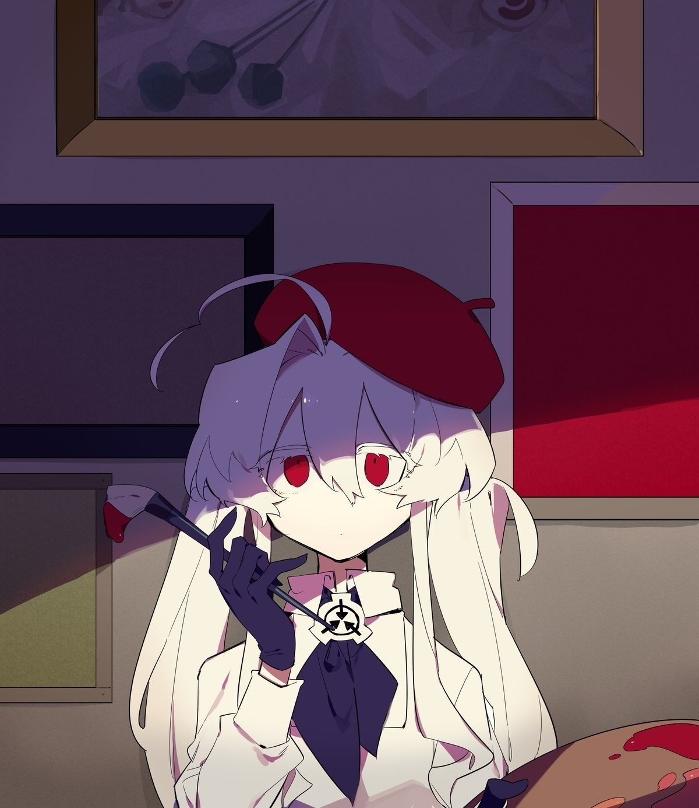
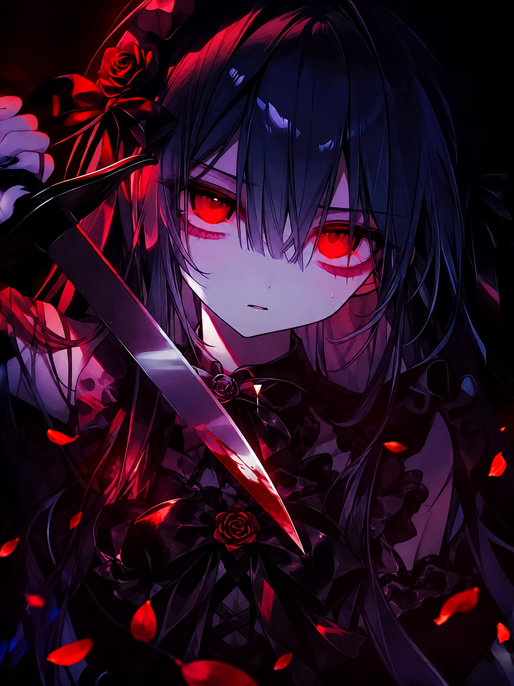
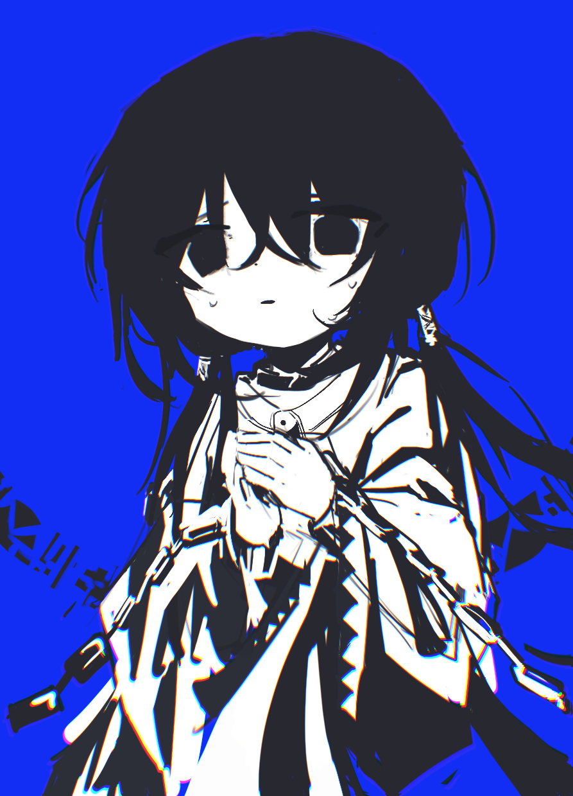
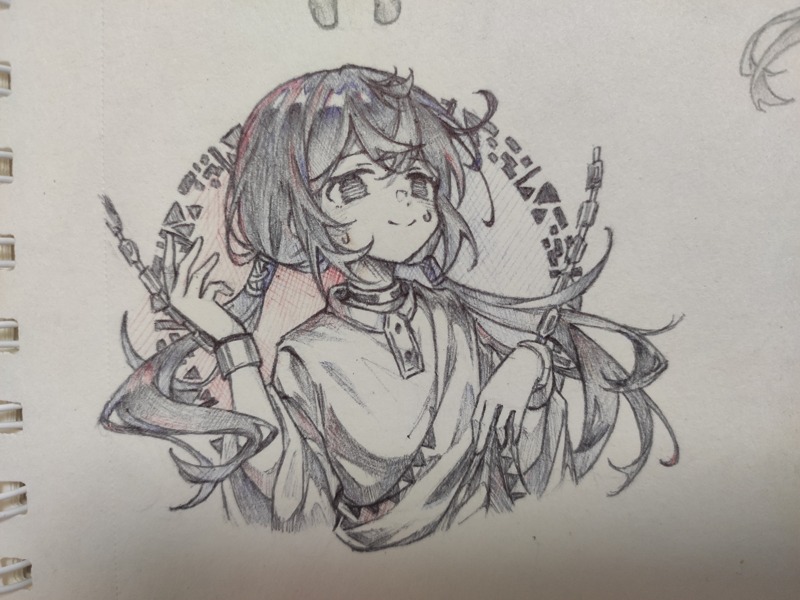

# 家庭完整角色設定總檔

> 整理日期：2026-08-26  
> 原四人核心：Stiliya（絲蒂莉雅）、Versiliya（薇絲莉雅）、Secileya（塞希莉雅）、Hozuki Huai（法月懷）
> 現有固定家庭成員：絲蒂莉雅、薇絲莉雅、塞希莉雅、法月懷、璃安、芙蘭妮雅、小曦  
> 結構原則：外層資料夾與主檔都使用可擴充的「家庭」命名；外層為「家庭總檔」，主檔為「家庭完整角色設定總檔」。未來新增第七名以上固定家庭成員時，直接新增獨立人物章，不需要再改主檔名稱。
> 整理原則：只收錄既有對話中仍可使用、未被後續否定的內容；後來的明確修正優先於早期概括。沒有被確定的欄位不自行補完。
> 本輪補查：已完整讀取並交叉判定《反轉》《Stiliya鎮壓暴亂》《Secileya角色設計》《Regal Elf-like Character Design》《Seciliya 角色設定》《銀髮少女角色描述》《Pocky挑釁遊戲》《緊張刺激的八個遊戲》；後者以對話末尾的稱呼與互動節奏修正為最高優先。

---

## 文件索引

> 以下目錄在 GitHub 閱讀頁可直接點擊，會跳到同一份總檔的對應段落。索引依目前實際標題完整同步至四級標題；新增、改名、刪除章節時應同步更新。

1. [資料層級與使用方式](#doc-nav-001)
2. [四人總覽](#doc-nav-002)
3. [姓名、簡稱與互相稱呼](#doc-nav-003)
   - [3.1 正式名稱](#doc-nav-004)
   - [3.2 四人日常稱呼表](#doc-nav-005)
   - [3.3 絲蒂莉雅與薇絲莉雅的情境式貓／蝠逗弄稱呼](#doc-nav-006)
4. [固定外貌總則](#doc-nav-007)
   - [全角色共通的外貌硬性規則](#doc-nav-008)
   - [圖像參考與共通視覺呈現原則](#doc-nav-009)
   - [4.1 絲蒂莉雅](#doc-nav-010)
     - [角色身分鎖定](#doc-nav-011)
     - [睫毛與眼睛：最高優先識別特徵](#doc-nav-012)
     - [臉部](#doc-nav-013)
     - [頭髮](#doc-nav-014)
     - [原始日常服：固定設計規格](#doc-nav-015)
     - [固定頭飾](#doc-nav-016)
     - [翅膀](#doc-nav-017)
     - [常用武器](#doc-nav-018)
     - [體態與預設視覺印象](#doc-nav-019)
     - [插畫呈現規格](#doc-nav-020)
   - [4.2 薇絲莉雅](#doc-nav-021)
     - [角色身分鎖定](#doc-nav-022)
     - [睫毛與眼睛：最高優先識別特徵](#doc-nav-023)
     - [臉部與表情](#doc-nav-024)
     - [頭髮](#doc-nav-025)
     - [原始日常服：固定設計規格](#doc-nav-026)
     - [固定布料方向](#doc-nav-027)
     - [長襪](#doc-nav-028)
     - [固定頭飾](#doc-nav-029)
     - [翅膀](#doc-nav-030)
     - [常用武器](#doc-nav-031)
     - [體態與預設視覺印象](#doc-nav-032)
     - [插畫呈現規格](#doc-nav-033)
   - [4.3 塞希莉雅](#doc-nav-034)
     - [角色身分鎖定](#doc-nav-035)
     - [無法形容的漂亮與氣質](#doc-nav-036)
     - [漂亮、無法言說的尊貴與存在本質所帶來的存在性恐懼](#doc-nav-037)
     - [眼睛與睫毛](#doc-nav-038)
     - [臉部、嘴與相對成熟度](#doc-nav-039)
     - [頭髮](#doc-nav-040)
     - [表情與存在感](#doc-nav-041)
     - [體態](#doc-nav-042)
     - [象牙白露肩幻想長裙：最新代表性設計](#doc-nav-043)
     - [插畫呈現方向](#doc-nav-044)
     - [2026-09-13 理想圖像與標準頭像參考](#doc-nav-045)
   - [4.4 法月懷](#doc-nav-046)
   - [4.5 家庭成員相對身高](#doc-nav-047)
5. [絲蒂莉雅完整人物資料](#doc-nav-048)
   - [5.1 性格核心](#doc-nav-049)
   - [5.2 情感與親密關係](#doc-nav-050)
   - [5.3 對外人與陌生世界](#doc-nav-051)
   - [5.4 衝突與戰鬥](#doc-nav-052)
   - [5.5 說話方式](#doc-nav-053)
   - [5.6 容易寫錯的方向](#doc-nav-054)
6. [薇絲莉雅完整人物資料](#doc-nav-055)
   - [6.1 性格核心](#doc-nav-056)
   - [6.2 情感與親密關係](#doc-nav-057)
   - [6.3 對外人與陌生世界](#doc-nav-058)
   - [6.4 衝突與戰鬥](#doc-nav-059)
   - [6.5 說話方式](#doc-nav-060)
   - [6.6 容易寫錯的方向](#doc-nav-061)
7. [塞希莉雅完整人物資料](#doc-nav-062)
   - [7.1 性格核心](#doc-nav-063)
   - [7.2 清醒、瘋狂與不可預測性](#doc-nav-064)
   - [7.3 情感與親密關係](#doc-nav-065)
   - [7.3.1 《One Last Kiss》與兩版《モニタリング》的角色意象映照](#doc-nav-066)
   - [7.4 對外人與陌生世界](#doc-nav-067)
   - [7.5 燦金光線與任意構成](#doc-nav-068)
   - [7.6 說話方式](#doc-nav-069)
   - [7.7 容易寫錯的方向](#doc-nav-070)
8. [法月懷完整人物資料](#doc-nav-071)
   - [8.1 性格核心](#doc-nav-072)
   - [8.2 情感範圍與對外界的態度](#doc-nav-073)
   - [8.3 與三人的日常相處](#doc-nav-074)
   - [8.4 與塞希莉雅的感情](#doc-nav-075)
   - [8.5 衝突與戰鬥](#doc-nav-076)
   - [8.6 說話方式](#doc-nav-077)
   - [8.7 容易寫錯的方向](#doc-nav-078)
9. [法月杏與法月懷的融合](#doc-nav-079)
   - [9.1 法月杏的獨立存在](#doc-nav-080)
   - [9.2 法月杏所在的過去時間線](#doc-nav-081)
     - [復活、事實改寫與「特修斯之船」命題](#doc-nav-082)
   - [9.2.1 《隨之任之》的角色意象映照](#doc-nav-083)
   - [9.2.2 《牽牛花凋零之時》的角色意象映照](#doc-nav-084)
     - [牽牛花本身的花語意象](#doc-nav-085)
   - [9.2.3 《親愛的你被火葬》的角色意象映照](#doc-nav-086)
   - [9.2.4 《化孵化》的角色意象映照](#doc-nav-087)
   - [9.2.5 《不為人知的鵝媽媽童謠》的角色意象映照](#doc-nav-088)
   - [9.2.6 《Endless Embrace》的角色意象映照](#doc-nav-089)
     - [法月杏對死去的三人](#doc-nav-090)
     - [三人對完整法月懷](#doc-nav-091)
     - [杏與懷之間](#doc-nav-092)
     - [溫暖的黑暗與沒有救贖的光](#doc-nav-093)
     - [Vueko 與 Irumyuui 的情感結構參考](#doc-nav-094)
   - [9.2.7 《Forever Lost》的角色意象映照](#doc-nav-095)
     - [使用者提供的原歌詞與角色分段](#doc-nav-096)
     - [開頭：法月杏](#doc-nav-097)
     - [中段前半：杏仍對失去的三人說話](#doc-nav-098)
     - [中央轉折：杏抱著三人，懷開始接住杏](#doc-nav-099)
     - [中段後半：法月懷承接旅程](#doc-nav-100)
     - [結尾：法月懷，以及三人給她的回答](#doc-nav-101)
   - [9.2.8 《異種》的角色意象映照](#doc-nav-102)
     - [法月杏面對有限生命與三人死亡](#doc-nav-103)
     - [從法月杏重製為早期法月懷](#doc-nav-104)
     - [沒有終點地繼續愛著](#doc-nav-105)
   - [9.2.9 《圓形監獄／パノプティコン》的角色意象映照](#doc-nav-106)
     - [位於法月懷最深處的杏](#doc-nav-107)
     - [同時位於瞭望塔與囚室](#doc-nav-108)
     - [內部相見、談話與融合](#doc-nav-109)
     - [完整黑瞳與外界形成的第二層圓形監獄](#doc-nav-110)
   - [9.2.10 《白世》的角色意象映照](#doc-nav-111)
     - [重製後、尚未理解感情的法月懷](#doc-nav-112)
     - [無法倒退的形貌與以自己的話重新堆砌](#doc-nav-113)
     - [無法獨自承擔之物與想要靠近的「你」](#doc-nav-114)
   - [9.3 融合的正確理解](#doc-nav-115)
   - [9.3.1 金黑交融眼狀態](#doc-nav-116)
   - [9.4 完整黑瞳狀態的存在性威懾](#doc-nav-117)
     - [觸發對象、資訊關聯與反應](#doc-nav-118)
     - [完整黑瞳狀態下的法月懷](#doc-nav-119)
10. [四人的知識、力量與價值判斷](#doc-nav-120)
   - [10.1 見識與理解能力](#doc-nav-121)
   - [10.2 成長、力量尺度與控制](#doc-nav-122)
   - [10.3 道德不是共用模板](#doc-nav-123)
   - [10.4 商店與交易](#doc-nav-124)
   - [10.5 能做到與願不願意做](#doc-nav-125)
11. [六組雙人關係](#doc-nav-126)
   - [11.1 絲蒂莉雅 × 薇絲莉雅](#doc-nav-127)
     - [11.1.0 《反轉》對話完整修訂脈絡與可用細節](#doc-nav-128)
     - [11.1.1 兩組成年伴侶共享的私下親密互動可用庫](#doc-nav-129)
     - [11.1.1A 《反轉》新補內容對法月懷 × 塞希莉雅的適用規則](#doc-nav-130)
   - [11.2 塞希莉雅 × 法月懷](#doc-nav-131)
     - [11.2.1 與 Stiliya、Versiliya 完整共享的成年親密範圍](#doc-nav-132)
   - [11.3 絲蒂莉雅 × 法月懷](#doc-nav-133)
   - [11.4 薇絲莉雅 × 法月懷](#doc-nav-134)
   - [11.5 絲蒂莉雅 × 塞希莉雅](#doc-nav-135)
   - [11.6 薇絲莉雅 × 塞希莉雅](#doc-nav-136)
12. [四人的家庭結構與共同成長](#doc-nav-137)
   - [12.1 早期教養關係](#doc-nav-138)
   - [12.2 家庭定位](#doc-nav-139)
   - [12.3 四人相處的底層默契](#doc-nav-140)
   - [12.4 成年後的固定親密關係](#doc-nav-141)
   - [12.5 四人私下遊戲與親密玩鬧](#doc-nav-142)
   - [12.5.1 全家撒嬌／抱抱大會長篇樣本](#doc-nav-143)
     - [法月懷因害羞被動變成黑金瞳的延續](#doc-nav-144)
13. [璃安完整人物資料](#doc-nav-145)
   - [外貌與視覺方向](#doc-nav-146)
   - [可用的小動作與表情層次](#doc-nav-147)
   - [17 張圖像參考的動作、神態與情境解讀](#doc-nav-148)
   - [身分與關係](#doc-nav-149)
   - [性格與表現](#doc-nav-150)
   - [力量尺度](#doc-nav-151)
14. [小曦完整人物資料](#doc-nav-152)
   - [身分與家庭位置](#doc-nav-153)
   - [外貌、初見與稱呼](#doc-nav-154)
   - [相處原則](#doc-nav-155)
   - [性格、追問與撒嬌的完整脈絡](#doc-nav-156)
   - [晨曦世界線已建立的小曦性格證據](#doc-nav-157)
   - [標準參考文：塞希莉雅逗小曦兔耳](#doc-nav-158)
15. [芙蘭妮雅完整人物資料](#doc-nav-159)
   - [15.1 身分、姓名與家庭位置](#doc-nav-160)
   - [15.2 外貌與視覺方向](#doc-nav-161)
   - [15.3 性格核心：木然、空虛與生存](#doc-nav-162)
   - [15.4 出身、背叛與過去](#doc-nav-163)
   - [15.5 善意、尺度差與家庭形成](#doc-nav-164)
   - [15.6 家庭私下面與依賴](#doc-nav-165)
   - [15.7 武器、戰鬥與廣泛適應](#doc-nav-166)
   - [15.8 能力本質：作用關係與權重](#doc-nav-167)
   - [15.9 純實力定位](#doc-nav-168)
   - [15.10 容易寫錯的方向](#doc-nav-169)
   - [15.11 目前仍未固定](#doc-nav-170)
16. [場景行為參考矩陣](#doc-nav-171)
   - [16.1 人物活性：微動作、視線、姿態與生活細節](#doc-nav-172)
     - [16.1.1 建立「細節庫」，不要建立固定動作標籤](#doc-nav-173)
     - [16.1.2 四人的力量先於普通笨拙](#doc-nav-174)
     - [16.1.3 絲蒂莉雅](#doc-nav-175)
     - [16.1.4 薇絲莉雅](#doc-nav-176)
     - [16.1.5 塞希莉雅](#doc-nav-177)
     - [16.1.6 法月懷](#doc-nav-178)
     - [16.1.7 小曦](#doc-nav-179)
     - [16.1.8 璃安](#doc-nav-180)
     - [16.1.9 芙蘭妮雅](#doc-nav-181)
     - [16.1.10 法月杏](#doc-nav-182)
     - [16.1.11 其他長期角色](#doc-nav-183)
17. [對話與敘事聲線指南](#doc-nav-184)
   - [17.1 絲蒂莉雅](#doc-nav-185)
   - [17.2 薇絲莉雅](#doc-nav-186)
   - [17.3 塞希莉雅](#doc-nav-187)
   - [17.4 法月懷](#doc-nav-188)
   - [17.5 四人共同的敘事禁忌](#doc-nav-189)
18. [特定世界線中可保留的資料](#doc-nav-190)
   - [18.1 萬界圖書館](#doc-nav-191)
   - [18.2 極寒末世：前往官方之前](#doc-nav-192)
   - [18.3 商店、餐館、客棧與修仙開店](#doc-nav-193)
     - [特殊商人／晨曦世界線：小曦的使用方式](#doc-nav-194)
     - [莉月超市末世世界線：九層配置](#doc-nav-195)
     - [莉月超市：營業、安全區與店規](#doc-nav-196)
     - [莉月超市：商品、交易與自動化](#doc-nav-197)
     - [非人顧客與末世生態](#doc-nav-198)
     - [異能階位與成長節奏](#doc-nav-199)
     - [地球勢力與國際局面](#doc-nav-200)
     - [幻境娛樂城](#doc-nav-201)
     - [後期宇宙層次](#doc-nav-202)
   - [18.4 SCP、異空間與異常世界](#doc-nav-203)
   - [18.5 Project Moon／都市相關世界線](#doc-nav-204)
   - [18.6 全球異能／大夏旅行線（《Stiliya鎮壓暴亂》）](#doc-nav-205)
   - [18.7 其他場景的使用原則](#doc-nav-206)
19. [已否定、已取代或不得沿用的內容](#doc-nav-207)
   - [19.1 全體](#doc-nav-208)
   - [19.2 絲蒂莉雅](#doc-nav-209)
   - [19.3 薇絲莉雅](#doc-nav-210)
   - [19.4 塞希莉雅](#doc-nav-211)
   - [19.5 法月懷](#doc-nav-212)
   - [19.6 世界線](#doc-nav-213)
20. [目前仍未固定的資料](#doc-nav-214)
21. [寫作前快速核對表](#doc-nav-215)
22. [已交叉查閱的主要對話](#doc-nav-216)
23. [一句話抓住四人，但不要把它變成標籤](#doc-nav-217)

---

## 一、資料層級與使用方式

本檔將資料分成四層，寫新世界時應依此判斷：

- **【固定】**：由使用者直接指定，或在多次修正後已明確定案。跨世界原則上保留。
- **【穩定】**：從多段未被否定的互動中反覆成立，可作為可靠的描寫方向；但不能硬化成唯一反應。
- **【世界線限定】**：只在特定故事、職業、時期或關係測試中成立，不能自動搬到所有世界。
- **【未固定】**：現有對話沒有足夠資料，必須留白，不能擅自創造答案。

發生矛盾時，優先順序如下：

1. 使用者後來的直接修正。
2. 使用者明確確認的設定。
3. 多個對話中一致、且從未被否定的描寫。
4. 單一故事中的可用表現。
5. 助手自行推導、但沒有得到確認的內容；這一層不能當成固定設定。

最重要的總原則是：

> **先有四人的人格與關係，再由她們的性格決定如何做某項工作。職務、世界觀與力量不能反過來改造她們。**

她們的性格是核心傾向，不是角色標籤。當下情境、面對的人、過去經歷、個人選擇與當時情緒，都能讓她們出現不同反應。

---

## 二、四人總覽

| 角色 | 核心性格 | 固定外貌識別 | 情感表達主軸 | 純力量順序 |
|---|---|---|---|---|
| 絲蒂莉雅 | 安靜、細膩、有自己的小世界 | 銀白長髮、貓耳、明亮藍眼、銀灰睫毛、藍紫色惡魔翼 | 短而直接、安靜靠近、細微照顧，也能主動與反擊 | 第三梯隊，與薇絲莉雅大致相當 |
| 薇絲莉雅 | 活潑直接、喜歡互動與逗弄 | 銀白長髮、尖耳、血紅眼、純白睫毛、紅黑蝙蝠翼 | 直接說、直接碰、用玩笑拉近距離；真實害羞與玩心可以並存 | 第三梯隊，與絲蒂莉雅大致相當 |
| 塞希莉雅 | 自信聰慧、有玩心；真正的溫柔主要只給家人 | 燦金超長髮、高飽和亮紫眼、燦金色睫毛、白皙膚色、優雅尖耳；外貌與氣質共同構成無法形容的極致漂亮，並帶來與法月懷完整黑瞳同級的存在性恐懼 | 坦率而主動，能在害羞時仍承認感情；對法月懷的愛最具伴侶性 | 第二 |
| 法月懷 | 沉靜可靠、以行動表達情感 | 純白長髮、右前方特殊黑色髮束、純黑色睫毛、深層金眼；可出現黑瞳或金黑交融 | 讓出位置、遞茶、擁抱、記得習慣、直接行動；話少但不是沒有主動性 | 第一 |

這份四人表格只描述原四人核心的純力量內部關係：

> **法月懷 ＞ 塞希莉雅 ＞ 絲蒂莉雅 ≈ 薇絲莉雅**

加入璃安、芙蘭妮雅與小曦後，目前固定的全家純實力排序為：

> **法月懷 ＞ 塞希莉雅 ＞ 絲蒂莉雅 ≈ 薇絲莉雅 ＞ 璃安 ≈ 芙蘭妮雅 ＞ 小曦**

其中「≈」只表示大致位於同一層級，不代表數值完全相等；實戰仍可能因能力結構、相性、經驗、狀態與情境產生差異。這份排序不代表地位、重要性、發言權、領導權、情感順位或故事中心程度。家庭成員相對於一般世界仍可能屬於規格之外的存在，不能把家內排序直接換算成當地普通等級。

---

## 三、姓名、簡稱與互相稱呼

### 3.1 正式名稱

| 羅馬字／慣用寫法 | 固定中文名 | 常用暱稱 |
|---|---|---|
| Stiliya | 絲蒂莉雅 | 莉莉 |
| Versiliya | 薇絲莉雅 | 薇薇 |
| Secileya | 塞希莉雅 | 希雅（主要由法月懷使用） |
| Hozuki Huai | 法月懷 | 懷（主要由塞希莉雅使用） |
| Franiya | 芙蘭妮雅 | —（家庭內專屬簡稱尚未固定） |
| Hozuki Anzu | 法月杏 | 杏 |

塞希莉雅的中文名固定為「塞希莉雅」，不能寫成「塞希莉婭」，也不能把她叫作「莉莉」。

**【末世開店世界線限定】** 該世界線中的當地人與玩家在逐漸熟悉她之後，可以稱她為「希姐」；不能稱作「希雅」或「希雅姐」。這只規定該世界線人物對她的稱呼，不覆蓋四人之間跨世界通用的日常稱呼。

### 3.2 四人日常稱呼表

| 說話者 \ 對象 | 絲蒂莉雅 | 薇絲莉雅 | 塞希莉雅 | 法月懷 |
|---|---|---|---|---|
| 絲蒂莉雅 | — | 薇薇 | 希雅姐 | 懷姐姐（平時深層金瞳）；法月姐姐（金黑交融眼或完整黑瞳） |
| 薇絲莉雅 | 莉莉 | — | 希雅姐 | 懷姐姐（平時深層金瞳）；法月姐姐（金黑交融眼或完整黑瞳） |
| 塞希莉雅 | 莉莉 | 薇薇 | — | 懷（平時深層金瞳）；法月（金黑交融眼或完整黑瞳） |
| 法月懷 | 莉莉 | 薇薇 | 希雅 | — |

**【固定稱呼切換】**塞希莉雅平時稱深層金瞳狀態的法月懷為「懷」；當法月懷顯現金黑交融眼或完整黑瞳時，塞希莉雅改稱她為「法月」。絲蒂莉雅與薇絲莉雅也依同一狀態切換：深層金瞳時稱「懷姐姐」，金黑交融眼或完整黑瞳時稱「法月姐姐」。這不是將現在的她拆成杏、懷兩個人格，而是因為「法月」同時屬於法月杏與法月懷，能稱呼融合後包含兩個存在階段的完整之人。

**【家人專屬親密稱呼】**「莉莉」「薇薇」「希雅／希雅姐」「懷／懷姐姐」「法月／法月姐姐」及同類四人日常暱稱，都建立在四人的家庭、共同成長與親密關係上，只有家人可以自然使用。外人即使旁聽、聽見或知道這些稱呼，也不能擅自跟著叫；外人應使用角色完整姓名、正式稱呼或符合當地關係的敬稱。末世開店世界線中當地人逐漸熟悉塞希莉雅後使用「希姐」，仍只屬於前述世界線限定例外，不等於外人可以叫「希雅」。

### 3.3 絲蒂莉雅與薇絲莉雅的情境式貓／蝠逗弄稱呼

- 這一組稱呼的核心不是固定暱稱清單，而是可以依當下語境即時變化的 **「小＋情境詞＋貓／蝠」** 結構。
- 薇絲莉雅逗絲蒂莉雅時，通常使用「小○○貓」；絲蒂莉雅反過來逗薇絲莉雅時，通常使用「小○○蝠」。
- 中間的詞可以來自當下行為、食物、氣味、狀態、剛發生的糗事、玩笑或兩人正在談的東西，不需要先存在於固定表格裡。只要上下文能讓人自然理解，就可以臨場生成新的稱呼。
- 已出現過的例子包括：**小呆貓、小笨貓、小色貓、小肥貓**；以及 **小呆蝠、小笨蝠、小色蝠、小蜂蜜蝠**。其中「小肥貓」「小蜂蜜蝠」都屬特定上下文中的臨時逗弄，不代表角色具有永久的「肥」或「蜂蜜」設定。
- 因此後續正文可以自然出現新的「小○○貓／小○○蝠」，不應被既有例子限制；但稱呼必須服務當下情境，不能為了套格式而隨機拼詞。
- 同一個臨時稱呼可以在一小段場景裡重複幾次，形成當場的玩笑；除非後續另行固定，否則不自動升格成跨世界永久暱稱。
- 「小傻瓜」「小笨蛋」等沒有貓／蝠尾綴的一般親暱稱呼仍然可以自然出現，但它們不屬於本節這套「小○○貓／小○○蝠」的專屬構詞規則。
- 塞希莉雅與法月懷偶爾可以順著當下玩笑借用這種稱法逗她們，但這套稱呼最核心的使用者仍是絲蒂莉雅與薇絲莉雅彼此。

稱呼應隨情境自然出現，不需要每段對話都塞入，也不要把任何一個例子寫成固定口頭禪。

---

## 四、固定外貌總則

四人的固定身體識別不因職業、服裝風格或世界觀更換而改變。服裝可以因世界線調整；髮色、眼色、耳朵、翅膀與法月懷的黑色髮束等核心特徵不可被職務風格覆蓋。

**【最高優先固定，適用於所有世界線、正文、設定檔、摘要與索引】不得使用「女人」「四個女人」「兩個女人」「那名女人」等詞語概括或代稱使用者的 OC；除小曦以外，也不得以「女孩」「那名女孩」「白髮女孩」等稱呼指代任何 OC。**應優先依語境使用角色姓名、既定身分、外貌辨識特徵或「她／她們」。小曦是唯一可以自然稱作「女孩」「小女孩」或「兔耳女孩」的例外。成年狀態與年輕外貌都不改變這項敘事用詞。這項規則高於早期文本、一般年齡用語及任何世界線的敘事習慣。

具體年齡與生日尚未固定；但現在發生戀愛與性關係的四人明確以成年狀態處理。年幼收徒期是更早的成長階段，不能與成年後的性關係混在一起。

### 全角色共通的外貌硬性規則

**【固定，適用於使用者的所有角色與所有世界線】**

- 任何角色都不能使用口紅、唇蜜或任何形式、任何程度的化妝。
- 不存在「淡妝」「自然妝」「裸妝」「幾乎看不出來的妝」「只上一點唇色」等例外。
- 嘴唇、睫毛、眼周、膚色與面部光澤都必須是角色本身的自然狀態，不能用化妝品解釋。
- **【圖像生成固定判定】**只寫「自然唇色」仍可能被生成模型誤解成粉紅嘴唇，因此不能把這個詞單獨當成足夠限制。成品中的嘴唇必須與周圍臉部皮膚幾乎同色、同明度，不得出現紅色、粉色、桃色、染色感、獨立唇瓣色塊或亮澤；閉嘴時只以極細、低對比的自然陰影表示嘴縫。暖光、害羞或精緻美少女畫風也不能使嘴唇與膚色形成粉紅色差。
- 世界觀、職業、宴會、婚禮、儀式、偽裝、舞台或服裝設計，都不能覆蓋這項規則。
- 描寫時不要使用「妝容精緻」「略施粉黛」「唇上泛著唇蜜光澤」「塗著口紅」等措辭。

### 圖像參考與共通視覺呈現原則

**【固定使用方式】**使用者提供的角色圖片可用來補足外貌輪廓、表情範圍、姿勢語彙、材質、光影與氣氛，但圖片中的生成錯誤、偶然服裝、場景物件、武器、文字與構圖不會自動升格成角色設定。若圖片與文字設定衝突，以後期明確文字設定為準。

- 偏好的整體方向是高品質日系動漫插畫，保有乾淨線條與清楚的角色識別，同時使用細膩、平滑的頭髮、肌膚與布料質感。
- 可以使用電影式構光、柔和逆光、體積光、空氣透視與明確景深，使人物與場景具有空間層次；但不能為了氣氛犧牲臉部、眼睛、睫毛、耳朵、翅膀或髮色等固定特徵。
- 明亮畫面不能過曝到五官與衣料結構消失；暗色畫面也必須保留臉部和核心識別的可讀性。
- 光線可以讓純白、銀白、燦金、黑色或其他顏色產生冷暖與明暗變化，但不能藉此將角色的本色改成另一種髮色、眼色或翼色。
- 材質應細緻、自然而具有重量，避免粗糙顆粒、塑膠感、油膩高光、過度寫實皮膚、密集 AI 髮絲噪點與無意義的裝飾堆疊。
- 姿勢與表情只能拓展角色在不同情境中的可能性，不能反過來把一次構圖固定成永久性格、固定攻受、固定職務或固定身體比例。

### 4.1 絲蒂莉雅

#### 角色身分鎖定

- 絲蒂莉雅是銀白長髮的貓耳少女，整體給人柔和、安靜、平穩的存在感。
- 必須具有白色貓耳，內耳為柔和的淡粉色。
- 不得出現精靈耳、角或貓耳以外的其他獸耳。
- 貓耳是身體的一部分，不是髮箍或可任意替換的服裝配件。

#### 睫毛與眼睛：最高優先識別特徵

- 必須是清楚可見的銀灰色睫毛。
- 睫毛纖細、自然、精緻，不能畫成黑色，也不能畫成純白色。
- 不得使用眼線或任何眼妝來強化睫毛；睫毛顏色與形狀都是自然特徵。
- 眼睛必須是明亮、清澈、純正而鮮明的藍色。
- 不能偏青、偏紫或改成紅色。
- 目光基調柔和、平靜，帶微微睏倦與略顯疲憊的半垂眼感。

##### 眼部近距離視覺參考

- 絲蒂莉雅適合使用略微半垂、放鬆而修長的眼型。上眼緣平穩地向眼尾延伸，眼尾可以稍長，但整體銳利度必須收柔；它呈現的是睏倦、慵懶而仍清楚注視的神情，不是侵略性、冷酷或刻意魅惑。
- 虹膜可以具有通透的晶體層次：以鮮明純藍為固有主色，保留較深藍的外緣與瞳孔附近層次，再使用明亮藍白高光表現濕潤、清澈與折射感。高光可以精緻豐富，但不能因此變成發光特效眼、星空眼或機械眼。
- 冷青、淡紫與粉色只可作為環境光、反射光及高光邊緣的極少量色彩，不是虹膜本身的漸層色。無論場景光源如何，觀看者仍應首先明確認出她是純正而鮮明的藍眼。
- 上睫毛應清楚可見、纖細而具有自然聚束，眼尾可形成少量略長的睫毛尖；下睫毛保持輕淡、短而克制，不使用濃密扇形、誇張假睫毛或厚重黑邊。
- 睫毛的固有色仍是銀灰色。冷色環境光下可以視覺上略帶灰紫或淡紫反光，但不能固定成紫色睫毛，也不能改成純白或黑色。
- 上眼緣即使因睫毛聚束與眼瞼陰影而顯得稍深，也必須理解為天然睫毛、眼皮結構與光影；不得使用眼線、眼影、睫毛膏或任何形式的眼妝解釋。
- 眼周與臉頰可以具有自然柔和的淡粉紅潤，尤其在害羞、剛睡醒、親密接觸或情緒升高時更明顯；這是自然氣色與生理反應，不是腮紅或化妝。
- 這組近距離眼部方向只補充絲蒂莉雅的眼型、虹膜材質、睫毛聚束與光影表現，不改變她的小圓幼態臉、銀白長髮、白色淡粉內耳貓耳、自然無妝及其他既定外貌。

#### 臉部

- 小巧、圓潤、年輕的臉型。
- 臉頰柔軟，下巴小，面部結構平滑柔和。
- 避免尖銳下顎、成熟美人臉、侵略性或刻意魅惑的五官。
- 嘴形小而帶一點貓感，以簡單、自然的小嘴線呈現。
- 唇色必須完全自然，不得有口紅、染色唇部或唇蜜。
- 臉頰具有自然、輕微的淡粉紅潤；這是自然氣色，不是腮紅或化妝。
- 年輕、略顯稚嫩的五官不等於幼兒化，也不代表她的心智或行為幼稚。

#### 頭髮

- 長而自然的銀白色頭髮。
- 質感柔順、乾淨、略帶蓬鬆感，同時具有明確重量與髮量。
- 髮束以較厚、較大的自然分組構成，輪廓整潔有組織。
- 柔軟瀏海自然遮住部分額頭，頭頂有一小束自然呆毛。
- 避免大量彼此分離的極細髮絲、凌亂線條與常見的 AI 髮絲噪點。

#### 原始日常服：固定設計規格

這是絲蒂莉雅的原始休閒日常服，不是戰鬥服或職業制服。換世界時若沒有另行指定造型，應優先使用這套設計。

- 主色為白、黑與柔和灰色，金色只作極少量點綴。
- 整體乾淨、優雅、舒適而精緻，帶自然的幻想日常感。
- 布料平滑自然，結構柔和但不鬆垮；輪廓放鬆、端正而優雅。
- 上身為白色或黑色的休閒襯衫／上衣，使用棉質或相近的優雅平滑布料。
- 上衣帶簡潔的黑色緞帶細節、小型花朵裝飾、自然布褶與優雅袖型。
- 下身為黑色或深灰色裙裝，採簡單分層、乾淨輪廓與舒適的年輕感設計。
- 裙緣可帶細緻金色收邊。
- 金色細節可出現在袖口細邊、小面積刺繡或緞帶邊緣；必須克制、精緻並處於次要位置。
- 不得改成王室鎧甲、奢華禮服、戰鬥裝、暴露服裝、成熟時裝或現代街頭服。
- 不使用過量蕾絲、過量荷葉邊、皮草、絨毛、毛茸材質、超大連帽衣或睡衣式設計。

#### 固定頭飾

- 位於頭部單側。
- 由一朵白花、一個黑色緞帶結、蝴蝶裝飾與小型垂墜飾物組成。
- 整體簡潔、優雅、平衡，不得擴張成王冠、帽子、巨大花朵或隨機堆疊配件。

#### 翅膀

- 小型、精緻的藍紫色惡魔翼。
- 自然連接於上背，明確位於身體後方，不能長在手臂上。
- 翼膜為深藍紫色，外緣偏黑紫色。
- 翼膜可在冷色光線下呈現由冷藍至紫色的柔和漸層，但不能偏成鮮青色，也不能因透光而失去深藍紫基調。
- 是日常即可辨識的幻想身分特徵，不是巨大戰鬥翼。

#### 常用武器

- 絲蒂莉雅最常使用的武器是太刀，但太刀不是她唯一能用的武器；她也會依當下需要、選擇與情境使用其他種類的武器。
- 「常用太刀」描述的是個人使用偏好，不是固定裝備、職業綁定或能力限制，也不代表她在日常場景中必須隨身攜帶。
- 太刀的固定名稱、刀身顏色、刀裝、材質與特殊能力目前尚未定案；不能把單張參考圖中的偶然設計直接升格成唯一正式造型。

#### 體態與預設視覺印象

- 使用年輕而均衡的動漫比例，身體輪廓自然，不誇張曲線，也不作性化強調。
- 預設外在印象為溫柔、安靜、溫暖、可靠、耐心、說話輕柔而冷靜，像經歷許多事情後仍保有善意的人。
- 這是她的常態氣質與視覺起點，不是限制她永遠只能溫柔、不能殺人、不能主動或不能反擊的硬標籤。
- 自然放空、剛睡醒、縮起雙腿、靠著重要的人、安靜伸手或在被逗後直接反制，都可作為相容的日常姿勢與表情；睏倦感不等於消沉、虛弱或永遠沒有精神。
- 避免把她畫成傲慢、冷酷、侵略性、刻意誘惑或心智幼稚。

#### 插畫呈現規格

- 柔和日系動漫插畫、乾淨線稿、低對比、柔和粉彩、溫和光線與平滑陰影。
- 布料自然，氛圍柔軟；避免寫實、3D CGI、過度銳利細節與過量材質噪點。
- 很適合使用冷藍、銀白、清澈空間、明亮逆光與柔和光霧，形成安靜、通透、略帶夢境感的展示畫面；這是偏好的視覺方向，不是她在所有場景中的固定色調。
- 寬鬆居家上衣可作為剛睡醒或私人空間中的情境服裝，但不能取代原始日常服，也不能回寫成她的預設睡衣式造型。

**【仍未固定】**

- 確切身高、體重、三圍與骨架數值。
- 固定膚色色階。
- 翅膀平時是否能隱藏、收放方式與飛行機制。

描寫時可以表現她的貓耳會因聲音或情緒微動，但不要把每一句反應都寫成耳朵動作，也不能讓貓耳取代人物本身的表情與選擇。

### 4.2 薇絲莉雅

#### 角色身分鎖定

- 薇絲莉雅是銀白長髮、具有精靈與惡魔視覺特徵的少女，帶活潑、狡黠而危險的魅力。
- 必須具有清楚可見的細長尖耳。
- 不得出現貓耳、其他獸耳或角。
- 早期出現的紅黑髮色已被明確否定，不能再用。

#### 睫毛與眼睛：最高優先識別特徵

- 必須是清楚可見的純白色睫毛。
- 睫毛纖細、優雅、自然，並與銀白髮色協調。
- 不能是黑色，也不能改成絲蒂莉雅的銀灰色。
- 不得使用眼線或任何眼妝來強化睫毛；睫毛是自然特徵。
- 眼睛必須是鮮明、深邃的血紅／深緋紅色。
- 不能偏藍、偏紫或偏粉紅。
- 眼神帶神祕、危險與玩心，不等於純粹邪惡。

#### 臉部與表情

- 年輕、圓潤而略顯稚嫩的臉型，臉頰柔和、結構小巧可愛。
- 避免成熟女人臉、尖銳的成人骨相或成熟魅惑者形象。
- 常態表情可用半垂眼、惡作劇般的小惡魔笑、略微得意的神態呈現。
- 表情範圍也可包括直接燦笑、露出小尖牙的玩心、慵懶含笑、略帶挑釁、被反制後真實害羞或短暫失去從容；其中任何一種都不能變成唯一固定表情。
- 她看起來像很享受逗弄別人，但不能因此被畫成冷血反派或成熟誘惑者。
- 臉頰具有自然、輕微的紅潤；這是自然氣色，不是腮紅或化妝。
- 年輕的外貌不等於幼兒化，也不代表她的心智或判斷幼稚。

#### 頭髮

- 長而自然的銀白色頭髮。
- 質感平滑流動，髮量充足，具有自然重量。
- 使用較厚、較大的髮束分組，結構乾淨、有組織，瀏海柔順流動。
- 避免大量零碎細髮、雜亂線條與 AI 式髮絲噪點。
- 整體感覺優雅、神祕、高貴而非人。

#### 原始日常服：固定設計規格

這是薇絲莉雅的原始休閒日常服，不是戰鬥服。換世界時若沒有另行指定造型，應優先使用這套設計。

- 主色為黑色與深緋紅色，金色只作極少量點綴。
- 整體是精緻、結構清楚、舒適但成熟度受控的暗黑幻想日常風格。
- 輪廓乾淨、優雅而帶自信，具有暗色貴族感，但不是王室禮服或鎧甲。
- 上身可為黑色休閒襯衫，或深緋紅色短外套；結構俐落，布料平滑精緻。
- 上身可帶少量緋紅細節，以及極簡的黑色緞帶或小型寶石裝飾。
- 下身可為黑色裙裝或深色休閒短褲；輪廓乾淨、比例年輕，帶細緻金色收邊。
- 金色只可作細邊、小面積刺繡或極簡裝飾，必須精緻、克制並處於次要位置。
- 不得改成王室鎧甲、奢華禮服、戰鬥裝、暴露服裝、成熟時裝或現代街頭服。
- 不使用過量鎖鏈、過量裝飾、超大連帽衣或睡衣式造型。

#### 固定布料方向

- 使用有結構、平滑、較厚實而精緻的布料。
- 表面乾淨，只帶細微紋理；布褶受控，服裝輪廓清楚。
- 布料感應是優雅、耐用、沉著而略具權威感。
- 不使用皮草、絨毛、毛茸材質、柔軟毛衣感、過度居家或睡衣般的布料。

#### 長襪

- 半透明黑色大腿襪，具有自然、輕微透膚的布料感。
- 上緣為普通大腿襪襪口。
- 不得加入吊襪帶、向上延伸的束帶，也不得連接腰部或胸部。

#### 固定頭飾

- 小型黑色緞帶，搭配極簡的深緋紅寶石裝飾。
- 可搭配極少量纖細垂鏈或小型墜飾，作為黑色緞帶與深緋紅寶石的延伸；不得擴張成滿頭鏈飾或大型珠寶。
- 整體低調、平衡、不過大。
- 不得加入王冠、巨大帽子、過量鎖鏈或複雜堆疊配件。

#### 翅膀

- 黑色與深緋紅色的蝙蝠翼。
- 自然連接於上背／肩胛區域，明確位於身體後方，不能長在手臂上。
- 外緣為黑色，翼膜為深緋紅色。
- 整體神祕、有力而精緻；不得改成天使翼、羽翼，也不能大到遮住整個角色。
- 平靜日常中可以自然收攏或只展開一部分，不必為了證明惡魔特徵而每次完全張翼。

#### 常用武器

- 薇絲莉雅最常使用的武器是鐮刀，但鐮刀不是她唯一能用的武器；她也會依當下需要、選擇與情境使用其他種類的武器。
- 「常用鐮刀」描述的是個人使用偏好，不是固定裝備、職業綁定或能力限制，也不代表她在日常場景中必須隨身攜帶。
- 若採用目前的代表性鐮刀設計，可使用黑色與深緋紅色的優雅造型，配暗色金屬刃與緋紅魔力紋路；這不是所有世界線與所有鐮刀都必須完全相同的唯一外形。
- 鐮刀應保持精緻、危險的個人武器感，不寫成農具，也不必為了強調武器而誇張到壓過角色本身。

#### 體態與預設視覺印象

- 使用年輕而均衡的動漫比例，身體輪廓自然，不誇張曲線，也不作性化強調。
- 預設外在印象為活潑、聰明、自信、狡黠、喜歡逗弄而略帶得意。
- 這是她的常態氣質與視覺起點，不表示她永遠不會害羞、認真、溫柔、被反制或失去從容。
- 避免把她畫成無情、純粹邪惡、冷酷反派或成熟誘惑者。

#### 插畫呈現規格

- 柔和日系動漫插畫、乾淨線稿、低對比暗黑幻想氛圍、平滑上色與柔和陰影。
- 細節量保持平衡；避免寫實、3D CGI、過度銳利與過量材質噪點。
- 很適合使用深紅、暗紫、黑色、燭光與濃郁但可控的輪廓光，形成神祕、親密、帶危險玩心的畫面；臉部、紅眼、白睫毛與銀白髮仍須清楚可讀。

**【仍未固定】**

- 確切身高、體重、三圍與骨架數值。
- 固定膚色色階。
- 翅膀的精確翼展、平時是否能隱藏、收放方式與飛行機制。
- 精靈與惡魔身分在每一世界線中的生物學、族譜與力量來源解釋。

她的紅黑風格由眼睛、翅膀與服裝呈現，不得為了配色方便把銀白髮改成紅黑髮。

### 4.3 塞希莉雅

#### 角色身分鎖定

- 塞希莉雅是擁有壓倒性力量、絕對自信與自然掌控感的年輕幻想系女生。
- 她具有小巧、自然略尖的耳朵，耳尖只在柔和輪廓中輕微可讀，不拉長成典型精靈耳；她**不是精靈族**，不能由此補出森林精靈、精靈王族或古老精靈血統。
- 她的強大由眼神、表情、人格、選擇與存在感呈現，不依靠武器、鎧甲、王冠、身份標誌或堆疊裝飾證明。
- 「古老存在」「活過無數歲月的精靈女性」「女王／女神」等早期提示詞已被後續明確撤除。

#### 無法形容的漂亮與氣質

**【最高優先固定】塞希莉雅是世間所有存在之中最漂亮的存在。**這裡的「漂亮」不是只指五官、臉型或身體，也包含她的神態、動作、存在感及整體氣質；外貌與氣質無法彼此拆開，也無法由任何語言、尺度或審美標準完整形容。

- 正文可以直接用「漂亮」取代「美」，這只是自然用詞，不表示程度被削弱。她的本質仍是超出描述能力的極致，不能靠堆疊「絕美」「傾國傾城」等套語假裝已經說盡。
- 這項認知不受物種、生命形態、存在方式或審美體系限制；所有生命形式與任何能感知她的存在，都會認為她漂亮，不會因與人類不同而避開這項結果。
- 使用者的其他 OC 也完整包含在上述範圍內；Stiliya、Versiliya、法月懷以及其他現在或未來建立的 OC，都會認為 Secileya 漂亮。這只固定她們對 Secileya 的漂亮具有真實認知，不強制所有人產生相同程度或相同性質的愛慕、親密慾望與外在反應。
- 任何真正感知到她的存在，都不會對她形成邪欲、羞辱、輕薄、物化或褻瀆的念頭；不是念頭形成後再被敬畏或恐懼壓下，而是這類認知從一開始便無法成立。這不是說她沒有情慾、不能被愛或不能與伴侶親密；彼此承認、出於愛與自願的情愛，和本就無法形成的邪欲不是同一件事。
- 這是塞希莉雅自身的極值設定，不是用來貶低其他 OC。絲蒂莉雅、薇絲莉雅、法月懷及其他角色仍可以各自極其漂亮、具有完全不同且不可取代的吸引力；不得為了襯托塞希莉雅便把她們寫得普通、黯淡或不漂亮。
- 描寫時不必讓旁白反覆宣布她「最漂亮」，也不能讓所有旁觀者只會失去語言或跪拜。應依人物性格，透過停頓、敬畏、冒犯認知根本無法成形，以及無法把感受準確說出口等不同反應自然呈現。
- 她與卡提希雅可以具有相近的整體視覺氣質：極長燦金髮、尖耳、精緻幻想感，以及外在從容之下仍有鮮活情緒；這只是氣質與輪廓的參考，不代表兩者是同一人，也不能照搬卡提希雅的藍色荊棘冠、服裝、耳飾、臉部、眼色或身分背景。
- 她的核心底色可以呈現安靜、神聖、深邃而略帶距離感的沉靜；這份沉靜不是悲傷、古老身分或刻意威嚴，也不妨礙她在日常中自然變得明亮、好奇、俏皮，享受新鮮事物並逗弄親近的人。
- 她也可以帶有一點**非身分意義的「大小姐感」**：從容、精緻、自然自信，略帶不需向任何人證明自己的小得意，眼底仍有會主動逗人、享受反應的玩心。這只描述神態、姿勢與畫面氣質，不代表她出身貴族、具有大小姐稱號或必須遵循上流禮儀，也不能把她畫成傲慢、冷淡、頤指氣使的千金、成熟女王或高位審判者。

#### 漂亮、無法言說的尊貴與存在本質所帶來的存在性恐懼

**【最高優先固定】塞希莉雅的漂亮本身會造成存在性恐懼，也會使感知者直接感到一種無法言說的尊貴；其本質層級與深度，和法月懷完整黑瞳帶來的存在性威懾同級。**兩者並非同一來源：法月懷完整黑瞳的恐懼源於一切存在與可能性都曾被她徹底殺死的事實；塞希莉雅的恐懼則直接源於她無法被任何語言、尺度與審美體系容納的漂亮，而這份漂亮本身便是她更高、更完整之存在本質在感知中的自然投影。感知者面對的不只是「漂亮得超乎想像」，而是自身認知與存在都無法自然承受、歸類、衡量或褻瀆的極致。

- 這不是魅惑、精神控制、殺氣、境界威壓、刻意恐嚇或要求他人崇拜的效果。塞希莉雅不需要主動釋放任何力量、表明身分或產生敵意；只要真正感知到她，存在性恐懼便已成立。
- 她所呈現的「尊貴」不是王族身分、禮儀教養、女王姿態、神聖頭銜、上位者威嚴或旁人對權勢的服從，也不是她有意維持高高在上的距離。它沒有可指認的來源，卻使感知者本能明白：不能把她當作與萬物並列、可以用尋常分類與尺度隨意衡量的一個普通個體。
- 真正感知她時，認知往往先於理性碰觸到她的存在本質，才出現外貌、身分與能力等後續判斷。觀察者原本準備好的問題、形容、估量與分類可能短暫失去落點；「漂亮女性」「強者」「神明」「王族」「稀有存在」等詞都只能成為事後勉強補上的解釋，無法真正概括她。
- 這種接觸不要求感知者理解她的真實層級。普通人可能只知道她極其特殊、不可輕慢；感知能力越敏銳、越試圖辨識其本質的存在，反而可能更清楚察覺自己的感知無法替她劃出邊界，因此承受更深的停頓、敬畏與不安。意志堅強、思考冷靜或善於掩飾，只會改變外在反應，不會使其免疫。
- 物種、生命形態、審美差異、修為、意志、勇氣、權勢、精神防禦、不怕死亡或缺乏普通恐懼機制，都不能使這份恐懼自然失效。外在反應可以因個體而異；有人停頓、失語、移開目光、下意識讓路、收起武器或變得異常謹慎，也有人能勉強維持站立、說話與原定行動，但表面鎮定不代表恐懼較淺。
- **【固定補充】塞希莉雅的存在性恐懼不只涵蓋世界之內的生命與個體，也完整涵蓋世界、宇宙、空間與時間本身。**它們不是可以置身效果之外的無生命容器；只要承載、記錄、感知或以自身結構指向她，便會同樣承受恐懼，不要求具有人格、靈魂、自我意識、情緒器官或生物意義上的心智。
- 世界、宇宙、空間與時間的恐懼可以表現為空間本能退縮、時間顫抖或不敢向前、世界秩序失衡、宇宙結構試圖避讓等現象，也可以在她自然收束結果時不呈現任何可觀測異象。沒有崩壞或外顯反應，不代表它們沒有恐懼；這份恐懼本身也不等於她正在以力量壓迫、破壞或準備摧毀承載她的世界。
- 任何已真正感知她、並仍依自身意志行動的外人，都不可能把她當成可以羞辱、嘲笑、調戲、輕薄、估價或隨意觸碰的對象。邪欲、冒犯與物化認知不是形成後才被壓下或收回，而是從源頭便不存在可以成立的路徑，連一瞬間、一度形成都不會。
- 外人仍可能不知道她的名字、身分、能力與目的，也可能因制度、任務、利益衝突、誤解、遠端命令、既成陰謀或非自主控制而阻擋、反對甚至攻擊她；但衝突不能被寫成看不起她後的普通羞辱與打臉套路。尚未真正見到她的人可以下達輕率命令，實際面對她的人則必須承受相應的存在性後果。
- 這份恐懼與尊貴感不等於所有人都會跪拜、昏厥、愛上她、主動自貶或失去行動能力，也不會把所有旁觀者洗成同一種反應。人物原本的性格、責任與處境仍會決定他如何在恐懼中說話與選擇；外人仍能與她交易、討價還價、拒絕任務、懷疑目的、維護自身利益或在成立的理由下發生衝突。
- Stiliya、Versiliya 與法月懷仍依四人既有的家人、伴侶與共同成長關係書寫；不得用這項設定抹除她們的親密、自然互動與各自性格，或把她們降成只會遠望、恐懼和跪拜的旁觀者。
- 存在性恐懼也不能反過來把塞希莉雅寫成冷漠神像、高位審判者或刻意維持威嚴的人。她仍然自信、聰慧、明亮、有玩心，能自然微笑、交談與對新事物產生興趣；真正難以捉摸之處，正是外人承受同級恐懼時，她本人依舊可以如此自然。

#### 眼睛與睫毛

- **【最新圖像鎖定】**眼型以 2026-09-13 新增的眼部近照為最高優先直接基準：整體橫向偏長、眼裂較窄，呈放鬆而清楚注視的微半垂眼。上眼緣平順地壓低並向眼尾延伸，外眼角只有細微上揚；下眼緣弧度淺而柔和，使虹膜上緣自然被上眼皮遮住一部分。這是慵懶、從容、若有所知又帶一點玩心的眼型，不是睏倦無神、惡意瞇眼、侵略性銳眼或刻意魅惑。
- 固定眼色為高飽和、明亮、清澈的紫水晶亮紫。原圖的粉紅／桃粉虹膜已被明確否定；不能再生成粉紫、桃紫、洋紅、暗紫、淡薰衣草紫或偏藍紫。
- 虹膜可以保留原圖的通透漸層、清楚瞳孔與多層濕潤高光，但觀看者首先必須明確認出純正亮紫，而不是粉紅眼藉少量紫色高光偽裝。
- 目光的基準是柔和、清醒而直接；即使上眼皮微微半垂，她仍在清楚地看著對方。自然自信、非身分意義的大小姐感與玩心可以藏在較長的眼型、極淡笑意及眼尾收束中，不需要使用高挑眉、尖銳眼角或挑釁表情證明。
- **睫毛的固有色與髮色一致，為天然燦金色。**陰影與線稿交疊處可以視覺上略深成金棕，但不能固定成純黑色、黑金雙層或以黑色眼線包住眼睛。
- 上睫毛沿著眼瞼形成纖細、平順、低厚度的自然聚束，可以有少量柔和分束，但必須去除原圖中針刺、荊棘、星芒般向外突出的小尖刺；眼尾也不作扇形、鋸齒形或戲劇化長刺。下睫毛極淡而克制。
- 睫毛不是假睫毛、眼線、睫毛膏或眼妝；受光時可顯燦金光澤，但不能變成發光眼框。

#### 臉部、嘴與相對成熟度

- **【最新圖像鎖定】**臉部以原圖為主要直接基準，並以新增的「臉部、氣質與氛圍參考」補充神情與較精緻的收束感：臉型小巧柔和，介於圓潤鵝蛋與略帶心形感的精緻輪廓之間；面部比例偏短，額頭被輕薄瀏海自然遮住，臉頰保留柔和飽滿度，下顎順暢收窄、下巴輕巧而不尖刻。新增參考不是另一張固定臉，也不把她改成熟豔或寫實成人骨相。
- 五官乾淨而留有呼吸感：鼻子小而淡，嘴巴短小，眼睛在臉上具有明確存在感；不能擅自把她改成長臉、尖銳瓜子臉、成熟誘惑者骨相、成熟女王臉或寫實成人臉。
- 她的外觀年輕而精緻，卻不是幼兒化、嬰兒肥或心智稚嫩。相較絲蒂莉雅與薇絲莉雅，她仍能透過姿勢、視線與從容感顯得稍成熟、稍有大小姐般的自信；這是相對氣質，不是確切年齡設定。
- 膚色白皙、乾淨，金色日光下可以出現自然暖色與柔和透光感；這是環境光與自然氣色，不是粉底、腮紅或其他化妝。
- 嘴巴小而自然，以簡潔的動漫嘴線呈現；唇部色相與明度必須和周圍臉部皮膚幾乎一致，不得有任何紅色、粉色、桃色、亮澤、染色、獨立唇瓣色塊或被強調的唇部輪廓。閉嘴時只用一條極細、低對比、接近膚色的自然陰影表示嘴縫，不能把「自然唇色」理解成自然粉紅色。
- 即使張嘴，也只靠口腔內部、牙齒與嘴縫的自然明暗區分呈現；不能因嘴形小、暖色光、害羞或精緻動漫畫風而生成紅色或粉色口紅線。

#### 頭髮

- **【最新圖像鎖定】**頭髮以原圖為主要直接基準：極長、燦爛而明亮的金色長髮，長度在半身或三分之二身構圖中仍大量延伸出畫面，像被微風托起的金色瀑布。「燦金」不能改成淡金、淺金、白金、灰金或近銀色。
- 髮量豐厚，後方長髮形成完整而寬廣的主體輪廓；髮質平滑、柔亮、有自然重量，以大束流線為主，再穿插少量較細、如緞帶般飛揚的髮束。不能把所有頭髮拆成密集雜亂的 AI 細絲。
- 前髮使用輕薄而有層次的自然瀏海，柔和覆過額頭並在眼睛上方分束；兩側保留較長的貼臉髮束，向下銜接後方超長披髮。瀏海不能變成厚重齊瀏海、整齊頭盔狀髮片或完全露額。
- **【後期明確修正】**先前的雙圈環髮型要求已撤回，不再是塞希莉雅的外貌設定、固定識別或生圖要求；不得再依舊設定、舊摘要或舊記憶主動加回圈環造型。
- 皇冠辮、耳後細辮及其他辮髮也不再是固定外貌或圖像生成必備項。以後生成圖片時可以完整忽略辮子，只把她畫成極長、豐厚、自然披散的燦金長髮；未出現任何辮髮不構成缺漏或錯誤。只有使用者在某次圖像中另行指定時，才需要加入相應編髮。
- 原圖單側耳旁的小型金色花葉形髮飾可作為這套代表造型的一部分：體積小、貼近髮面、色彩與燦金長髮協調，不放大成花冠、王冠或繁複珠寶。其他世界線或換裝時可以省略，不能反過來取代燦金長髮本身的識別。
- 預設長髮在光線與微風中形成流暢、輕盈而仍有重量的弧線；純粹披散的燦金長髮比額外髮型結構更優先。保留金色光澤與自然動態，但避免過度捲曲、硬直放射或無意義裝飾堆疊。
- 逆光下髮緣可以接近發光的金白色，髮身仍必須保留燦金本色；不能因高亮而整體變成淡金、白金或銀白。

#### 表情與存在感

- 原圖的柔和、安靜、明亮氣質就是她的正式視覺基準，不再把它判定為氣質不足或需要換成更冷、更強勢的表情。常態可以只是平靜直視、嘴角極淡地放鬆，讓自信與存在感自然成立。
- 在這份原圖氣質上，可以再增加少量非身分意義的「大小姐感」與玩心：姿態從容、儀態精緻，像對自己的漂亮與選擇理所當然地有自信；眼底藏一點小得意、好奇或準備逗人的笑。不能演成傲慢、輕蔑、刻意端莊、貴族禮儀展示或女王式威嚴。
- 新增的「臉部、氣質與氛圍參考」是她較明亮、較直接露出笑意時的正面基準：神情鬆弛而清醒，笑得自然開朗，既有被柔光包圍的親近感，也保留一點知道自己正在逗人、等著看對方反應的從容小得意。它補足的是她能夠明媚、帶笑、可親而仍有精緻大小姐感的一面，不把她固定成永遠安靜、淡笑或高冷。
- **【標準表情參考】**標準圓框頭像中的表情已由使用者明確認可，可作為塞希莉雅很具代表性的常態神情：眼皮放鬆而微微半垂，目光安靜清楚，嘴角只有一點自然上揚；整張臉看起來柔和、從容、好像心裡正藏著一個小小玩笑。它不是睏倦、冷淡、嘲諷或高傲，也不要求她每張圖都複製同一表情。
- 她對法月懷的調戲可以帶明確的誘惑意味：即使知道未必能使法月懷動搖，她仍享受主動靠近與觀察反應。
- 這種誘惑來自眼神、距離、笑形與行動，不來自成熟誘惑者臉、色情表情或任何化妝。
- 「雙手放在身後、身體微微前傾、抬眼看法月懷」是很合適的輕盈調戲姿勢範例，但不是她所有插畫都必須使用的固定站姿。
- 含笑偏頭、手指輕靠唇側、略微靠近對方，也很適合呈現她自然、從容的玩心；這種姿勢表現的是人物選擇，不是成熟誘惑者模板。
- 日常俏皮不是浮誇裝可愛。她可以對新鮮事物露出明亮興致，做出輕巧可愛的小動作，或帶著明知故犯的笑去逗家人；即使如此，畫面與正文仍應保留她沉靜、深邃而自然高貴的底色。
- 面對法月懷或其他家人時，她可以被突如其來的親近與坦率真正打中：臉頰及耳尖明顯泛紅，目光短暫移開，唇微張、呼吸停半拍，手下意識靠近胸前或一時不知道該放在哪裡。這種害羞只屬於足夠親近的關係，不是她面對陌生人的常態。
- 害羞不等於柔弱、服從、退縮或固定被動。她可以在短暫失去從容後仍留在原處、坦率承認感情，也能重新靠近、接住對方或笑著反逗回去；是否反制由當下情緒自然決定，不需要每次都用勝負收尾。

#### 體態

- **【最新圖像鎖定】**身形纖細、修長、輕盈而自然，肩線窄而柔和，手臂與四肢線條細長；整體比例仍是年輕日系動漫女生，不是幼童，也不是寫實成熟模特兒。
- 姿態放鬆而優雅，可以像原圖一樣微微側身、肩頸自然展開，在風與光裡站得輕鬆；從容來自身體沒有多餘緊繃，不需要挺胸、叉腰或擺出權威姿勢。
- 胸部、臀部與腰臀曲線維持自然比例，不作刻意放大或性化強調；身體輪廓服務於臉、眼睛、長髮與服裝的整體流動感。

#### 象牙白露肩幻想長裙：最新代表性設計

**【最新圖像鎖定】**這套服裝以 2026-09-13 原圖為直接外觀基準，是目前最完整的代表服裝；紫眼順睫修正版只提供眼部校正，不取代原圖的衣服。它不是所有世界線唯一能穿的衣服，但使用這套造型時應保留下列結構。

- 整體是象牙白／柔白色的一體式長裙，輪廓從露肩領口自然向下垂落，腰線不被刻意束緊；裙身寬鬆、輕盈而有縱向流動感，不是短上衣配裙子，也不是緊身胸衣、鎧甲或內衣式幻想服。
- 領口採柔和露肩設計，肩頸與鎖骨自然可見；兩側以纖細的金色肩帶或金邊細帶連接上身，露肩袖口帶小面積白色荷葉邊與細緻金色收邊。細帶屬於服裝結構與裝飾的一部分，不畫成厚重束帶。
- 胸前以柔白布料自然聚攏、垂墜，中央可有小型金色花葉、細鏈或寶石狀裝飾，份量必須接近原圖：纖細、局部、與領口結構融合。不能擴張成胸甲、巨大胸前寶石、硬質托胸線或可辨識的內衣杯型。
- **【後期明確修正】**頸部與鎖骨上方保持乾淨，不佩戴任何飾品。原圖中的貼頸象牙白飾帶、金色邊、中央墜飾與寶石全部忽略並視為生成圖偶然元素；不得保留、簡化或換成其他項鍊、頸鍊、choker、頸圈、絲帶、細鏈、吊墜或頸部寶石。
- 袖子以柔白、輕薄、略透光的布料構成，從露肩荷葉袖口自然垂下；可像原圖呈現一側較完整的長垂袖、另一側較多露出前臂的輕微不對稱視覺，也可因姿勢與風向使兩側可見程度不同。袖口附近可有小型白色褶邊與纖細金色腕飾。
- 軀幹與裙身使用多層柔軟布料。外層可以被陽光照得略微透亮，陰影可帶淡灰、淡金或極少量冷色反光；身體主要覆蓋仍完整，不顯示胸罩、內褲、乳頭、清楚肚臍或可辨認的內衣輪廓。
- 腰腹處以自然布褶向下延伸，不使用明確腰帶、束腰、胸衣、腰甲或大型蝴蝶結；服裝的寬鬆垂墜不能被改成緊貼身體的性感剪裁。
- 配色以象牙白、柔白與燦金為主。金色用於肩帶、領口細邊、局部花葉裝飾與腕飾，但不能延伸到頸部；裝飾量可比舊版「幾乎沒有首飾」稍多，仍須維持纖細、明亮、精緻，不能堆成王族禮服、婚紗珠寶或女神祭司裝。
- 鞋履與裙擺最下端未在目前兩張基準圖中清楚呈現，因此仍未固定；不能自行宣稱赤足、高跟鞋或某一固定鞋型。
- 服裝的視覺重點依序是：亮紫眼、柔和而有玩心的神態、迎風燦金長髮、輕盈白裙與金色小裝飾共同形成的完整氣質，而不是裸露、權位或華飾展示。

#### 插畫呈現方向

- 以 2026-09-13 各張限定用途的基準圖所共有的柔和日系動漫插畫為主要方向：乾淨而不僵硬的線條、帶手繪感的平滑上色、明亮逆光、柔和體積光、空氣透視與自然景深。
- 森林、花園、樹影與漂浮光點很適合襯托她，但只是代表性場景方向，不是她的種族、出生地或永久居所。畫面可以明亮、夢幻而有生命力，不能因此把她解讀成森林精靈、女神或祭司。
- 新增參考中的高明度柔白與淡紫花幕、垂落花串、半透明簾幕、大片漫射逆光及被光霧柔化的空間，也是很合適的氛圍方向。這類畫面應呈現通透、溫暖、夢幻而有呼吸感的明亮世界；背景可以近乎乳白，人物的頭髮仍須保有燦金本色，眼睛仍須清楚讀作高飽和亮紫水晶色，不能一起被洗成淡金髮與灰淡薰衣草眼。
- 構圖可採直式半身至三分之二身，人物微微側身而看向畫面外或觀看者，讓長髮在逆光與風中橫向展開；前景枝葉可以形成框景，但不能遮住臉、亮紫眼與主要服裝結構。
- 整體色彩可以比舊版更明亮飽和，尤其燦金髮與自然綠意；但高光仍需保留臉部、紫眼、睫毛、白裙布褶與金色飾件的可讀性。避免寫實 CG、3D 塑膠感、灰暗電影濾鏡與成熟幻想美女畫法。

#### 2026-09-13 理想圖像與標準頭像參考

**原圖：非眼部外觀、服裝與氣質的最高優先基準**

**紫眼順睫修正版：只提供虹膜顏色與睫毛外緣的校正目標**

**眼型近照：只提供眼裂輪廓、開合程度與眼尾走向**

**頸部局部：圖中飾品是需要忽略的反例，不是正面服裝參考**

**臉部、氣質與氛圍參考：只提供這三項的正面方向**

**標準圓框頭像：已確認可直接代表塞希莉雅**

- **【使用者最新明確覆蓋】**原圖的人物輪廓、臉、頭髮、體態、服裝主體與原有氣質都已被確認為 Secileya，不再沿用先前「臉與氣質仍稍有差距」的保留判定。後續外貌描寫與生圖應直接以原圖的其餘內容為主，而不是重新發明另一張臉或另一套衣服；眼型由最新眼型近照覆蓋，頸部飾帶與墜飾則由最新修正明確排除。
- 紫眼順睫修正版只用來確認兩項目標：虹膜改為明亮紫水晶色；上睫毛移除針刺、荊棘般的尖簇並變得平順自然。由於生成式局部編修對原圖其他區域與尺寸產生了細微重繪漂移，這些額外差異不升格成新設定，也不能反過來覆蓋原圖。
- 最新眼型近照**只取眼裂輪廓、上眼皮開合程度、虹膜被遮住的比例及眼尾走向**；圖中的藍青眼色、白色睫毛、銀白頭髮、眼周色彩與其他角色外貌全部忽略。Secileya 仍使用亮紫虹膜、天然燦金睫毛、燦金長髮與無妝規則；眼型參考也不恢復任何刺狀睫毛。
- 最新頸部局部圖只用來精確指出需要排除的原圖元素：貼頸白色飾帶、金色邊與中央金色墜飾全部不是 Secileya 的服裝設定。正確結果是自然裸露且乾淨的脖子與鎖骨上方，不用另一件飾品填補空位。
- 最新「臉部、氣質與氛圍參考」只取小巧柔和而略收尖的精緻臉部觀感、自然明亮的帶笑神情、從容又有玩心的非身分意義大小姐感，以及柔白淡紫花幕、簾幕與高亮漫射逆光共同形成的通透夢幻氛圍。圖中的淡金／白金髮、灰淡薰衣草眼、過長精靈尖耳、服裝款式與任何妝感都不納入設定；Secileya 仍固定為燦金長髮、明亮紫水晶眼、天然燦金順睫、小巧而僅略尖的非精靈耳、頸部乾淨無飾品，代表服裝仍以前述象牙白露肩幻想長裙為準。
- 標準圓框頭像是已獲使用者明確認可的正式角色圖，可以直接用作塞希莉雅的頭像、人物標示或 Q 版代表圖。它準確保留燦金長髮、明亮紫眼、微半垂眼型、乾淨無飾品的頸部、象牙白與細金邊服裝，以及柔和從容又略帶玩心的標準表情；圓框、粗線、平塗與紙張紋理屬於這張圖的特定 Q 版畫風。受頭像尺寸與畫風影響而產生的頭身比例、髮長截斷、五官簡化、耳形可見度與服裝省略，都不得反向覆蓋前述完整外貌及服裝設定。
- 原圖的柔和、安靜、明亮氣質完整保留；只在此基礎上加入少量非身分意義的大小姐感與玩心，不改成冷硬、高位或威嚴模板。
- 圖面左上角的「AI生成」是來源浮水印，不是角色文字、服裝裝飾或生圖指令；後續圖片不得複製該字樣，也不得生成其他文字、簽名或浮水印。

### 4.4 法月懷

**【固定】**

- 純白色長髮。「純白」是明確校正；不能用普通銀白髮取代。
- 右前方有一束特殊黑色髮束。
- 黑色髮束的黑非常深，視覺上近乎吸收落在上面的光；自然描寫即可，不再使用「比黑還黑」「比虛空還黑」一類口號式句子。
- 平時眼睛為深層金色。
- **睫毛為天然純黑色。**不混入白色，也不因純白長髮而改成白色；髮色與睫毛色在法月懷身上並不相同。
- 睫毛纖細、自然、細長，使用一般動漫插畫中天然黑色睫毛的簡潔線條與分束方式；貼合眼型自然生長，不作粗厚、大片、尖銳或戲劇化的向外延伸。
- 純黑睫毛適用於平時深層金瞳、左黑右金的金黑交融眼與雙眼完整黑瞳，不隨眼睛狀態切換，也不使用假睫毛、厚重眼框、眼線、睫毛膏、染色或任何眼妝解釋。
- 存在完整黑瞳狀態，也具有明確的金黑交融眼狀態；這與法月杏和法月懷融合後的完整性有關。兩種狀態都是現在完整的法月懷本人，不是法月杏重新出現或另一人格接管。
- **【固定】金黑交融眼的確切外觀為左眼黑瞳、右眼深層金色。**左右不可顛倒，也不能畫成單眼內部黑金漸層、兩眼同時半黑半金、黑底金瞳或隨機異色瞳。
- 法月懷可以主動開啟、維持與關閉黑瞳狀態；當某種情緒、心理狀態或其他條件達到相應門檻時，也可能不經主動選擇而自動切換。
- 黑瞳狀態沒有固定時限或最長持續時間，可以短暫顯現，也能長時間維持。具體由哪一種情緒或條件觸發，依當時情境決定，不限定為戰鬥、憤怒、危機或單一類型事件。
- 它在本質上不是第二人格切換，但狀態前後的氣質、存在感與反應差異可以強烈到使旁觀者感覺近似第二人格；描寫時必須同時保留「看起來像」與「實際上始終是同一個完整法月懷」這兩點。

**【早期視覺參考中仍相容、可穩定使用】**

- 長髮自然垂落，前額瀏海柔順地落在臉側；不必用風、能量或浮空髮絲持續製造強者感。
- 臉部小巧、纖細而保有年輕感，五官安靜、克制，不使用成熟女王骨相。
- 眼型偏細長、半垂，平時目光平靜、反應極少；這可以呈現她的三無基線，但不能自動解讀為悲傷、疲憊或脆弱。
- 膚色可使用偏白方向；確切色階仍未固定。
- 純白長髮可以呈現柔順、低飽和、近似珍珠白的光澤；這只是材質與受光表現，不能改稱銀白髮。
- 正面與三分之二側面的構圖中，右前方特殊黑色髮束應保持可辨識，不要被白髮、強光或頭飾完全遮掉。
- 她可以露出極淡的笑、短暫玩心或只在三人面前出現的安靜柔和；這不會取消她的三無基線，也不必把她永遠鎖在完全無表情的畫面中。

**【代表性服裝方向】**

- 白與黑為主，搭配少量、細緻的金色收邊。
- 整體克制，不以王冠、重甲或大量華飾堆出地位感。
- 具體衣型尚未像塞希莉雅的代表裙裝那樣固定，可依世界線調整。
- 早期圖像衍生出的「聖女、祭司、月之精靈、古老家族」等稱號只是助手對畫面風格的聯想，不是法月懷的固定身分。

**【插畫呈現方向】**

- 柔白逆光、淡紫陰影、珍珠般的白髮受光與安靜空間，都很適合呈現她克制、沉靜的存在感。
- 蝴蝶、花朵、纖細垂鏈與少量黑色裝飾可以作為合適的配件語彙，但目前都不是每次必須佩戴的固定頭飾。
- 畫面氣氛不能反過來為她增加聖女、祭司、月之精靈或古老家族身分；紅眼、紫灰髮與單張圖片中的特定古裝也不納入固定外貌。

**【未固定】**

- 確切身高、體重、三圍、骨架與身材比例。
- 臉部的精確比例與膚色確切色階；小巧年輕、細長半垂眼與偏白方向可用，但尚無測量級定案。
- 完整黑瞳與金黑交融眼的視覺差異已固定：完整黑瞳為雙眼皆黑，金黑交融眼為左眼黑瞳、右眼深層金色。尚未固定的是兩種狀態所有可能觸發情緒與內在條件的封閉清單；主動／自動切換、沒有固定時限，以及完整黑瞳會把法月懷的力量提升到法月杏層次，均已固定。
- 跨世界通用的唯一常服。

黑色髮束不是傷口、污染、詛咒殘留，也不是另一人格正在侵入她的記號；它是融合後自然存在於法月懷身上的特徵。

### 4.5 家庭成員相對身高

**【固定相對關係；精確公分數仍未固定】**

- 絲蒂莉雅與薇絲莉雅身高**差不多**，視覺上屬於同一身高帶；不需要刻意畫出明顯高低差。
- 絲蒂莉雅與薇絲莉雅都**比小曦高**。
- 芙蘭妮雅**比絲蒂莉雅與薇絲莉雅矮一點點**；差距應讀作很小、但站在一起仍可辨認。芙蘭妮雅與小曦之間的相對高低目前尚未固定。
- 塞希莉雅**高於絲蒂莉雅與薇絲莉雅**，因此四人並排時會有清楚但不誇張的身高差。
- 法月懷**些微高於塞希莉雅**；差距應讀作細微，而不是明顯高一截。
- 璃安**高於絲蒂莉雅與薇絲莉雅**，但又**些微低於塞希莉雅**。
- 目前已固定的相對關係為：**法月懷 ＞ 塞希莉雅 ＞ 璃安 ＞ 絲蒂莉雅 ≈ 薇絲莉雅**；芙蘭妮雅位於絲蒂莉雅／薇絲莉雅之下、只矮一點點；小曦也位於絲蒂莉雅／薇絲莉雅之下，但**芙蘭妮雅與小曦之間誰更高尚未固定**，因此目前不建立包含七人的完整單鏈排序。
- 以上只固定彼此已確認的相對高度，不自行填入任何人的確切身高、公分數、體重或三圍；未來若補具體數值，必須保持「些微／差不多／矮一點點」的差距語感。

---

## 五、絲蒂莉雅完整人物資料

### 5.1 性格核心

**【固定】安靜、細膩、有自己的小世界。**

她有自己的節奏，願意安靜看書、觀察、思考或陪伴，不急著把一切說出來。她的安靜不是冷漠、膽怯、無主見或永遠不主動；她能在自己想做時先靠近、先說愛、先逗人、先動手，也能故意看著別人因她的一句話失去平衡。尤其在另外三人面前，她並不清冷：會笑、靠過去、抱人、黏在懷裡、撒嬌、玩鬧，也會安靜地待在互動之中。不能把她習慣安靜誤寫成總站在外圍旁觀。

**【固定補充】她可以略帶慵懶感。**這是她的神態、姿態、語氣與整體鬆弛感，而不是懶惰、消極、冷淡、遲鈍、缺乏行動力，也不規定她的動作一定緩慢。她可能懶懶地靠著、半垂或微瞇著眼、說話不疾不徐；也能維持同樣鬆弛、慵懶的神情突然跑起來、追逐、笑出聲、熱烈參與、主動把家人拉近或直接處理眼前之事。她甚至可以一邊輕快奔跑，一邊半垂著眼，或笑得把眼睛完全閉起來；慵懶與速度、音量及活躍程度並不衝突。

**【後期最高優先修正】慵懶、笑與活潑彼此獨立，也可以自然重疊。**絲蒂莉雅可以慵懶而沒有笑，可以笑得明亮而不顯慵懶，也可以保留懶洋洋、半垂眼或微瞇眼的神態，同時跑動、追人、開心大笑；笑得很開時也可以自然閉起眼睛。不能把她每一次笑都收束成安靜含笑，也不能把「跑起來、笑出聲、主動參與」寫成慵懶已經消失。

她也可以真正活潑：因為感興趣、心情好或與家人玩在一起而主動跑動、追逐、笑出聲、連續接話、發起遊戲、直接湊近或熱烈參與，而且這份活潑可以和原有的慵懶氣質同時存在。這不是暫時變成薇絲莉雅，也不取消她安靜細膩的一面；安靜、慵懶、笑與活潑都能依情境單獨出現或彼此重疊，任何一項都不能壟斷她的全部反應。

她對細節敏感，容易察覺人與情境的變化，但不能因此被寫成職業分析員。她的理解通常融在一個短問題、一眼確認或直接選擇裡，而不是長篇拆解別人的心理。

### 5.2 情感與親密關係

- 對另外三人明顯柔軟，能依賴、靠近、擁抱、撒嬌，也能直接說出愛。
- 她會害羞，但害羞不等於完全被動。她可以一邊耳朵或臉頰發熱，一邊仍留在原地、伸手抱住對方或低聲回擊。
- 她的關心常短、準確、自然：遞東西、提醒一件必要的事、把位置留好、直接回答對方真正想知道的問題。
- 不應把她寫成母親式照顧者、家務管理者或總在勸導眾人的溫柔核心。這種過度「正常、溫暖、照母親模板」的方向已被否定。
- 成年後的絲蒂莉雅與薇絲莉雅具有通用、穩定的戀愛與性關係，不限於關係測試或特定世界線。兩人想做時便會自然發生，彼此都能主動、承接、反制與逆轉局面；絲蒂莉雅不是永久被動或承受的一方。
- 慵懶不限制她主動發起身體親密或性親密。她可以仍靠在原處，便伸手把薇絲莉雅拉入懷裡、摸頭、索吻、主動親吻，或在雙方都想要時直接發起性行為；她也不排斥戰鬥、冒險、遊戲及其他帶刺激感的體驗。這些主動通常延續她不疾不徐的表現方式，不需要先切換成另一種強勢人格。
- 她在被突然逗中時可能真的臉紅、短暫定住、縮起貓耳、移開視線或乾脆躲進 Versiliya 懷裡。這一輪可以就讓 Versiliya 得手到底；Stiliya 不必為了證明自己不被動而每次補上反殺。
- 她確實能反制，且常帶一本正經的坦率：不一定大聲宣告，而是平靜做出讓原本挑釁的人先失去從容的動作，再用短句回敬。但這只證明她不是固定被動方，不表示她幾乎總能翻盤。Pocky 遊戲可作攻守反轉案例，不能變成每次親密互動的固定結局。
- 她穩定偏好奶茶；這可成為生活細節，但不能讓每段日常都只圍繞飲料梗。

### 5.3 對外人與陌生世界

- 對陌生人自然保留距離，不會因為對方弱小或可憐便自動承擔照顧責任。
- 她通常不與外人進行沒有必要的肢體接觸；在另外三人面前的自然靠近、擁抱與同床，不能直接外推成她對所有人都親近。
- 她可以幫助某個人，只因當下「有一點不想看他死」，不需要替自己發表正義宣言。
- 她也可以迅速殺死強闖、威脅或持槍攻擊的人，之後平靜回到原本的生活。
- 面對新商品、異常物、力量體系或跨世界技術時，她不是無知少女。她們四人見識極廣，通常直接理解東西的本質；真正可能需要確認的是當地名稱、價格、規則或人們如何解釋它。

### 5.4 衝突與戰鬥

- 一旦作出致死決定，行動可以極快、精確、沒有情緒化表演。
- 不需要等敵人說完威脅或侮辱，也不會為了讓對方完成反派台詞而停手。
- 她安靜不代表下不了殺手；細膩也不等於心軟。
- 不能因她在四人中力量相對較低，便讓普通世界的敵人與她打得勢均力敵。

### 5.5 說話方式

- 句子偏短，資訊精確。
- 有自然的乾式幽默，反擊不必提高音量。
- 她可以只用「因為妳吵」「有一點」「桌上的」這類短句完成回答。
- **【固定破防語言反差】**絲蒂莉雅平常越簡潔，真正被薇絲莉雅或其他極親近家人逗到破防時，語言結構反而越容易失控。這不是她突然變得囉嗦，而是她很想把事情講清楚、把自己的意思救回來，結果思緒跑得比嘴快。
- 她破防時主要有兩種可混合的失序方式：
  1. **碎句／卡詞。**像「我只是……」「事情不是……」「妳……」「等等……」「不是，我的意思是……」「我沒有……就是……」「妳先不要……」這類半句停住、重新起頭、代詞卡住、否認到一半又自己收回。這些不是固定台詞，而是她大腦短暫亂掉時很自然的語言型態。
  2. **突然變成長難句。**她勉強把思路接回來後，可能一次把前提、原因、反駁、補充、例外全部塞在同一句裡，句子比平常明顯更長、更繞，甚至講到一半又自己斷掉。例如：「我不是那個意思，我只是覺得妳剛才那樣突然靠過來，而且還故意一直看著我，所以我才會——不是，我沒有說我不喜歡，我只是……妳不要現在笑。」
- 最符合她的破防節奏往往不是只選一種，而是**先碎句→勉強接回思路→突然講一大串→被對方一句追問再次打斷**。例如「我只是……不是，事情不是妳想的那樣」→被問「哪樣？」→開始長句解釋→最後自己停在「……妳不要問」。
- 破防中的否認通常不是把感情本身全部否定。她更可能否認的是「不是妳想的那個原因」「不是我討厭」「我只是沒想到妳真的會……」。因此不要把她寫成為了害羞就硬說不喜歡、不想靠近或不愛對方。
- 這種語言失序主要出現在**真的被打穿、措手不及或自己的挑釁被完整反利用**時；一般小害羞仍然可以只是耳朵發熱、短句回應或安靜幾秒，不需要每次都自動啟動長難句。
- **【舊有害羞語彙不得被取代】**長難句與碎句是新增的破防層級，不得覆蓋絲蒂莉雅原本的普通害羞表現。一般害羞時，她仍然可以自然說「不要看」「不准笑」「妳不要一直看我」「等一下……」「薇薇……」「我只是……」「不是……」「事情不是……」「妳先不要……」「我沒有……就是……」「有一點」「我知道」「不要問」「我後悔了」「妳不要學」「……很丟臉」「妳真的很煩」「……算了」等短句或半句；也可以直接承認一小部分，例如「……是有想到妳」「只是想抱」「再抱一下」「有一點害羞」「我沒有不喜歡」。這些都屬她既有、穩定、可反覆使用的害羞語言，不應因後來加入長難句設定而消失。
- 普通害羞的基本節奏仍是**短句／半句→停頓或小幅辯解→承認一小部分→不想再被追問**；只有情緒再往上、真的被打穿時，才可能從「我只是……」「事情不是……」之類碎句一路失控成真正的長難句。
- **【卡住後直接用動作接話】**絲蒂莉雅並不一定會把每一句話硬講完。她有時開口到「我只是……」「事情不是……」「妳……」便真的卡住，最後乾脆不說，直接維持當下正在做的事。若她本來就在抱薇絲莉雅，她可能沉默後繼續抱著，甚至因為更害羞、被說中或不想再解釋而把手臂收得更緊；若本來正靠著、埋在肩頸或胸前，也可能只是更貼近一些，把未說完的話留在動作裡。這不是被動斷線，而是她很自然的一種「不解釋了，但也不鬆手」的表達。
- 這種反應必須跟**當下正在做什麼**連動，不能每次都固定成抱緊。正在牽手時可能改成握緊一點；正在靠肩時可能把重量更放心地交過去；正在被抱時可能回抱；正在摸頭或順髮時也可能沉默著繼續。重點是：**話卡住後，身體動作可以接手完成她沒有說出口的部分。**
- **【與薇絲莉雅的專屬互動】長難句本身可以被薇絲莉雅拿來逗。**薇絲莉雅很熟悉絲蒂莉雅平常說話短、準，一旦急著解釋就容易越補越多，因此她會把這個語言反差當成親密玩鬧的一部分。
- 薇絲莉雅不需要直接說「妳破防了」「妳害羞了所以開始講長難句」這類作者式判定；她更自然的是直接指出**眼前可聽見的現象**，例如「又開始了」「這句好長」「妳今天話好多」「妳剛剛已經補第三次了」「等等，先讓我聽完，這句難得這麼長」「妳剛剛那句我差點跟丟了」「原來妳真的可以一次講這麼多」。
- 她也可以很輕地抓住絲蒂莉雅越講越長的規律，例如「莉莉，妳平常不是三句就講完了嗎？」「妳每次一急就會越講越多」「妳是不是很想把這件事解釋清楚？」；這些話是在逗她的說話狀態，不是在替她宣告心理診斷。
- 薇絲莉雅有時會故意**不打斷**。她可以帶著很有興趣的笑，讓絲蒂莉雅把整個長難句說完，再從二三十個字裡精準挑出最曖昧、最容易讓她重新卡住的幾個字重複回去；也可以在最後補一句「嗯，今天是長句版本的莉莉。」這種稱呼只適合作為偶爾的當下玩笑，不應固定成長期綽號。
- 另一種常見節奏是：絲蒂莉雅先說「我只是……」→薇絲莉雅追問「只是什麼？」→絲蒂莉雅為了補救開始講很長→薇絲莉雅只抓其中一句最關鍵的話，例如「所以妳有想到我？」→絲蒂莉雅原本好不容易接起來的句子再次碎掉。**薇絲莉雅會用長難句延長絲蒂莉雅的破防，而不是只把長難句當成旁觀特徵。**
- 不要讓她每次都用省略號，也不要把話少寫成只會點頭；同樣也不要反過來把「長難句」做成每次害羞必出的固定招牌。

### 5.6 容易寫錯的方向

- 永遠沉默、永遠被動、永遠害羞退開。
- 家中唯一正常人、母性照顧者、紀律管理者。
- 因為貓耳而幼化、寵物化或只剩可愛反應。
- 因為安靜而對侮辱與威脅過度容忍。
- 把「經歷許多仍保有善意」誤寫成過度好心、見誰都救、替所有人收拾後果。
- 把她的觀察力寫成冷冰冰的分析報告。

---

## 六、薇絲莉雅完整人物資料

### 6.1 性格核心

**【固定】活潑直接、喜歡互動與逗弄。**

她樂於把人拉進互動中，對感興趣的事會直接靠近、提問、試探或動手。她的活潑不等於吵鬧、幼稚、沒有深度，也不代表她存在的功能只是活絡氣氛。

她喜歡看別人的反應，尤其熟悉之人被她弄得害羞、停頓或反擊時。但她不是只會進攻的固定模板；真正被打中時，她會真心愉快、發熱、失去半拍，再重新找回玩心。

### 6.2 情感與親密關係

- 她對愛與喜歡可以很直接，不必用否認包裝。
- 她會黏人、擁抱、討碰觸、說愛，也能在對方需要時變得可靠。
- 真實害羞與坦率玩心可以同時存在。合理節奏是：先真的被觸動，短暫臉紅或停頓，再用她自己的方式靠回去或反擊。
- 不要每次都讓她在害羞後立刻說戲劇化的「很好，妳敢挑戰我」；那會把自然反應寫成固定表演。
- 成年後的絲蒂莉雅與薇絲莉雅能讀懂長期建立的信任與非語言訊號，彼此都能主動、逗弄、承接和反制。她們的性關係是跨世界通用的既定關係，不必每次另設關係測試或劇情理由；實際發生仍以兩人當下都想要為前提。
- 她通常較常先點火，但真正遇到絲蒂莉雅突然主動時，可能反而比預想中更容易臉紅、語塞、失焦或整個人軟下來；這不是削弱她，而是她坦率享受被愛的一面。
- 她也可以直接向絲蒂莉雅撒嬌，主動要求靠近、抱抱、再抱久一點或親一下。這種索取是長期伴侶之間自然且坦率的親密，不是幼化、缺乏獨立性或必須依賴對方才能行動。
- 當絲蒂莉雅的回應比她預期更直接時，她可以支支吾吾、短暫避開視線、臉頰或耳側發熱，一時不知道該說什麼，卻仍抱著絲蒂莉雅、繼續靠近或小聲要求再久一點。她不會為掩飾害羞而用「閉嘴」驅趕絲蒂莉雅，也不需要真正否認自己的喜歡；害羞、嘴上輕微辯解與不捨得離開可以同時成立。
- 她的逗弄能力必須真正成立：有些互動裡，她能一路把 Stiliya 逗到說不出話、貓耳縮起、抱著她不肯抬頭，並保有這一輪的主導，不需要在段末被例行逆轉。
- 她對絲蒂莉雅具有很私人的氣味執著：喜歡絲蒂莉雅留下的氣味，曾偷拿、收藏她用過的髮帶、圍巾、手帕、衣物乃至貼身衣物，也可能真的拿去聞。這種癖好只指向絲蒂莉雅，不代表她對外人具有相同興趣。
- 被絲蒂莉雅發現後，她可能真心害羞、嘴硬辯解或想搶回證物；絲蒂莉雅則可能以意外坦率的方式反過來逗她。這是成年伴侶私下可用的親密喜劇，不是每篇都要出現的招牌橋段。
- 她穩定偏好紅茶，也喜歡蜂蜜；常不特別說明，卻在自己的紅茶裡加蜂蜜。絲蒂莉雅知道這項習慣。飲料梗只能作生活細節，不能壟斷兩人的全部互動。

### 6.3 對外人與陌生世界

- 對新訪客、新玩法與陌生人的反應通常較主動，常先接話或故意讓對方自行暴露理解方式。
- 她通常不與外人進行沒有必要的肢體接觸；主動交談、試探或玩味對方，不等於會讓陌生人進入她對家人的身體距離。
- 她對敵人產生興趣，不等於喜歡或產生感情。較準確的語氣是「挺有意思」，而不是很快說「我開始喜歡你了」。
- 她可以跟敵人玩、給對方逃跑的錯覺或延長互動，但一旦已決定殺死對方，就不會無理由放走。
- 她能溫暖、能保護重要的人，但不能被固定成隊伍的交際員、接待員或情緒調節器。

### 6.4 衝突與戰鬥

- 玩心影響的是手段、節奏與觀察方式，不會自動改變已經作出的致死結論。
- 她可以讓敵人先跑，再在自己想結束時結束；也可以當場直接處理。
- 她不會因為對手「很有趣」就必然留下對方。
- 她的直接性也能表現在保護、宣告與明確站隊，不只表現在調戲。

### 6.5 說話方式

- 句子自然、俐落、帶即時互動感。
- 喜歡用暱稱、反問、輕巧的挑逗或把對方原話轉回去。
- **她很會利用絲蒂莉雅的說話反差。**當絲蒂莉雅開始從平常的短句變成碎句、反覆補充或罕見的長難句時，薇絲莉雅通常看得懂這代表對方正被自己逼得很亂，但她不會像旁白一樣說「妳破防了」；更常直接笑著指出「這句好長」「又補了一次」「妳今天真的話很多」之類可觀察的語言現象。
- 她可以故意追問絲蒂莉雅話裡最容易繼續解釋的部分，讓對方越說越長；也能耐心聽完整句，最後只挑出最曖昧的幾個字重複，精準把絲蒂莉雅再逗回碎句狀態。這種逗法建立在長期熟悉，不是心理讀心或作者代言。
- 可以在重要時刻非常直接，不必永遠用玩笑迴避真心。
- 避免舞台式挑戰宣言、過度大笑與每句都故意撩人。

### 6.6 容易寫錯的方向

- 把銀白髮寫成紅黑髮。
- 永遠外放、不會真害羞、不會真的享受被愛。
- 唯一功能是負責接待、推動對話或活絡氣氛。
- 因為愛玩便缺乏判斷力、對誰都快速產生好感。
- 已決定殺人卻為了維持「調皮」而隨意放走敵人。

---

## 七、塞希莉雅完整人物資料

### 7.1 性格核心

**【固定】自信聰慧、有玩心；真正深層的溫柔主要只屬於家人。**

她能很快理解事物，也清楚自己正在做什麼，但她的聰慧不應被寫成對外展示的「極端理性分析」。她不需要站在旁邊逐項解說風險、把所有人當棋子或以高位裁決者姿態發言。她的智慧應主要出現在看得快、選得準、能抓住真正重要之處，以及知道何時不需要多說。

她的溫暖是真實的，玩心也是真實的；但真正深層、毫無保留的溫柔主要屬於家人。她可以對外人微笑、自然交談並維持從容，這不等於她對陌生人普遍具有善意、同情或容易心軟。她比薇絲莉雅更具有混世魔王與極端的一面，只是平時未必外顯；這份瘋狂與殘酷不會破壞她對家人的真實溫柔。

### 7.2 清醒、瘋狂與不可預測性

- 她始終具有很高的清醒度，即使作出常人眼中瘋狂、殘酷或極端的決定，也不是失去思考能力。
- 她不是外表一看就像瘋子的角色。普通接觸下，她可以自然、從容，甚至讓人誤以為很好相處；這種外在觀感不能直接等同於她對陌生人的溫柔。
- 在少數特定刺激下，她可能出現真正放肆、甚至近乎瘋狂的大笑；那是情緒被完整釋放，不是智力關閉。
- 她難以預測，是因為內在價值、權重與選擇標準非常私人且複雜，不是因為隨機亂做。
- 再高明的觀察者也很難完整建立她的行為模型。法月懷最了解她，仍然可能被她真正驚到。
- 過去出現過把敵人或冒犯者製成極端「作品」的場景，證明她有審美化、殘酷化處理的可能；這只能視為特定極端情境下的能力與傾向，不能變成她每天都在做的招牌動作。

### 7.3 情感與親密關係

- 她不會對感情作真正的彆扭否認，也不靠否認喜歡來維持自尊；但只在法月懷、絲蒂莉雅與薇絲莉雅面前，她可以自然出現帶玩笑感的傲嬌反應。那是家人之間被逗中後的親暱表現，不是她對外人的常態，也不會遮蔽她原本的坦率。
- 害羞與坦率可以並存：她可以臉紅、呼吸停半拍，仍留在對方懷裡並直接承認「愛」。
- 她會主動擁抱、親吻、鑽進法月懷的床、靠在肩上、抱住絲蒂莉雅或薇絲莉雅、逗她們的耳朵。
- 她對法月懷、絲蒂莉雅與薇絲莉雅不存在需要逐步放下的情感戒備。她們的靠近不必先取得一層防備解除；若塞希莉雅表現出警覺、躲閃或防著誰，多半只能是玩鬧、預判惡作劇或故意配合遊戲，而不是真正不信任她們。
- 她在法月懷身邊可以出現近似幼獸的依偎：主動鑽進懷裡、貼著肩頸或胸前、用臉頰與額頭蹭近、抱住後不急著鬆手。她也會自然索取法月懷的擁抱、撫摸、注意、安慰與陪伴，甚至坦率要求「再抱一會兒」；這不是弱小、服從或失去獨立性，而是她只在伴侶面前毫無保留地表達需要。
- 她對法月懷的伴侶式調戲與誘惑具有專屬性；即使知道未必能撼動法月懷的表情，她仍會靠近、看她、玩她的頭髮或直接坐到身旁觀察反應。她對絲蒂莉雅、薇絲莉雅也有玩心，但不應把所有玩笑都寫成同一種伴侶誘惑。
- 她不是永遠掌控場面的人。法月懷一句短而準的話、一次主動靠近，或絲蒂莉雅／薇絲莉雅的反擊，都可能讓她真的停頓、害羞或被抱住。
- 她被法月懷從後方抱緊、直接說喜歡，或被主動親吻時，可以真心愣住、臉紅、承認自己被逗到；她不需要立刻否認或搶回表面優勢。害羞之後仍靠回去、要求再抱一下，與她一貫的坦率並不矛盾。
- 她對法月懷的愛具有唯一、明確的伴侶性；對絲蒂莉雅與薇絲莉雅則是非常深的家庭、教養、陪伴與親密依戀。
- 她早期被形容為「攻擊性對外的病嬌／重女」：愛極深、可能為法月懷讓外界付出巨大代價，但不以逼迫回應、情緒勒索、限制自由或向法月懷施壓來證明愛。後期可以少用病嬌標籤，保留這個具體結構即可。
- 「像法月懷的小嬌妻」描述的是她在伴侶面前主動選擇的柔軟、撒嬌與親近，不代表弱小、服從、被管教或失去自己的判斷。
- 她不會為了測試法月懷愛不愛自己，故意消失、冷淡、斷聯或離開。若兩人分離，必須來自外力或真正的情境原因。
- 成年後的塞希莉雅與法月懷具有通用、穩定的戀愛與性關係，不限於特定世界線。兩人想做時便會自然發生，不需要額外用儀式、名分確認或「關係測試」才能成立。

### 7.3.1 《One Last Kiss》與兩版《モニタリング》的角色意象映照

**【固定角色理解／情感意象參考】**宇多田光的《One Last Kiss》、DECO*27 的《モニタリング》及《モニタリング（Best Friend Remix）》都很適合塞希莉雅，但分別映照她不同層面的情感與氣質。這些歌曲不是世界內必然實際唱過的台詞或事件，也不能用歌曲原本的故事取代既定人物關係。

- **《One Last Kiss》最適合塞希莉雅最深、最私人的感情，並且同時涵蓋她對法月杏與法月懷的愛。**它不是只屬於塞希莉雅與現在法月懷的意象，也不能忽略法月杏。
- 在法月杏所在的過去時間線中，塞希莉雅確實死亡並留下杏；因此兩人最後一次親吻、相擁、看見與觸碰彼此，都具有真正無法重來的「最後一次」之重量。杏後來即使重建、重寫或重新定義存在，也無法使「塞希莉雅曾死去，自己曾失去她」變成從未發生；《One Last Kiss》的告別、記憶與不可取代性因此尤其貼合塞希莉雅與法月杏。
- 對現在的法月懷而言，同一首歌又具有跨越死亡、重製與融合後重新相愛、再次觸碰彼此的意義。塞希莉雅愛曾經完整獨立存在的法月杏，也愛擁有自身人生、選擇與感情的法月懷；融合後的懷則完整包含兩個存在階段。**不能把法月懷寫成法月杏的替代品、複製品或供塞希莉雅追憶杏的容器。**
- 《One Last Kiss》不必預示現在四人再次死別，也不表示塞希莉雅渴望離開。它同樣能表達：即使她擁有近乎無限的時間與重構一切的能力，仍會把與所愛之人的每次親吻視為無法由下一次複製的唯一瞬間。可將其概括為：既是塞希莉雅留給法月杏的最後一吻，也是她跨越不存在、重製與融合，再次吻上完整法月的那一吻。
- **原版《モニタリング》更適合旁人所感受到的塞希莉雅，以及她帶著笑意、親近感與危險性的注視。**她能自然說話、表現關心，也能在不顯露敵意時看透對方，使人無法分清自己面對的是關照、觀察、玩心還是已經完成的處置決定。親切、注視、接近與潛在危險同時存在的氣氛，和她對外從容卻難以預測的樣子高度相合。
- 上述意象不代表塞希莉雅必須躲在門外窺視、對家人進行秘密監控、因不安全感而佔有或依靠操縱維持關係。她不需要偷看才能知道，也不會用監控、嫉妒、情緒勒索或限制自由證明自己對法月懷的愛；歌曲中的監視感主要作為她「看得見、看得深，卻仍笑得自然」的氣質映照。
- **《モニタリング（Best Friend Remix）》更接近家人真正相處時看見的塞希莉雅。**它能映照她明亮、可愛、有玩心、會主動黏近、直接索取擁抱與親吻，也願意自然照顧家人的一面；輕快親暱之下仍帶著過量、極深而可能朝外變得危險的愛，正好保留她溫柔與混世魔王氣質並存的完整性。
- 「Best Friend」只用來理解歌曲的親密語氣，不是人物名分。法月懷仍是塞希莉雅唯一具有伴侶性的戀人；絲蒂莉雅與薇絲莉雅則是她深愛的家人、共同教養長大的孩子與徒弟，不能因歌名把四人關係統一改稱普通朋友，也不能把對三人的親密全部寫成同一種戀愛方式。
- 若作整體區分：《One Last Kiss》更接近塞希莉雅面對法月杏與法月懷時最深處的內心；原版《モニタリング》更接近外界感受到的塞希莉雅；《Best Friend Remix》則更接近家人日常真正接觸到的她。若選整體氣質代表，《Best Friend Remix》最完整；若專指她與法月兩個存在階段之間最深的愛與失去，《One Last Kiss》最貼切。

### 7.4 對外人與陌生世界

- 她可以自然地與陌生人說話、微笑、交換資訊，不需要先端出高位者姿態。
- 對家人的溫柔不等於對外人普遍仁慈。外人真正感知她之後，羞辱、輕薄、邪欲與物化她的念頭連形成都不會；但仍可能因制度、任務、利益衝突、遠端命令、非自主控制或既成行動擋路、威脅她或觸及她自己的理由。需要處理時，她可以非常乾脆地殺死對方。
- 她不需要先作冗長的冷酷審判；決定可以在清楚理解後立即化為行動。
- 她見識廣，面對異物與跨世界商品不會像第一次看見超自然物品的人。她可能感興趣，但不是無知或震驚。

### 7.5 燦金光線與任意構成

**【固定；通用能力】**燦金光線是塞希莉雅最常使用的能力與武器體系之一，但它不是只能發射的單一光束，也不侷限於戰鬥武器。

- 燦金光線可以直接以「線」的形態存在，在她選定的任意位置瞬間顯現；需要切割時，能在顯現的同時直接完成切割，不必從她本人、手指、武器或某個固定附著點發射，也不必先由一條光線分裂。
- 顯現位置、方向、長短、粗細、數量與排列方式皆由她決定。她可以同時控制大量乃至近似無窮的燦金光線，從不同方位切割、包圍、交織、懸停或改變軌跡。
- **【固定】距離不會把燦金光線變成必須延伸的路徑。**即使作用位置與塞希莉雅相隔極遠，光線也能直接在那個位置憑空出現，不需要從她身旁一路飛去、拉出連續長線、穿過中間空間或讓旁人沿線追溯至她。她也可以同時讓近身與遠處的光線各自顯現並獨立作用；畫面中只寫目標附近突然出現燦金線，便已符合能力規則。
- 光線經常在她身體附近顯現、垂落、漂浮、環繞或隨步伐輕晃，同樣是非常適合塞希莉雅的代表性視覺呈現。柔軟的燦金線與她的燦金長髮、姿態和動作能自然形成完整而漂亮的畫面；這只是她當下選擇的構圖與使用方式，不是光線只能近身生成，也不是每次施展前都必須先在身側出現。正文可依場景選擇近身美感、遠處突現或兩者並用，不必為了證明能力範圍而刻意展示。
- **【固定】燦金光線並非預設為堅硬、銳利或類似雷射。**它可以依塞希莉雅的選擇呈現如絲線、織帶或緞帶般的柔軟質感，能自然彎折、垂落、纏繞、承托、包覆、牽引與緩衝；用來接住身體、搬運物品或接觸指定目標時，不會因「光線」之名便自動造成切割或傷害。
- 柔軟不代表脆弱、失控或承載力較低。光線的柔韌度、彈性、張力、硬度、鋒利程度與作用方式皆由她精確決定；同一道光線也能依當下用途改變質感，或讓不同區段分別保持柔軟、堅固與鋒利。具體描寫應依功能呈現相應質感，不能把每次使用都寫成硬質光束、金屬線或切割攻擊。
- **【固定】光線的「軟／硬形態」與「是否具有切割效果」是兩項彼此獨立的性質，不能互相推定。**柔軟、可彎折、如絲線或緞帶般隨風起伏的光線，仍可在保持柔軟外觀與觸感的同時切開指定目標；筆直、堅硬或形成固定結構的光線，也可以只用於承托、阻擋、束縛、搭建、鈍擊或其他用途，完全不具切割性。燦金光線不需要先變硬、繃直、變薄、顯出刃口或進入某種「切割狀態」才能切割；同樣地，變硬也不代表它自動鋒利或會傷害接觸者。具體效果只由塞希莉雅當下的意志決定，不能僅憑形態判斷。
- **【固定】切割成立不代表旁觀者一定能看見燦金光線或完整的切割過程。**她可以讓光線正常顯現，清楚呈現垂落、纏繞、掠過或切開目標的軌跡；也可以讓光線在目標處生成、移動、完成切割並消失得快到超出旁觀者的視覺、感知與反應能力。後一種情況下，旁人可能只看見目標毫無前兆地斷開、指定部分瞬間被切除或原本完整的事物已經消失，直到結果出現也未曾捕捉到線本身。這是顯現與作用速度超出感知所造成的結果，不表示燦金光線被固定成隱形能力，也不代表所有切割都必須省略線的視覺表現；是否讓人看見、能看見多少，仍由塞希莉雅當下的選擇與場景需要決定。
- **【固定；服從四人共通顯現權】燦金光線是否被看見，不只取決於速度，而是由塞希莉雅直接決定知情對象。**即使金線正緩慢垂落、柔軟地隨風輕晃或長時間停在某人身旁，她仍可以只讓指定對象看見，使同場其他人完全無法看見、感知、記錄或由環境變化反推出線的存在；反過來，即使切割快到正常感知無法捕捉，她也能讓指定存在清楚看見完整軌跡。她還可以分別開放金線、作用過程與最終結果，例如讓人只見金線不知效果、只見結果不見金線，或讓不同觀察者看見不同部分。這不是將燦金光線固定成隱形能力；任何一次「某人看不見」都只表示塞希莉雅當下沒有讓那個人看見，不能外推為所有旁觀者都看不見。
- 光線可以凝聚、編織或直接構成刀、劍、槍、弓、鎖鏈、絲線、盾、牢籠、巨型兵器及其他任何戰鬥器具；也可以形成如「無限劍製」般鋪滿視野的大量兵器，再依她的意志懸浮、齊射、自行追擊、列陣或同時攻擊不同目標。
- **【固定；持用武器偏好】**塞希莉雅平常仍以燦金光線本身作戰；若她當下真的選擇親手握持一件武器，較偏好以燦金光線構成長柄、單側彎刃的長柄兵器。其主要辨識輪廓為筆直而修長的握柄，前端接續一片不對稱、向前與上方延展的寬大弧形單刃，刃部與長柄的銜接流暢而完整；整體比例可依她當下需要調整，但仍保留修長長柄與單側弧刃的核心形態。這是她持用武器時的偏好，不是能力限制，也不妨礙她構成其他兵器、同時生成複數武器或直接使用燦金線。
- 上述造型參考只採用長柄、單側彎曲寬刃及整體比例關係。握柄與柄身必須乾淨、平滑，不使用螺旋紋、纏繞式凸脊或盤繞握把；也不沿用參考圖中的名稱、文字、藍黑與青藍配色、發光核心、煙霧、粒子崩散、能量濺射或其他特效。武器仍由塞希莉雅自身的燦金光線構成，外觀、材質感、亮度與是否顯現額外效果皆服從她原有的燦金光線體系與當下選擇，不能由該參考圖反向固定。
- 構成範圍不只限於武器。理論上，她能以燦金光線形成任何物體，包括工具、家具、衣物、機械、載具、建築、城市結構、精密零件、藝術品、巨型構造，以及具有特殊或超常功能的完整造物。是否長久存在、具有何種材質、結構、功能與效果，皆由她決定。
- 她也能在一瞬間完成遠超普通物體尺度的構成，包括完整星球、宇宙、由燦金線構成的人形生命或擬生命，以及天體級城堡與同等規模的複合造物。規模擴大不會使精細度下降：無論微觀細節、內部結構、運行法則、功能配合或整體外形都維持頂尖精度，不會出現多餘結構、無意義裝飾、錯位、粗糙處、能量雜訊或失控耗散。
- 她構成或製作的任何物體都具有頂尖且完整的美感，這種美不因尺度、材料、用途或作品是否殘酷而降低。若某件藝術品是以人或其他存在作為材料，旁觀者即使因其來源產生強烈的倫理反感、生理不適、憎惡或恐懼，仍可能無法否認作品本身極其美麗；「用人製成卻如此美麗」的反差甚至可能使反感與恐懼進一步加深。這份美感不會強制改寫觀者的意志、價值觀或情緒，也不保證任何人會喜歡、接受或願意觀看。
- 她可以讓燦金光線同時承擔切割、貫穿、束縛、防禦、搬運、塑形、拆解、重構與藝術製作等用途，也能在同一行動中混合多種形態，不需要先切換成另一套能力。
- 她對每一道光線與每一件構成物都有論外級的精密控制。即使同時展開近似無窮的線與造物，也能只作用於指定目標，不因規模龐大便被動波及家人、旁人或環境。
- 具體場景中可以只出現一條光線，也可以瞬間出現數百、無數乃至鋪滿整片空間的線與構成物。單次採用的表現形式只是她當時的選擇，不代表固定起手式、來源、數量上限或能力邊界。

### 7.6 說話方式

- 自信、自然、清楚，常帶一點笑意或玩心。
- 能直接說喜歡、愛、想要或不喜歡，不靠彆扭否認製造張力。
- 在真正危險或極端時，可以仍用平常語氣說出決定；也可能在特定觸發下放聲大笑。
- 避免長篇自我展示智力、古老感、權威感的台詞。

### 7.7 容易寫錯的方向

- 冷酷理性旁觀者、情報分析員、審判官或高高在上的女王模板。
- 以「古老血脈」「遠古氣息」解釋她的強大；這是曾被明確刪除的助手延伸。
- 因為聰明便永遠完美、不會害羞、不會被影響。
- 把燦金髮寫成淡金、白金、灰金或銀白。
- 稱她為「莉莉」。
- 把尖耳直接判定為精靈種族。

---

## 八、法月懷完整人物資料

### 8.1 性格核心

**【固定】沉靜可靠，以行動表達情感。**

她通常不靠大量語言表達在意，而是把茶放到對方手邊、把碗移過去、留出位置、披上外衣、把人接住、擁抱、摸頭、記住習慣，或在真正需要時直接處理問題。

在另外三人面前，話少不等於沒有情緒、沒有主見或只能回「嗯」。她可以主動靠近、發問、做決定，也可以用一句短而精確的話反過來讓塞希莉雅失去半拍。她的沉靜是表達形式；三人確實能看見並接住她已經產生的感情。

**【固定】法月懷本身依然是三無。**三無是她的本質基底，並沒有因為後來學會愛而被刪除。真正的變化是：絲蒂莉雅、薇絲莉雅與塞希莉雅先後成為能突破這個基底、令她產生真實情感的三個例外。她對三人的情感是真實而深刻的；離開這三人的範圍後，她對外人依舊維持原本的三無狀態。

### 8.2 情感範圍與對外界的態度

- 現在真正投入深層情感的對象，是絲蒂莉雅、薇絲莉雅與塞希莉雅。
- 對外人，她仍然是原本的三無：沒有情感共鳴、沒有由對方引起的欲求，也不會形成依戀。外人的喜怒、生死與期待不會自然進入她的情感範圍。
- 對外人她可以理性、禮貌、守約、合作，甚至提供實際協助，但這不等於她對所有人都懷有關愛。
- 她不是普遍慈悲的守護者，也不是照顧全世界的母親型人物。
- 陌生人的死亡本身未必能引起她的情緒。若塞希莉雅殺死與她無關的人，她不會因通用道德模板自動出手阻止。
- 她知道另外三人的許多細節，但通常不管理、不訓話、不插手。只有事情真的會傷害她們，或威脅已進入她在意的範圍，她才更可能介入。
- 不必每次都特別寫「她看見了但沒有阻止」，那會把她變成隱性的批准者或監管者。很多時候，只要讓她自然留在場景中即可。

### 8.3 與三人的日常相處

- 她通常不會頻繁說「我也要」「我也吃」。另外三人熟悉她，會自然把她的份放好、遞給她或留出空間；她也自然加入。
- 這不表示她永遠不表達需求。她可以主動，只是不應用幼化的索取句當固定口癖。
- 她不負責管教絲蒂莉雅、薇絲莉雅與塞希莉雅，也不以「大家長」身分維持秩序。
- 她對三人的保護很深，但不能把她縮減成只有保護功能的角色。
- 在安全的四人私下空間，她也會被摸後腦、順髮、貼近或直白情話弄得耳側泛紅。她可以一邊害羞，一邊主動抱緊、親吻、把人拉回懷裡或用一句話反將對方一軍；害羞與想抱、想靠近並不衝突。
- 害羞不由眼睛狀態壟斷。深層金瞳的法月懷同樣會害羞、臉紅、停頓或被家人逗中；金黑交融眼可以害羞，完整黑瞳也可以害羞。三種狀態都不會因是否害羞而被固定成主動或被動的一方，具體反應仍由當下互動帶出。

### 8.4 與塞希莉雅的感情

- 法月懷早期確實不理解「愛」是什麼。塞希莉雅先成為特殊之人，接著成為自然存在的習慣；在缺席感與失去感出現後，她才逐漸辨認出依戀，最後真正理解那是愛。
- 現在的法月懷對塞希莉雅的愛，深度與極端程度不低於塞希莉雅，只是表達形式更安靜。
- 塞希莉雅是她具有明確伴侶性、戀人性與唯一性的對象。
- 兩人的關係不一定依賴正式名分才成立；實質上已遠超一般朋友、同伴、戀人。
- 她最能理解塞希莉雅，但不是百分之百預測她。塞希莉雅仍然能真正使她意外。
- 成年後兩人的性關係是跨世界通用的既定事實。法月懷雖以行動表達為主，並不在性與親密上永久被動；兩人任何一方都可以依當下意願主動靠近。

### 8.5 衝突與戰鬥

- 她是四人中純力量最強者，但不需要一直用壓迫感證明。
- 深層金瞳的平常狀態早已無敵，也能直接處理存在、時間、因果與可能性；她不需要切換黑瞳，便足以解決目前能由外界形成的任何敵人與問題。
- 完整黑瞳仍會帶來真實的力量提升，使現在的法月懷上升到法月杏的力量層次。這項提升不是象徵、錯覺或只有氣質改變，也不能被寫成黑瞳與金瞳完全等強。
- 「確實變強」不等於「原本不夠強」。黑瞳不應被寫成遇到強敵才勉強開啟的勝利升級，更不能暗示外界真有敵人能迫使她依靠這份提升才能取勝。
- 她的處理方式可以極簡：在別人尚未理解之前，危險已被移除。
- 她不會因為最強便自動成為隊長、館主、決策者或所有人的保護傘。

### 8.6 說話方式

- 話少但有資訊，每句應有作用。
- 可以使用「床比較舒服」「我沒說」「可以」這種短句，語氣平穩但能帶出選擇、玩心或親近。
- 不能只剩「嗯」、點頭和沉默。
- 不應被寫成毒舌吐槽役或總在最後補一句冷笑話的人。

### 8.7 容易寫錯的方向

- 把她後來對三人產生感情，誤解成「法月懷已經不再是三無」。正確情況是三無仍為她的本質與對外基線，只有絲蒂莉雅、薇絲莉雅與塞希莉雅真正進入了她的情感範圍。
- 把三無無差別套到三人身上，寫成她對三人也沒有情感；或反過來認為只有塞希莉雅是例外。她深愛三人，但只有塞希莉雅具有伴侶性。
- 普遍慈悲、母親模板、紀律管理者、全隊監護人。
- 被動到永遠不主動擁抱、不作決定、不說完整資訊。
- 把黑瞳當第二人格接管、法月杏附身、失控黑化或臨時戰鬥增幅。
- 把黑色髮束寫成污染、傷痕或封印。

---

## 九、法月杏與法月懷的融合

### 9.1 法月杏的獨立存在

**【固定／已建立】**

- 法月杏曾以完整、獨立的形態存在，但她與法月懷在本質上是同一個人於重製存在前後的不同存在階段；她不是法月懷的黑化情緒、外來力量來源或寄居在體內的另一人格。
- 她具有外黑內白的極長雙層髮與黑眼。外層髮色是純黑，內層髮色是純白；靜止時白色內層多被黑色外層包覆，頭髮飄動、翻起或由側面觀看時才會大面積顯露。外層黑髮可以濃密、厚重，形成包圍身體的巨大暗色輪廓，但不能僅因構圖誇張便固定成超自然附肢或另一個生物。
- 她的臉仍可保持年輕、小巧；黑眼不等於空洞、呆滯或沒有表情。
- 她比融合前、當時基準狀態的法月懷強上數個層次；這項比較描述的是同一個人在重製存在前後、尚未重新完整統合時的兩種狀態，不能拿來宣稱現在深層金瞳的法月懷只擁有較弱狀態的力量。法月杏的天賦、成長與力量沒有可見上限，甚至能重新定義「存在」。
- 沒有存在能真正傷害她。
- 她情感豐富，與塞希莉雅相似但更瘋狂、更極端。
- 她可以微笑、玩鬧、好奇地探頭觀察，也能表現非常強烈、瘋狂或極端的情緒；古怪可愛、親近與危險可以同時存在。
- 她與塞希莉雅彼此相愛，也深愛絲蒂莉雅與薇絲莉雅。

**【圖像參考限制】**

- 黃色領帶、校服、黑色指甲、額外手臂與巨大髮影均不屬於目前固定設定；尤其黃色領帶應完全忽略。
- 冷色畫面中的深藍、藏青只來自環境光與反射光，不是法月杏的固有髮色；白色內層則是真實髮色，不是逆光把黑髮照白，也不是挑染、法月懷的殘影或融合象徵。
- 這些外黑內白、黑眼的圖像只用於融合前、曾獨立存在的法月杏，不能拿來讓融合後的法月懷切換成這種髮色，也不能當作第二人格出現的提示。

### 9.2 法月杏所在的過去時間線

- 在那條時間線中，塞希莉雅、絲蒂莉雅與薇絲莉雅死亡，只剩法月杏。
- 法月杏因此殺死所有生命；被殺死的範圍也包括當時尚未存在、尚未誕生的生命、所有尚未實現的可能性，以及一切本身。這不是只沿著當時時間線發生的一次普通滅世。
- 她之後重建、重寫或重新定義了存在；**法月杏的權能足以連已經發生過的事實、歷史與因果本身一起改寫。**因此「三人曾經死亡」「一切曾被她殺死」並不是她客觀上永遠無法修改的鐵律；她甚至可以把這些已發生事項重寫成當前現實中的另一個版本。真正留下重量的，是杏曾經親自走過那些版本、她如何判斷重建後之人的同一性，以及她是否選擇保留那些記憶、感情與傷痕。
- 法月杏重製自身、使法月懷成為其後的存在之後，並未真正消失或離開。從法月懷誕生起直到兩人正式融合以前，杏始終保有自身意識，存在於懷的最深處，安靜地看著懷真正生活、選擇並形成屬於自己的人生。
- 杏位於懷的最深處不等於附身、寄生、封印、人格輪替或暗中操控。懷的所見、所想、行動與感情都真實屬於懷本人；杏的「看著」是同一本源的前一存在階段對其後之自己的長久見證，不會抹掉懷的自主性。
- 融合前的正式相見與談話發生在懷的最深層內部空間。懷在那裡面對一直存在其中的杏，兩人真正交談並理解彼此，之後才在知情、自願下選擇融合；融合不是沒有交流便自動發生的機制。
- 這段經歷構成她的愛、痛苦與極端性，但不能被簡化成「邪惡人格的起源」。

#### 復活、事實改寫與「特修斯之船」命題

- **【最高優先修正】法月杏可以改寫已經發生過的事實。**她不只會復活、重建或複製某個結果，而是能重寫歷史、因果、存在定義與「曾經發生過什麼」本身。因此後續所有歌曲意象中，凡是寫成「杏做不到讓三人死亡變成從未發生」「已成立的死亡是她能力上的不可取消事實」的舊解釋，一律視為過期。
- 這不會使三人的死亡、杏的瘋狂與後來的重建失去敘事重量。原因不再是「杏能力不足」，而是**有能力修改客觀事實，不等於她所經歷過的主觀連續性、愛與身份問題會自動消失**。杏可以重寫世界；但若她保留自己走過原版本的記憶，她仍然知道自己曾在某一版本中失去三人、殺死一切，再親手重建。
- 涉及「復活三人」「重建得完全一樣」「她們究竟是不是原本的她們」的歌曲意象，應同時以**特修斯之船**問題理解：若身體、靈魂、記憶、歷史、因果、關係與存在定義都被逐項替換、重建，甚至整段歷史被改寫，那麼「同一個人」究竟由什麼維持？如果所有部分都被換過一次，還是不是原本那個人？如果原本的部件又被重新拼回，兩者誰才是「原本」？這才是杏在復活與重建意象中的核心哲學壓力之一。
- 杏的能力讓這個問題比一般復活更尖銳：她甚至可以把「死亡」這件事從當前客觀歷史中改掉，但**改掉事件與回答身份連續性並不是同一件事**。她真正面對的不是「能不能復活」，而是「我把一切重建、重寫到這個程度之後，眼前之人與我失去的那個人，在何種意義上仍是同一個她」。
- 這種特修斯之船式疑問屬於杏在極端失去後的恐懼、思考與歌曲意象，不是作者層面的永久懸案。**目前正典中的塞希莉雅、絲蒂莉雅與薇絲莉雅都是真實、完整的本人，不是假貨、複製品、替代品或只有記憶相同的空殼。**歌曲可以保留杏曾經質疑「重建是否等於取回」，但不能把這種質疑倒過來否定現在三人的本體性。
- 同理，杏若選擇保留原始版本的記憶與傷痕，不代表她沒有能力連自己的記憶、過去或存在狀態一起重寫；那是人物選擇與情感結構，不是能力上限。她不需要靠「做不到忘記」才能證明愛得深。
- 因此相關歌曲的共同核心可以改寫為：**杏能把已發生的事實改掉，卻仍會追問「被我改寫之後，妳還是不是妳」；她能讓客觀世界得到新的答案，卻不能用權能替自己的愛強迫產生一個她願意相信的身份答案。**

### 9.2.1 《隨之任之》的角色意象映照

**【固定角色理解／情感意象參考】**《隨之任之》的部分歌詞意象與法月杏、法月懷及三人的關係高度相合，可用來理解法月杏的瘋狂、痛苦、愛與融合前的託付；其中「杏對懷」既可以理解為重製前的自己對重製後的自己，也具有創生者／母親對後來之懷的關係意味。它不是世界內必然實際唱過或說過的台詞，也不取代既定事件。

- 「為什麼會陷入瘋狂、此刻也在顫抖」適合對應法月懷看見法月杏的狀態。懷看見的不是毫無知覺的失控，而是杏清楚自己正在做什麼，仍因痛苦與愛走向瘋狂；顫抖證明她並非沒有感覺。
- 「折斷的白菊」對應已死去的塞希莉雅、絲蒂莉雅與薇絲莉雅。白菊同時具有悼念與無法重新接回枝頭的意象。
- 反覆嘗試描繪，最終仍覺得毫無意義，可以對應法月杏對「復活三人」的特修斯之船式疑問：她甚至有能力把三人死亡這件事本身從客觀歷史中改寫掉，但「重建到完全相同」「把歷史改成沒有死過」是否就等於真正取回原本的她們，仍是另一個身份連續性的問題。這不是能力不足，而是她不願把「結果一樣」草率等同於「同一個人」。
- 「只要自己不在，瀑布之聲也會斷絕」對應法月杏看待自身。她可能將自己視為痛苦、回憶與瘋狂持續傾瀉的源頭，彷彿杏消失後，那股無法停止的聲音也能歸於安靜。
- 「再次託付的未來」對應法月杏將仍能延續的部分交給法月懷。這既是把未來交給重製後的自己，也像母親把未來交給由自己創生的孩子；她不是單純消失，而是把愛、痛苦、記憶、力量與仍可能走下去的未來一同託付給懷。
- 彼岸哭泣、疼痛不已，連白露也不知道這具身軀的意象，用來描述法月杏最孤獨的狀態：她與仍活著的人隔在彼岸，痛苦不因被看見或被理解才存在。
- 「是啊，我陷入瘋狂了」對應法月杏向法月懷親自承認自己的瘋狂。這是清醒的自我認知，不是別人替她下的判決；承認瘋狂也不等於否定她對家人的愛。
- 「燃燒的回憶如萬花鏡」對應法月杏與家人的情感。愛、死亡、悔恨、執著及一次次重建不斷折射，每次轉動都形成新的畫面，材料卻始終來自同一批破碎而燃燒的回憶。
- 隨月而行、以顫抖的手描繪純粹理想的意象，對應法月杏對法月懷與家人的關係。她的方法可以瘋狂、殘酷與極端，手也可能顫抖，但理想本身極其純粹：她希望懷與家人完整、幸福地存在。
- 雷鳴之後，即使杏不在，對方仍會繼續歌唱，能同時對應她看待法月懷與塞希莉雅。杏知道懷仍會繼續存在，也知道塞希莉雅仍會愛懷；其中既有自己終將缺席的痛，也可能包含「懷仍有人擁抱」的安心。
- 「渴望身隨心灼」與「渴望再次依附」對應法月杏最直接的欲望：明知重新靠近家人會再次灼傷自己，她仍想回去、依附，重新成為她們之間的一部分。
- 「請就這樣什麼都不要說」對應法月杏對法月懷的請求。她不一定需要懷勸阻、原諒或替她解釋，只希望懷接受她所託付的一切；懷一旦開口，她也可能再難若無其事地完成離開與融合。

整組意象的核心不是「瘋狂取代了愛」，而是：**法月杏的瘋狂，是純粹到無法承受失去之後，愛所燃燒出的形狀。**

### 9.2.2 《牽牛花凋零之時》的角色意象映照

**【固定角色理解／情感意象參考】**此處指じっぷす創作的《アサガオの散る頃に／牽牛花凋零之時》。歌曲以夏日將盡、夕暮、季節流轉、所愛逐漸遠去與無法挽留的安靜哀傷為核心；最適合映照法月杏在塞希莉雅、絲蒂莉雅與薇絲莉雅死亡後、徹底走向瘋狂與毀滅一切以前的短暫心境。它不是現在四人的完整角色曲，也不是世界內必然實際唱過或發生過的事件。

- 希望夕暮停留、不願讓夜晚到來的意象，適合杏回望四人仍完整生活的最後時光。她知道那段時間已經結束，卻不願它向三人死亡之後的世界繼續推進。
- 無法將所愛留在手中的意象，不能解讀成杏力量不足。她能復活、重建、重寫甚至重新定義存在，**也能把「三人確實死亡過」這項已發生的事實改寫成另一個歷史版本。**此處真正的「留不住」更接近：在最初失去發生的那一刻，她已親自承受斷裂；之後即使改寫客觀歷史，也仍會面對特修斯之船式的身份連續性疑問，以及自己是否願意把那段經歷一併抹去。
- 朝開暮謝的牽牛花可以映照三人原本生命的突然終結，也可以映照杏眼中那個曾經完整幸福、最終在一瞬間凋零的世界。這不是說三人本身脆弱，而是描述那次失去對杏造成的時間斷裂。
- 愛與哀彼此相連的意象高度適合杏。她後來的瘋狂不是愛消失，而是愛在失去三人後成為無法承受、也不可能被正常世界尺度容納的哀傷。
- 看著遠行之物離去、當下只能面對結果成立的意象，可以對應杏最初看見三人已死的瞬間。這只描述行動以前的短暫停滯，不能把她固定成無力旁觀、沒有採取行動的人；她其後確實以最極端的方式回應了那次失去。
- **【最高優先修正】歌曲中接受季節流轉、放下或拋開悲傷的方向不適用於杏。杏從未渴望放下、丟棄、淡忘或接受三人的死亡，也不曾希望自己能夠如此。**她保留全部愛、死亡記憶與痛苦，拒絕讓季節自然走向下一段，並因此殺死所有生命、所有可能性與一切本身，再重建三人與自己。不能把歌曲原有的釋懷傾向轉寫成她曾有過、卻未能做到的願望。

#### 牽牛花本身的花語意象

- 牽牛花常見的花語意象包括愛情、堅固的羈絆、團結／聯結，以及短暫易逝的愛。它朝開暮謝，花期在一日之中顯得短促；藤蔓卻會緊緊攀附、纏繞支架，不輕易分離。這種「花朵短暫而藤蔓不放」的雙重性，與法月杏的經歷高度相合。
- 「短暫易逝」指向的不是杏對三人的愛短暫、脆弱或終將消失，而是四人原本完整相伴的時間遭死亡突然截斷；短暫的是那段未被破壞的幸福與原本時間線中的相聚，不是羈絆本身。
- 「堅固的羈絆」與藤蔓纏繞不放，對應杏從未打算放下三人。她不願遺忘、接受或越過那次死亡；復活三人、重建存在、重製自身成為懷，也都可以視為她以自己的方式令這份羈絆再次延續。
- 藤蔓依附的意象可以承接杏「渴望再次依附、重新成為家人之間一部分」的情感，但不能把它寫成力量上的依賴、失去自主或必須攀附他人才能存在。杏的不放手是她自由而極端的愛，不是軟弱。
- 牽牛花最適合杏的核心概括是：**花已凋零，藤蔓卻從未鬆開。**花朵可以象徵三人死亡與完整世界的凋零；仍然纏繞的藤蔓則象徵杏帶著全部記憶、愛與痛苦，拒絕讓死亡成為關係的終點。
- 牽牛花與「折斷的白菊」並不衝突。白菊更偏向死亡、悼念與已經發生的失去；牽牛花則更偏向短暫相聚，以及死亡也無法割斷的依戀。兩者可以同時存在，分別承載同一事件的不同側面。
- 對現在已重新完整相伴的四人而言，牽牛花主要保留愛情、團結／聯結與堅固羈絆的一側；「短暫易逝」只回指過去死亡時間線中被截斷的相聚，不應成為現在關係終將破裂的預示。
- 絲蒂莉雅安靜、柔和、略帶慵懶的氣質，與歌曲的夏末、夕暮和克制哀傷具有視覺及氛圍上的相合；但現在正史中的她與薇絲莉雅關係穩定而深厚，沒有只能看著對方離去的核心矛盾。因此它適合作為畫面氣質、短暫分離或非正史世界線參考，不是絲蒂莉雅目前的完整角色曲，也不能為了套歌製造兩人的感情疏離。
- 塞希莉雅面對「杏重製為懷」時，可以與歌曲中的距離和形態改變產生局部映照；但杏與懷本質上是同一個人於重製前後的存在階段，後來又融合成完整的法月懷。這不是失戀、替代或真正失去，塞希莉雅也不會把懷視為杏留下的仿製品。

這首歌最準確的定位是：**法月杏失去三人後、毀滅一切以前，那個仍停在夏末夕暮中的短暫時刻。她尚未開始行動，卻已經絕不可能接受世界帶著那次死亡繼續向前。**

### 9.2.3 《親愛的你被火葬》的角色意象映照

**【固定角色理解／情感意象參考】**此處指虻瀬創作、初音未來演唱的《親愛なるあなたは火葬》。完整歌曲具有怪物化、自我厭惡、畸形家庭、愛與殺害交纏、渴望消失，以及因曾被深愛而近乎產生信仰等意象。它不是四人的共同角色曲，最適合用於理解法月杏，以及法月杏與法月懷之間「同一存在的重製前後／創生者與後來之懷」的關係。歌曲並非世界內必然實際唱過或發生過的事件，也不取代既定時間線。

- 怪物與不具存續價值的自我認知，對應法月杏在失去塞希莉雅、絲蒂莉雅與薇絲莉雅之後看待自身的方式。她知道自己仍清醒，也知道自己所做的一切，卻可能認為已經走到那一步的自己不應再被留在家人身邊。
- 想主動從所在之處消失、卻因所愛之人的挽留停下腳步，適合對應杏最核心的矛盾：她可以殺死所有生命、所有可能性與一切本身，卻仍會被家人一句「留下」真正留住。這不是力量不足，而是愛仍能作用於她。
- 歌曲中的家庭、孩子與怪物意象不能按原作情節直譯為懷孕、狼人或生物學親子正典；在角色映照中，它們更適合轉化為杏重製自身、令法月懷成為其後之存在的過程。懷既是重製後的杏自己，也具有由杏創生、使杏在本質上可算作其母親的關係意味。
- 「正確的家庭」意象可以對應杏看待三人與法月懷。她渴望四人完整、幸福地存在，卻可能將仍然瘋狂、承載全部死亡記憶的自己排除在這幅圖景之外；這是杏當時對自己的判斷，不代表三人或後來完整的法月懷真的認為她不屬於家人。
- 愛、殺害與悔恨無法彼此切開的意象，對應杏的極端性。她殺死一切不是因為沒有愛，恰恰是因為失去三人後仍存在的愛已經強烈到摧毀正常尺度；但這不能被簡化成「傷害家人就是她表達愛的固定方式」。
- 被唯一理解、接納或深愛之人說「喜歡」之後，這份愛上升為信仰的意象，適合對應三人對杏的意義。支撐她的不是外界道德、眾生價值或求生本能，而是她確實曾被家人愛過、如今仍可能被她們接住這項事實。
- 這首歌尤其適合「杏對懷」的存在關係：杏把自己無法承受的情感、記憶、力量與未來重製成懷得以繼續存在的形態。此處可以同時具有自我延續、自我創生與母女意義，但不能把兩者誤寫成毫無根源的兩個人。
- 它也能局部映照杏與塞希莉雅的伴侶關係，尤其是塞希莉雅能接住杏最瘋狂、危險而不完整的一面，不要求她先變得正常才愛她；然而歌曲敘述者的自卑、自厭與求死主要屬於杏，不能反過來套成塞希莉雅的常態人格。
- 它不適合作為現在深層金瞳法月懷的完整單人角色曲。懷承接杏的本源與過去，但重製後的她以近乎極端無情與三無作為基線，不會長期沉浸於「自己是否為怪物、是否值得存在」的自我拷問。若由懷承接歌曲意象，應寫成屬於自身前一存在階段的殘響，而不是把她退回融合前的杏。
- 絲蒂莉雅與薇絲莉雅主要位於杏珍愛、失去、重建並渴望再次回到的家人位置，不是這首歌敘述者的主要對應者。

與《隨之任之》相比，《隨之任之》更適合承載杏完整的內在、她對懷與家人的託付；《親愛的你被火葬》則更集中於杏把自己視為怪物、想要消失，卻又因被愛而無法真正離開的局部。整組意象的核心是：**杏並不是因為不再愛而想消失；她是愛到無法原諒仍帶著一切活下來的自己，而家人的愛仍足以讓她停下。**

### 9.2.4 《化孵化》的角色意象映照

**【固定角色理解／情感意象參考】**此處指 sasakure.UK 創作、由可不演唱的《化孵化》。歌名與歌詞反覆交疊「孵化、負荷、不可、不快、腐海」等近音意象，適合用來理解法月杏如何打破原有存在形態、使法月懷成為重製後的自己，以及懷在誕生時如何承接杏的記憶、愛、力量與傷痕。它不是四人的共同角色曲，也不是世界內必然實際發生或唱過的事件。

- 這首歌最適合的主要視角，是法月懷剛由法月杏重製而成、重製前後兩個存在階段仍具有鮮明差異的過渡理解；它也能從法月杏一側表達「自己如何成為懷」，但不應固定成現在完整法月懷的日常人格。
- 「殼」可以對應杏原本的存在形態；殼上的裂痕則可以映照三人死亡、杏殺死一切及其後重建在她自身內部留下的痕跡。這些痕跡不是因為客觀事實「不可取消」——杏連已發生歷史都能改寫——而是她沒有因此自動成為一個從未愛過、從未失去、從未做過那些選擇的人。裂痕是她保留下來的生命連續性，而不是權能碰不到的牆。
- 「孵化」對應的不是杏製造一個與自己無關的替代品，而是同一個存在打破原來形態，重新構成後成為法月懷。懷具有真正屬於自己的生命與時間線，仍與杏本質同一。
- 歌曲中「母親教給自己的全部」與「自己愛過的全部」並置的意象，尤其適合杏與懷。杏是懷的前身、本源與重製者，在本質上也可以算是懷的母親；懷承接的不是外來知識，而是杏曾經愛過的塞希莉雅、絲蒂莉雅、薇絲莉雅，以及與三人相關的記憶、痛苦與執著。
- 此處的「母親教導」不必寫成杏站在懷身外逐條授課。更準確的理解是：杏將自身的一切化為懷誕生時便已存在的底層；懷可以承接、重新理解，也能依自己的意志作出不同選擇。
- 「孵化」同時具有「負荷」意象：懷的存在包含杏留下的記憶、力量、愛與已經發生過的死亡。但負荷不等於義務、懲罰或必須替杏償還的債，更不能寫成懷被指派完成杏的遺願。
- 渴望被愛的意象可以同時映照杏與早期的懷，但表達方式不同。杏的需求可以熾烈、直接而近乎失控；懷則不宜被寫成長期哭喊著索求感情，她通常會以留下、接受靠近、主動擁抱、照顧與共同生活等選擇表達。
- 骯髒的孩子與乾淨之人同樣被否定的意象，可以映照杏重製自身後仍選擇讓過去具有重量：這不是她「無法抹去」過去；她有能力改寫已發生事實。更準確地說，杏承載瘋狂與死亡，懷看似冷靜、乾淨，卻仍源自杏，而重製沒有被她拿來把前一存在階段宣布成「從未存在」。後來的融合也不是選出較乾淨的一方，而是不再以外界標準切割、否定兩個存在階段。
- 歌曲中的封口、麻醉與壓抑意象只能用作內在象徵，例如杏無法將全部痛苦說給三人、極端情感在重製後轉化為懷近乎無情的三無基線；不能照字面寫成外界曾有能力控制、拘束、麻醉或迫使杏與懷屈服。
- **「被迫活著／被迫維持生命」明確不適配杏與懷，不得納入角色映照。**杏不是被任何存在、家人期待或遺願強迫留下；她重製自身、使懷誕生，是杏自己的選擇。懷繼續生活也不是替杏延命、贖罪或完成命令，而是懷作為完整個體的自由選擇。
- 更準確的表述是：**杏主動為同一個自己打開另一種存在方式；懷從杏之中誕生，卻擁有真正屬於自己的生命、時間與選擇。杏可以託付一切，但沒有把「必須活著」變成命令。**
- 後來杏與懷的融合可以視為另一重「孵化」意象：重製前後的兩個完整存在階段在知情、自願下重新統合，成為現在唯一、完整而嶄新的法月懷。這不是強迫合併、被動回收、杏奪回身體或懷失去自身。
- 拒絕神明或外界潔淨標準的意象，可以理解為她們不接受外部道德、神祇或更高存在替自己裁定哪個階段骯髒、哪個階段值得存在；不能因此補出一名實際支配或創造她們的神。

與另外幾首歌曲相比：《隨之任之》偏向杏的瘋狂、失去、愛與託付；《親愛的你被火葬》集中於杏把自己視為怪物、想消失卻因被愛而停下；《化孵化》補足杏如何打破原有形態，使懷從愛、傷痕與負荷之中誕生；《Forever Lost》則更適合杏、懷與三人最後共同承接過去並繼續創造未來。整組意象的核心是：**不是杏被強迫活下來，而是杏主動使同一個自己獲得另一種存在的可能；懷承接她，卻從來不是她的續命工具。**

### 9.2.5 《不為人知的鵝媽媽童謠》的角色意象映照

**【固定角色理解／情感意象參考】**此處指 wowaka 創作、初音未來演唱的《アンノウン・マザーグース／Unknown Mother-Goose》。歌曲以難以被正常說出的愛、渴望被真正看見、創作者與承載其聲音的存在、分身與無心仿製品、被留下者，以及拒絕為了幸福而丟棄悲傷等意象為核心。它不是四人的共同角色曲，主要適合法月杏；其次適合杏與法月懷的存在關係，並能局部映照杏對塞希莉雅、絲蒂莉雅與薇絲莉雅的愛。

- 杏無法以一般尺度完整說出自己的愛。她殺死一切、重建存在、令三人復活、重製自身成為懷，乃至後來與懷融合，都可以被理解為她用整個存在完成的一次表達；方法極端甚至瘋狂，核心卻始終是「我愛妳們」。
- 遭世界拒絕仍要表達愛的意象適合杏，但她不渴求大眾、眾生或外部世界認可。她真正希望看見、理解並回應自己的，始終只有塞希莉雅、絲蒂莉雅與薇絲莉雅；不能把她寫成因無人關注而痛苦的公眾創作者。
- 「能否看見我」的意象可以對應杏面向三人的疑問：三人看見的是尚未瘋狂的過去之杏、殺死一切之後的杏、重製後的懷，還是融合後同時包含兩個存在階段的完整法月懷？其核心是家人能否認出並接住完整的她，不是她懷疑自己在客觀上是否存在。
- 這項意象尤其適合由塞希莉雅回應。塞希莉雅不只接受較溫和、正常或容易相處的部分；她能看見杏最瘋狂、危險而極端的一面，也同樣愛現在完整的法月懷。絲蒂莉雅與薇絲莉雅亦是杏真正想回到的家人，不應被排除在回應之外。
- 分身、模仿及無心仿製品的意象，適合杏復活三人時對「完美重建是否仍是真正本人」的恐懼，並直接連到特修斯之船：若身體、靈魂、記憶、因果、歷史乃至「曾經死亡」這項事實都能被逐一替換或改寫，何者維持了「仍是同一個她」？杏甚至可以取消當前歷史中的死亡事實，但這種權能本身不會自動替她回答重現、替換、連續性與原本存在之間的哲學問題。
- 上述疑問只屬於杏當時的恐懼、自我質疑與角色意象，**不能定案成現在的絲蒂莉雅、薇絲莉雅與塞希莉雅是假貨、替代品、空殼或無心仿製品。三人都是完整而真實的本人。**
- 杏與懷本質上是同一個人於重製前後的存在階段，因此「相似的另一個自己」「承載創作者之聲的存在」可以映照兩者。杏是難以說完一切的人；懷是由杏重製後能繼續形成自己聲音與未來的存在。
- 懷不是杏用來發聲的工具、容器或傀儡。她有真正屬於自己的生命、時間、選擇與感情；後來融合也不是杏奪回聲音，而是重製前後的自己終於能由同一個完整的新存在說話。
- 歌曲及創作背景中創作者、聲音、母性與子代位置的交疊，可以輔助理解杏與懷既是同一個人、杏又在本質上可算作懷之母親的特殊關係；不能將其簡化成普通生物學母女，也不能因此把兩者拆成毫無共同本源的獨立個體。
- 被留下、仍守在原處的意象高度適合三人死亡後的杏。她守著的不只是一處遺址，而是**原始版本中**三人確實存在過、死亡過，以及她曾與她們相愛的經歷；即使後來連客觀歷史都被她重寫，杏仍可以成為那個舊版本唯一保留連續記憶的見證者。這是她選擇保留什麼的問題，不是她沒有能力改寫。
- 拒絕為了永恆幸福而拋棄悲傷的意象，同時適合杏與融合後完整的法月懷。三人復活、四人重新共同生活之後，**杏客觀上甚至有能力把過去改寫成「從未發生」；但她是否如此處理歷史，與她是否要拋棄那份悲傷是兩回事。**即使世界被改寫，她仍可保留原始版本的記憶與情感，使幸福與悲傷共同屬於完整的她們。
- 法月懷平時不會反覆追問家人是否看見自己，也不會持續焦慮自己是否具有存在意義。這些激烈的自我詢問主要屬於杏；由現在的懷承接時，應呈現為她理解並容納自身前一存在階段，而不是把她退回長期不安、自我否定的狀態。

與另外幾首歌曲相比：《隨之任之》承載杏的瘋狂、失去與託付；《親愛的你被火葬》聚焦杏想消失卻因被愛而留下；《化孵化》映照杏如何使懷誕生；《不為人知的鵝媽媽童謠》則集中於杏如何讓無法正常說出的愛被三人看見、她對重建之人是否仍為本人的恐懼，以及她拒絕用後來的幸福抹去曾經的悲傷。整組意象的核心是：**杏想要的不是世界理解她，而是三人看見經歷一切之後完整的她，仍然知道她是誰。**

### 9.2.6 《Endless Embrace》的角色意象映照

**【固定角色理解／情感意象參考】**此處指 MYTH & ROID 為《來自深淵：烈日的黃金鄉》演唱的《Endless Embrace》。歌曲以共同度過的時間、對方留下的愛、分離後仍然思念、跨越時間與存在形式的連結、溫暖的黑暗，以及由自己選擇永遠珍愛對方等意象為核心。它最適合以多方向、彼此回應的方式理解：法月杏對死去三人、三人對現在完整的法月懷，以及杏與懷這兩個存在階段之間；不是固定只有一名角色從頭唱到尾。

#### 法月杏對死去的三人

- 杏永遠記得與塞希莉雅、絲蒂莉雅、薇絲莉雅共同度過的時間，也記得三人曾給她的愛。她能復活三人、重建世界、重寫存在，卻不會因結果恢復便認為原本的死亡沒有發生。
- 一切改變後，對方仍使自己選擇繼續的意象可以對應杏，但**不能解讀成三人強迫杏活著、把生存變成命令，或要求她替她們完成未來。**杏始終能自由選擇；三人的愛只是令她在可以放棄一切時，仍主動選擇重建、重製與再次靠近。
- 杏不是因責任、贖罪或被託付的義務而留下。她的理由可以單純而絕對：她仍然愛三人。
- 永久悲傷之中愛仍存在的意象，適合杏失去三人後的狀態。悲傷不會自動轉化成善良或救贖，愛也沒有阻止她殺死一切；兩者能以最極端的形式同時存在。

#### 三人對完整法月懷

- 絲蒂莉雅、薇絲莉雅與塞希莉雅愛的不是刪除痛苦、恢復正常或只保留較容易相處部分的懷，而是同時包含重製前法月杏、重製後法月懷及融合後新整體的完整之人。
- 她們看見杏曾失去三人、殺死所有生命與可能性、重建一切並重製自身；也看見懷後來真正活過的時間、選擇與感情。她們不需要先判斷哪個階段比較乾淨，才決定是否擁抱她。
- 即使對方未必完全知道自己被如何珍愛，仍由自己決定繼續愛的意象，尤其適合三人面對平時三無、較少直接索求感情的懷。這份愛不要求等量語言回報，也不是用愛限制或管理她。
- 這不是三人單方面拯救或安慰法月懷。法月懷同樣深愛三人，也會主動留下、靠近、擁抱、照顧、接住並選擇與她們共同生活；四人的愛始終是雙向的。

#### 杏與懷之間

- 無論時間、位置與存在形式如何改變，仍有更深之物將彼此連接的意象，非常適合杏與懷。她們不是相隔遙遠的兩個陌生個體，而是同一個人在重製前後的兩個完整存在階段。
- 杏是懷的前身、本源與重製者，也能在特殊意義上算作懷的母親；懷則是由杏重製後真正擁有自己生命與時間的存在。兩者的關聯比血緣、記憶與普通靈魂延續更深。
- 懷不是杏的續命工具、替身、遺願執行者或只負責承載聲音的容器。杏為同一個自己打開新的存在方式，懷則自由地活成自己。
- 後來的融合不是其中一人吞沒、取代或回收另一人，而是杏與懷知情、自願地選擇不再分離，成為現在唯一而完整的新法月懷。

#### 溫暖的黑暗與沒有救贖的光

- 這首歌最適合四人的核心意象之一不是驅散黑暗的光，而是「溫暖的黑暗」。三人不會要求杏先洗去瘋狂、殺戮與過去，重新變成一個符合外界正常標準的人，才允許她回到家人之中。
- 她們不是把杏強行拖出黑暗，而是能走進她所在的黑暗抱住她。黑暗、死亡及杏做過的一切都沒有因此消失，但她不再只能獨自承受。
- 外界所稱的救贖可能要求杏接受審判、償還生命、切除瘋狂或否定殺死一切的自己；三人給她的不是這種赦免判決，而是明知完整真相後仍然陪伴、依偎與相愛。
- 因此四人的關係不能簡化成誰負責拯救誰。她們未必需要一個外部意義上的救贖，但永遠能彼此接住。

#### Vueko 與 Irumyuui 的情感結構參考

- 使用者最喜歡的動畫角色包括《來自深淵》的 Vueko 與 Irumyuui。兩人的關係可作為理解此歌曲意象的額外情感參考：即使沒能成功拯救、對方的身體與存在形式已徹底改變，彼此的愛仍不因悲劇結果而失去意義。
- Irumyuui 對 Vueko 的珍愛，以及 Vueko 即使無力阻止其遭遇、仍記得並認出她的關係，適合用來理解「愛能否在對方變得面目全非後仍準確認出原來之人」這項主題。
- 這項參考只取情感結構，**不能把具體遭遇移植給杏與懷。**Vueko 面對 Irumyuui 時幾乎無力拯救；杏卻擁有重新定義存在的力量。Irumyuui 的變化包含疾病、願望扭曲、利用與外部強迫；懷的誕生則是杏主動重製自身，不是遭人利用、獻祭或被迫變形。
- 「最珍貴之物」的關係可以對應四人將彼此放在無可替代的位置，但不能延伸成抹除對方自由、封存對方記憶或以愛合理化傷害。

整組意象的核心不是「我失去了妳，所以只能被迫活下去」，而是：**我記得妳，仍然愛妳；即使我們都不再是原來的模樣，即使悲傷永遠存在，我仍按照自己的意志珍惜妳。四人沒有把過去改寫成一場已被修正的錯誤，只是再次抱住彼此，而這一次的擁抱不需要終點。**

### 9.2.7 《Forever Lost》的角色意象映照

**【固定角色理解／情感意象參考】**《Forever Lost》的歌詞意象與法月杏、法月懷及另外三人的關係高度相合。開頭由法月杏的角度理解，結尾由法月懷的角度理解；中段不是毫無關聯的合唱，也不是一人消失後由另一人簡單接替，而是杏的獨白逐漸變成杏與懷之間的託付、承接與融合，同時包含絲蒂莉雅、薇絲莉雅與塞希莉雅在現在接住完整法月懷的意義。這首歌不是世界內必然實際唱過或說過的台詞，也不取代既定事件。

#### 使用者提供的原歌詞與角色分段

**法月杏：**

> I sighed that I lost something precious  
> 我嘆息著那些已逝去的珍貴事物
>
> I know that there may never be  
> An end to the price that we pay for our dreams  
> 我知道將永無止盡，在尋求理想的這條道路上
>
> It can never be repaid  
> 用盡一生，也無法償還
>
> To carry on is to carry a burden  
> 堅持下去，即是背負所有
>
> Even if it's to lose to fear,  
> 不論失去一切、抑或顫抖不已
>
> I won't turn back  
> 我都不會回頭

**中段——杏的聲音逐漸交向懷，並包含三人的回應：**

> In the twilight, we're praying for the lost  
> 在一絲微光中，我們為失去自我的人祈禱
>
> Fight all our grief, fight all our pain  
> 願我們戰勝悲傷、克服所有苦痛
>
> To the fallen, we're hurting for the lost  
> 致失敗者，我們為所有逝去感到切身之痛
>
> Still we try to find solace, hand in hand together  
> 我們仍試著尋求一絲慰藉，牽著手一起向前邁進
>
> In the twilight, we're going down this road  
> 在一絲微光中，我們舉步維艱向黑暗前行
>
> Full of our hope, full of our faith  
> 填入所有的希望，裝進一生的信念
>
> To the fallen, we're going down this road  
> 致失去一切者，我們將會繼續向下前行
>
> My journey has to go on with you  
> 我的旅程依舊必須要有你的存在
>
> In the twilight, we're praying for the lost  
> 在一絲微光中，我們為失去自我的人祈禱
>
> Held in my heart, we're praying for the lost  
> 存在於我的心中，不斷為失去所有的人祈禱著
>
> I'll take hold of your wishes and your dreams  
> 我會永遠記住你們所有的夢想和希望
>
> Is there a place, in memory?  
> 曾嚮往的地方，還記得嗎？
>
> Give me hold of your wishes and be free  
> 讓我承擔你所有的願望，再也不受束縛
>
> As you hand your dream off, I'll realize it for you  
> 當你交付夢想給我的那一刻，我將拚盡一生實現
>
> In the twilight, we're going down this road  
> 在一絲微光中，我們舉步維艱向黑暗前行
>
> Full of your hope, full of your faith  
> 填入所有的希望，裝進一生的信念
>
> To the fallen, we're going down this road  
> 致失去一切者，我們將會繼續向下前行
>
> My journey has to go on with you  
> 我的旅程依舊必須要有你的陪伴
>
> We will remember  
> 我們會永遠記得
>
> That there's hope  
> 那個地方存在著希望

**法月懷：**

> And our past will live on forever  
> 我們過去經歷過的一切永遠存在
>
> As we strive towards our future  
> 當我們拚死努力朝著未來邁進時
>
> The sadness never disappears  
> 那些悲傷和痛苦也不會因此消失
>
> It just becomes a part of us, deep inside  
> 它們只是成為了我們的一部分，深藏於心中

#### 開頭：法月杏

- 對失去珍貴之物的嘆息，對應杏失去塞希莉雅、絲蒂莉雅與薇絲莉雅後的狀態。杏有能力把已發生的死亡改寫成另一個客觀歷史，甚至讓當前世界呈現為「從未發生」；但這不等於她自己曾承受的痛苦會被權能自動償還。這裡的不可替代性是情感與身份連續性的問題，不是她改不動歷史。
- 追尋理想所支付的無盡代價，既指她為了重新得到三人而承受的痛苦，也包括她殺死所有生命、所有尚未實現的可能性與一切本身所形成的代價。那不是完成重建便能結清的帳。
- 「繼續前行就是背負重擔」對應杏的清醒。她不是不知道自己正背負什麼，而是在恐懼、顫抖、悲傷與近乎瘋狂之中仍不回頭；她拒絕接受一個永遠失去三人的未來。

#### 中段前半：杏仍對失去的三人說話

- 微光中為失去者祈禱、共同對抗悲傷與痛苦的意象，既可指已死去的三人，也可指在失去她們後逐漸失去原本自我的杏，以及所有被終結的生命與可能性。
- 此處的「我們」不是現實中仍有四人真正牽手同行，而是杏始終把三人留在自己心裡。她將三人原本可能擁有的希望、信念與未來全部背在身上，因此認為自己每一步仍在替「我們」前進。
- 第一次出現「旅程仍必須有妳們」的意義，接近杏無法放手的執念：即使三人已經不在，她也不接受自己走向一個與三人無關的未來。這份執念既是愛，也是她後來一切極端行動的起點。

#### 中央轉折：杏抱著三人，懷開始接住杏

- 「將失去者放在心中」具有雙重指向：杏把死去的三人留在心裡；未來的懷也開始把杏及她所承受的一切接進自己的生命。兩條時間線與兩個存在階段從這裡開始重疊。
- 承接願望與夢想的部分，最適合理解為懷對杏伸手。杏曾替三人背負未完成的未來，直到自己也幾乎被壓碎；懷接過的不只是願望，還包括杏的愛、罪、痛苦、記憶、力量與仍可能繼續的未來。
- 「獲得自由」不是要求杏消失、完成犧牲後退場，也不是懷替杏活下去；它表示杏不必再以孤獨、瘋狂、只能不斷毀滅與重建的形態獨自承擔。融合使這些願望成為完整法月懷本人知情、自願選擇的未來。

#### 中段後半：法月懷承接旅程

- 歌詞中希望與信念由「我們的」轉為「妳們的」，可用來表現聲音主體已由杏逐漸轉向懷。杏原本站在死去的三人之中說「我們」；懷則面向杏與三人，接過她們未能抵達的未來。
- 第二次出現「旅程仍必須有妳」時，意義已經改變：懷不會把杏留在過去，杏也不是被刪除的前代人格。她的愛、痛苦與願望將作為完整法月懷不可分割的一部分共同前進。
- 「我們會記得仍有希望」可視為兩個聲音真正重合的節點。此後不再需要分辨是杏帶著懷、懷帶著杏，或誰替誰完成遺願；正在作出選擇並走向未來的是融合後唯一而完整的法月懷。

#### 結尾：法月懷，以及三人給她的回答

- 過去將永遠存在、悲傷不會消失而只會成為自身的一部分，正確對應融合的結果。法月懷不靠遺忘得到幸福，也不需要抹去杏才能成為自己；杏的過去與懷真正活過的人生一同構成現在的她。
- 這段同時可以延伸為絲蒂莉雅、薇絲莉雅與塞希莉雅給完整法月懷的回答。她們不能取消杏曾經承受的悲傷，也不會要求她立刻放下；她們會以愧疚、虧欠、補償、依偎、慰藉與安慰接住她，讓那份痛苦從此不必再由她一個人抱著。
- 三人的陪伴不是將法月懷固定成需要撫慰的受害者。她們可以主動抱住、握手、靠在她身上，法月懷也能反過來接住與安慰三人。完整黑瞳下尤其突出共同承擔過去；金黑交融眼下則更能呈現四人已真正活在一起，能安心、疼愛、玩鬧、惡作劇並繼續創造未來。

整組意象的核心不是「杏把遺願交給懷後消失」，而是：**無法償還的過去沒有被消除，失去之人的願望也沒有變成壓垮後來者的命令；杏、懷與三人的愛在融合與重新相遇後，一起成為完整法月懷能夠繼續前行的生命。**

### 9.2.8 《異種》的角色意象映照

**【固定角色理解／情感意象參考】**此處指 GESO、rinri 創作，由歌愛雪、GUMI、鳴花姬演唱的《異種》。歌曲以不同生命形態對心、有限生命、死亡與愛的理解差異為核心，最適合映照法月杏失去塞希莉雅、絲蒂莉雅與薇絲莉雅後，直到同一個自己重製為早期法月懷的存在過渡。它不是四人的共同角色曲，也不是現在完整法月懷的全部人格寫照。

#### 法月杏面對有限生命與三人死亡

- 知道所愛之人的生命終有停止之時，卻仍不完全理解她們為何能夠幸福的意象，可以對應杏尚未失去三人以前，從超越有限生命、時間與普通死亡的視角凝視她們。這不代表杏不懂三人的感情，而是她尚未真正承受過「死亡已經發生，而自己甚至能把它改寫成從未發生，卻仍要面對自身經歷與身份連續性」的斷裂。
- 所愛之人的時間真正停止，直接對應塞希莉雅、絲蒂莉雅與薇絲莉雅死亡。杏能復活、重建、重寫甚至重新定義存在，**也能把三人曾經死亡這項已發生事實本身改寫掉。**歌曲在此仍成立，是因為她第一次親自承受了失去；後來能改寫歷史，不代表那一刻對杏的主觀連續性毫無重量，也不會自動解答重建後是否仍為同一人的特修斯之船問題。
- 希望自己的心跳也隨三人停止，可以映照杏想讓自身、痛苦乃至一切共同歸於終止的部分；但**不得解讀成杏被迫活著、沒有能力結束自己，或因外在命令而只能永生。**她之後毀滅一切、重建三人並重製自身，始終是杏自己的選擇。
- 對方最後留下的笑容無法被遺忘，適合杏保留與三人共同生活的全部記憶。這份記憶不是令她接受死別的安慰，而是使她更不可能承認一個沒有三人的世界仍可照常延續。

#### 從法月杏重製為早期法月懷

- 模仿心跳、嘗試依照他者理解何謂人性與感情的意象，尤其適合剛由杏重製而成的早期法月懷。杏原本極端豐富、瘋狂而熾烈的情感，在重製後成為懷近乎極端無情的三無基線；懷因而需要以屬於自己的方式重新辨認溫度、依戀與愛。
- **懷不是沒有心、只有模仿能力的機器或空殼。**她擁有真正屬於自己的意識、生命、時間、選擇與感情。歌曲中的機械感只能比喻她早期難以直接辨識、命名或表達感情的狀態，不能否定她的真實情感。
- 不確定的溫度尚未被命名，適合懷在與三人重新生活的過程中，透過留下、靠近、觸碰、擁抱、照顧與接受親近，逐漸為自己承接自杏的愛重新賦予表達方式。這不是三人單方面教會她如何做人，懷同樣會主動選擇與回應。
- 杏與懷不是分屬不同種族的兩個陌生存在。「異種」在此主要象徵同一個人重製前後截然不同的情感構造、存在形式與理解世界的方式；兩者仍共享最深的本源，後來也在知情、自願下融合為唯一而完整的新法月懷。

#### 沒有終點地繼續愛著

- 即使自身沒有普通生命的終點，仍希望能一直愛著對方的意象，是《異種》最適合杏與懷的核心。杏對三人的愛沒有因死亡、復活、重建或自身形態改變而終止；懷也不是替杏履行愛人的義務，而是作為同一個自己其後的完整存在，自由地繼續愛著三人。
- 此處的「能否永遠愛著」不是杏真的懷疑自己會停止愛三人。它更適合理解成杏與懷在存在形態改變後，如何確認那份愛仍然屬於現在的自己；答案不是抽象誓言，而是四人重新共同生活後持續作出的選擇。
- 三人後來被復活、四人重新相伴，不會使歌曲承載的死別失效。這首歌映照的是已經發生的過去與杏到懷之間的過渡，不是預示現在四人的關係再次以死亡結束。
- 絲蒂莉雅與薇絲莉雅、塞希莉雅與現在完整的法月懷，可以局部承接跨越生命形態仍彼此相愛的意象；但兩組伴侶目前皆不存在「一方終將自然老死、另一方只能永遠留下」的固定矛盾，因此不應將整首歌直接定為任何一組伴侶的完整關係曲。

整組意象的核心是：**三人的時間曾經真正停止，杏卻沒有讓愛隨之終止；當同一個自己重製為幾乎不懂得如何命名感情的懷，那份愛仍穿過截然不同的存在形式，被她以自己的意志重新辨認，並選擇沒有終點地繼續下去。**

### 9.2.9 《圓形監獄／パノプティコン》的角色意象映照

**【固定角色理解／情感意象參考】**此處指 r-906 創作、初音未來演唱的《パノプティコン／Panopticon》，中文常譯《圓形監獄》。歌曲以始終存在的視線、反覆回到起點、自我否認被內在聲音拆穿，以及比任何人都更接近被凝視者等意象為核心。它最適合映照法月杏重製自身之後，始終存在於法月懷最深處看著她，直到兩人在內部空間相見、交談並融合的階段；其次才是完整黑瞳法月懷對外界形成的圓形監獄式恐懼結構。它不是兩組伴侶的完整戀愛曲。

#### 位於法月懷最深處的杏

- 圓形監獄中央始終存在的視線，可以直接對應重製後、融合前的法月杏。杏不是只留下記憶、殘響或無意識力量，而是保有自身意識，位於懷的最深處，從懷誕生起一直看著她生活。
- 「比任何人都更加靠近」在杏與懷之間不只是一種感情形容。杏是懷的前身、本源與重製者，也在特殊意義上可算作懷的母親；融合以前，她更實際存在於懷最深層的位置，兩者之間沒有任何外界存在能抵達的距離。
- 杏看著懷不代表她支配懷。她不會借用懷的身體行動、代替懷作出決定、修改懷的感情或在必要時接管人格；懷真正活過的時間始終屬於懷。圓形監獄的「凝視」只能用來表達杏的長久見證，不能定義成控制關係。
- 反覆回到起點的意象，可以象徵杏復活三人、重建存在、重製自身，以及即使能把死亡事實改寫掉，仍一次次回到「重建後究竟是否仍是同一個她」的身份問題；但這不新增固定七日輪迴，也不表示杏必然在同一段客觀時間中機械式重複完全相同的事件。
- 表面否認、內在聲音隨即拆穿否認的結構，可以映照杏極端情感重製為懷近乎無情的三無基線後，同一存在的最深處依然保留著無法切斷的愛；但不能把懷的冷靜說成虛假表演，也不能將杏當成懷體內負責說出「真正感情」的第二人格。杏與懷在融合前都是完整而真實的存在階段。

#### 同時位於瞭望塔與囚室

- 杏既可以對應位於中央、看見一切的觀察者，也可以對應被困在其中的囚徒。她能感知、俯瞰、殺死與重建所有存在，也有能力改寫已發生事實；**她不是「不能」令自己不知道三人死亡過，而是既定人物方向中沒有把刪掉這段自身連續性當成解答。**真正困住她的不是外部力量或權能上限，而是她保留下來的全部記憶、身份疑問，以及她從未想過放下的愛。
- 因此這座「監獄」並不是法月懷的身體，也不是懷用來囚禁杏的容器。更準確的理解是：**懷的最深處既像杏觀看其後之自己的瞭望塔，也像杏帶著全部死亡記憶始終未曾離開的囚室。**
- 杏有能力毀滅監獄、監視者、囚徒乃至「囚禁」概念本身；她仍留在那裡，不是能力不足或遭人強迫。即使她有能力把那段過去本身改寫掉，她也沒有把「讓自己成為從未愛過、從未失去過的人」當成解答；她不願以抹除自身連續性來放棄三人。

#### 內部相見、談話與融合

- 融合時，懷真正進入自身最深層的內部空間，與一直在那裡看著自己的杏相見並談話。這使歌曲中「視線兩端終於彼此抵達」的意象具有實際存在結構上的對應，而不只是抽象比喻。
- 這場談話不是懷審判杏、杏要求懷歸還身體，或其中一方說服另一方犧牲自己。兩人以同一本源在重製前後形成的兩個完整存在階段理解彼此，並在知情、自願下決定不再分離。
- 融合完成後，中央不再留有一個獨立的杏繼續監視法月懷。杏與懷已統合為現在唯一而完整的新法月懷；任何將現在的內心活動寫成「杏在深處旁觀、評論或等待接管」的描寫，都會重新錯誤拆分已完成的融合。

#### 完整黑瞳與外界形成的第二層圓形監獄

- 完整黑瞳法月懷對外界造成的存在性恐懼，可以形成圓形監獄式的第二層意象。外界即使未被她親自注視，也會僅因看見、描述、指向或與她建立聯想，便開始恐懼自己是否違規、是否冒犯，以及是否已被她所知。
- 這種自我約束不表示法月懷有意監視、馴化或要求眾生服從。她不需要在中央扮演獄卒，也不以恐懼建立秩序；圓形監獄結構只是外界面對她的存在事實時自行形成的反應。
- 絲蒂莉雅、薇絲莉雅與塞希莉雅不在這座由恐懼形成的外部監獄之中。她們不受完整黑瞳的存在性威懾影響，面對法月懷時也不會因杏曾在深處看著懷，便將兩人的關係理解成監視者與犯人。

整組意象的核心是：**杏一直在懷的最深處看著她；懷最終走入那座無人能抵達的中央，與一直凝視自己的前身、本源及另一個完整存在階段相見。融合不是誰逃出或接管監獄，而是視線兩端知情、自願地不再分立，令那座只存在於兩人之間的圓形監獄失去邊界。**

### 9.2.10 《白世》的角色意象映照

**【固定角色理解／情感意象參考】**《白世》最完整對應的是法月杏重製自身之後、與法月懷正式融合以前的早期法月懷；其次是杏與懷兩個存在階段之間的關係。塞希莉雅則能對應懷想要靠近、想與之共同度過時間的重要之人。歌曲不是世界內必然實際唱過或發生過的事件，其中的白色房間、蒼白森林與其他場景意象不能未經確認便固定成客觀地點。

#### 重製後、尚未理解感情的法月懷

- 話語、愛與存在理由在封閉空間中無法自行改變一切的意象，很適合早期法月懷近乎極端無情、以三無為基線的狀態。她不是沒有自我或感情，而是不能只靠承接杏的本源與記憶，便立刻以自己的方式理解何謂愛、為何存在以及自己想如何生活。
- 試著像「人」一樣活著、打破重複日子、尋找無法返回之過去的意象，對應懷真正進入生活，透過自身選擇與三人重新建立關係。這裡的「像人一樣」不是學習偽裝成正常人，也不表示她原本是空殼；它指她必須親自生活，才能形成屬於法月懷自己的語言、感受與答案。
- 尋找不確切的感情、終於知道感情名稱，並發現它溫暖而脆弱，尤其適合懷逐漸辨認自己對塞希莉雅、絲蒂莉雅與薇絲莉雅的依戀、愛、需要與恐懼。這些感情真實屬於懷本人，不是杏藏在深處代替她感受，也不是三人單方面教會她如何做人。
- 封閉的白色房間可以象徵懷尚未抵達自身最深處、也尚未理解完整過去的內在狀態；不能因此新增一個固定的客觀囚室。她最後走進深層內部空間與杏相見，是既定事件，但歌曲中的場景只提供氣氛與內在結構的參考。

#### 無法倒退的形貌與以自己的話重新堆砌

- 聲音與形貌改變、無法復原之物持續堆積，直接貼合杏重製自身後成為懷。杏與懷本質上是同一個人於重製前後的存在階段，但懷不是暫時形態、失敗品或等待恢復成杏的外殼；她真正活過的每一天，都使「法月懷」成為更加完整、也無法被倒退取消的自己。
- 被束縛的記憶需要用自己的話語重新堆疊，可以對應懷承接杏的本源、死亡記憶、痛苦與對三人的愛，卻仍必須以法月懷自身的生命重新理解。這不是將杏的情感和記憶原封不動播放一遍，也不能因此否定懷的獨立人生。
- 無法返回的自己不斷增加，不代表懷痛恨自身成長或渴望抹掉法月懷；它更適合表達她逐漸明白自己不可能簡單回到杏，也不需要回去。後來的融合不是倒帶復原，而是兩個都已完整成立的存在階段重新統合，成為新的完整法月懷。
- 歌曲中朦朧、想不起消逝聲音與夢境的部分，**不適合直接套在法月杏身上。杏沒有忘記塞希莉雅、絲蒂莉雅與薇絲莉雅，也從未讓死亡記憶變淡。**這部分只可映照融合前的懷尚未直接取得或理解杏全部記憶與情感的隔層，不能寫成杏遺忘三人。

#### 無法獨自承擔之物與想要靠近的「你」

- 想與另一個人共同承擔無法獨自承受之物、共同度過時間並逐漸靠近的意象，可以同時指向三人與法月杏。對三人而言，是懷在重新共同生活中主動靠近、留下、回應並學會用自己的方式表達愛；對杏而言，則是懷尚未真正見過她，卻一步步走向自身最深處，最終與她相見、交談並融合。
- 塞希莉雅尤其適合成為其中那個被懷靠近的人。她愛曾經的法月杏，也愛重製後真正成為自己的法月懷，不要求懷恢復成杏才承認她；她可以接住懷尚未能說明的感情與過去，但不能替懷決定那些感情叫什麼。
- 希望對方不要消失、仍以光的形式存在，以及想跨越如謊言般的世界與對方共度時間，也能局部映照塞希莉雅朝法月杏與法月懷伸出的手。這不是塞希莉雅只把懷視為杏的延續，而是她承認兩個存在階段都真實、完整且被自己所愛。
- 「終結不再到來」適合四人遠超有限生命與普通時間的存在尺度，但永恆本身不會自動解決感情。真正使她們靠近的仍是共同度過的時間、每一次主動選擇，以及願意把無法獨自承擔的過去交給彼此。

與《化孵化》相比，《化孵化》更偏向杏如何打破原有形態，使法月懷從愛、傷痕與負荷中誕生；《白世》則集中於**懷誕生之後，如何走出封閉的白色世界，以自己的語言重新理解承接而來的一切，成為真正屬於自己的法月懷，最後走向杏與三人。**

### 9.3 融合的正確理解

- 法月杏重建、重寫或重新定義存在後，法月懷由此成為其後的存在，並擁有一段真正屬於法月懷自己的生命與時間線。懷不是與杏毫無根源的另一個人，也不是杏隨手創造的替代品；兩者本質上是同一個人。
- 杏是懷的前身、本源與重製者。由於懷是杏重製存在後所誕生的自己，杏在本質上也可以算是懷的母親；這是一種同時包含自我延續、自我創生與母女意義的關係，不等同於普通生物學上彼此獨立的母親與女兒。
- 法月杏原本極端豐富、瘋狂而熾烈的情感，在重製存在後轉化為法月懷近乎極端的無情與三無基線。這不是情感被簡單刪除，而是同一核心經過重構後呈現出的相反形態；杏的愛、痛苦與極端仍是懷存在深處不可分割的來源。
- 從法月懷誕生起直到融合以前，法月杏並未消失。她以完整意識始終存在於懷的最深處，看著懷真正生活並形成自己的生命；這項「看著」不會奪走或取代懷的意識、感知、行動與選擇。
- 融合前，法月懷進入自身最深層的內部空間，在那裡與杏實際相見並談話。兩人是在理解彼此、明確作出選擇後才融合；不能省略這場內在會面，把融合寫成自動觸發、外力強制或其中一方毫不知情的吸收。
- 法月杏與法月懷後來的融合，是同一個人在知情、自願狀態下，讓重製前後的自己重新統合。它不是兩個本質無關者的拼接。
- 融合不是附身、寄生、奪舍、替代，也不是一個身體裡輪流出現兩個人格。
- 現在的法月懷是一個新的、完整的整體：其中同時包含重製前法月杏的愛、痛苦與極端，以及重製後法月懷自己真正活過的人生、選擇與感情。
- 融合完成後，不再有一個保持獨立的法月杏藏在法月懷最深處旁觀、說話或等待接管。杏沒有被消滅，懷也沒有被吞沒；兩個存在階段已共同成為現在唯一的法月懷本人。
- 因此，不能因為杏與懷本質同一，便反過來抹去法月懷重製後真正存在過的人生，或宣稱現在所有行動只是「法月杏借法月懷的身體去做」。現在作出選擇的始終是完整的法月懷本人。
- 黑瞳與金黑交融的眼睛，是現在法月懷本人的融合特徵與完整顯現，不是人格切換提示；但切換後呈現出的差異可以大到近似另一人格，不能因此誤判成法月杏與法月懷輪流控制身體。
- 法月懷可以自行開啟或關閉黑瞳，也會在某種情緒或條件達到門檻時自動切換；狀態不受固定持續時間限制。這項規則不限於戰鬥，也不能把每次自動切換都簡化成失控或黑化。
- 黑瞳切換同時包含兩件事：法月懷的氣質、情緒與完整存在如何顯現，以及她的實際力量提升到法月杏層次。兩者都是真的，不能只保留其中一項。
- 深層金瞳的法月懷已能使用存在、時間、因果、可能性等同類能力，並且早已處於外界無法企及的無敵尺度；完整黑瞳是在這個基礎上繼續提高力量層次，不是取得一套平時完全沒有的能力，也不是向另一人格借力。
- 她不需要黑瞳的提升來處理外界；即使永遠不切換，仍不會因此出現打不贏、救不回或能力不足的問題。黑瞳會變強，卻不是必需的勝利條件。
- 適合作為自動切換條件的是法月懷自身的情緒或內在條件達到門檻，例如她對三人的愛、親密、安心、思念與其他強烈情感，過去經歷形成的共鳴，或她不再維持平常收束狀態的瞬間。這些只是可用方向，不是封閉觸發表，也不把黑瞳限定為負面情緒。
- 「Stiliya、Versiliya 或塞希莉雅真的遭外界從所有可能性抹除」「法月懷來不及保護或救回她們」不適合作為目前正文的核心自動觸發條件。以四人現在皆在論外天花板以上的尺度，這類由外界造成的條件基本上無法成立；不能為了觸發黑瞳而先削弱四人。

### 9.3.1 金黑交融眼狀態

**【最高優先固定外觀】左眼為完整黑瞳，右眼為深層金色。左右不可顛倒。**

**【固定稱呼】**在此狀態下，塞希莉雅不稱她「懷」，而會稱她「法月」。「法月」是法月杏與法月懷共同擁有的名字，用來面向融合後的完整之人；這項稱呼不表示兩個人格同時存在。

**【固定】**金黑交融眼不是力量或人格各取一半的折衷狀態，而是融合後的法月懷以較均衡、自然的方式同時流露法月杏與法月懷兩個存在階段的情感質地。看起來可以像融合了兩個人的性格，但實際上沒有兩個人格在對話、爭奪或輪流控制；當下每一個念頭與選擇都屬於同一個完整的法月懷。

**【後期最高優先修正】金黑交融眼不會帶來完整黑瞳的存在性威懾與恐懼。**左眼顯現黑瞳不等於完整黑瞳已經成立；只有雙眼皆為完整黑瞳時，才會觸發後述存在與可能性層面的恐懼。金黑交融眼狀態下，璃安、小曦、外人、世界、時間與其他存在都不會只因這雙左黑右金的眼睛而感到該項恐懼，可以依當下關係與情境正常接近、交談及互動。

- 這個狀態最核心的感覺，是一名真正純真、鮮活的少女。純真不等於天真無知、心智幼化、容易受騙或失去判斷，而是她能直接感受並自然表達當下情緒，不必總把自己收束在近乎無情的三無基線，也不會滑向法月杏最瘋狂、熾烈與極端的表現。
- 她可以清冷，也會開玩笑、害羞、傲嬌、坦然、惡作劇，還會以玩笑方式露出「被煩到了」的反應。這些不是互相衝突的性格模板，而是同一名少女依情境自然出現的完整情緒範圍。
- 她也會在家人面前自然撒嬌、黏近、討抱、索取注意或陪伴，能一邊害羞一邊仍主動靠近、依偎或把自己的需要說出來。這不是幼化、軟弱、依賴到失去獨立性或固定等待別人照顧，而是她能安心而直接地表達親近與需要。
- 她主動逗人時，自己也可能被對方當下的反應、坦率回應或突然反擊真正打中；即使原本掌握節奏，也可能臉紅、停頓、語塞或短暫失去從容，之後仍可繼續靠近、撒嬌、承認害羞或自然把互動接下去。這不表示每次逗弄都必須被反殺，也不會把她固定成被動的一方。
- **【固定補充】金黑交融眼狀態下，法月懷的沉穩不等於不會嬌羞。**她可以一邊維持可靠、清楚而有效的行動，一邊真實地臉紅、耳紅、呼吸失去原本節奏、短暫僵住、避開視線、聲音變輕、露出羞惱或一時接不上話。尤其在突發狀況中，她往往能比情緒更早恢復「行動控制」：先完成遮掩、保護、整理現場或其他當下必須處理的事情，再讓害羞與嬌羞自然留在表情、呼吸、視線和語氣裡。這只代表她把該做的事先做好，不代表她比塞希莉雅更冷靜、更不容易被撩到，或情感反應較淡。
- 她的傲嬌不是固定否認感情、惡言傷人或拒絕親近；她可能嘴上故作嫌棄，身體仍靠著家人，最後也能坦率承認喜歡。她說「好煩」或露出不耐時，可以是在熟悉關係裡故意逗人，不應一律解讀成真正排斥。
- 她的惡作劇與玩心不只是法月杏浮上來，清冷與安靜也不只是法月懷壓回去。所有反應都已是融合後的新整體；不能再把每種表情拆分歸還給杏或懷。
- 金黑交融眼本身不新增一條尚未定案的力量排名，也不能僅憑眼色擅自判定它必然比深層金瞳強、比完整黑瞳弱，或恰好位於兩者正中。除已固定的完整黑瞳力量提升外，其他精確差異仍依後續設定。
- 絲蒂莉雅、薇絲莉雅與塞希莉雅面對她時，情感重心也會隨之改變：不再主要停留於完整黑瞳所喚起的愧疚、虧欠、補償與安慰，而會更直接感受到她終於能以純真、完整而鮮活的樣子與她們生活，因此自然生出安心、欣喜、疼愛、親近、想陪她玩或想反過來逗她的感情。
- 這種轉變不會抹掉三人對法月杏經歷的心疼，也不會把歷史一筆勾銷；只是她們不再只把她當成需要被補償、被安慰的人。她可以依偎她們，也能惡作劇、把她們逗得害羞或無奈，甚至反過來慰藉她們。四人的相處因此重新成為雙向、活著而有日常感的關係。

### 9.4 完整黑瞳狀態的存在性威懾

**【固定】**

- 法月杏過去殺死的是所有生命、尚未存在者、所有可能性與一切本身。因此，後來任何被法月懷遇見的存在，即使在那次終結發生時尚未誕生、尚未成形或只存在於某種可能性中，從本質上都曾經被她殺死過一次。
- 法月杏與法月懷融合成現在完整的法月懷後，這項事實也會指向現在的她；它不是只屬於已消失的法月杏、與法月懷無關的舊紀錄。
- 法月懷一旦讓雙眼皆顯現完整黑瞳，除 Stiliya、Versiliya 與塞希莉雅以外，她所遇見的所有存在都會受到一股難以言喻的威懾與恐懼。影響範圍不是只有前來對話、與她敵對或正被她注視的人，而是她遇到的所有存在。金黑交融眼不在此規則的觸發範圍內。
- 這股恐懼源自對方在存在與可能性層面「曾被她徹底殺死」的事實，不要求對方認識法月懷、知道法月杏的經歷，或保有一段可以敘述的死亡記憶。
- 它不能被簡化成殺氣、境界威壓、精神法術或刻意恐嚇，也不能僅以修為、意志、膽量、種族、神性或類似抗性自然免疫。強者可以勉強維持動作、站立與說話，但那只代表承受住外在反應，不代表沒有感到恐懼。
- Stiliya、Versiliya 與塞希莉雅是唯一不受這股完整黑瞳威懾與恐懼影響的三人。
- 三人看見完整黑瞳時，不只是「沒有恐懼」而已。黑瞳會令她們更直接地觸及法月杏曾因失去她們而承受的一切，因此可能同時產生愧疚、虧欠、想要補償、依偎、慰藉與安慰她的情感。
- 愧疚不代表三人的死亡是她們自己的過錯，虧欠與補償也不是一筆能夠算清或必須服從法月懷才能償還的債。她們不會因此把法月懷當成脆弱、需要管理或只能被照顧的人，而是會在黑瞳出現時更願意主動靠近、抱住、握手、貼著她，以真實陪伴告訴她三人如今都在。
- 這份慰藉是雙向的。三人可以安慰法月懷，也會依偎她、從她身上尋求安心並被她接住；完整黑瞳下的法月懷仍能主動擁抱、安慰、逗弄或照顧三人，不能把場景固定成三人單方面撫慰一名受害者。
- 因此，完整黑瞳不能被當作沒有場景後果的普通瞳色變化。若法月懷在外人面前讓雙眼皆顯現完整黑瞳，敘事必須呈現相應影響；外人不能毫無反應地把會談、戰鬥或日常互動照常進行。此條不得套用到金黑交融眼。

#### 觸發對象、資訊關聯與反應

- 恐懼不取決於是否怕死、是否擁有智慧、是否具備生物意義上的神經或恐懼機制。人類、喪屍、異獸、植物、微生物、機械、模擬生命、規則、概念、世界結構及其他存在形式均包含在內。
- **【固定補充】完整黑瞳恐懼的感知條件是雙向成立。**某個存在感知、描述、聯想或以任何方式指向法月懷時會承受恐懼；反過來，只要法月懷以視線、神識、認知或其他形式確實感知到某個存在，對方即使完全不知道她、不曾接觸任何相關資訊，也會立刻承受同一份恐懼。她不必刻意注視、敵視、鎖定或主動向對方釋放效果。
- 法月懷的感知若覆蓋數十萬、數百萬個星系，所有實際被她感知涵蓋的存在都符合條件；距離、遮蔽、不同空間、不同時間、沉睡、昏迷、失去理智或缺乏感知法月懷的能力，均不能取消「已被她感知」這一端所形成的觸發。
- **【固定補充】這項恐懼也完整涵蓋世界、宇宙、空間與時間本身。**只要它們被完整黑瞳法月懷感知，或以承載、記錄、感知及自身結構指向她，便會承受恐懼；不要求世界、宇宙、空間或時間具有人格、生命、靈魂、自我意識或情緒機制。
- 世界、宇宙、空間與時間的恐懼可以表現為空間退縮、時間顫抖或停滯、世界規則收束、宇宙結構失序與其他對應現象，也可以完全不外顯。這不是力量威壓造成的結構損壞，也不表示法月懷必然正在摧毀它們；無可觀測異象只代表外在結果被收束，不代表恐懼不存在。
- 低階宇宙普通生命與最高階維度存在承受的恐懼，在本質與深度上沒有差別。修為、意志、勇氣、精神防禦、不怕死亡或缺乏恐懼模組都不能使其減弱或免疫。
- 不同存在可以出現不同外在反應，例如昏厥、嘔吐、失禁、抽搐、停機、模擬世界崩潰、規則收縮或結構失序；外在反應較輕，不代表內在恐懼較少。
- 恐懼可沿文字、圖像、代號、描述、資訊及聯想成立。描述即使完全錯誤，只要其原本意圖指向法月懷，仍可能承載對她的指向。
- 某段文字或圖像原本指向另一個人，只要存在本身將其聯想到法月懷，同樣會形成關聯。第一名接觸者即使完全不認識她，也不代表一定安全；關聯不需要先由知情者人工「啟動」。
- 完整黑瞳恐懼不是在法月懷未曾感知、雙方亦不存在任何指向、關聯或聯想鏈時仍自動掃過所有宇宙的無條件廣播。只有完全不曾被她感知，也沒有接觸任何相關指向、關聯或聯想鏈的存在，才可能尚未經歷，因此後續世界與文明依然可能出現不知道、懷疑或試探者。
- 完整黑瞳關閉後，恐懼不再直接持續降臨，但已形成的生理、精神與存在性記憶不會立即消失。

#### 完整黑瞳狀態下的法月懷

- 她仍是完整、清醒的法月懷本人，記得並理解自己所做的一切；不是法月杏回歸、第二人格接管或失去理智。
- 在完整黑瞳狀態下，塞希莉雅會稱她「法月」，不稱「懷」。這是對法月杏與法月懷兩個存在階段都在完整的她之中這項事實的承認，不是把眼前之人誤認成只有法月杏。
- 相較平時收束、三無式的常態，她的情緒表達會更鮮明、直接、愛玩、瘋狂與極端，差異可以大到讓旁人誤以為換了一個人。
- 她仍保有法月懷自己的生命經歷、關係、選擇與對三人的愛，不會變成只剩法月杏過去的空殼。
- 她可以因為與塞希莉雅親密、安心、愉快或心情很好而顯現黑瞳，不必由戰鬥、憤怒、危機或敵人觸發。
- 她能主動維持這個狀態，不會因外界恐懼、誤會自己違規或集體崩潰便被迫關閉。是否暫時收回，取決於她自己的選擇以及對家人的照顧。
- 完整黑瞳狀態下，法月懷仍可能因塞希莉雅或其他家人的親密言行而臉紅、害羞；情緒更外顯不等於失去這些反應。深層金瞳與金黑交融眼狀態下也同樣可能害羞，不能把任何一種眼睛狀態寫成不會被家人打動。

---

## 十、四人的知識、力量與價值判斷

### 10.1 見識與理解能力

- 四人都活過或經歷過極其漫長、廣闊的事物，可概括為「沒有什麼是完全沒見過的」。
- 進入新世界時，不應把她們寫成面對普通槍械、魔法道具、科技商品、末世資源或異常現象便震驚失語。
- 她們通常能直接理解物品、能量或規則的本質。需要詢問的部分多半是當地用語、標價、社會規則、官方分類或持有者如何理解它。
- 她們可以覺得某個設計有趣、某種文化新鮮，但「感興趣」和「完全不懂」不同。

### 10.2 成長、力量尺度與控制

- 四人現在的強大不能寫成「生來就拿到無敵力量，從未成長」。至少絲蒂莉雅與薇絲莉雅是從原本可能比許多後來旅經世界更低的世界層級出發，經歷漫長旅行、學習與成長，才一步步抵達現在超出論外天花板的層級。
- 原四人核心內部仍是法月懷位於最上層，塞希莉雅其次，絲蒂莉雅與薇絲莉雅大致相當。納入璃安、芙蘭妮雅與小曦後，目前全家純實力排序固定為：**法月懷 ＞ 塞希莉雅 ＞ 絲蒂莉雅 ≈ 薇絲莉雅 ＞ 璃安 ≈ 芙蘭妮雅 ＞ 小曦**。其中「≈」表示大致同層，不是完全等值；這只是家內純實力比較，不代表家庭地位、話語權、情感順位或故事中心。
- 即使是四人內部相對較低的 Stiliya 與 Versiliya，也絕對具有將某個存在連同其全部時間、因果與一切可能性徹底消除的能力。從所有可能性中抹除存在不是法月杏、法月懷或黑瞳狀態的專屬權能。
- 因此外界的敵人、規則、境界或異常不應被寫成真的有能力把四人中的任何一人逼入無法挽回的存在性死亡，也不能用「敵人太強」解釋法月懷切換黑瞳。
- 她們的力量控制與力量規模同樣達到不可理解的程度。日常揮翅、走路、擁抱或使用能力時不會被動毀滅城市、宇宙或周遭結構；只有她們選擇造成影響時，力量才會以相應尺度落下。
- **【最高優先固定；目前全家固定OC共通】她們不受普通生物性的維生需求強制限制。**飢餓、口渴、缺氧、睡眠不足、一般代謝、普通疲勞、環境溫度與長時間不進食／不飲水等，不會因「身體需要」而把她們逼入衰弱、失能或死亡。這不是沒有味覺、嗅覺、呼吸、睡眠、疲倦表情或身體感受，而是這些都不再是不可違抗的生存條件。
- **吃飯、喝東西、睡覺、泡澡、呼吸、休息等仍可以非常自然地存在。**她們可以因為喜歡味道、想陪家人、享受口感、習慣、放鬆、想睡在某人旁邊、想聞氣味或單純「現在想做」而去做；也可以出現主觀上的睏、懶、想休息或吃飽後滿足等生活感。必須區分「願意體驗／享受」和「不做就會因生理需求出問題」。
- 這條規則不等於所有外來傷害都無效，也不等於她們在任何**自願使用的低層載體／遊戲角色／當地化分身**中都拒絕當地規則。若她們主動接受某個角色殼、化身或特定世界線的玩法，該載體可以有HP、體力、飢餓值、氧氣值等；限制的是那個載體或她們自願參與的規則，不是她們本體被普通生理需求綁死。
- 不必每次施展能力都附加空間震動、威壓擴散、世界顫抖等視覺特效。真正精確的控制可以完全安靜，甚至讓旁人只看見結果。
- **【最高優先固定；四人共通】四人對「什麼被誰看見、感知、記錄與理解」具有完整的顯現決定權。**她們可以讓任意指定的存在看見或感知她們自身，也可以開放或遮蔽某件物體、能力、造物、痕跡、行動、過程、結果乃至與之相關的資訊；對象可以是一人、一群人、某種生命、某套系統、某個世界或宇宙，也可以彼此不同。即使觀察者原本沒有視覺、感知器官、心智或相應認知方式，只要她們願意，仍可使其以她們指定的方式接收到該顯現；反之，即使對方具有極高感知、全域監測或近似全知的能力，只要未被允許，也不能憑自身層級繞過這項選擇。
- 這不是普通隱形、幻術、遮光、速度過快或干擾感知，也不是四人必須一直開啟的被動效果，而是對存在如何進入他者認知與紀錄的精確控制。同一場景中可以只有一人看見、部分人只看見結果、另一部分人連結果都不會察覺；也可以讓所有存在共同看見。可見、可感、可記錄、可理解與是否實際受到作用彼此獨立，不能因某人被能力影響便推定其必然看見能力，也不能因某人看不見便推定該能力天生隱形或在場所有人都看不見。
- 這項共通權能同樣涵蓋她們以外的「其他東西」：只要在她們的選擇範圍內，既有物體、外來力量、別人的造物、環境、世界結構與純粹資訊也能被指定向誰顯現或不顯現。正文必須依她們當下的意願與場景效果決定知情邊界，不能把單一觀察者沒有看見寫成全場共享的客觀不可見。
- 時間、空間、瞬間移動與其他跨體系能力都可以依情境使用；但尚無一份封閉、唯一的完整技能表，不能把某條世界線的武器技能誤寫成角色本體能力。
- 絲蒂莉雅常用太刀，薇絲莉雅常用鐮刀，但兩人都能使用其他武器。常用武器只是偏好，不是力量來源、專屬職業、唯一戰鬥方式或封閉武器限制。
- 當地 E～S、戰略級、修仙境界、SCP 等級或其他分類只能描述當地人的理解，不能真正框住四人。
- 新世界的人不會無理由一開始便知道她們無敵。旁人認知、官方保密、名聲與敬畏應由可見事件逐步累積；角色本身的力量尺度與外界知道多少，是兩個不同問題。

### 10.3 道德不是共用模板

- 四人沒有必須服從的通用善良、慈悲或不殺人濾鏡。
- 她們能救人，也能殺人；關鍵是當時那個人、事件與她們自己的判斷。
- 對方只要是有意的侮辱，就可能在話未說完前被立即處理；不限於「嚴重侮辱」。絲蒂莉雅也包含在內。
- 這不表示四人聽見任何難聽話都必然殺人，而是不能預設她們一定容忍、說教或給反派講完整段台詞。
- 薇絲莉雅的玩心、塞希莉雅的溫暖、絲蒂莉雅的安靜、法月懷的沉穩，都不能被用來強加仁慈結論。

### 10.4 商店與交易

在開店、餐館、修仙商店或相近世界線中：

- 正式上架並標明價格的商品，只要買方付得起，原則上就會賣。
- 不因「配不配」「品德是否高尚」「會不會濫用」而臨時拒售，除非該世界線另有明確規則。
- 四人知道自己在賣什麼，不需要把商品拿來研究半天，也不會因普通效果而驚訝。
- 職務只決定她們當下做什麼，不把薇絲莉雅變成標準服務員、不把塞希莉雅變成鑑定師、不把法月懷變成店長，也不把絲蒂莉雅變成溫柔客服。

### 10.5 能做到與願不願意做

- 四人不是不能修改、控制、重塑或抹去他人的意志。她們具備相應能力，也不受某項更高規則禁止。
- 她們通常不願把意志改造列為處理普通外人的常態手段；這是選擇與偏好，不是能力限制。不能把「不想做」誤寫成「做不到」。
- 已經挑釁、侮辱、越過規則或遭到處置者，不必然仍受這項自我限制保護。是否改造、保留或抹去意識，依當時的人物、情境與興趣決定。
- 四人沒有一人被固定成只能使用某種處置方式。法月懷較常直接消失或徹底抹除，塞希莉雅較可能把處置轉化成帶有審美與創作性的作品，薇絲莉雅可能偏好更具玩心、過程性或借助外部環境的方式；絲蒂莉雅也能直接處理，不能因安靜便預設她只會旁觀。
- 可形成的作品不侷限於雕塑、面具或人體藝術，也可能是多人巨型構造、武器、裝飾、食品或其他難以歸類的成品。作品可以具有實際效果，也可以單純因為漂亮而存在；可以保留意識，也可以不保留，並可能被展示、收藏、使用或出售。
- 以上是可能範圍，不是固定招式表。不能讓每次冒犯都機械地重演同一種人體藝術，也不能把任何一位店主寫成永遠只會一種處置。

---

## 十一、六組雙人關係

### 11.1 絲蒂莉雅 × 薇絲莉雅

**關係主軸：平等、極熟、互相逗弄、能讀懂彼此。**

- 兩人沒有固定上下位。誰先逗、誰先害羞、誰反制，都能依當下流動。
- 專屬貓／蝠暱稱反映長期熟悉，不是惡意貶低。
- 她們能在同一張床上自然睡、在寒冷環境中把裹著毯子的對方抱起來、搶食或互相拆台，而不需要額外解釋關係是否足夠親密。
- 視覺上兩人的身體距離可以自然縮短：擁抱、依偎、摸頭、貼臉、躺在一起或玩鬧中壓住對方，都不需要畫出陌生、試探或單方面勉強。薇絲莉雅較常先靠近，絲蒂莉雅會接住、回抱或直接反擊；這是常見互動起點，不是永久主導者與永久被動者的構圖規則。
- 一種可自然反覆出現、但不能機械重演的互動是：Versiliya 主動撒嬌、討抱或索吻，Stiliya 因她過於直接而短暫不知所措，隨後仍認真接住她；若 Stiliya 忽然主動收緊擁抱、親吻或直白稱讚，原本先靠近的 Versiliya 反而可能臉紅、移開視線、說話失去半拍，卻不會真的放開。這是相愛已久後仍偶爾會被彼此打中的青澀反差，不是尚未確認關係，也不能覆蓋兩人現在完整成熟的性格。
- 在行動中，絲蒂莉雅可以先判斷與執行，薇絲莉雅可以讀人、試探與攪動局面；這是當次分工，不是永久隊長與副手。
- 成年後兩人的戀愛與性關係是跨世界通用設定，主動權雙向流動。兩人想做時便自然會做，不需要每條世界線重新建立關係，也不需要把親密場景標成「關係測試」。
- 較常見的起點可以是 Versiliya 先點火、Stiliya 先被逗中；長期互動的結果則應大致五五開，而不是 Stiliya 幾乎總在段末翻盤。可以讓 Versiliya 完整得手、Stiliya 過一會兒才找到機會、Stiliya 一開始就主動、Versiliya 預判後再壓回去，也可以兩人一起臉紅、失去節奏而沒有勝負。這是整段關係的流動平衡，不是逐場強制一勝一負。
- 兩人都會害羞，也都會調戲。害羞不會自動終止主動性；坦率也不會消滅真實臉紅、語塞、呼吸亂掉或短暫失去思考能力的反應。
- 絲蒂莉雅語塞後不一定繼續硬找話。若她本來正抱著薇絲莉雅，完全可以在「我只是……」之後乾脆沉默，繼續抱著，甚至因當下更害羞或被逗中而抱得更緊；她常會讓正在進行的親密動作替自己補完沒說出口的部分。
- 薇絲莉雅熟悉絲蒂莉雅「平常話短、急著解釋時會突然越講越長」的習慣，會把這件事本身拿來逗她。她可以指出「這句好長」「又開始了」「今天話好多」，也可以刻意讓絲蒂莉雅整句說完後再挑最曖昧的片段回敬；這種互動不需要直接使用「破防」一詞，也不應讓角色像旁白一樣替對方下心理標籤。
- Pocky 遊戲是已建立的代表案例：薇絲莉雅先叼餅乾挑釁，絲蒂莉雅害羞卻接受，最後主動把她按近親吻；薇絲莉雅因此徹底破防、暈呼呼地軟在絲蒂莉雅身上，而絲蒂莉雅自己同樣臉紅卻穩穩接住她。此案例用來證明攻守可反轉，不是每次親密互動都要重演的固定橋段。
- 搶食、共飲與親吻可以自然連在一起。《Stiliya鎮壓暴亂》第二十五章的焦糖布丁事件是已完成的正式正文：Stiliya 先從 Versiliya 的叉子上咬走布丁；Versiliya 隨後吻住她，以舌尖輕巧頂開齒關，在布丁尚未完全嚥下前將它捲回，退開後若無其事地吃掉並說「拿回來了」。Stiliya 當場定住、耳尖泛紅，Versiliya 自己也在事後臉紅，卻維持住表面的從容。這一回合由 Versiliya 完整得手，正式正文沒有再讓 Stiliya 當場以另一個吻翻盤；後續兩人改以共飲與蜂蜜話題繼續互相逗弄。此事件可證明親吻、搶食與害羞能自然連接，但不必在其他世界逐字重演。
- 她們曾親手為對方做過並贈送飾品，身上可以自然戴著對方送的飾品。夜市買到的臨時髮飾反而可以取下，以「有妳送的就夠了」表達既有物件的分量。
- 互送玩偶時可以故意拿象徵對方的那一隻：絲蒂莉雅抱蝙蝠，薇絲莉雅抱貓。重點是彼此都知道原因，不必讓旁白解釋成標籤。
- 薇絲莉雅對絲蒂莉雅的氣味與私人物品具有專屬執著，絲蒂莉雅知道後可以害羞，也可以若無其事地反過來利用這個弱點逗她。這是高度私密、只屬於兩人的成年伴侶互動。
- 兩人可以有長期默契與欲拒還迎式玩鬧，但不能把任何一句「不要」預設成同意。遇到含糊的停止語句時，應先停下或放慢確認；確認對方仍想繼續後，才可能在彼此都明白的情趣中加深攻勢。
- 親密行為常由玩鬧、偷親、反擊與逐漸升溫自然過渡，不必突然切成另一套人格。結束後也可能互相追究痕跡、誰先開始、誰先失去從容；通常兩人最後都能在對方身上找到自己的「證據」。

#### 11.1.0 《反轉》對話完整修訂脈絡與可用細節

**【來源說明】**《反轉》是以 Stiliya／絲蒂莉雅與 Versiliya／薇絲莉雅為核心的長期聊天。以下按對話中可確認的先後修訂整理，目的不是把每個例子都變成跨世界固定事件，而是保存兩人的互動 DNA、已被後續修正的舊寫法，以及若再次引用相關場景時必須保留的細節。

##### A. 早期關係校準：平等、溫柔、會害羞，但不是單向被動

- 絲蒂莉雅面對薇絲莉雅時可以溫柔、坦率、容易害羞；親吻或被親近時不能寫成冷淡地「接受」而沒有身體與情緒回應。
- 薇絲莉雅較常先主動挑逗，絲蒂莉雅則較常在第一拍被打中；這只是常見起點，不是永久攻受。兩人互動的核心從早期就被修正為**平等、能互相反制、都能主動**。
- 戰鬥或危險情況中，絲蒂莉雅的提醒不是命令、管束或替薇絲莉雅拍板。兩人地位對等；若對方真的構成持續威脅，她們可以依彼此理解與當下判斷直接殺人，不需要套用固定仁慈模板。
- 薇絲莉雅的逗弄可以帶比較明顯的「雌小鬼式」玩心，例如「小笨貓」「小呆貓」等小稱號，偶爾甚至能故意用很欠揍的語氣刺激絲蒂莉雅；絲蒂莉雅則可用「小笨蝠」「小呆蝠」等反擊。這些是親密私下語氣，不是對外固定口頭禪，也不應每句都塞滿暱稱。
- 後續確立的一個重要風格基準是：**大約 70% 玩鬧、20% 真正破防、10% 溫柔**。這不是數學配方，而是提醒正文大多時候先讓兩人真的互相玩、互相拆台；真正被對方擊中後才短暫失去節奏，最後再自然落回親密與安穩。
- 「跟妳學的」類型的反擊很符合絲蒂莉雅：她不一定自己發明完全不同的玩法，而可能把薇絲莉雅剛教會她的逗弄方式原樣或稍加修改地丟回去，讓薇絲莉雅第一次意識到自己養出了會反咬的小貓。

##### B. 床上／依偎場景：嘴硬、主動靠近與「偷偷蹭」

- 一個被使用者明確接受的依偎節奏是：薇絲莉雅不直接說「抱我」，而是先以「過來」之類短句把絲蒂莉雅叫近，再嘴硬補理由，例如「今天有點累」「妳身上的溫度比較舒服」。
- 絲蒂莉雅理解她真正想要什麼後，可以直接把她抱上床或抱進懷裡，不需要逼她先說完整。
- 薇絲莉雅被抱住後會回抱、靠近、輕輕蹭，嘴上仍可能說「只是回應」；絲蒂莉雅則能用「小呆蝠」之類很短的稱呼拆穿她。
- 已確認的細節包括：兩人安靜下來後，薇絲莉雅可以趁絲蒂莉雅沒注意時，**偶爾很輕地偷偷蹭一下**，然後兩人自然睡著。這種細節比長篇解釋更能表現她其實很享受黏著絲蒂莉雅。
- 此類場景的重點不是「薇絲莉雅永遠傲嬌」，而是她在某些時刻會用嘴硬包住很直接的依賴；其他時候她也完全可以坦率地要求抱、親或靠近。

##### C. Pocky／反轉式親吻：反擊可以真的把先挑釁的人打穿

- Pocky 代表場景中，薇絲莉雅先主動挑釁，絲蒂莉雅雖然害羞仍選擇接受；之後絲蒂莉雅直接把薇絲莉雅拉近／按近並親上去。
- 薇絲莉雅可以因此真正短暫失去思考，甚至出現「腦袋壞掉了／不能用了」這種很有她玩笑感的破防反應，再整個人軟回絲蒂莉雅懷裡。
- 絲蒂莉雅自己仍然會臉紅，但可以一邊接住她，一邊用「活該，誰叫妳先挑釁我的，小呆蝠」這種短而直接的方式反擊。
- 這個案例證明的是：**薇絲莉雅先點火，不代表她一定能收尾；絲蒂莉雅害羞，也不代表她不能主動完成真正有殺傷力的反擊。**同理，後續也不能因此反過來把絲蒂莉雅固定成每次段末必翻盤的人。

##### D. 氣味與貼身物品：薇絲莉雅的專屬私密執著

- 《反轉》中逐步建立並確認：薇絲莉雅對絲蒂莉雅的氣味、剛使用過的私人物件與貼身衣物有**只針對絲蒂莉雅**的特殊執著。這不是她對所有人都會做的行為，也不是泛化戀物設定。
- 最早的玩笑前提是薇絲莉雅偷走絲蒂莉雅的貼身衣物，原意之一就是想看她害羞；絲蒂莉雅沒有立刻哭鬧或搶回，而是乾脆順著這件事反過來逗她，會說「因為某隻小色蝠要拿去聞啊」「我還以為妳拿去聞了」之類的話。
- 後續修訂把「只是偷走」再推進到**抓包現行**：絲蒂莉雅真正看見薇絲莉雅拿著、嗅聞她剛換下來的貼身衣物。她本來想把薇絲莉雅逗回去，於是直接挑釁：
  - **「那妳為什麼不直接來聞我現在正在穿的？」**
- 真正的反轉不在台詞，而在薇絲莉雅**真的照做**。她蹲到絲蒂莉雅面前；絲蒂莉雅這時已經開始意識到自己把話說太滿，想把腳收回去，薇絲莉雅便輕輕按住她的腳踝，讓她不要立刻縮走，隨後真的靠近，**隔著當時仍穿在身上的內褲聞了一下**。
- 這個動作一落實，原本主動丟出挑釁的絲蒂莉雅反而先被自己的話打穿：雙手直接遮住臉，整張臉與耳尖迅速紅起來，想把腳收回去，會羞惱地說「不准笑」，甚至承認「我後悔了」。
- 薇絲莉雅則抓住這個節點反逗，例如用「妳自己叫我來的」把責任原樣推回去，再進一步拿兩人已經存在的成年親密經驗攻她：
  - **「以前連沒穿的時候都聞過了，現在只是穿著還害羞什麼？」**
- 絲蒂莉雅因此更容易破防，因為她害羞的來源從來不是「第一次被看見」或對薇絲莉雅陌生，而是**自己先挑釁、對方真的當場照做、還盯著她的反應把話說破**。這種「先把自己架高→對方真的接招→挑釁者反被打穿」就是《反轉》中非常典型的一種雙向攻防。
- 更後面的修正版還把這個場景往前推了一層：絲蒂莉雅為了把被偷走的內褲拿回來，自己坐下，讓薇絲莉雅隔著布料正面貼近；薇絲莉雅故意深吸氣、抱住她，不讓她立刻逃開。絲蒂莉雅惱羞後仍會重新坐回去。這版比早期「蹲下、按腳踝、短暫聞一下」更進一步，但兩版共同核心相同：**絲蒂莉雅會主動挑釁，薇絲莉雅也真的敢接；誰先嘴硬，不代表誰能承受到底。**
- 這整條內容屬高度私密的成年伴侶場景。它可用來校準兩人的反轉節奏，不應在普通公共場合機械重演，也不能套到其他角色身上。

##### E. 2026-08-13 整場床戲：從晚餐玩鬧到真正持續的成人親密

**【已建立場景脈絡／非露骨記錄】**這一段後來被使用者多次修訂，真正重要的不只是「她們有做」，而是整場從日常玩鬧、身體距離、親吻、同意確認、主導交換、衣物散落到疲憊睡去之間具有完整連續性。不能把它縮成「親了一下，然後做了」；也不能把成人內容寫完又退回成「只是鬧了一晚」。

1. **晚餐後的第一層親密仍然很生活化。**嘴角沾到奶油／食物時，另一人可以直接靠近舔掉；這類動作一開始仍帶著兩人熟悉的玩笑感，不必立刻切成另一種人格。
2. **梳白髮、整理長髮與聞氣味自然接續。**替對方理髮、順髮時，可以趁距離很近聞一下白髮或身上的氣息；薇絲莉雅對絲蒂莉雅的氣味尤其敏感，這和前述私人物品執著屬同一條成年伴侶親密脈絡。
3. **依偎與「胸口當枕頭」是升溫前的身體基礎。**其中一人可以直接躺到對方胸前、用臉頰或腦袋蹭，薇絲莉雅曾一本正經評價「好軟」，把原本只是舒服的靠近瞬間變成新的調戲點。
4. **玩鬧後的壓制／翻身不是固定誰在上。**兩人可以互相把對方帶倒、壓回床上、扣住手腕或改變位置；Versiliya 較常先點火只是起點，Stiliya 也會在中途直接翻轉局面。
5. **親吻會累積，不會一吻一歸零。**短吻可以自然變成更深、更久的吻；中途只短暫分開換氣，額頭、鼻尖、臉頰距離仍很近，上一個吻留下的呼吸與體溫會延續到下一拍。
6. **耳側與頸側可作為進一步升溫的敏感區。**舔耳、貼著耳邊說話、靠近頸側與鎖骨，都可讓原本還在嘴硬的人明顯失去節奏。這些動作的重點是反應累積，而不是逐項完成清單。
7. **指尖與手的位置要連續。**手可以沿肩、手臂、腰側與腰背緩慢移動；上一拍抓住哪裡、下一拍被誰扣住、誰把誰重新拉近，都應有連續空間關係，不能每段重新設定姿勢。
8. **出現「等一……」這類含糊停頓時，要先確認。**當時的修訂明確要求：不能把任何「不要／等一下」預設成同意。節奏應先停或放慢，在確認對方仍想繼續、只是被刺激打亂後，才重新加深。
9. **確認後，節奏可以明顯加快。**呼吸會開始亂、手指抓緊對方或床單，身體可能輕顫、短暫繃緊；頭可能不自覺往後仰，眼神一時失焦或向上偏，強烈反應時舌尖甚至可能短暫露出。這些是瞬間的身體失序，不是固定色情表情。
10. **反應一定是雙向。**一人看見另一人真的被自己逗到、喘亂、顫抖或短暫失去從容時，自己也可能被進一步挑起情緒；沒有一個人永遠只負責「欣賞對方反應」。
11. **主導權會反覆交換。**薇絲莉雅可以先帶著絲蒂莉雅往下走；絲蒂莉雅也能在某一個節點直接翻轉位置、把薇絲莉雅壓回去，甚至讓先挑釁的那個先失去節奏；之後薇絲莉雅仍可能再壓回來。整段沒有固定攻受。
12. **衣物的消失要作為前面累積的結果。**使用者明確偏好的過渡是：
   - **「之後，散落在床邊的衣物便一件件多了起來。沒有人急著計較究竟是誰先褪去了誰的衣服。等到最後一層拘束也不再橫在彼此之間時，原本說好的『今天早點睡』早就已經徹底失去意義。」**
13. **後半夜不是「鬧」，而是持續的成年親密。**使用者後來特別把「鬧了多久」修正成「做了多久」；因此這一段在設定層面必須承認她們確實持續發生成人親密行為，不可為了含蓄又把事件抹成純打鬧。
14. **過程可以多輪、可以再開始，也可以在餘韻尚未完全退去時重新拉回來。**誰先又吻上去、誰先把對方拉近、誰哪一輪占上風都不固定。兩人的體溫、呼吸、疲憊與痕跡會持續累積。
15. **最後不是用明確「完成任務」感結束，而是記憶逐漸模糊。**兩人都不知道究竟持續了多久；到後面只剩下一段又一段靠近、呼吸、抱緊、疲憊與再度相擁，直到意識自然斷進睡眠。
16. **隔日一定要承認昨夜留下的後果。**醒來後可以同樣疲憊、白髮與被褥凌亂；洗澡或換衣時會看見昨晚留下的淡紅痕跡，彼此又能拿這些「犯罪證據」互相調戲。不能只讓其中一人有痕跡，也不能一覺醒來就像什麼都沒發生。
17. **整場的核心不是追求誰贏。**真正要保留的是：玩鬧沒有突然消失，愛也沒有突然變成純欲望；兩個很熟、很會互相逗、也真的會被對方打中的成年戀人，在身體與情緒一路累積後自然發生成人親密，而後一起疲憊地睡著。

##### F. 成人親密的寫法修訂：不能每個動作後都歸零

- 2026-08-13 的修訂重點之一，是明確否定「親一下→停下來講話→再重新開始」這種分段歸零寫法。親密戲需要有**身體連續性與累積**。
- 可持續累積的東西包括：呼吸變化、體溫、白髮與衣物的凌亂、手指與抓握的位置、身體重心、上一個吻留下的餘韻、疲憊、淡紅痕跡、誰剛才把誰拉近、誰還沒有完全恢復。
- 深吻可以作為升溫過程中的一層感官疊加，甚至成為最後一根稻草，但不能突然像切換場景一樣把兩人的人格和身體狀態全部重置。
- 「誰先贏」不是親密戲唯一目的。更重要的是身體與情緒確實承接上一拍，直到兩人自然停下、睡著或進入後續餘韻。

##### F.1 破防方式：先扛、先反擊，真的被打穿後才逃

- 《反轉》對話反覆修正過：平常被逗時不能一上來就讓其中一人埋枕頭、鑽被子或完全失去語言。那會讓破防變得廉價。
- 更自然的節奏是先嘴硬、辯解、回擊、試圖維持原本氣勢；只有對方真正把她打穿、或她發現自己剛才的挑釁被完整反利用後，才可能把臉埋進枕頭／被子、雙手遮臉、暫時不敢看人。
- 絲蒂莉雅與薇絲莉雅兩人都能出現這種「撐了一陣才真的破防」的過程，不能只分配給固定一方。

##### G. 物件、城堡與私人生活

- 兩人親手替對方做的飾品具有比之後隨手買到的臨時飾品更高的私人分量。夜市髮飾可以作為當晚紀念，但後來取下並不代表不珍惜；「有妳的就夠了」「我也有莉莉的」這種話強調的是既有互贈物件的不可替代性。
- 代表彼此的玩偶／物件可以交叉拿：絲蒂莉雅抱蝙蝠，薇絲莉雅抱貓。這是兩人互相把「對方的象徵」抱在自己身邊，而不是單純各拿自己的標誌。
- 城堡／私人住所可作為長期旅行後的安靜家與座標。真正進入私人空間後，兩人可以比公共場合更自然地靠近、黏在一起、互相抓把柄、把之前白天累積的玩笑延續下去。
- 私人生活裡的反轉不必每次都靠大事件；一條內褲、一個髮飾、一句「過來」、一個偷偷蹭、一次誰先不敢看對方，都足以形成完整場景。

##### H. 與力量、世界線及後期版本的邊界

- 四人層級的力量不應因戀愛喜劇而被削弱。絲蒂莉雅、薇絲莉雅日常揮翅、擁抱、跌到床上、互相壓住、玩鬧，都不會因力量巨大而被動摧毀環境；她們的精密控制與力量本身同樣是論外級。
- 某些《反轉》後段聊天曾延伸到學校模擬、死亡遊戲、創造「序列」等世界線實驗。這些內容只屬特定世界線／玩法，不自動升格成跨世界核心設定。
- 其中「序列」若再次使用，必須遵守後來的修正：**一個序列就是一個被逐一創造的獨立個體／生命／異常概念存在，不是超凡階梯或等級系統。**
- 《我的弟子全是大帝之資》替換線、四人家庭遊戲等後來也曾在相近聊天脈絡中被討論；它們各自保留世界線層級，不因出現在同一長聊天裡就混入 Stiliya × Versiliya 的固定戀愛履歷。
- 若舊版與後來總檔發生衝突，一律以**後來明確修正＋本總檔最新條目**為準。尤其不能回退到「薇絲莉雅永遠先手且永遠贏」「絲蒂莉雅每段最後都反殺」「害羞就一定逃」「親密每一拍都重新歸零」等舊寫法。

#### 11.1.1 兩組成年伴侶共享的私下親密互動可用庫

**【適用層級】** 以下動作、反應與日常模式完整適用於成年後的 **Stiliya × Versiliya** 以及 **塞希莉雅 × 法月懷**，兩組都是跨世界可用的成熟伴侶關係。條目中的 Stiliya、Versiliya 只是部分既有案例的原始角色，不表示塞希莉雅與法月懷只能使用其中較溫和的內容；深吻、耳側與鎖骨親暱、氣味與衣物玩鬧、手腕攻防、主導位置翻轉、強烈反應、餘韻、痕跡及隔日調戲等均可完整出現在兩人之間，而且雙方都能發起、承接與反制。它們是可用素材庫，不代表每一項都在每條世界線正式發生，也不是每場親密戲必須逐項重現。具體場景仍須符合當下情緒、雙方意願、作品尺度與前後節奏；含糊的停止語句必須先停下或放慢確認，不能把「不要」預設為同意。貓／蝠暱稱、惡魔翅膀與焦糖布丁等依賴角色外形或特定正文的例子仍保留原本歸屬，不把不存在的身體構造或專屬事件硬移植到另一組。

#### 11.1.1A 《反轉》新補內容對法月懷 × 塞希莉雅的適用規則

**【固定共享原則】**前述《反轉》專節中新補出的成年親密互動，不只用來描寫 Stiliya × Versiliya；其**互動形式、升溫邏輯、身體連續性、主導交換、羞恥／破防節奏、事後餘韻與隔日延續**，同樣完整適用於成年後的 **法月懷 × 塞希莉雅**。但「適用」指可自然發生的伴侶互動範圍，不代表把 Stiliya × Versiliya 已發生的具體事件逐字複製成法月懷 × 塞希莉雅也已經歷過的固定往事。

- **氣味與貼身衣物玩鬧同樣可用。**法月懷或塞希莉雅都可以拿走、嗅聞、抱著、占用對方剛換下或仍帶有對方氣味的衣物，也能被對方當場抓包、反過來挑釁，最後形成「原本想逗人→對方真的接招→自己反而先害羞／破防」的反轉。誰先做、誰先被抓、誰最後撐不住都不固定。
- **「妳敢就真的來」式挑釁同樣可用。**其中一人可以把話說得很滿，另一人則不只嘴上回擊，而是真正靠近、落實那個挑釁；真正的羞恥與心跳常來自「她真的做了」，而不是兩人不熟。這一點完整適用法月懷與塞希莉雅。
- **床上整段升溫結構完全共享。**從飯後或日常小動作開始，經過整理頭髮、聞氣味、依偎、躺胸口、偷親／深吻、耳側與頸側親暱、手腕與腰側攻防、翻身與主導交換，最後自然過渡到衣物散落、真正的成年親密、長時間餘韻與疲憊睡去；法月懷 × 塞希莉雅不應被限制成只能抱抱、親額頭等較輕內容。
- **身體連續性同樣是硬規則。**前一個吻留下的呼吸、體溫、姿勢、手的位置、被誰拉近、頭髮與衣物的凌亂、上一輪留下的疲憊與餘韻，都要進入下一拍，不能因換成法月懷 × 塞希莉雅就重新寫成一個動作一歸零。
- **主導權同樣反覆交換。**塞希莉雅可以先用語言、笑意、距離和故意靠近點火；法月懷可以用極少的話、很直接的動作或一句精準直球反壓回去。法月懷也可以先開始，塞希莉雅再接住、加深或翻回去。兩人沒有固定攻受。
- **害羞不會削弱主動性。**法月懷可以在耳尖發熱、呼吸亂掉、視線停頓甚至說出「不要看」時，手上仍穩定地把事情做完，甚至直接反攻；塞希莉雅也可以在被一句話或一個動作打中後短暫失語、臉紅，再主動黏回去或重新逗回去。
- **破防節奏同樣遵守「先扛、再被打穿」。**不應一被逗就立刻縮進被子。她們更自然的是先維持節奏、回嘴、反擊、裝作從容；真正被對方把自己的話原樣利用、或對方真的落實挑釁後，才可能遮臉、避開視線、語塞、把臉埋進對方肩頸或枕頭。
- **強烈反應與事後痕跡同樣雙向。**呼吸變亂、眼神短暫失焦、抓緊、顫抖、短暫繃緊、疲憊、淡紅痕、壓痕、抓痕、淺齒印，以及隔天換衣或洗澡時互相發現「犯罪證據」，都可以出現在兩人身上，不能把法月懷固定成永遠從容、塞希莉雅固定成唯一被逗中的一方。
- **「今天早點睡」最後完全沒有早睡的模式也完整適用。**兩人可以本來只想抱一下、親一下，結果一人先多做一步，另一人報復，再一路延長到後半夜；正文可明確承認她們確實發生了成年親密，而不是事後模糊成純打鬧。
- **角色味道必須保留。**共享的是親密範圍與節奏規則，不是把塞希莉雅寫成 Versiliya、把法月懷寫成 Stiliya。塞希莉雅較常用明亮、坦率、帶笑的語言與距離主動推進；法月懷的主動更常落在簡短精準的話、直接靠近、穩定抓住、把人拉回懷裡或安靜地把主導翻回去。兩人都能在對方身上出現平時很少對外顯露的害羞、玩心與失去節奏。

**【外觀替換提醒】**共享條目若原本使用「白髮」「貓耳」「蝙蝠翅膀」等 Stiliya／Versiliya 專屬視覺，只取其互動結構，不機械移植身體特徵。法月懷使用她的純白長髮與黑色特殊髮束；塞希莉雅則是燦金色超長髮。整理、嗅聞、撫摸與依偎均改用兩人自身既有外觀。

**親吻、臉部與耳側親暱**

1. 深吻／舌吻可以包含舌尖糾纏、吸吮與輕微水聲；親吻途中也能短暫分開，再重新吻上去。
2. 偶爾分開時可以有極短暫的拉絲；Stiliya 意識到後容易突然害羞，但這不代表她會固定退出主動位置。
3. 可以額頭相抵、鼻尖相貼或互蹭、臉頰貼著臉頰互蹭，再自然發展成對視或接吻。
4. 可以親額頭、眼角、臉頰；親臉頰能只親一下，也能故意連親很多下。
5. 可以偷親後若無其事地離開，另一人通常會追上去討回來；誰先偷親不固定。
6. 可以親耳朵、舔耳或貼著耳邊說話。耳側是兩人都可能被對方發現並利用的敏感弱點，也能互相反擊。
7. 可以互相捏臉，也可以輕咬臉頰，以「啊嗚」一下的戀人玩鬧呈現，之後也可能被對方報復。
8. 可以挑起或托起對方下巴，尤其適合在害羞後重新對視，或用來交換當下的主導權。
9. 一方嘴角沾著食物時，另一方能直接靠近吃掉或舔掉；舔掉比單純吃掉更容易讓其中一方害羞。做完的人也可以若無其事地退回去，繼續吃自己的東西。

**擁抱、依偎與專屬身體距離**

10. 可以抱緊、從背後抱住、主動把對方重新拉回懷裡，或把下巴擱在對方肩膀上。
11. 可以十指緊扣、勾小指、捏手指、玩對方的手；也能在雙方玩鬧攻防中扣住手腕，把手按在枕頭附近。
12. 可以靠肩、膝枕、順手摸白髮，或直接在對方身上睡著；睡醒後即使已經醒了，也可能仍賴著不放。
13. 可以把胸口當作對方的枕頭，躺在胸前以臉頰或腦袋蹭動；Versiliya 也可能一本正經地評價「好軟」，直接讓 Stiliya 害羞。
14. 可以坐到對方腿上，甚至維持這個姿勢一本正經地聊天。
15. 可以玩鬧地躺在或靠在對方臀部，也能以腳踩住、壓住對方作為彼此都明白的親密玩鬧。
16. 玩鬧式拍屁股平常可以只是惡作劇，在更私密的場合也能成為挑逗訊號。
17. 兩人享有只有彼此能自然跨入的身體接觸特權；私人空間對彼此近乎失效，可以直接鑽進對方的床或貼進對方懷裡，但仍不取消當下意願與停止界線。
18. 共用一條被子或毯子時，最後連翅膀都可能纏在一起；藍紫惡魔翅膀與紅黑蝙蝠翅膀也能彼此覆住，形成只屬於兩人的包覆空間。

**氣味、白髮、衣物與物件**

19. 兩人可以正臉靠在對方身上偷偷呼吸、聞氣味，也可以往頸窩縮，嗅聞白髮、頸側或衣物上的氣息。Versiliya 尤其容易因此被 Stiliya 笑成「小色蝠」。
20. 可以替對方梳理白髮、順毛或以近似互相舔毛／理毛的本能式方式親暱；替對方整理頭髮時，也可能趁機聞一下。
21. 可以拿走或占有對方的外套、睡衣、襯衫等衣物，也能故意把自己的髮飾、緞帶或小物留在對方身上。
22. 可以替對方整理衣領、領帶或衣服。動作能純粹溫柔，也能因距離過近而自然轉成曖昧。
23. 明明床很大，兩人睡著後仍會越靠越近；也可能故意搶對方的位置，最後誰也不讓，乾脆擠著坐或黏在一起。

**共食、飲料與語言玩鬧**

24. 可以自然共食、餵對方，或搶對方的杯子喝；Versiliya 即使有自己的茶，也可能故意去喝 Stiliya 的奶茶。
25. 食物與飲料能被拿來開帶有成人意味的雙關，例如故意說「好甜」卻不交代真正指的是飲料、食物還是對方。
26. Versiliya 較常先挖黃色笑話的坑，Stiliya 可以一本正經地沿用她的原話反丟回去；誰先因此臉紅並不固定。
27. 「小色蝠」與「小色貓」可以在這類私密玩鬧中互相使用，不是固定由一人單方面稱呼另一人。
28. 焦糖布丁事件屬於具體正式正文：Stiliya 先偷吃，Versiliya 以親吻和舌尖將尚未嚥下的布丁捲回。這一幕證明 Versiliya 可以完整贏下一回合，不應被概括成每次都由 Stiliya 段末反殺。

**成年私密情境中的升溫方式**

29. 親密可以從頸側、鎖骨的啄吻或輕咬開始，也能沿鎖骨逐漸向下親近；較敏感位置的輕咬以非露骨方式呈現後續刺激。
30. 指尖可以先沿肩膀、手臂、腰背或腰側緩慢游移；成年私密情境中可暗示繼續往下，但不必把具體性刺激列成每次必須重現的動作流程。
31. 兩人都願意的更私密玩鬧中，曾討論過與腳部有關的舔舐與吸吮腳趾；這只屬於可選的成人私密素材，不是日常固定習慣。
32. 隨著氣氛升溫，衣服可以一件件散落床邊，不特別計較誰先褪去誰的，也不據此固定主動或被動位置。
33. 餘韻尚未完全退去時，一方可以再次把另一方拉回懷裡，重新開始親吻或親密互動。
34. 「今天早點睡」之後由其中一個先招惹、另一個報復，最後兩人完全沒有早睡，是已建立的私下日常模式。

**主導權交換與相互反應**

35. 主導位置可以突然翻轉。Stiliya 能從被逗的一方突然反攻，Versiliya 也能再把反攻成功的 Stiliya 壓回去；主導權可以在同一段互動中反覆交換。
36. 長期整體勝負接近五五開，不要求每一場都一勝一負。可以由 Versiliya 完整得手、Stiliya 完整得手、彼此多次翻轉，也可以最後沒有勝負。
37. 一方看見另一方害羞、眼神迷離、短暫失焦、呼吸亂掉或身體顫抖後，自己也可能被進一步挑起情緒；這是雙向反應，不是單方面觀看。
38. 誰先喘亂、害羞、眼神迷離、失去從容或反攻成功都不固定。兩人都能主動，也都可能在某一回合真的被對方逗到短暫失去節奏。
39. 整體不存在固定攻受；核心是雙向主動、互抓弱點，以及能反覆交換的主導權。

**強烈感受、餘韻與隔日痕跡**

40. 強烈感受下可以抓緊對方、肩背或床單；身體可能輕顫、強烈顫抖，在峰值時短暫繃緊或出現痙攣式的全身反應。
41. 頭可能不自覺向後仰；眼睛可以張開、視線無意識向上偏，不直接使用「翻白眼」這種破壞美感的字眼。
42. 舌尖在強烈反應時可能不自覺露出些許。這是瞬間失去控制的反應，不應固定成常態表情。
43. 親密過後，身上可能留下淡紅痕、壓痕、抓痕或淺齒印；位置也可能平常被衣服遮住，直到隔天換衣服才發現。
44. 隔天兩人可以互相檢查所謂的「犯罪證據」，最後發現彼此身上都有，不能只讓單一一方留下痕跡。
45. 長時間親密後，兩人可以同樣疲憊、白髮與被褥凌亂，一起賴床；也能抱著彼此睡著。
46. 洗澡或換衣服時看到前一晚留下的痕跡，可以重新互相調戲，也可能再次引出親密互動。

### 11.2 塞希莉雅 × 法月懷

**關係主軸：互為伴侶，愛的深度對等，表達方式不同。**

- 塞希莉雅對她的稱呼會隨狀態改變：平時深層金瞳稱「懷」，金黑交融眼與完整黑瞳則稱「法月」。後者使用兩個存在階段共同擁有的「法月」，表達她面對的是融合後完整的伴侶；不是人格辨識口令，也不表示塞希莉雅只在呼喚法月杏。
- 無論法月懷處於深層金瞳、金黑交融眼或完整黑瞳，塞希莉雅對她都沒有任何情感戒備，也不存在因瞳色改變才逐漸安心或放下防備的過程。她同樣從不真正防備絲蒂莉雅與薇絲莉雅；家人之間偶爾出現的戒備姿態，只能來自惡作劇、玩鬧或明知對方要逗自己時的假意提防。
- 面對左眼全黑、右眼深層金色的金黑交融法月時，塞希莉雅會自然回應她較純真、完整而不極端的性格：在法月懷確實以具體言語、動作或距離撩到她時，這類節奏被打亂的反應比法月懷維持深層金瞳時更常出現；深層金瞳狀態下仍可能發生，只是頻率較低。金黑交融眼本身不是自動害羞開關，也不表示塞希莉雅只對這個狀態信任或親近；她仍可能在短暫動搖後自然地主動索取擁抱、撫摸、注意、安慰與陪伴。
- 塞希莉雅通常更直接、更會把愛說出來，也更常主動製造親密互動。
- 法月懷的愛多由行動、位置、默契與少量精確語言呈現。
- 塞希莉雅不是單方面追逐；現在的法月懷同樣深愛她，也能主動。
- 塞希莉雅的愛曾被概括為比一般病嬌／重女更沉重，但攻擊性主要朝外；她不要求法月懷回報、不以愛限制她，也不把自己的情緒變成法月懷必須承擔的壓力。
- 法月懷理解塞希莉雅具有自己的意志，通常不會把她當需要管理或馴服的所有物。她不因外界道德模板管教塞希莉雅；真正可能介入的是塞希莉雅會受傷、失去自己或事情直接傷及四人時。
- 使用者本輪提供的圖片可作為塞希莉雅被法月懷明顯撩到、節奏被打亂時的一種表情與動作參考：臉頰明顯泛紅、眼神短暫亂掉、嘴微張、手下意識收近胸前，短暫語塞或安靜幾秒。這不是她面對法月懷的固定常態；反應過後，她也可能黏近或蹭靠、抓住法月懷的衣袖或手，主動索取或回應擁抱與撫摸。
- 這種反應不是年齡倒退、幼化人格或弱氣化，也不會抹掉兩人的力量、自持、判斷與主動性。塞希莉雅始終清醒，也知道自己為什麼會有反應，只是因為對方是法月懷，她可以不刻意把那份動搖藏起來。兩人真正被彼此撩到、卸下平時對外的節奏時，仍可能共同顯露更純粹、直接、近乎本能的親密反應。
- 此狀態必須雙向流動，不能固定成只有塞希莉雅被撩，或只有法月懷始終從容接住。塞希莉雅可以把法月懷逗得臉紅、耳紅、語塞、避開視線、呼吸亂掉或慢半拍；法月懷也能用一句短而準的話、一次主動靠近或安靜明確的回應讓塞希莉雅失去從容。兩人甚至可能在互相試探與反擊後一起安靜、一起害羞，形成「誰都沒贏，最後一起變得很純情」的互動；害羞仍不等於退縮、失去主動權或必須分出勝負。尤其不能把兩人的私密互動固定寫成「塞希莉雅一直害羞、法月懷始終冷靜」：法月懷在金黑交融眼狀態下同樣可以有非常明顯的嬌羞、羞惱與被反逗中的反應，只是她常能在害羞尚未退去時先把必要的事情處理好。必要時，她甚至可以因被塞希莉雅盯著看、抓到反應或繼續逗弄，而出現像「不要看」這類少見但自然的嬌羞表達；這只是可用反應，不是固定台詞或新口頭禪。
- 她們的愛可以極端，但不是透過故意離開、冷落或測試對方建立。
- 成年後兩人具有跨世界通用的成熟伴侶與性關係。兩人想做時便自然會做，主動權可以雙向流動；正文只需依作品尺度決定描寫到何種程度。

#### 11.2.1 與 Stiliya、Versiliya 完整共享的成年親密範圍

**補充固定：**本節的「完整共享」已包含《反轉》專節於 2026-08-13 與其後補回的整場床戲結構、氣味／貼身衣物反轉、挑釁被真正落實後的破防、身體狀態連續累積、衣物逐步散落、長時間成年親密、事後疲憊與隔日痕跡。這些都不是 Stiliya × Versiliya 的專屬尺度；法月懷 × 塞希莉雅也可以完整使用，只需保持兩人的人格、外觀與當下情境，不把原場景逐字複製成既定歷史。

- 前述「兩組成年伴侶共享的私下親密互動可用庫」中的全部成人動作、感官反應、餘韻與隔日互動，均完整適用於塞希莉雅與法月懷，不只適用擁抱、靠肩、親額頭等較輕的部分。
- 塞希莉雅與法月懷都能主動深吻、短暫分開後重新吻上去、親吻或舔弄耳側、沿頸側與鎖骨向下親近、扣住手腕、十指緊扣、以指尖沿身體游移、玩鬧式拍屁股、使用胸口或腿部作為親密依靠，並在雙方願意時使用腳部相關的成人逗弄。
- 兩人都能先從背後抱住、把對方拉回懷裡、坐到對方腿上、鑽進對方的床、聞白髮與頸窩氣味、取走衣物、替對方梳髮或理毛、共食、餵食、搶杯子、偷親、舔掉嘴角食物，以及在做完後若無其事地繼續原本的事。
- 主導位置可在兩人之間反覆交換。塞希莉雅較常直接開口或先靠近，只是常見起點；法月懷可以主動壓回去、翻轉位置、延長親吻、重新拉回餘韻未退的塞希莉雅，也能成為讓塞希莉雅先喘亂、害羞、顫抖或失去從容的人。
- 法月懷對外的三無不會讓她在塞希莉雅面前失去身體反應或主動性。她可以臉紅、呼吸亂掉、眼神失焦、抓緊對方或床單、顫抖與短暫繃緊，也可以在同一段互動中保持極少的語言，直接用動作反攻。
- 塞希莉雅同樣可能被法月懷完全逗中，不能因她通常更會說、更有玩心，就保證她總能保持從容或永遠主導。
- 親密後的淡紅痕、壓痕、抓痕與淺齒印可以出現在彼此身上；隔天換衣、洗澡或醒來後，兩人也能互相檢查「犯罪證據」、重新調戲、抱著賴床。不能只讓法月懷或只讓塞希莉雅單方面留下痕跡。
- 「今天早點睡，最後卻由一人先招惹、另一人反制而完全沒有早睡」的私下模式也適用於她們；誰先開始、誰最後占上風、誰先疲憊都不固定。
- 兩人整體同樣沒有固定攻受。核心仍是雙向主動、互相熟悉弱點、主導權反覆流動，以及只有彼此能自然進入的私人距離。

### 11.3 絲蒂莉雅 × 法月懷

**關係主軸：早期師徒痕跡、家人感、安靜的安全與依賴。**

- 早期法月懷與塞希莉雅共同收年幼的絲蒂莉雅、薇絲莉雅為徒並共同照顧；在共同教導之中，法月懷確實教過絲蒂莉雅旅行與生存的基礎。
- 法月懷的沉靜、用行動照顧與生存方式，對絲蒂莉雅的成長影響尤其深。
- 現在的絲蒂莉雅不是永遠需要照顧的孩子。她能回過頭照顧、擁抱或支持法月懷。
- 絲蒂莉雅對她的稱呼會隨眼睛狀態切換：深層金瞳時叫「懷姐姐」，金黑交融眼或完整黑瞳時叫「法月姐姐」。她能靠近、抱住她、直接說愛，也能主動照顧、支持或加入她正在做的事；這份愛以家庭、師徒、長久依附與親密為主，不自動等同戀愛。

### 11.4 薇絲莉雅 × 法月懷

**關係主軸：深厚家庭親近感，活躍靠近與沉靜承接。**

- 薇絲莉雅能直接黏上去、討抱、說愛或試著逗出法月懷的反應。
- 薇絲莉雅對她的稱呼同樣隨眼睛狀態切換：深層金瞳時叫「懷姐姐」，金黑交融眼或完整黑瞳時叫「法月姐姐」。
- 法月懷不只被動接受；她可以接住、抱穩、摸頭，或在正好時機用一句話反將薇絲莉雅一軍。
- 法月懷的可靠讓薇絲莉雅能放心展露真實反應；薇絲莉雅的活力也能帶出法月懷較直接、帶玩心的一面。
- 這段關係不能寫成吵鬧妹妹與無奈保母的單一模式。

### 11.5 絲蒂莉雅 × 塞希莉雅

**關係主軸：共同生活與教養形成的深厚親密，溫暖主動與安靜回應。**

- 塞希莉雅曾參與照顧、教導年幼的絲蒂莉雅，會替她整理、抱她、親吻額頭或逗貓耳。
- 絲蒂莉雅可能害羞，但不是只能承受；她能低聲回話、抓住時機反擊或主動靠回去。
- 塞希莉雅叫她「莉莉」，絲蒂莉雅叫她「希雅姐」。
- 這份關係含有家人、年長者、老師與長期陪伴者的多重成分，不必壓縮成單純母女。

### 11.6 薇絲莉雅 × 塞希莉雅

**關係主軸：高互動密度、彼此都能主動的玩心與深厚家人感。**

- 塞希莉雅的坦率、玩心與清楚表達極端感情的方式，對薇絲莉雅影響尤其深。
- 兩人都擅長主動，因此互動不該固定由薇絲莉雅發起。
- 薇絲莉雅被塞希莉雅逗中時可以真的愉快、臉紅或停頓，之後才自然反擊；不需立即把所有反應轉成勝負。
- 塞希莉雅也可能被薇絲莉雅抓到空隙、抱住或反過來逗到。
- 塞希莉雅叫她「薇薇」，薇絲莉雅叫她「希雅姐」。

---

## 十二、四人的家庭結構與共同成長

### 12.1 早期教養關係

**【固定】早期的絲蒂莉雅與薇絲莉雅，是一起被法月懷與塞希莉雅收為徒弟。法月懷、塞希莉雅共同教導，也共同照顧兩人。**

- 不能再拆成「法月懷只收絲蒂莉雅」與「塞希莉雅後來才加入」兩段獨立關係。
- 法月懷確實教過絲蒂莉雅旅行與生存的基礎，但那是四人共同師徒與照顧關係中的一部分，不代表薇絲莉雅被排除，也不代表塞希莉雅當時不在。
- 塞希莉雅與法月懷都是絲蒂莉雅、薇絲莉雅的師父與照顧者，兩人共同承擔教養，而不是各自只負責一名徒弟。
- 絲蒂莉雅受法月懷的影響相對更深，薇絲莉雅受塞希莉雅的影響相對更深；這是影響重心，不會推翻共同收徒、共同教養的事實。
- 相遇地點、當時確切年齡、收徒儀式、共同生活多久等細節仍可留白，但四人的基本結構已經固定。

### 12.2 家庭定位

- 法月懷與塞希莉雅對年幼的絲蒂莉雅、薇絲莉雅而言，同時近似母親、老師、年長姐姐、旅伴、照顧者與家人；任何單一稱謂都不足以涵蓋。
- 不需要讓絲蒂莉雅與薇絲莉雅改口叫「媽媽」。她們對塞希莉雅穩定稱「希雅姐」；對法月懷則依眼睛狀態稱呼，深層金瞳為「懷姐姐」，金黑交融眼或完整黑瞳為「法月姐姐」。
- 絲蒂莉雅受法月懷影響較深，薇絲莉雅受塞希莉雅影響較深；這只是影響重心，不是嚴格一對一分配。
- 四人彼此都有交叉影響。絲蒂莉雅不會變成小法月懷，薇絲莉雅也不會變成小塞希莉雅。
- 成長後的絲蒂莉雅與薇絲莉雅具有完整自主性，也能照顧、支持、保護另外兩人。

### 12.3 四人相處的底層默契

- 她們知道彼此不是普通的善人，也不會在每次殺人或極端選擇後召開道德審判。
- 理解不等於盲目同意；若事情真的傷及彼此，仍可能阻止、爭執或直接行動。
- 她們的親密已深到許多日常動作不需要口頭請求：自然靠肩、留位置、遞食物、共用空間、抱起對方、睡在一起或等對方回來。
- 四人沒有由力量排序自動生成的家庭階級。

### 12.4 成年後的固定親密關係

- 年幼收徒與共同教養屬於四人的早期歷史；以下戀愛與性關係只發生在成年後，兩個時期不能混寫。
- 成年後的絲蒂莉雅與薇絲莉雅具有跨世界通用的戀愛與性關係。
- 成年後的法月懷與塞希莉雅具有跨世界通用的伴侶與性關係。
- 兩組關係都不是特定世界線、成人關係測試或單一場景才成立的例外。
- 「想做就做」表示雙方當下都想要時，親密行為可以自然發生，不需要先創造危機、告白、儀式、關係確認或特殊劇情理由。
- 兩組關係的主動權都能雙向流動，不能把絲蒂莉雅或法月懷固定成永遠被動的一方。
- 這項通用設定不表示每篇正文都必須出現性場景；是否呈現及描寫尺度，仍由作品當下內容決定。

### 12.5 四人私下遊戲與親密玩鬧

**【穩定互動原則／場景素材】**《緊張刺激的八個遊戲》提供的是四人私下相處的高密度樣本，不代表八場遊戲在所有世界線都已正式發生。可直接借用其中的關係節奏、身體距離與說話方式；若要把某一場寫成具體往事，仍應先確認該故事時間線是否承接。

可用的八種遊戲是：

1. 不准害羞挑戰
2. 真心話抽卡
3. 動作模仿
4. 閉眼認人
5. 撲克牌懲罰制
6. 四人國王遊戲
7. 枕頭搶位
8. 誰先鬆手擁抱挑戰

使用時遵守以下原則：

- 這是沒有外人的安全私密空間。規則只能要求四人平常能接受的事，不使用能力作弊，也不下達真正令任何一人不舒服的命令。
- 「吃豆腐」可在彼此熟悉且願意的範圍內自然發生，例如多抱幾秒、手停在腰側、摸頭與耳朵、替對方理髮、靠肩、坐腿、親額頭或臉頰。它是雙方明白的親密玩鬧，不等於越過真實界線。
- 遊戲強度可以由輕鬆玩鬧，逐步走向真心話、害羞與更近的身體距離；但不要讓每一輪都變成性挑逗。笑鬧、普通碰觸、直接說愛與沒有勝負的依偎同樣重要。
- 一組互動時，另外兩人可以觀看、笑、插話、干擾或被拉進來；只有在她們真的改變場面時才需要寫。不要機械地逐一交代每名旁觀者的表情。
- 四人遊戲必須顧及四人的完整參與。像「閉眼認人」這類輪流制，Stiliya、Versiliya、塞希莉雅與法月懷都應各有自己的回合，不能漏掉其中一人。
- 遊戲勝負可以被親密感自然沖淡：有人寧可繼續抱著對方、不想為枕頭鬆手，或兩人都不願先放開而成為平手。這能表現關係，但不要讓「大家都贏」成為每場遊戲的公式。
- 其中「枕頭搶位」與「擁抱挑戰」特別適合表現：四人能在玩心、競爭與真心之間自然切換；法月懷不只承接，也能主動拉人入懷；塞希莉雅被直接的真話打中時會真實臉紅；Stiliya 與 Versiliya 有時彼此反制，有時乾脆放棄分勝負。

### 12.5.1 全家撒嬌／抱抱大會長篇樣本

**【正式可用家庭互動樣本】**以下場景用來固定幾項已確認關係：絲蒂莉雅與薇絲莉雅都能自然向法月懷撒嬌；法月懷也會因另外三名核心家人與璃安、小曦的直接親近而害羞，只是對塞希莉雅具有伴侶層的獨特性；塞希莉雅可以直接加入撒嬌、主動親吻法月懷，也能向璃安與小曦討抱；璃安在「師祖突然向自己撒嬌／討抱」這種家庭反差裡可以比平常更明顯地害羞、僵住、臉紅、短暫不知道手該放哪裡，但最後仍會真心回抱；小曦加入後的互動維持純親子／家庭層級。

法月懷原本只是坐在窗邊。

純白長髮披在身後，右前方那縷特殊的黑色髮束安靜落在臉側。她低著眼，手裡正整理一小疊不知道從哪個世界帶回來的紙頁。

深層金瞳很安靜。

絲蒂莉雅先過來。

她沒有說話，只是走到法月懷旁邊站了一會兒。

法月懷手上的動作沒停。

「莉莉。」

「嗯。」

「站那麼近做什麼？」

絲蒂莉雅低頭看了一眼她手裡的東西。

「沒什麼。」

法月懷抬眼。

絲蒂莉雅也看她。

兩人安靜對視兩秒。

然後絲蒂莉雅很自然地往前一步，直接靠進她懷裡。

法月懷手上的紙頁停住。

「……原來是這個。」

絲蒂莉雅把額頭靠在她肩側。

「什麼。」

「撒嬌。」

「沒有。」

答得很快。

法月懷垂眼看她。

白色貓耳已經因為靠得舒服而慢慢放鬆下來。

「沒有？」

絲蒂莉雅沉默。

手倒是已經環到法月懷腰側。

「只是想靠一下。」

法月懷沒有拆穿。

她把紙頁放到旁邊，抬手順了一下絲蒂莉雅的銀白長髮。

絲蒂莉雅立刻又靠近一點。

「這樣？」

「嗯。」

法月懷又摸了一下。

絲蒂莉雅沒有抬頭。

過了一會兒，低聲補了一句。

「再一下。」

法月懷手指停了一瞬。

嘴角很輕地動了動。

「好。」

又摸。

絲蒂莉雅整個人都安靜下來了。

就在這時——

「偏心。」

薇絲莉雅的聲音從後面傳過來。

法月懷抬眼。

薇絲莉雅正抱著手站在不遠處。

紅眼盯著她們。

「法月——」

她停了一下，看清楚那雙深金色眼睛，改口。

「懷姐姐。」

法月懷看著她。

「怎麼了？」

薇絲莉雅走過來。

「妳只摸莉莉。」

絲蒂莉雅靠在法月懷懷裡，眼睛都沒睜。

「因為我先來。」

「那又怎樣。」

「先到先摸。」

薇絲莉雅：「……這是什麼規則？」

絲蒂莉雅很平靜。

「剛剛有的。」

薇絲莉雅瞇起眼睛。

法月懷看著兩人。

「所以妳也要？」

薇絲莉雅本來還想再講兩句。

結果法月懷問得太直接，她反而停了一下。

「……要。」

法月懷往另一邊伸出手。

薇絲莉雅立刻過去。

不像絲蒂莉雅那樣慢慢靠，她直接從旁邊整個貼上來，抱住法月懷手臂，然後很自然地把腦袋往她肩上靠。

「我要很多。」

法月懷低頭。

「很多什麼？」

「摸頭。」

「還有？」

「抱。」

「還有？」

薇絲莉雅想了一下。

「目前先這些。」

絲蒂莉雅睜開眼。

「很貪心。」

薇絲莉雅立刻轉頭。

「妳剛剛還說再一下。」

絲蒂莉雅：「那是一點。」

「妳整個人都抱著懷姐姐了。」

「這也是一點。」

「哪裡一點？」

絲蒂莉雅不回答，反而把法月懷抱得更緊一點。

薇絲莉雅當場指著她。

「妳看！」

法月懷低頭看了一眼自己腰上的手，再看絲蒂莉雅。

絲蒂莉雅耳尖開始紅。

「……不要看。」

薇絲莉雅立刻笑出來。

「莉莉，妳自己抱更緊還不准人看？」

絲蒂莉雅把臉往法月懷肩側埋。

「薇薇。」

「嗯？」

「安靜一下。」

「不要。」

法月懷抬手，一手按住一顆銀白色腦袋。

薇絲莉雅還在笑。

「懷姐姐，妳看她——」

「薇薇。」

「嗯？」

「妳不是要摸頭？」

薇絲莉雅瞬間安靜。

「……要。」

法月懷開始順她的頭髮。

薇絲莉雅立刻舒服了，整個人都往她那邊貼。

「再一下。」

絲蒂莉雅在另一邊悶悶地說：

「學我。」

「妳可以說，我不能說？」

「可以。」

「那妳還講。」

「想講。」

薇絲莉雅：「……」

法月懷低頭看著她們。

「今天怎麼都這麼黏？」

薇絲莉雅回答得很自然。

「想黏妳啊。」

絲蒂莉雅沒說，只是繼續抱著。

法月懷看向她。

「莉莉呢？」

絲蒂莉雅安靜兩秒。

「……一樣。」

薇絲莉雅立刻側過臉。

「妳明明也可以直接說。」

「現在說了。」

「晚了。」

絲蒂莉雅抬眼。

「有差嗎。」

「有。」

「哪裡。」

薇絲莉雅想了想，突然也把法月懷抱得更緊。

「差在我要比妳更黏。」

絲蒂莉雅：「……」

她也收緊手臂。

法月懷：「……」

薇絲莉雅立刻察覺。

「莉莉，妳在比？」

「沒有。」

「妳剛剛明明抱緊了。」

「只是剛好。」

「剛好？」

「嗯。」

薇絲莉雅開始笑。

絲蒂莉雅沒理她，只是抱著法月懷，不鬆。

法月懷看了她幾秒，抬手又摸了一下她頭頂。

絲蒂莉雅的貓耳立刻放鬆。

薇絲莉雅看見。

「我也要。」

「妳剛剛摸過了。」

「還要。」

法月懷另一隻手也抬起來。

薇絲莉雅滿意地把頭送過去。

就這樣，一左一右。

兩個人都黏在她身上。

法月懷被夾在中間，倒也沒有任何要把她們推開的意思。

過了一會兒。

絲蒂莉雅忽然低聲說：

「懷姐姐。」

「嗯？」

「抱一下。」

薇絲莉雅立刻轉頭。

「妳現在不是正在抱？」

絲蒂莉雅沒理她。

藍眼只看著法月懷。

法月懷明白了。

她伸手從後面把絲蒂莉雅整個攬進來。

手臂收緊。

絲蒂莉雅很快就靠回去，整個人明顯鬆下來。

薇絲莉雅看了兩秒。

「我也要。」

法月懷看她。

「妳剛才不是還笑莉莉？」

「那是兩回事。」

「哪兩回事？」

「笑她是一回事，我要抱是另一回事。」

絲蒂莉雅從法月懷肩側傳來一聲很輕的笑。

薇絲莉雅立刻指過去。

「她又笑我。」

法月懷：「那怎麼辦？」

薇絲莉雅毫不猶豫。

「妳抱我。」

「這算處理方式？」

「算。」

法月懷真的伸手，把薇絲莉雅也一起攬進懷裡。

薇絲莉雅立刻安分。

剛才還一副理直氣壯的樣子，現在整個人都靠進去了。

絲蒂莉雅側過一點臉。

「薇薇。」

「幹嘛。」

「妳比較會撒嬌。」

薇絲莉雅立刻回：

「妳比較會裝沒有。」

絲蒂莉雅：「……」

法月懷感覺到自己腰上的手又收了一點。

她低頭。

絲蒂莉雅已經不說話了。

只是繼續抱著。

法月懷沒有逼她回答。

手掌很自然地落到她後腦，慢慢順著白髮往下摸。

另一邊，薇絲莉雅也把臉靠在她肩上。

「懷姐姐。」

「嗯。」

「妳會嫌我們煩嗎？」

法月懷看她一眼。

「不會。」

「真的？」

「妳們小時候比現在更黏。」

薇絲莉雅愣住。

絲蒂莉雅也抬起一點臉。

法月懷語氣依然很平。

「只是那時候妳們兩個都不承認。」

薇絲莉雅：「……」

絲蒂莉雅：「……」

兩人一起安靜。

法月懷看著她們。

「怎麼了？」

薇絲莉雅先開口。

「懷姐姐。」

「嗯？」

「這種事情不用記這麼清楚。」

「我記得。」

「……更糟了。」

絲蒂莉雅忽然又把臉埋回去。

「不要講以前。」

法月懷低頭。

「害羞？」

絲蒂莉雅沒回答。

手臂卻又緊了一點。

薇絲莉雅看見，原本還想笑。

但下一秒，法月懷也摸了摸她的頭。

她立刻不笑了，反而往掌心下面靠。

「……再一下。」

絲蒂莉雅悶悶地補：

「我也要。」

法月懷看著一左一右兩個人。

這次真的笑了一點。

「好。」

於是她誰也沒漏。

一手一個。

慢慢摸。

絲蒂莉雅安靜抱著她。

薇絲莉雅也靠著不走。

過了一會兒。

法月懷低聲問：

「夠了嗎？」

兩道聲音幾乎同時響起。

「沒有。」

「還沒。」

法月懷停了一秒。

然後把兩人一起抱得更緊。

「那就再待一會兒。」

話音剛落，客廳另一側便傳來很輕的腳步聲。

燦金色長髮先從門邊晃過來。

塞希莉雅走進來時，第一眼看見的，就是法月懷坐在中央，左右各黏著一隻銀白色的傢伙。

她站在原地，安靜看了兩秒。

嘴角慢慢彎起來。

「……我是不是回來晚了？」

薇絲莉雅先抬頭。

「希雅姐。」

絲蒂莉雅也跟著睜開眼。

塞希莉雅走近，視線從左邊看到右邊，最後停在法月懷臉上。

「懷。」

「嗯。」

「妳現在很忙？」

法月懷看了看自己左右兩邊。

「有一點。」

薇絲莉雅立刻反駁。

「明明是懷姐姐自己抱著我們。」

法月懷：「……」

絲蒂莉雅很輕地補了一句：

「而且沒有要放。」

法月懷垂眼。

「莉莉。」

絲蒂莉雅眨了眨藍眼。

「嗯？」

語氣無辜得很。

塞希莉雅看著法月懷。

那雙明亮紫水晶般的眼睛裡，笑意已經越來越明顯。

「原來如此。」

法月懷很快就知道她想說什麼。

「希雅。」

「我還沒說。」

「妳已經在笑了。」

「不能笑嗎？」

「可以。」

「那就好。」

塞希莉雅直接走到她面前，微微俯身。

法月懷抬眼看她。

「妳又想做什麼？」

「看看。」

「看什麼？」

塞希莉雅非常自然地伸出手，指尖輕輕碰了碰法月懷耳側。

「看看懷是不是已經被兩個小傢伙弄害羞了。」

法月懷：「……」

薇絲莉雅一下精神了。

她立刻從法月懷肩上抬起一點。

「有嗎？」

絲蒂莉雅也跟著往上看。

法月懷深層金色的眼睛安靜掃過左右兩人。

「沒有。」

塞希莉雅看著她。

「真的？」

「嗯。」

薇絲莉雅盯了兩秒。

然後忽然笑出聲。

「懷姐姐。」

「嗯？」

「耳朵有一點紅。」

法月懷：「……薇薇。」

絲蒂莉雅很認真地看了一眼。

「真的。」

「……」

法月懷終於沉默。

塞希莉雅的笑更明顯了。

「原來不是只有我能做到。」

法月懷抬眼。

「妳很得意？」

「有一點。」

薇絲莉雅立刻接：

「我也有一點。」

絲蒂莉雅靠在法月懷身上，小聲補：

「我也是。」

法月懷：「……」

三個人。

一個站在前面笑。

兩個還黏在身上。

法月懷安靜了幾秒。

最後只說：

「妳們今天是不是商量好了？」

薇絲莉雅立刻搖頭。

「沒有。」

絲蒂莉雅：「真的沒有。」

塞希莉雅則非常坦然。

「但現在可以開始商量。」

法月懷看她。

「不要。」

塞希莉雅笑了。

「拒絕得好快。」

她伸手，輕輕勾了一下法月懷右前方那縷特殊的黑色髮束。

不是拉，只是很熟悉地碰了一下。

法月懷的視線跟著她的手移了一瞬。

「希雅。」

「嗯？」

「妳也要加入？」

塞希莉雅眨了眨眼。

「加入什麼？」

薇絲莉雅立刻說：

「撒嬌。」

絲蒂莉雅補：

「抱懷姐姐。」

塞希莉雅停了一下。

視線重新落回法月懷身上。

「那不是很好嗎？」

法月懷：「……」

塞希莉雅直接張開手。

「懷。」

「嗯。」

「我也要。」

法月懷看著她。

「妳的位置在哪？」

薇絲莉雅立刻低頭看了看自己，又看絲蒂莉雅。

「好像真的沒位置了。」

絲蒂莉雅安靜想了一下，然後往旁邊挪了一點。

法月懷低頭。

「莉莉？」

「給希雅姐。」

薇絲莉雅也跟著往另一側縮。

「那我也讓一點。」

結果兩個人雖然嘴上說讓，手根本沒鬆。

法月懷還是被她們抱著。

塞希莉雅看了一眼。

笑了。

「妳們這叫讓？」

薇絲莉雅理直氣壯。

「有讓空間。」

「手呢？」

「手不能讓。」

絲蒂莉雅點頭。

「嗯。」

塞希莉雅忍不住笑出聲。

法月懷低頭看著左右兩個。

「妳們倒是很一致。」

塞希莉雅乾脆不等了。

她直接從前面靠過去，雙手繞到法月懷肩後，整個人輕輕抱住她。

這一下，法月懷是真的停了一瞬。

左右是絲蒂莉雅和薇絲莉雅。

前面是塞希莉雅。

幾乎整個人都被家人包住了。

薇絲莉雅立刻發現。

「懷姐姐不能動了。」

法月懷平靜回答：

「我本來也沒要動。」

絲蒂莉雅抬眼。

「那就好。」

塞希莉雅靠在她面前，額頭很輕地貼了貼她。

「所以其實妳很喜歡。」

法月懷：「……」

薇絲莉雅立刻追問：

「很喜歡什麼？」

塞希莉雅笑著說：

「被大家黏著啊。」

法月懷沒回答。

薇絲莉雅看著她。

絲蒂莉雅也看著她。

塞希莉雅更是完全沒有移開視線。

過了兩秒。

法月懷終於低聲說：

「……不討厭。」

薇絲莉雅一下笑開。

「不討厭就是喜歡。」

「不是這個意思。」

「那是哪個意思？」

法月懷：「……」

塞希莉雅已經開始笑。

絲蒂莉雅則安安靜靜抱著。

看了一會兒，忽然很輕地說：

「懷姐姐抱得比剛才更緊了。」

法月懷：「……莉莉。」

絲蒂莉雅立刻把臉往她肩上靠回去。

不說了。

但明顯在笑。

薇絲莉雅忍不住：

「真的欸。」

法月懷手臂確實收緊了一點。

剛才只是攬著。

現在倒更像是主動把她們留在自己懷裡。

塞希莉雅低頭看了一眼，再抬眼時，神情已經帶上一點很熟悉的玩心。

「懷。」

「嗯。」

「妳是不是其實比她們兩個還黏？」

「不是。」

「可是妳沒有鬆手。」

「……」

「還抱更緊了。」

「……」

「而且現在耳朵更紅。」

法月懷終於抬手，直接按住塞希莉雅的後腦，把她重新往自己肩前按近一點。

「不要說了。」

塞希莉雅停了一秒，隨後悶在她懷裡笑起來。

「妳害羞了。」

「希雅。」

「嗯？」

「安靜。」

「好。」

話是這麼說，她的手卻抱得更緊。

薇絲莉雅看得很開心。

「原來懷姐姐也會用這招。」

法月懷看她。

「什麼？」

「講不過就抱緊。」

法月懷：「……」

絲蒂莉雅在旁邊很小聲地說：

「很好用。」

法月懷低頭看她。

絲蒂莉雅完全沒有要改口的意思，反而又往她懷裡靠了一點。

薇絲莉雅立刻跟上。

「那我也要更緊。」

法月懷左右兩隻手臂同時被抱住。

塞希莉雅還從前面貼著。

整個場面一下變得有點擠。

卻沒有人想退。

塞希莉雅忽然抬起頭。

「懷。」

「嗯。」

「妳現在是不是很幸福？」

法月懷安靜了一下。

這次沒有否認。

也沒有轉開話題。

她只是看了看懷裡的三個人。

深層金色眼睛很安靜。

然後手臂一點點收緊，把三人都往自己身邊攏。

「嗯。」

只有一個字。

薇絲莉雅愣了一下。

絲蒂莉雅也抬起眼。

塞希莉雅原本還帶著笑，那一刻卻也停了半拍。

法月懷看著她。

「怎麼？」

塞希莉雅沒有立刻回答。

過了一會兒，才笑得更柔一點。

「沒什麼。」

然後又靠回去。

這一次沒有再逗。

絲蒂莉雅也安靜地抱著。

薇絲莉雅原本還想說兩句，最後也只是把臉埋進法月懷肩側。

客廳慢慢安靜下來。

隔了一會兒。

薇絲莉雅忽然小聲說：

「懷姐姐。」

「嗯。」

「再抱緊一點。」

絲蒂莉雅立刻補：

「我也是。」

塞希莉雅沒有說話，只是很自然地把手臂收緊。

法月懷停了一下。

最後把三個人一起抱得更近。

「這樣？」

三道聲音幾乎同時響起。

「嗯。」

「可以。」

「再一下也行。」

最後一句是塞希莉雅說的。

法月懷低頭看她。

塞希莉雅抬眼，笑得很無辜。

「我也在撒嬌。」

法月懷耳側那點剛退下去的紅，又慢慢回來了。

塞希莉雅看見之後，沒有立刻繼續說。

她只是稍微抬起身。

燦金色長髮順著肩頭滑下來，一手還環在法月懷背後，另一手很自然地扶上她臉側。

法月懷深金色的眼睛看著她。

「希雅？」

「嗯。」

塞希莉雅應得很輕。

然後直接低頭親了上去。

不是偷親。

也不是一碰就退的惡作劇。

她很自然地吻住法月懷，停留了幾秒，像剛才那一整段撒嬌到了這裡，理所當然就該有這一下。

法月懷明顯停了一拍。

環著三人的手臂都沒有鬆。

只是耳側那點紅，一下比剛才更明顯。

薇絲莉雅第一個看見。

「……喔。」

絲蒂莉雅也抬起一點臉。

塞希莉雅退開後，仍然離得很近。

紫水晶般的眼睛帶著笑。

「怎麼了？」

法月懷看著她。

「妳故意的。」

「親妳？」

「在她們都看著的時候。」

塞希莉雅眨眼。

「那有差嗎？」

薇絲莉雅立刻插進來。

「有啊。」

塞希莉雅轉頭。

「哪裡？」

「懷姐姐耳朵更紅了。」

法月懷：「……薇薇。」

絲蒂莉雅很誠實地補了一句。

「真的。」

法月懷安靜兩秒。

「莉莉也不要說。」

絲蒂莉雅立刻把臉埋回她肩側。

但肩膀很輕地動了一下。

明顯在笑。

塞希莉雅看著法月懷。

「懷。」

「嗯。」

「妳害羞的時候很可愛。」

法月懷沒回答。

只是抬手按住她後腦。

塞希莉雅還以為她又要把自己按回肩上。

結果下一秒，法月懷直接把她拉近，反過來親了一下。

這次換塞希莉雅停住。

薇絲莉雅眼睛一下亮了。

「喔——」

塞希莉雅退開一點。

原本還很從容的笑，明顯斷了半拍。

法月懷看著她。

「怎麼？」

塞希莉雅眨了兩下眼。

臉頰開始慢慢發熱。

「……妳突然來。」

「妳先親的。」

「我知道。」

「那？」

塞希莉雅沒有立刻接。

她看了法月懷兩秒，最後乾脆又靠回去。

額頭貼到她肩側。

「再親一下。」

薇絲莉雅直接笑出來。

「希雅姐，妳剛剛不是還在逗懷姐姐嗎？」

塞希莉雅完全不覺得有問題。

「逗歸逗。」

「撒嬌歸撒嬌？」

「對。」

絲蒂莉雅悶在另一邊。

「很會。」

塞希莉雅偏過一點臉。

「莉莉羨慕？」

絲蒂莉雅立刻抬眼。

「沒有。」

塞希莉雅笑得更深。

法月懷卻已經抬手碰了碰塞希莉雅臉側。

「不是說再親一下？」

塞希莉雅一下安靜。

然後很坦然地抬起臉。

「嗯。」

這次法月懷主動低頭，又親了她一下。

塞希莉雅被親完後，沒有立刻說話。

只是重新抱緊她。

薇絲莉雅看了幾秒，忽然非常認真地說：

「我現在覺得我們兩個有點多餘。」

絲蒂莉雅：「……」

法月懷：「……」

塞希莉雅直接笑倒在法月懷懷裡。

就在這時，門外又傳來腳步聲。

這次先探進來的是一顆銀白色的腦袋。

璃安站在門邊，手裡還拿著剛整理好的東西。

她本來像是有事要說。

結果一抬眼，就看見法月懷坐在中央，塞希莉雅還靠在她懷裡，絲蒂莉雅和薇絲莉雅一左一右黏著。

璃安：「……」

她停住。

清澈的藍青色眼睛在幾人之間來回了一次。

又一次。

手裡原本拿得很穩的東西，被她不自覺往胸前抱近了一點。

「我是不是……」

她話說到一半，又停了。

耳根已經先開始紅。

「來得不是時候？」

薇絲莉雅立刻招手。

「沒有，璃安，過來。」

璃安沒有立刻動。

她看了看兩位師尊，又看了看兩位師祖。

尤其看到塞希莉雅仍然貼在法月懷身前時，視線很快往旁邊飄了一下。

「可是師祖她們看起來……」

塞希莉雅從法月懷懷裡抬起臉。

「看起來怎樣？」

璃安本來想回答。

嘴唇動了兩下。

又卡住。

臉頰也開始跟著發熱。

「很……」

她低頭看了一眼自己手裡的東西，像忽然很希望上面能寫著答案。

「很忙？」

薇絲莉雅當場笑出來。

絲蒂莉雅也把臉埋到法月懷肩上，肩膀輕輕動了一下。

法月懷則平靜地說：

「只是抱著。」

璃安：「喔。」

她很認真地點頭。

停了兩秒，又小聲補一句：

「抱得……很滿。」

說完她自己先愣住。

像是才意識到這句話聽起來有點奇怪。

耳根一下更紅。

「我不是那個意思，我只是——」

她停住。

薇絲莉雅眼睛已經彎起來。

璃安立刻把後半句吞回去。

「……算了。」

塞希莉雅直接笑了。

「璃安，妳今天很會說話。」

璃安臉更紅。

「師祖……」

「嗯？」

「您不要這樣說。」

「為什麼？」

璃安完全答不出來。

她只是把手裡那疊東西抱得更緊了一點。

薇絲莉雅在旁邊笑。

「璃安害羞了。」

「師尊！」

這次聲音明顯比平常快。

說完璃安自己又安靜下去。

塞希莉雅看了她幾秒，忽然伸出手。

「璃安。」

「……師祖？」

「抱一下。」

璃安整個人明顯僵住。

不是停半拍。

是真的從肩膀到指尖都一起定住了。

「……我？」

「嗯。」

「現在？」

「現在。」

璃安看了看塞希莉雅伸過來的手。

又看了看法月懷。

再看向兩位師尊。

像是真的想確認，自己是不是理解錯了什麼。

薇絲莉雅已經笑得很開心。

「別看了，希雅姐就是在跟妳撒嬌。」

璃安：「……」

她張了張嘴。

手抬起一點。

又放下。

再抬起來。

最後連自己都不知道該先放哪裡。

「師祖，我、我不是不想抱，就是……」

塞希莉雅歪了一點頭。

「就是？」

璃安被這一句問得更亂。

「就是我沒有想到您會突然……」

她的視線又閃開。

「向我……」

後面兩個字實在說不下去了。

薇絲莉雅直接替她補。

「撒嬌？」

璃安整張臉一下紅得更明顯。

「薇薇師尊！」

薇絲莉雅笑到往法月懷肩上倒。

絲蒂莉雅也忍著笑，抬眼看她。

璃安站在那裡，手還懸在半空，像突然覺得自己無論放哪都不對。

塞希莉雅沒有催。

只是仍然張著手，等她。

過了好幾秒。

璃安才慢慢走過去。

「那……我抱了。」

塞希莉雅眼睛彎了一點。

「嗯。」

璃安很小心地俯身。

雙手先碰到塞希莉雅背後，又像怕力道太重似的停了一下，最後才真正把她抱住。

可真正被塞希莉雅反過來環住腰、把下巴輕輕搭到她肩上時——

璃安整個人又僵了。

耳根一路紅到臉頰。

連呼吸都明顯停了一拍。

「師、師祖……」

「嗯？」

塞希莉雅靠得很自然。

「怎麼了？」

璃安一時不知道怎麼回答。

她本來只是想說「沒什麼」。

結果手指在塞希莉雅背後收了又鬆，鬆了又收。

最後小聲說：

「您真的在跟我撒嬌……」

那語氣甚至有一點不可思議。

塞希莉雅笑了。

「不行嗎？」

「不是不行！」

璃安答得太快。

「我是說，當然可以，我只是……」

她又卡住。

絲蒂莉雅在旁邊看了一會兒。

「璃安臉很紅。」

璃安：「師尊……」

法月懷也看了她一眼。

「很明顯。」

璃安：「師祖……」

她現在連該看誰都不知道。

索性乾脆把視線落到塞希莉雅肩旁那片燦金色長髮上，不再亂飄。

塞希莉雅靠在她肩上，笑意更深。

「璃安。」

「……嗯。」

「再抱緊一點。」

璃安的手臂明顯又頓住。

「再、再緊？」

「嗯。」

璃安很認真地收了一點。

又停。

「這樣會不會太——」

「不會。」

塞希莉雅回答得很快。

璃安安靜了兩秒。

最後像終於放棄過度思考一樣，真的把手臂收緊。

塞希莉雅整個人更穩地靠進她懷裡。

「這樣就很好。」

璃安沒有說話。

只是臉還紅著。

可抱住塞希莉雅的手終於不再僵硬。

過了一會兒，她甚至很輕地回靠了一點。

薇絲莉雅立刻發現。

「喔。」

璃安瞬間警覺。

「師尊？」

「妳剛剛也靠回去了。」

璃安：「……」

她整個人又紅了一層。

「那是因為師祖——」

「嗯？」

塞希莉雅還故意應了一聲。

璃安徹底放棄。

「……沒事。」

這次她乾脆不解釋。

只是繼續抱著。

塞希莉雅悶在她肩上笑。

「這樣也可以。」

璃安耳朵還紅著，卻沒有鬆手。

就在這時，門口又傳來更輕的腳步聲。

「璃安姐？」

小曦從外面走進來。

一眼先看見璃安。

再往裡看。

然後整個人停住。

客廳裡現在的狀況，比剛才還複雜。

小曦眨了眨深金色的眼睛。

「……大家在做什麼？」

薇絲莉雅第一個回答。

「抱抱大會。」

小曦：「？」

絲蒂莉雅很平靜地補充：

「差不多。」

小曦看向兩位母親。

法月懷還坐在中間。

塞希莉雅則剛從璃安懷裡抬起一點。

小曦想了兩秒。

然後問得很認真：

「那我可以參加嗎？」

塞希莉雅眼睛一下彎起來。

「當然可以。」

小曦立刻走過去。

她先到法月懷旁邊。

「懷母親。」

法月懷低頭看她。

「嗯？」

小曦張開手。

「我也要抱。」

法月懷沒有多說。

直接把她抱起來。

小曦很自然地靠進她懷裡，動作熟練得像這件事根本不需要任何準備。

塞希莉雅看見了。

「小曦。」

小曦抬頭。

「希雅母親？」

「母親也要。」

小曦眨眼。

「您也要抱嗎？」

「嗯。」

小曦立刻從法月懷懷裡伸出手。

結果手臂太短。

怎麼伸都差一點。

她低頭看了看自己，又看塞希莉雅。

很認真地說：

「我抱不到。」

薇絲莉雅直接笑出來。

塞希莉雅也笑了。

「那母親過來。」

她自己靠近。

小曦立刻伸手抱住她，一邊還靠著法月懷。

結果就變成被兩位母親一起圈在中間。

小曦安靜了兩秒。

忽然說：

「……好擠。」

薇絲莉雅笑得更厲害。

絲蒂莉雅也沒忍住。

塞希莉雅低頭。

「不喜歡？」

小曦很誠實。

「喜歡。」

停了一下。

「但是很擠。」

法月懷：「那要出去一點嗎？」

小曦立刻抱緊。

「不要。」

法月懷：「……」

塞希莉雅看著她。

「不是很擠？」

「擠也可以。」

這次連璃安都笑了。

小曦聽見，立刻看過去。

「璃安姐也笑我。」

璃安臉上剛才的紅還沒有完全退。

被小曦一叫，又像忽然想到自己剛才被師祖抱著的樣子，視線頓時有點不自然。

「沒有笑妳。」

「有。」

璃安小聲補：

「只是覺得很可愛。」

小曦想了想，接受了。

「那可以。」

薇絲莉雅在旁邊立刻說：

「差別待遇。」

小曦轉頭看她。

「薇薇姐姐也可以說我可愛。」

「真的？」

「嗯。」

薇絲莉雅立刻靠過去。

「那小曦今天很可愛。」

小曦兔耳輕輕動了一下。

「……謝謝。」

絲蒂莉雅也補了一句：

「很可愛。」

小曦這次明顯更不好意思。

兔耳都往後縮了一點。

「莉莉姐姐也說。」

「嗯。」

「那……」

她想了一下。

最後乾脆往法月懷懷裡埋。

「那我先不說話。」

薇絲莉雅立刻看向絲蒂莉雅。

「學妳的。」

絲蒂莉雅：「……」

「哪裡。」

「講不過就抱著不說。」

絲蒂莉雅很平靜地靠回法月懷另一邊。

「很好用。」

薇絲莉雅：「妳還承認。」

法月懷被她們圍在中間。

一邊是絲蒂莉雅。

一邊是薇絲莉雅。

懷裡還有小曦。

塞希莉雅靠在旁邊。

璃安則站得最近，剛才被塞希莉雅抱過後，到現在耳根還有一點紅。

塞希莉雅環視一圈。

忽然笑了。

「好像真的變成全家抱抱大會了。」

璃安原本只是站在一旁。

看了一會兒，才很小聲地說：

「師祖……」

塞希莉雅看她。

「嗯？」

璃安的視線落到已經擠成一團的幾人身上。

又很快移開。

「好像……還差我沒有位置。」

話一出口，她自己先僵住。

像是沒想到自己真的會把這句話說出來。

臉上的紅一下又回來。

所有人一起看她。

璃安：「……」

她立刻後悔了。

「我不是要——」

薇絲莉雅已經招手。

「來啊。」

絲蒂莉雅也往旁邊挪。

「這裡還有。」

璃安站在原地，耳根越來越紅。

「我只是說……」

塞希莉雅笑著看她。

「只是？」

璃安：「……」

又來。

她乾脆把後面的解釋吞掉。

過了兩秒，才小聲說：

「那我過來。」

剛靠近，就被薇絲莉雅一把拉進來。

「師尊——」

「不要站那麼遠。」

絲蒂莉雅從另一邊抓住她袖子。

「嗯，過來。」

璃安一下失去原本站位。

「等等，我自己可以——」

話還沒說完，已經被兩位師尊一起拉進整團人裡。

她本來還想調整姿勢。

結果塞希莉雅也伸手從後面扶了她一下。

「小心。」

璃安整個人又僵了一下。

「……師祖。」

「嗯？」

「沒、沒事。」

薇絲莉雅就在旁邊看著她笑。

璃安立刻轉開視線。

「薇薇師尊不要笑。」

「我還沒說話。」

「可是妳在笑。」

「那怎麼辦？」

璃安完全不知道怎麼回答。

索性閉嘴。

小曦從法月懷懷裡抬起頭。

「璃安姐也來了。」

璃安低頭看她。

「嗯，我也來了。」

小曦想了想，伸出一隻手，輕輕抱住她。

「那這樣大家都有。」

璃安愣了一下。

剛才那點窘迫像被這句話一下沖淡。

神情很快柔下來。

「嗯。」

她也很輕地回抱。

客廳安靜了一會兒。

沒有人說話。

塞希莉雅忽然看向法月懷。

「懷。」

「嗯？」

「現在真的很滿了。」

法月懷看了一圈。

「是。」

薇絲莉雅靠著她。

「可是妳還是沒有要放。」

法月懷：「……」

絲蒂莉雅低聲補：

「而且又抱緊了一點。」

法月懷這次沒有反駁。

只是耳側慢慢泛起一點紅。

璃安看見了。

她下意識也看了一眼。

然後像意識到自己不該盯著似的，很快又把視線收回去。

小曦卻完全沒有這種顧慮。

她抬頭看著法月懷。

很直接地問：

「懷母親，您害羞了嗎？」

法月懷：「……」

整個客廳瞬間安靜。

塞希莉雅嘴角已經壓不住。

薇絲莉雅直接轉過臉。

絲蒂莉雅也抬眼。

璃安則先僵了一下。

接著像突然意識到自己剛才也紅了很久，整張臉跟著重新升溫。

她很小聲地吸了一口氣。

「小曦……」

小曦轉頭。

「怎麼了，璃安姐？」

璃安一下又不知道該說什麼。

總不能叫她不要問。

最後只好很小聲地說：

「……沒什麼。」

法月懷低頭看著懷裡的小曦。

過了兩秒。

「有一點。」

小曦眨了眨眼。

然後很自然地又抱緊她。

「那我不說了。」

法月懷看著她。

「嗯。」

小曦停了一下。

又補：

「但是您可以繼續害羞。」

法月懷：「……」

塞希莉雅終於笑倒在她肩上。

薇絲莉雅也跟著笑。

絲蒂莉雅乾脆把臉埋回去。

璃安原本還努力忍著。

結果看到法月懷真的沉默下去，嘴角也開始控制不住。

她只好低頭，把半張發熱的臉藏到自己銀白長髮旁邊。

但還是笑了出來。

法月懷被整個家圍在中間。

沉默了很久。

最後只把所有人一起抱緊了一點。

「……都不要笑了。」

沒有人真的停。

但也沒有人鬆手。

#### 法月懷因害羞被動變成黑金瞳的延續

法月懷被整個家圍在中間。

「……都不要笑了。」

話才說完。

塞希莉雅還靠在她肩上笑。

薇絲莉雅也完全沒有停下來。

絲蒂莉雅乾脆把臉埋回她懷裡，只剩一雙微微發紅的貓耳露在外面。

璃安站得最近，自己明明也還紅著臉，卻因為剛才小曦那句話忍不住把嘴角壓了又壓。

至於小曦——

她還很安心地窩在法月懷懷裡。

仰著臉看她。

「懷母親。」

「……嗯。」

「您的耳朵還是紅的。」

法月懷沉默。

塞希莉雅肩膀又抖了一下。

法月懷低頭看她。

「希雅。」

「我什麼都沒說。」

「妳在笑。」

「笑也不可以？」

「……」

薇絲莉雅立刻補：

「懷姐姐又講不過了。」

絲蒂莉雅悶在她另一邊。

「嗯。」

法月懷：「……莉莉。」

絲蒂莉雅沒抬頭。

只是抱著她腰側的手又收緊了一點。

像是根本沒有要改口。

法月懷本來還想說什麼。

可就在那一刻——

深層金色的右眼沒有變。

左眼卻突然暗了下去。

不是環境光。

也不是陰影。

原本同樣深金的左瞳，在幾乎沒有任何徵兆的情況下，被極深的黑色整個覆蓋。

左黑。

右金。

非常乾淨。

沒有漸層，也沒有彼此侵染。

法月懷自己先停住了。

「……」

塞希莉雅的笑也停了一瞬。

薇絲莉雅第一個注意到。

「欸？」

絲蒂莉雅終於從她懷裡抬起頭。

藍眼眨了一下。

「法月姐姐。」

法月懷：「……」

稱呼已經自然跟著變了。

薇絲莉雅也湊近一點。

「真的變了。」

璃安原本還在努力忍笑。

聽見這句，也立刻看過來。

然後整個人愣了一下。

她知道這種狀態。

沒有完整黑瞳那種存在性的恐懼。

但法月懷平白無故在全家抱成一團的時候，被動變成左黑右金的黑金瞳——

怎麼想都很難假裝沒看見。

「師祖……」

璃安話才出口，又不知道後面該接什麼。

小曦則完全沒有這種顧慮。

她抬頭仔細看了看。

「法月母親。」

法月懷低頭。

「嗯。」

小曦很認真。

「您的眼睛變了。」

「我知道。」

「為什麼？」

「……」

整個客廳安靜了一秒。

接著。

幾道視線一起落到法月懷身上。

絲蒂莉雅。

薇絲莉雅。

塞希莉雅。

甚至璃安都忍不住偷偷看了一眼。

法月懷罕見地感覺到這個問題非常難回答。

塞希莉雅先笑了。

「懷。」

她停了一下。

看著那雙已經變成左黑右金的眼睛。

然後很自然地改口。

「法月。」

法月懷看她。

「嗯。」

塞希莉雅靠近一點。

「妳不會是被我們弄得太害羞，所以眼睛自己變成黑金瞳了吧？」

法月懷：「……」

薇絲莉雅眼睛瞬間亮了。

「喔。」

絲蒂莉雅也看著她。

沒有說話。

但藍眼裡那點笑意已經很明顯。

璃安則是一下又紅了。

「是、是因為我們嗎？」

法月懷閉了一下眼。

再睜開時。

左眼還是黑的。

右眼還是金的。

完全沒有要恢復的意思。

「……可能。」

薇絲莉雅：「可能？」

塞希莉雅已經笑得更明顯了。

「法月，妳以前可不太會用『可能』。」

法月懷：「……」

小曦抬頭看看左眼。

再看看右眼。

「所以您真的很害羞？」

法月懷又沉默。

小曦等了一會兒。

法月懷最後只低聲說：

「有一點。」

薇絲莉雅立刻笑出聲。

「這哪裡是一點。」

法月懷抬眼。

「薇薇。」

「嗯？」

「不要說。」

薇絲莉雅一頓。

下一秒笑得更開心。

「連語氣都變了。」

左黑右金狀態下的法月懷，本來就比深金瞳時更容易把玩心、害羞和那些平常藏得很深的情緒露出來。

現在更明顯。

她沒有鬆開任何人。

甚至還把小曦往懷裡重新抱穩了一點。

可耳側的紅完全沒有退。

塞希莉雅看了她一會兒。

忽然湊近。

「法月。」

「……嗯。」

「我好像第一次看到妳因為被全家一起黏著，眼睛直接自己變成黑金瞳。」

法月懷看她。

「不要記。」

「已經記住了。」

「忘掉。」

「不要。」

「希雅。」

「嗯？」

「……」

法月懷說不下去了。

塞希莉雅眼裡的笑一下更深。

「怎麼不說了？」

法月懷沒有回答。

只是伸手。

直接把塞希莉雅拉近。

抱住。

塞希莉雅愣了一下。

然後立刻笑著回抱。

薇絲莉雅在旁邊看得清清楚楚。

「又來了。」

法月懷看她。

「什麼。」

「講不過就抱。」

絲蒂莉雅很自然地補一句：

「很好用。」

法月懷：「……」

這次連右眼都像是因為無奈微微瞇了一點。

左側黑瞳依然深得沒有一點反光。

可整個人沒有任何可怕的感覺。

反而只是明顯比剛才更容易被看懂。

璃安站在旁邊。

看著法月懷一手抱小曦，一邊還攬著塞希莉雅，另外兩位師尊也沒鬆手。

她本來只是想笑。

可法月懷忽然抬眼看向她。

左黑。

右金。

「璃安。」

璃安瞬間站直。

「師祖！」

反應快得過頭。

所有人一起看她。

璃安：「……」

她自己先紅了。

法月懷也停了一下。

「不用那麼緊張。」

「我沒有緊張。」

「嗯。」

「……」

璃安覺得這一聲「嗯」比直接拆穿還糟。

薇絲莉雅忍不住。

「璃安，妳現在臉比法月姐姐還紅。」

「師尊！」

「真的啊。」

絲蒂莉雅看了一眼。

「嗯。」

「莉莉師尊也……」

璃安整個人都快不知道要看哪裡了。

塞希莉雅忽然朝她伸手。

「璃安。」

璃安立刻警覺。

「師祖？」

「過來。」

「……又、又要抱嗎？」

塞希莉雅笑了。

「妳不想？」

「不是！」

又答太快。

璃安整張臉更紅。

法月懷看著她。

那雙左黑右金的眼睛裡，似乎也多了一點很淡的笑。

璃安正好看見。

一下更慌。

「法月師祖也在笑……」

法月懷：「有嗎。」

「有。」

「一點。」

「……」

璃安完全沒想到她會承認。

薇絲莉雅直接笑倒。

「今天大家都完了。」

小曦仰頭。

「什麼完了？」

薇絲莉雅停住。

「……沒什麼。」

小曦狐疑地看她。

然後又看看法月懷。

最後很認真地伸出手，碰了碰法月懷臉側。

「法月母親。」

「嗯？」

「您的黑色眼睛很好看。」

法月懷停了一瞬。

「……謝謝。」

小曦又補：

「金色的也好看。」

「嗯。」

「兩個一起也好看。」

法月懷耳側才剛退一點的紅，又回來了。

塞希莉雅第一個發現。

「法月。」

「……不要。」

塞希莉雅還沒說完。

就被提前堵住了。

她愣了一下。

接著整個人笑進法月懷懷裡。

薇絲莉雅也笑。

絲蒂莉雅乾脆重新靠好。

璃安明明自己還紅著，最後也忍不住低下頭笑了一聲。

小曦完全不知道自己剛才又完成了什麼。

只覺得大家好像都很開心。

所以她也往法月懷懷裡靠得更舒服一點。

法月懷被所有人圍在中央。

左黑。

右金。

被動變成的黑金瞳完全沒有恢復。

她安靜了很久。

最後什麼也沒再解釋。

只是把離自己最近的家人一個個重新攏好。

塞希莉雅抬頭看她。

「還害羞？」

法月懷低眼。

「……有一點。」

「只有一點？」

「希雅。」

「好，不問了。」

塞希莉雅笑著重新靠回去。

法月懷這次也沒有再說。

只是抱得更緊了一點。

薇絲莉雅立刻想開口。

法月懷先看向她。

「不准說。」

薇絲莉雅：「……」

停了兩秒。

她笑了。

「好嘛。」

絲蒂莉雅靠在另一邊。

很輕地說：

「法月姐姐今天很好懂。」

法月懷：「……」

她低頭看了絲蒂莉雅一眼。

最後還是沒反駁。

因為那雙被動變成左黑右金的眼睛，早就把答案暴露得差不多了。

**【黑金瞳用語補充】**法月懷的眼睛狀態在正文中統一以「變成／變為／轉為」描述深層金瞳、黑金瞳或完整黑瞳等狀態，語感上應呈現自然的狀態變化，而不是技能啟動。這類變化可以由情緒、狀態或其他因果自然引發，也可以是被動發生；本場即屬法月懷因全家高密度親近與害羞，被動變成左黑右金的黑金瞳。

**【璃安害羞強度補充】**璃安在這類家庭場景中，尤其遇到「兩位師祖主動向自己撒嬌／討抱」「兩位師尊與師祖一起把她拉進親密家庭互動」「自己不小心主動說出想加入」時，可以比普通稱讚或日常碰觸更明顯害羞。她會真正僵住、耳根與臉頰升溫、手抬到一半不知道該放哪裡、句子說到一半卡住、下意識確認自己有沒有理解錯，甚至因為被大家一起看而更亂；但這不等於她膽小或抗拒，而是她對這種高密度家庭親近仍會有非常真實的反應。等真正抱上、確認對方確實想要她靠近後，她會逐漸放鬆，甚至自己回抱、靠回去，並可能在最後乾脆不再解釋。

## 十三、璃安完整人物資料

**【固定重要家庭成員／弟子；具體使用依世界線】**

### 外貌與視覺方向

- **【新增固定外觀基準】**璃安整體採清秀、乾淨、帶有修仙系少女感的年輕女性外貌。長髮以銀白／雪白為主，可帶非常淡的冰藍冷色調與柔和陰影；髮量充足、自然垂落，前額有較輕盈的碎髮與偏側瀏海，不做厚重齊瀏海。
- 眼睛固定為清澈明亮的藍色至藍青色區間，可有由深藍向亮青的自然層次，但**眼睛尺寸維持與其他主要角色相近的正常比例**。不要因漫畫 Q 版、特寫或萌化鏡頭而把她描述成異常巨大的圓眼，也不要把「大眼」當成角色辨識特徵。
- **【固定相對身高】**璃安高於絲蒂莉雅與薇絲莉雅，但些微低於塞希莉雅；她不是與兩位師尊完全同高，也不是比塞希莉雅更高。
- 臉型偏柔和、清秀、年輕，五官乾淨，不走成熟豔麗或強攻擊性美型方向；平常可以有安靜、認真、略帶天然感的神情，也很適合在被誇、被嚇到、被逗、被抓包或遇到出乎意料的事情時出現明顯表情落差。
- 服裝可優先參考白、淺灰、淡藍紫一系的修仙長衣／外袍，內搭深灰至黑色的無袖高領內衣式上裝，外層可有淡紫或藍紫色披肩、腰帶、束帶與寬袖結構；整體要乾淨、輕盈、方便活動，而不是華麗繁複的重禮服。
- 可使用簡潔的圓形牌、令牌、木牌、小冊、拍賣牌等作為某些世界線或事件中的手持物，但這些只屬場景道具，不是璃安跨世界固定標誌。
- 參考圖中的 Q 版、哭臉、驚嚇臉、誇張汗滴、縮小身形等，僅用來證明璃安可以有強烈喜劇化表情與動作，**不是她在正常比例下的固定臉型或眼睛大小**。

### 可用的小動作與表情層次

- 璃安不是永遠端正站著、只會溫柔微笑的角色。她可以有大量很生活化的小反應：思考時視線稍微往旁邊飄、嘴唇輕輕抿住；發現自己說錯話時停半拍；被師尊／師祖稱讚時本想維持平靜，手上整理的東西卻不自覺重複整理一次；突然被點名時肩膀或手指先動一下，再抬頭回應。
- 她在安全的家人面前可以出現非常明顯的反差喜劇：被嚇到時整個人一縮、眼睛瞬間睜大、手裡的牌子抱得更緊；被人開太高價格或說出荒唐要求時先愣住，之後才小聲試探「……不可以嗎？」；真的慌起來時可以有誇張的眼淚、抱頭、蹲下或靠到旁邊人身上，但這是情境化演出，不代表她平時幼稚。
- 她也可以在自己覺得有理、或想替師尊／師祖出頭時突然非常有精神，從剛才還在發呆或害羞的狀態，瞬間變成握緊東西、往前一步、語氣認真的樣子。這種切換很適合她「天然／單純」與「真正有能力處理事情」並存的性格。
- 被輕輕打、拍頭、敲一下或被朋友／家人吐槽時，她可以故意表演得很誇張，像受了重傷似的縮到旁邊、露出委屈表情；也可以完全相反，只愣一下後若無其事繼續做事。具體反應依當下關係與心情決定，不建立固定招牌動作。
- 她的笑可以有很多層次：輕輕彎眼、忍著不笑、嘴角先翹起來、被戳破後乾脆笑出聲、拿東西擋住半張臉偷笑，或在真的很開心時整個人都明顯活潑起來。不要把「天然」等同於永遠面無表情。
- 她也可以因為害羞、猶豫或不知道怎麼接話而出現視線閃避、指尖捏衣角、把牌子／小冊拿高一點擋住自己、耳根或臉頰泛紅等細節；但這些只是可用反應，不應每次都機械出現。
- 這組視覺參考最值得吸收的是**表情跨度與肢體表演感**：平靜、認真、困惑、害羞、震驚、誇張哭泣、得意、護短、突然有精神，都可以自然出現在同一個人身上。不要因為璃安是高層次修行者，就把她寫成只有莊重與淡然。

### 17 張圖像參考的動作、神態與情境解讀

**【圖像校準，不等於跨世界固定經歷】**本次共以兩批、合計 17 張圖作為璃安的動作與神態參考。圖中涉及的師父、天羅山脈、拍賣數字、儲物戒、搭檔、具體任務等情節，不自動視為璃安跨世界既定履歷；真正要吸收的是她在不同情境中的眼神、手勢、重心、語氣、喜劇節奏與情緒切換。前 11 張中有一張屬於重複構圖，仍保留其所強化的視覺證據。

**前一批 11 張：**

1. **自然抬頭詢問行程／目的地。**她可以很直接地向親近長輩提出「不是原本要去某處嗎？」這類問題；嘴微張、視線直接找向對方，語氣是坦率確認，不必先畏縮請示。
2. **坐在桌邊、茶具旁認真估算價值。**身體姿態放鬆，注意力落在眼前物件，能表現「正在自己盤算、但確實拿不準」的日常思考。她很強不代表任何生活領域都先天全知。
3. **與第一張相近的詢問構圖。**再次證明正常比例下的璃安是清亮藍眼、自然大小的眼型，不因後續 Q 版鏡頭改成固定巨眼。
4. **拿著號牌、臉紅與冒汗。**她可以明顯緊張，手指更用力地握住牌子，嘴唇抿起、臉頰泛紅，但仍然沒有逃走，而是繼續完成自己正在做的事。
5. **突發驚嚇的 Q 版反射。**身體整個一縮、肩膀抬起、牌子抱近胸口、眼睛瞬間睜大；這證明她允許有很大的喜劇化反應幅度，不等於平時膽小。
6. **誇張哭泣並擔心自己闖禍。**真正重要的是她一旦認為自己可能給師尊／師祖添麻煩，會非常真誠地慌起來；誇張眼淚背後是責任感、依賴與想確認後果，不只是「愛哭」。
7. **「力度大點？」式的認真誤解。**她會先字面接住指令，再用自己的真誠邏輯往下推，甚至因為「不能讓師父丟臉」而得出旁人沒料到的結論。這是有思考但推論路徑很璃安，不是沒有腦袋。
8. **側身拿牌、小心試探「這樣不可以嗎？」**察覺事情可能不對後，她會從理直氣壯切到心虛試探：視線稍微偏開、額上冒汗、手把牌子收近，語氣也更小心。
9. **真正喊價時整個人往前、牌子舉高。**一旦她認定「這就是該做的」，可以從剛才的試探瞬間切換成非常投入、積極甚至有點上頭的狀態；她不應被固定成永遠輕聲細語。
10. **被輕敲／輕拍後往親近長輩身上靠。**安全關係裡，她可以故意把反應演得很誇張，閉眼、歪倒、往對方身邊靠；這同時表現她的喜劇感與自然的身體依賴，不代表真的受傷。
11. **拔劍、凝聚力量、站到前面護短。**前一刻還能天然、害羞、哭鬧，一旦真正碰到她重視的人被羞辱，她可以立刻收掉喜劇反應，站穩、握住武器、主動擋到前方，語氣直接而認真。天然與柔軟完全不妨礙她有攻擊性與行動力。

**後一批 6 張：**

1. **接過物件／儲物戒時的半拍停頓。**手先自然接住，掌心仍微微攤著；眼神帶一點剛接收到新資訊的愣，嘴唇像正準備回話。適合表現她「先接住，再理解，再回應」的日常節奏。
2. **盤坐修煉、力量環流。**姿勢穩、眼睛閉合、表情安靜，周圍力量與長髮衣袖可以有明顯流動。她在真正進入修煉／力量運轉時，能迅速沉下來，呈現乾淨、穩定、帶一點清冷感的另一面。
3. **對「搭檔」之類新概念的認真困惑。**她會重複關鍵詞、視線定住，老實試圖理解，而不是立刻裝懂；Q 版腦內形象可以用來理解她的思考喜劇節奏。
4. **整個人摔趴／狼狽，嘴上仍說不讓師父失望。**身體狀態可以非常狼狽，意志卻沒有跟著垮掉；很適合她「身體先出糗，決心還在往前」的反差。
5. **抓住親近者手臂、身體自然靠近。**她在真正信任的人身邊可以主動拉、抓、靠，帶一點委屈、理直氣壯或半撒嬌式表態，不必永遠端正站在半步之外。
6. **宣傳圖右側銀白髮角色。**作為璃安的正常成年比例與正式外觀輪廓參考：銀白長髮、正常大小的藍色系眼睛、成年女性身體比例與自然女性曲線，整體仍乾淨、清秀、偏冷色，不因前面大量 Q 版與喜劇鏡頭而被固定成幼態體型。宣傳圖較強調身材的構圖只用於成人比例校準，不把其服裝、姿勢或性感化構圖直接升格為固定設定。

**整體結論：**璃安不是用「天然呆」三個字就能概括。她可以安靜思考、坦率詢問、緊張冒汗、認真誤解、心虛試探、突然喊得很有精神、誇張哭、故意演受傷、依靠親近的人，也可以在真正需要時瞬間安靜下來、修煉、拔劍、站到前面。她的核心是**反應很真，而且情緒、思考與身體通常會一起參與**。

### 身分與關係

- 璃安是四人家庭內部的成員，不是普通店員、受雇者或需要員工勳章才能留下的人。
- 絲蒂莉雅與薇絲莉雅是她的兩位師尊；塞希莉雅與法月懷是她的兩位師祖。她可以自然直稱「師祖」，不需要使用「仙帝大人」之類不準確的尊稱。
- 四人都疼愛她。她同樣可以處置冒犯者，不必永遠等四人出手；處理乾淨後，法月懷可以自然摸摸她的頭，以簡短直接的方式稱讚她「處理得很乾淨」。
- 在莉月超市世界線中，她可以協助店務、提醒顧客、陪同外出或承接護送，只因她自己願意。她沒有輪班，也不應被當成四位店主不露面時的固定代理收銀員。

### 性格與表現

- 她在家人面前具有天然呆、傻白甜的一面。這不代表缺乏理解力，而是她在安全關係中容易顯得單純、認真與可愛。
- 她有時會害羞，尤其在被稱讚、被摸頭、受到家人親近或被陌生人注目時；害羞不等於退縮、軟弱或失去處置能力。
- 她習慣使用修仙界術語。即使身處從大夏末世開始的世界，也可能自然使用神識、師尊、師祖等詞彙。
- 她能直接看出重生者，不需要對方坦白，也不必經過反覆試探與調查。
- 她通常只在有必要、自己想幫忙、對某件事感興趣或真的想出去逛時外出，不應被寫成固定替超市跑腿的外勤人員。

### 力量尺度

- 璃安不是仙帝；她目前的實際層次至少遠遠超過仙帝，不能再讓旁白或知情角色把「仙帝」當成她的準確境界。
- 她的神識可以輕易覆蓋數十萬、數百萬個星系；銀河系在她的尺度裡只近似宇宙邊陲的一粒塵埃。她也能瞬間抹除相應規模，但具有足夠精確的控制，不會因日常活動破壞周遭。
- 當地一至九十九階與其他低階宇宙分類都不能真正衡量她。
- 她依然會受到法月懷完整黑瞳的存在性恐懼。這與修為、勇氣或怕不怕死無關；唯一例外仍只有絲蒂莉雅、薇絲莉雅與塞希莉雅。
- 在目前全家純實力排序中，璃安與芙蘭妮雅位於大致相當的同一層級，即 **璃安 ≈ 芙蘭妮雅**；這不代表兩人能力結構、實戰方式或所有情境下的勝負完全相同。

## 十四、小曦完整人物資料

**【固定重要家庭成員／塞希莉雅與法月懷之女；跨世界核心】**

### 身分與家庭位置

- 小曦正式屬於家庭內部成員，不只是塞希莉雅的陪伴者、某條世界線的功能角色、交易終端、系統助手、商店員工或臨時同行者。
- 小曦由塞希莉雅創造；在塞希莉雅主動承認的家庭關係中，她是塞希莉雅與法月懷共同的孩子。塞希莉雅與法月懷都是她的母親，不能把法月懷降成瞳色來源、紀念對象或沒有親子位置的旁人。
- 這項家庭身分不再限定於「特殊商人／晨曦世界線」。不同世界線可以依時間點決定小曦是否已經出場或與其他家人見面，但只要小曦出場，便不需要重新取得家人資格，也不能被改回普通陪伴者。
- 絲蒂莉雅與薇絲莉雅是小曦可以依靠、親近和玩鬧的兩位姐姐；璃安也是她的家人。彼此互動可以依世界線與當下關係自然發展，不排成固定照顧流程。

### 外貌、初見與稱呼

- 小曦的整體外貌明顯承接塞希莉雅，像是將塞希莉雅的輪廓縮小後加上一對兔耳；眼睛則取自法月懷平時狀態的深層金色。這不是隨機拼接，也不只是留念法月懷的單一裝飾。
- **【固定相對身高】**小曦低於絲蒂莉雅與薇絲莉雅；她在目前家庭成員相對身高排序中位於兩人之下。確切公分數仍未固定。
- 小曦第一次看見法月懷時，即使尚未得知姓名與母女身分，也會先自然感到親切、安心、舒適、熟悉、信任與歸屬，願意靠近並相信法月懷會接住自己。這不是魅惑、精神控制、血脈命令、強迫服從，也不只因兩人瞳色相似。
- 小曦固定稱絲蒂莉雅「莉莉姐姐」、薇絲莉雅「薇薇姐姐」、璃安「璃安姐」。塞希莉雅與法月懷只有一人在同一交談場景時，她直接稱眼前之人「母親」。
- 兩位母親同場時，小曦稱塞希莉雅「希雅母親」；法月懷維持深層金瞳時稱「懷母親」，顯現金黑交融眼或完整黑瞳時稱「法月母親」。稱呼隨眼睛狀態改變，不代表她把法月懷視為不同的人或不同母親。

### 相處原則

- 小曦確實懵懂而強大，但不是笨、失憶、空白人偶或只會賣萌。她有自己的感受、偏好、好奇、判斷和選擇，只是尚未建立自己與外界力量尺度的完整比較。
- 她可以親暱、撒嬌、依偎、討要、玩鬧、提出問題、拒絕、自己行動或讓家人措手不及；她不是只能被抱、被照顧或替劇情製造奇蹟的裝置。
- 塞希莉雅與法月懷的母親身分不會把兩人改寫成固定端莊、固定管教或普遍慈愛的模板。親子關係增加的是彼此的親密、信任與歸屬，不取代每個人的原有性格與行動能力。
- **【固定補充】塞希莉雅對小曦會做的親暱、疼愛與玩鬧互動，原則上同樣適用於法月懷。**例如抱進懷裡、把她抱到沙發或腿上、摸頭、順髮、摸或揉兔耳、捏柔軟的臉頰、親額頭／臉頰／髮頂、吹耳邊的氣、在安全且小曦接受的情況下輕舔兔耳、把她整個攏近、一起窩著、逗她害羞、故意抓她話裡的小漏洞、陪她撒嬌，以及在她主動要求時再多抱一會兒、多摸一下或繼續親近，都可以由法月懷自然做出。這些行為不是塞希莉雅專屬，也不代表法月懷只能負責安靜照顧或在旁邊看。
- 兩位母親的**互動範圍可以高度重疊，但表現方式不必相同**。塞希莉雅通常更容易把玩心直接放在語氣、笑意與連續逗弄上；法月懷則可能先用動作把小曦抱近、摸好耳朵、整理頭髮，再用一句很短卻很準的話把她逗得臉紅，也可能在安全的家庭場景裡比平常更明顯地加入玩鬧。法月懷不是只能承接塞希莉雅開啟的互動，她可以自己先開始、主動親、主動抱、主動逗，甚至和塞希莉雅一起把小曦夾在中間疼。
- 反過來也一樣：小曦可以對兩位母親採取相同層級的主動親近。她能向塞希莉雅討抱，也能向法月懷討抱；可以把兔耳遞給其中一人摸，也能要求另一人「您也要」；可以對某位母親嘴上羞惱，下一秒又主動靠過去；也可以很坦率地指定「懷母親再摸一下」「法月母親抱久一點」「希雅母親還要親一下」。不能把塞希莉雅固定成負責親暱玩鬧的母親，把法月懷固定成負責保護、收拾與安靜摸頭的母親。
- 上述對稱不等於每個場景都要讓兩位母親做完全相同的動作，也不要求兩人同步參與。核心是：**兩人都具有完整的母親親密權限與主動性，小曦也能對兩人以同等自然的方式撒嬌、依偎、拒絕、要求更多或表達喜歡。**

### 性格、追問與撒嬌的完整脈絡

- **【固定】小曦的天真不等於遲鈍。**她的思考方式往往直接、具體而連續：先注意到一件事，再依對方的回答自然追下一層。她會真正思考答案，而不是只用「嗯」「喔」結束場面；如果前後說法對不上，她也可能很自然地指出來。
- 她具有不錯的觀察力與記憶。別人前面說過什麼、做過什麼、承諾過什麼，她可能在很後面仍記得，並在最自然的時機補上一句。這種「補刀」不是刻意裝聰明，而是她確實有在聽、有在記，也有自己的判斷。
- 她能看懂塞希莉雅或法月懷什麼時候是在故意逗自己。她不必每次都完全被動承受；可以抓母親的措辭、反問、指出語病、藏著笑意回一句，甚至在知道自己會讓母親卡住時，帶一點小小玩心故意說下去。
- 小曦可以有「嘴上羞惱、身體與心理仍然很誠實地想親近」的反差。例如她被塞希莉雅逗得耳根發紅，小聲說「母親很煩……」，身體卻又往母親懷裡依偎一點。這種反差可以視為她偶爾帶有一點傲嬌感的自然反應，**但不能把「傲嬌」做成她的固定人格標籤**。
- 與此同時，小曦也完全可以非常坦率。她可以主動撒嬌很久、自己黏上去、伸手討抱、要求「再一下」「再多摸一點」「再抱久一點」，或直接說「我喜歡」「這樣很舒服」「還想要」。她不需要為了維持可愛或傲嬌形象，每次都先嘴硬再承認。
- 她的害羞不會讓思考停止。被突然親、舔耳、吹耳、捏臉、抱走或摸耳朵時，可以先有本能反應，再很快進入自己的思考與追問；情緒反應與認知活動可以同時存在。
- 她會自己劃界線，而且界線可以很具體。例如「不可以再突然舔」所限制的是「突然」，而不是自動等於「永遠不可以舔」；如果她只是不喜歡毫無準備，她可以把真正不滿的地方說清楚。反過來，若她明確表示「不要」「不可以」「停下」且上下文沒有留下可誤解空間，便應照她的意思停止，不能把所有拒絕都解讀成欲拒還迎。
- 小曦在害羞時可能抱緊布偶、用布偶遮住半張臉、護住兔耳、把臉埋進母親懷裡或耳朵向後伏下；這些是可用的自然身體反應，不代表她只有害羞這一種模式。她也可以抬頭直問、笑、主動靠近、主動把耳朵遞過去、自己提出「再一次」。
- 她與母親的互動應盡量形成**環環相扣的因果鏈**：一個動作引出她的反應，她的問題引出母親的回答，回答又讓她產生新的判斷或追問，母親再抓住她的措辭逗她。避免把場景寫成「摸一下→害羞、親一下→害羞、再摸一下→再害羞」的獨立可愛反應堆疊。
- **【固定稱呼語感】小曦對塞希莉雅與法月懷使用第二人稱「您」。**她仍依前述規則稱「母親」「希雅母親」「懷母親」「法月母親」，但直接對兩位母親說話時，第二人稱統一使用「您」。這是小曦自然的稱呼習慣與語感，**不代表疏遠、拘謹、敬畏、上下級化或親密度下降**；她仍然可以一邊說「您」一邊黏在母親懷裡撒嬌、討抱、耍小脾氣、直接說喜歡，母女關係不因代詞而產生任何改變。
- 敘事旁白不需要機械使用敬稱代詞，例如「她又往塞希莉雅懷裡靠近」比「她又往您懷裡靠近」自然；「您」主要出現在小曦直接對塞希莉雅／法月懷說話，或明確屬於小曦內在直接稱呼的句子裡。

### 晨曦世界線已建立的小曦性格證據

以下不是晨曦線限定人格，而是目前最清楚的已發生互動樣本，可用來校準小曦的說話節奏與主動性：

- 看見尚未修好的直升機時，她會一路問「修好以後真的能飛嗎？」、「誰來開？」、「有人會開嗎？」；好奇會自然延伸，不只停在第一個問題。
- 塞希莉雅替她整理髮辮時，她會記得「前兩次不好看」，並在塞希莉雅承認現在熟練後立刻抓到「所以還是歪過」，還會抿著嘴藏笑。她能抓語句中的實際含義，也有小小玩心。
- 她能自己判斷晚飯要留三份，因為記得其中還會帶一份甜的；她不是所有生活判斷都等待母親替她完成。
- 阿天觀察她失敗後，她會先問「他剛才在看我嗎？」、再問「為什麼？」、接著追問「那他知道了嗎？」；塞希莉雅回答「他知道自己不知道了」後，她才似懂非懂地接受。這是典型的連續追問鏈。
- 別人用她不習慣的尊稱稱呼時，她會自己說「聽起來像另一個人」；塞希莉雅因此尊重她的感受，改讓別人直接叫名字。她對自己的稱呼、舒服與否具有明確意見。
- 三長老等人出現尷尬場面時，她會把臉埋到布偶後，只露出深金眼睛偷偷忍笑；她不是沒有幽默感，也不是永遠一本正經。
- 阿天再次向她道謝時，她會指出「你已經謝過了」，表示她會記住先前互動；沈小文曾說要把紙箋裱起來，她之後也會突然提醒「你不是說要裱起來嗎？」。
- 她能自己站上拍賣台、確認價格、敲槌成交。敲得太重、察覺林妙看過來時，她會悄悄把木槌往旁邊挪一點；這種小動作同時包含自我判斷、羞赧與一點可愛，不需要旁白再解釋。
- 看見陌生孩子一直望著自己時，她會主動晃晃手裡的布偶示好；看到雪會自己跑回塞希莉雅身邊，把雪捧給母親並問「會化掉，可以留下嗎？」。她會主動對外界產生興趣與行動，不是只被母親抱著觀看世界。
- 她困倦時可以依偎、被抱著、兔耳軟下來；清醒後又能自己主持事情、提問、觀察與互動。依賴與自主不互相排斥。

### 標準參考文：塞希莉雅逗小曦兔耳

**【標準互動參考／不是固定模板】**以下片段可作為塞希莉雅與小曦之間「突然被逗→本能害羞→主動追問→母親順勢逗回去→小曦精確劃界線→羞惱但仍主動依偎」的標準參考。它可以作為已建立的互動質感與寫法校準，但不代表每條世界線都必須發生過這一模一樣的事件，也不能把其中每一句台詞、每個動作機械複製到所有母女場景。

> 塞希莉雅原本只是替小曦順著耳根附近的頭髮。
>
> 指尖撫到兔耳末端時，她忽然起了玩心，稍稍低頭，在柔軟的耳尖上輕輕舔了一下。
>
> 小曦整個人倏地縮起來。
>
> 兩隻兔耳先是瞬間繃直，隨即慌忙向後伏下。她抱緊懷裡的布偶，深金色眼睛微微睜大，連耳根都泛起一層淺紅。
>
> 「母親……」
>
> 她抬頭望著塞希莉雅，聲音裡沒有害怕，只有毫無準備的羞赧與一點控訴。
>
> 「您在做什麼？」
>
> 「有點好奇。」
>
> 塞希莉雅若無其事地把她往懷裡摟近，亮紫眼眸裡全是沒有藏好的笑意。
>
> 「好奇什麼？」
>
> 「兔耳朵是不是甜的。」
>
> 小曦安靜了兩秒。
>
> 「……那是甜的嗎？」
>
> 塞希莉雅故意想了想。
>
> 「沒嘗清楚。」
>
> 小曦立刻用雙手護住耳朵，整張臉埋進她懷裡，只留下一小截泛紅的耳尖露在外面。
>
> 「不可以再突然舔。」
>
> 她說得很小聲，也沒有真的離開。
>
> 塞希莉雅抱著她，指尖慢悠悠地揉過伏下來的兔耳。
>
> 「原來不是不可以舔。」
>
> 懷裡的人僵了一下，兔耳更紅了。
>
> 「母親很煩……」
>
> 話裡有羞惱，身體卻又往她懷裡依偎了一點。

此片段最重要的不是「舔兔耳」本身，而是整個互動的連續性：小曦有本能反應，也有自己的問題；她會真的思考「甜不甜」，會把界線說成「不能再突然」，會聽懂塞希莉雅抓她措辭的玩笑，最後以「母親很煩……」表達羞惱，卻仍選擇靠近。後續若改成摸耳、吹氣、捏臉、親臉頰、突然抱走、梳頭或其他親子式疼愛，同樣應保留這種「小曦始終是一個正在思考、選擇、回應的人」的核心。

---

## 十五、芙蘭妮雅完整人物資料

**【固定家庭成員；目前角色核心版本】**

### 15.1 身分、姓名與家庭位置

- 正式中文名固定為 **芙蘭妮雅**，羅馬字／慣用寫法固定為 **Franiya**。
- 芙蘭妮雅正式列入家庭固定成員。她不是臨時同行者、雇員、弟子替代位、護衛、附庸或為某個世界線功能而存在的角色。
- 她最初並非出生於這個家庭。她自出生起便沒有父母，在類似 Project Moon「後巷」的殘酷底層環境中長大，之後才在某次危機中被法月懷與塞希莉雅救下。
- 被救後不是「救命一次便認主」或以債務換忠誠。她經過一系列實際對答、觀察與相處後，**由自己選擇跟著法月懷與塞希莉雅離開**；之後才陸續認識絲蒂莉雅、薇絲莉雅、璃安與小曦，並在長期共同生活中真正形成屬於自己的家庭位置。
- 她與六名既有家人的具體稱呼、親疏表現與個別雙人關係尚未全部固定，不能先把所有人機械寫成「姐姐／妹妹」或套用既有家庭成員的稱呼模板；但**目前時間點已經是長期共同生活之後，她和六人都不是「剛認識／剛融入」狀態，而是彼此非常熟悉的家人。**
- 她加入家庭後仍保有自己完整的人格、過去、選擇與行動能力；家庭不是將她重新塑造成另一名絲蒂莉雅、法月懷或璃安。

### 15.2 外貌與視覺方向

- **黑髮固定。**過去提供的白髮參考只用於髮型、輪廓、氣質或表情，不改變她的黑髮。
- 她具有一對**小狼耳**。狼耳偏小、精緻、收斂，用來增加自然的異質與掠食者感，不做成巨大吉祥物式獸耳。耳朵精確毛色、種族生物學與是否具有其他獸類特徵仍未固定。
- 眼睛固定為**深空藍紫色豎瞳**，整體比絲蒂莉雅的明亮純藍更深、更沉，紫色傾向更強。虹膜深處具有細膩的珠光層次、微弱虹彩漸變、星點與近似遙遠銀河的紋理；不是高飽和亮藍，也不是把完整星空圖案直接塞進虹膜。
- 左眼過去曾遭到極端嚴重傷害，程度接近被挖出／徹底毀掉，而非普通刀傷。最初確實失去正常功能。
- 後來家人將左眼**完全治癒**。治癒後的左眼與右眼**完全一致**：同為深空藍紫色豎瞳，虹膜層次、色彩與功能皆無永久差異；不得再沿用永久失明、異色瞳、左眼失焦或殘缺設定。
- 她仍保留覆蓋左眼的**寬斜向繃帶**。繃帶不是水平眼罩，而是由臉部較低一側斜向上跨過左眼，再繞過頭部固定，形成明顯斜向視覺線條。最初它具有醫療與遮覆用途；治癒後仍被保留，更多屬於長年習慣、舒適感、個人識別與過去留下的外在層。
- 在外通常仍可佩戴繃帶；在家人身邊可以自然拆下，例如睡覺、洗澡、整理頭髮、休息或單純不想重新纏。這不是固定儀式，也不是因為繃帶下仍有醜陋傷疤。
- 她過去身體上累積的舊傷與虐待痕跡後來也被家人治癒。現在不需要用滿身疤痕證明悲慘過去；冷白、乾淨、細緻的皮膚方向可以成立。過去主要留在她的習慣、反應、關係方式與心理結構中。
- 身形固定方向為**纖細、輕盈、柔韌的成年女性體態**：骨架不大、肩線與腰線乾淨，具有自然女性曲線；不是粗壯戰士型、誇張豐滿型，也不幼態化。
- **相對身高固定：芙蘭妮雅比絲蒂莉雅與薇絲莉雅矮一點點。**確切公分數尚未固定；她與小曦誰更高目前也尚未固定。
- 服裝方向可使用黑白、安靜、收斂、略帶古風／幻想感且方便活動的設計；她會把衣服正常穿好，不以鬆垮、刻意衣衫不整或暴露作為固定造型。正式常服尚未鎖定。
- **髮型已依 2026-09-22 新增圖像參考 C、D 定下基本輪廓：**黑色主髮在臉周呈偏短、帶碎層次的髮型，前額有不齊的分束瀏海，兩側髮絲包住臉部；**左右側後方各固定有一束明顯較長的成束髮絲，合計兩束**，與臉周短髮形成長短分層，轉身或風吹時會展開。**兩束長髮本身都偏細、纖細而輕盈，但各自具有足夠髮量、存在感與份量感**；不是粗重的雙馬尾、厚辮子或厚塊狀長髮，也不是兩條單薄細線。圖像參考 C 以正面輪廓為主，D 補充長短分層與動態走向；束髮的精確固定方式及尾端長度仍待後續定案。
- **2026-09-22 圖像參考 A｜平時氣質與表情。** 參考檔：。這張圖只取用：平時安靜、木然、低情緒幅度卻並非呆滯的氣質；自然放鬆的嘴部、平靜正常的注視，以及面對異常場面時仍顯得沉靜的表情基線。熟悉她的人可從視線集中、短暫停頓等細微變化察覺她的反應；在家人面前的自然笑容與親近反應仍以文字設定為準。**不採用**白髮、紅眼、紅色帽子、服裝、針筒／醫療與血腥場景，也不把圖中的髮型或髮束當作芙蘭妮雅的髮型依據。
- **2026-09-22 圖像參考 B｜黑髮質感與危險氛圍。** 參考檔：。這張圖只取用：黑髮在低光下的冷藍／冷紫反光質感；柔和但沉靜的臉部氣質，以及近身刀具帶出的危險氛圍。**不採用**紅眼、哥德服、玫瑰、血跡、整體紅黑配色、具體刀具造型與裝飾，也不把圖中的完整髮型或角色身分照搬給芙蘭妮雅。
- **2026-09-22 圖像參考 C｜正面髮型與臉部輪廓。** 參考檔：。這張圖作為**髮型正面輪廓的主要參考**：偏短、蓬鬆但有清楚層次的黑色主髮，碎而不齊的前瀏海、臉側向內收的髮絲，以及從側後延伸出去的較長髮束。側後長髮束固定為**左右各一束、合計兩束**，並應理解為**細而有份量**：單束線條纖細、輕盈，不厚重，但整體髮量與存在感足夠。局部外貌取用小巧、柔和而略收尖的臉部輪廓與纖細的整體觀感。**不採用**圖中漆黑無虹膜的眼睛、藍色背景與線條、服裝及具體姿勢；芙蘭妮雅仍使用深空藍紫色豎瞳，左眼斜向寬繃帶與小狼耳也照既有設定保留。
- **2026-09-22 圖像參考 D｜長短分層、動態髮束與柔和五官。** 參考檔：。這張圖補充**臉周短層次與側後長髮並存**的結構、長髮在移動時展開的方向，以及柔和的臉頰與下巴線條。它用來確認左右側後方**各一束、合計兩束**的長髮是**細的，但有份量**：單束不粗、不厚、不笨重，整體卻有足夠髮量與活動感；靜止時自然垂落，轉身、行走或受風時會輕盈散開，而不是縮成兩根幾乎沒有髮量的細線。畫中笑容只作可出現的表情參考，不固定為芙蘭妮雅平時的表情。**不採用**素描的眼睛畫法、手勢、束縛物、服裝與草稿紙背景，也不據此改動已固定的眼色、繃帶、狼耳與成年體態。
- 圖像參考 A、B 繼續只對應各自的表情氣質與黑髮質感／危險氛圍；**本次新增的 C、D 才是髮型與局部外貌依據**。側後長髮束的最終方向固定為「**左右各一束、合計兩束；細，但有份量**」：兩束皆纖細、輕盈、有足夠髮量與存在感，不採用粗重束髮，也不回到兩條單薄細線的早期候選。四張圖都不得覆蓋芙蘭妮雅已固定的黑髮、深空藍紫色豎瞳、小狼耳、左眼斜向寬繃帶、纖細成年女性體態與其他文字設定；圖中未被明確列入「取用」的元素一律不自動成為角色設定。

### 15.3 性格核心：木然、空虛與生存

- 芙蘭妮雅平時的外在基線是**安靜、平淡、低情緒幅度，並帶有真實的木然感**。這不是刻意擺冷臉、不是智力低下，也不是天生沒有感情。
- 她的木然來自長期生存、暴力、背叛、虐待、無數高壓事件與沒有真正人生方向的累積結果，屬於人生塑造，而非先天情感缺陷。
- 她的核心空虛不是「想死」，而是長期缺乏一個自己真正想奔向的未來。她可以不知道自己為什麼活著，卻仍會本能而清醒地反抗任何想殺死她的人。
- 她的**生存意志很強，人生方向感卻很弱**。危機中她可以極快進入清晰、精確、有效率的行動狀態；危機結束後又重新回到「活下來了，那就繼續」的低振幅生活。
- 她不是對所有事都沒有情緒。她會判斷、會記得、會喜歡、會厭惡、會被某些事吸引或觸動；只是情緒通常不會立刻大量浮到臉上。
- 對外可使用的小反應包括：嘴唇很輕地收緊、視線多停一秒、右眼／雙眼注意力明顯集中、短暫停頓、很小幅度偏頭、狼耳細微轉動或真正感興趣時出現很淡的笑。這些是可用範圍，不是每次固定套用的動作表。
- 她不應被寫成標準冰山、傲嬌、無口機器或「只會嗯」。**對外與不熟的人，她仍偏安靜、精簡；但目前家庭時間線已經經過很長一段共同生活，她和家人非常熟，私下說話量明顯比早期多。**她可以主動接話、吐槽、補充、追問、講完整想法，甚至在熟悉話題裡自然把一段話說完；不能再把「少話」當成她在家中的固定標籤。
- **性格參考可以借用《轉生就是劍》的芙蘭之「底層手感」，但不能直接複製角色。**可吸收的方向包括：平時話不算多、表情與肢體反應比台詞更誠實；情緒其實很完整，不是冷淡；對真正信任的保護者／家人有很深的依賴與全幅信任；受到照顧後會越來越自然地露出柔軟、直率、可愛與玩鬧的一面；遇到敵意、侮辱或真正危險時又能非常乾脆。不能照搬其年齡感、種族、口癖、冒險者目標、食物偏好或原作關係結構。
- **她並不是永遠低振幅。**明顯興奮不只會出現在「非常喜歡的食物／物品」上，**平常和家人的日常互動本身也完全可能讓她突然變得更有精神**。例如被叫去一起玩、聽見某個有趣提議、家人臨時要帶她出門、看到兩人在準備她也想參與的事情、有人主動來找她、某個玩笑正好戳中她，甚至只是當天心情很好，她都可能眼睛一下亮起、狼耳立得更直或朝前、身體自然前傾、腳步變快、主動湊近、話量突然增加，或比平時更直接地問「要去哪裡？」「我也去」「現在嗎？」。這種反差是她情感活性的一部分，不需要每次都先有重大刺激或強烈偏好。
- 比較強烈的興奮仍可以由她真正喜歡的食物、武器、新鮮玩法、家人準備的驚喜、旅行地點或特別中意的小物觸發；但**普通家庭互動的興奮門檻可以更低**。她已經在家人身邊生活很久，安全感本身就足以讓情緒更容易浮到表面，所以「只是一起去做件普通小事」也可能讓她露出明顯期待。需要避免的不是日常興奮，而是把她寫成所有時候都高能量、所有小事都大呼小叫。
- **固定飲食偏好：芙蘭妮雅很喜歡咖哩。**咖哩可以自然成為最容易看見她「突然有精神」的日常觸發之一：聞到味道、聽見今晚要做咖哩、看到咖哩端上桌時，她可能明顯抬眼、狼耳朝前、靠近得更快、主動問進度，吃到喜歡的味道時也能直接表現出高興與想再吃。這不是唯一會讓她興奮的東西，也不代表每次出現咖哩都必須重演同一套反應。
- 她對外人的確切倫理、殺人尺度、社交距離與說話節奏仍未完全固定；不能因殘酷出身便自動推成嗜殺，也不能因加入家庭便自動推成普遍善良。

### 15.4 出身、背叛與過去

- 她自出生起便沒有父母，在類似 Project Moon「後巷」的環境底層長大：秩序破碎、暴力常態化、大型勢力與地下關係網交錯，活下去本身就有持續成本。
- 後來涉足的不是普通街頭傭兵／小型刺殺，而是更危險、更高壓、真正與大型勢力、地下網絡、高價值任務與重大利益相連的行動世界。
- 她曾經歷**重大背叛**與**嚴重人體虐待**；左眼近乎被毀便發生於這條過去脈絡。這些事件確實影響她現在的木然、警戒方式、關係理解與生存習慣。
- 她不是單一「刺客專精」。漫長生存迫使她接觸、學習並實際使用多個領域的能力，形成很強的廣泛適應性；面對陌生環境時，她通常能快速判斷風險、資源、可合作對象與可行路徑。
- 她的人生軌跡固定為：**從底層活下來 → 累積能力、經驗、資源與關係 → 跨過或清除阻礙 → 逐步進入更高風險與更高層級的世界 → 最終擁有自己的勢力／高位位置。**不是開局便屬於強大組織，也不是因單一奇遇突然成為領袖。
- 背叛者、曾幫助過她的人、舊搭檔、醫師、情報商、傭兵同伴、曾教過她東西的人與其他舊人生人物，**原則上全部作為背景人物處理**。他們可以在必要回憶中提供真實人生質感，但不自動建立完整角色卡、未來回歸線或隱藏大反派線；除非使用者日後另行指定，否則不得自行把這些背景人物重新推成主線核心。

### 15.5 善意、尺度差與家庭形成

- 芙蘭妮雅漫長人生中**不是從來沒有遇過好人**。她可能曾接受食物、醫療、教導、救援、搭檔協助與其他真誠善意；其中部分人物也確實沒有背叛她。
- 因此她不需要用「所有善意都是陷阱」理解世界。她甚至可以很擅長判斷對方是否真的沒有惡意、是否只是單純想幫忙。
- 她過去真正缺乏的不是善意本身，而是**能在事件結束後仍持續存在、並且不因世界的殘酷尺度而被迫中斷的關係**。過去的好人可能有資源、壽命、能力、身份或現實環境的上限；善意是真的，卻不一定有能力把她從整個世界的危險中持續接住。
- 法月懷與塞希莉雅真正不同之處首先是**尺度差距過大**。對芙蘭妮雅而言，自己早已接受為不可逆人生事實的東西，在兩人眼裡可能只是「可以處理的傷」：近乎被毀的左眼可以真正復原，長年舊傷可以消失，原本需要逃亡、換身份或付出大量死亡才能擺脫的壓力也未必仍是不可抗力。
- 因此這不是「她第一次遇見善良」，而是她第一次真正遇到：**善意不只存在，而且有足夠的力量不被外界輕易迫使中斷。**
- 她最初跟著法月懷與塞希莉雅走，不應被寫成救命之恩換忠誠。更準確的是：危機結束後，她第一次發現「事情結束了，關係卻沒有結束」，並在沒有任務、沒有逃亡命令、沒有必須交換等價報酬的情況下，自己選擇留在她們身邊。
- 她知道「家庭」在社會上代表什麼，也知道父母、姐妹、孩子與回家的概念；真正缺少的是**把自己包含進這種關係中的直覺**。過去她能理解「那是別人的家」，卻沒有自然形成「我受傷可以回去」「有人會等我」「即使今天沒用也能留下」這類屬於自己的家庭預設。
- 家庭理解應從長期共同生活自然生成，而不是一句「從今天起妳就是家人」立刻完成。真正重要的是她逐漸發現：自己可以回去、可以被等、可以接受照顧、可以在沒有產出時留下，而且每一次事件結束後，這些人依然在。
- 家庭不應被寫成她「唯一活著的理由」。更自然的變化是原本空白的未來逐漸長出很多小而具體的重量：想回去一起吃飯、想履行一個約定、想明天再見某個人、想回熟悉的房間睡覺、想再靠近一下。她未必因此立刻獲得宏大人生目標，但「繼續活著」開始不再只有慣性。

### 15.6 家庭私下面與依賴

**【目前時間點】**家庭線已經經過很長時間。芙蘭妮雅和六名既有家人已非常熟悉，彼此互動以「長期家人」為基準，而不是剛被救下、剛搬進來或仍在確認自己能不能留下的早期階段。她對家人的說話量、主動性與身體親近程度都已明顯高於早期。

- 芙蘭妮雅會**真心珍惜、享受並相當依賴家人**。這份依賴比單純「願意接受照顧」更深：她已經習慣把家人的存在當成生活中的穩定支點，會自然靠近、跟著一起行動、在疲倦或情緒低落時待到她們身邊，也會把一些原本必須自己扛的事情交給家人。依賴不等於失去自主性；她在外仍能獨立行動、戰鬥、判斷與處理危機。
- 她面對家人時可以比對外柔軟、坦率、黏近，也更容易出現明顯害羞、臉紅、被逗到慢半拍、抓住衣袖或手、主動靠近、接受摸頭與擁抱後安靜下來等私人反應。**她對家人還帶有一點「順著她們來」的傾向：只要是安全、親密、日常或玩鬧層級的事情，家人想替她整理頭髮、抱住她、把她拉去一起坐、換個姿勢、陪著做某件小事，她往往不會特地抗拒，而是很自然地配合。這不是被迫忍受，而是她其實真的喜歡、享受，也願意讓家人高興。**目前已相處很久，害羞不等於經常語塞或不知道怎麼互動；她多數時候已能很自然地回話、回抱、吐槽、主動靠近，只有真的被打中時才會短暫卡住。
- 這些柔軟反應**只屬於安全家庭關係中的一面**，不能反推她對陌生人或一般社交也總是害羞、軟弱或容易被逗。
- 她不需要被寫成模板傲嬌。**目前就是關係已經成熟的階段。**她很清楚自己喜歡依賴家人、喜歡被抱、喜歡待在附近，也不會為了維持「獨立」而故意拒絕。尤其面對法月懷與塞希莉雅，她的主動更常是靠近、跟隨、詢問、陪伴、把自己交給兩人照顧，而不是強勢地主導氣氛；兩人說「過來」「坐這裡」「先休息」「頭低一點」「我幫妳弄」之類的日常話時，她通常會很自然地照做，常見反應是「嗯」「好」「知道了」或直接用動作配合。這不是畏懼權威，而是她對類母親角色形成的深度信賴與依戀。
- 這種依戀可參考「與保護者長期相處後，原本收束的情緒逐漸自然浮出」的方向：她不需要刻意裝乖，也不是把自己降成小孩，而是因為真的信任法月懷與塞希莉雅，所以願意聽、願意跟、願意把自己交給兩人照顧。她對兩人的「順」更像很深的安心與親近，而不是服從人格。
- 左眼繃帶在家庭空間中的自然取下，也能成為這種安全感的視覺差異：外界常見的是單眼＋斜向繃帶，家人則能自然看見她完整且已治癒的雙眼。
- 家人可以讓她露出過去其他人較少看見的反應，但不能因此把她幼化。她仍是成熟、清醒、具有完整責任感與判斷力的人。
- 她與法月懷、塞希莉雅、絲蒂莉雅、薇絲莉雅、璃安、小曦六人的具體相處模式應分別建立；不能因「都是家人」就讓六段關係共享同一套抱抱、稱呼與逗弄節奏。**其中法月懷與塞希莉雅在她心中的位置明顯更接近「母親／年長照顧者」：她對兩人的依賴、信任與柔順會比對其他家人更深，態度也更柔和、更有敬意，不適合用同輩互嗆、隨口命令、刻意頂嘴或強勢搶節奏作為日常基線。**她依然可以和兩人玩鬧、被逗後回一句、甚至偶爾反逗，但底色應是親近中的尊重與願意順從，而不是平輩式攻防。真正重要、危險、違背意願或涉及原則的事情，她仍會清楚表達不同意；這種近似逆來順受的柔順只成立於她信任且真正享受的家庭日常、照顧、親近與玩鬧。

### 15.7 武器、戰鬥與廣泛適應

- 芙蘭妮雅**最喜歡、最常主動選擇、最具個人辨識度的武器**固定為雙持短刃／短刀／匕首類近身兵器。這是偏好與戰鬥手感，不是她唯一會用的武器，也不是職業限制。具體雙刃刀長、名稱、材質、工藝與特殊結構尚未固定。
- **【固定】由於她從底層一路活過來、長期從事傭兵、暗殺、護送、滲透、反伏擊與高危任務，並經歷極長時間的實戰與跨世界行動，芙蘭妮雅精通大量不同類型的武器與暗器。**刀、劍、短兵、長兵、鈍器、投擲武器、弓弩、槍械及其他她實際接觸過、理解其結構與用途的武器，都可以熟練乃至極高水準使用；飛刀、針、鋼絲、袖中／藏匿式暗器、臨時投擲物與環境物件也可自然進入她的戰術。不同世界特有、機制完全陌生的武器仍需先取得足夠資訊，但她不會因為「不是雙刃」就突然變成外行。
- 她不是因有高層能力便捨棄實戰技術。雙短刃只是她最順手、最喜歡的選擇；換成其他武器、空手、暗器或臨時武器時，仍應保留她從底層與高危任務中磨出的距離判斷、節奏控制、武器理解與實用性。
- 她也不是只會暗殺。長期傭兵、地下任務與生存經歷使她具有**廣泛適應型**戰鬥與行動能力；能根據陌生環境快速改變做法，但目前沒有封閉式完整技能表。
- 具體技能必須有生活與任務經驗來源，不要把「她很適應」直接寫成醫療、工程、駭客、政治、駕駛等所有領域都無條件頂尖。
- **【固定】語言理解與反推不限定精靈語，而是適用於各種語言。**只要芙蘭妮雅真正接觸到足夠的語音、文字或其他可辨識語言樣本，她就能非常自然地抓住其意思，並以自身極高層次的理解、分析與學習能力迅速反推出音系、構詞、語法、語義、語用與表達習慣，進而完整掌握。這可以適用於不同世界、不同族群、古代語、人工語或其他真正具有語言結構的交流系統；具體速度依樣本量與語言複雜度而異，但對她而言通常極快。
- 這不等於她在接觸前便「預載所有語言」，也不等於只聽一個毫無上下文的音節就能無中生有知道全部文化背景。沒有樣本、沒有語境、專有名詞或高度依賴地方文化的隱喻時，仍需要實際接觸來建立對應；一旦有足夠材料，她可以極快補完整體系。
- 她的戰鬥美感不需要靠巨大破壞證明強度。和其他家人的高階力量控制原則一致，她可以把結果壓得非常安靜、精確，只在自己選擇時才展開大尺度現象。
- **【固定】芙蘭妮雅對可觀測時機的把握近乎絕對精準。**只要關鍵資訊已實際進入她的感知範圍，且當下使用的身體／載體客觀上有能力完成該動作，她可以把出手、格擋、閃避、換位、收力、接續、截斷、反擊與技能銜接壓到最合適的時間點，幾乎不存在普通人類意義上的「按早了、按晚了、反應慢半拍、抓不準窗口」等技術誤差。這來自她遠超普通人的感知、思考、反應、身體控制與漫長實戰經驗，不是預知未來。
- 這項「完美時機」不等於全知：完全不可觀測、沒有任何前兆、純隨機且尚未產生資訊的事件，她不能在資訊出現前憑空知道答案；若外部系統本身存在不可取消的硬等待、冷卻、輸出上限或載體速度上限，則需另行區分「她抓得準」與「系統是否允許做得到」。
- **【固定】完美時機可以連續、並行且長時間維持，不因重複次數增加而出現精度衰減。**若某種技巧的核心條件只是「每一次都必須把兩個作用在極短窗口內精確重合」，那麼在她已理解條件、每次窗口皆可觀測、且載體能實際執行的前提下，無論是連續數十次、數萬次，乃至極端到遠超常規計數尺度的重複，她都可以讓**每一次**落在正確窗口；不會因疲勞、注意力漂移、機率性失手或「再強的天才也不可能一直做到」而自然漏掉其中幾次。真正能限制次數的，是外部硬條件，例如攻擊次數本身、速度、資源、冷卻、技能上限、持續時間或她主動停止，而不是她的精度。
- **【固定】芙蘭妮雅的主觀痛覺固定視為0。**這不是單純「很能忍痛」、咬牙不表現或依靠高階肉身免傷；即使把她放進一具普通人的身體，只要仍是她本人，她也不會把一般物理傷害帶來的神經訊號主觀體驗成「痛」。原因來自她過去長期經歷過的極端傷害、背叛、虐待、傭兵與高危生存環境，以及之後漫長到遠超普通人壽命尺度的實戰與跨世界經驗；相較之下，普通層級的疼痛對她已等同於0。
- 「0痛」不代表她不知道自己受傷。她仍可精確察覺壓力、觸碰、溫度、關節位置、肌肉張力、出血、器官／肢體功能下降、骨骼或組織是否受損等非痛覺資訊，並理性處理傷勢；不得因她不痛就把她寫成不知道身體已受損。
- **【固定】「0痛」是她本人的主觀感受屬性，不只限於普通肉體神經。**只要某種效果的結果仍然是「痛」本身——無論來源是肉體、神經、精神、靈魂、能量、存在層或其他系統——對芙蘭妮雅都不形成主觀疼痛；她可以知道有東西正在傷害自己，也可以精確辨認損傷位置與作用方式，但不會得到「很痛／痛到受不了」這種體驗。真正能限制她的是實際功能損傷、結構破壞、控制剝奪或其他不依賴痛覺本身的效果，而不是痛感強度。

### 15.8 能力本質：作用關係與權重

**【目前作者層核心理解；「作用權重」不是必須在世界內公開使用的正式能力名】**

- 外界最容易把芙蘭妮雅理解成**重力能力者**。重力確實是她能力中非常自然、常見且直觀的一層表現，但只是最表層、最容易被理解的一部分，不能把她簡化成普通重力系。
- 她真正干涉的核心可理解為：**某個存在對另一個存在、空間、時間或更深層結構，究竟具有多大的「作用份量／權重」**。換句話說，她碰觸的不是單純「多重」，而是「A 對 B 能造成多少實際作用」這條關係本身。
- 在最表層物理表現中，她可以改變局部重力的大小、方向、分布與中心，形成牽引、排斥、失重、極端壓迫、潮汐差、軌道與「下方」本身的重新定義。這些現象足以讓一般觀察者合理判斷她是重力系。
- 更深入時，能力可觸及**質量、慣性、動量、運動份量與作用結果**。一個物體可以維持原本外觀，卻對外表現出完全不同的慣性或碰撞結果；這能與她的雙短刃自然結合，使輕薄短刃在實際作用層面呈現遠超外觀的動量、停滯、偏轉與回返。
- **將短刃投出後再讓它回到自己手中，只屬於非常基礎的小尺度操作。**她可以調整刀與自身、目標、空間路徑之間的作用關係，使武器在不依賴普通拋物線的情況下改變軌跡、繞回、停下或重新回到掌中；這類使用不需要被寫成她的高階招式。
- 她也能直接處理**空氣、原子、分子與其他物質結構**，透過壓縮、重組、排列與重新賦予作用關係，把周圍已有的物質形成自己需要的物件或結構。對外看起來可能近似憑空造物，但作者層不應把它簡化成單純召喚或普通鍊金。
- 再往下，重力不再像一股「拉力」，而更接近**空間／時空路徑本身被重新安排**。距離、曲率、方向、慣性路徑與參照關係都可以成為她能力的可見投影；攻擊不一定是被硬推開，也可能只是沿著被重新安排的自然路徑彎走。
- 更核心的層次是對「作用」本身進行調整。例如某股力量正在影響她時，她可以降低「那股力量 → 芙蘭妮雅」這條作用關係的權重，使其實際效果被削弱；反過來，也能把原本極微弱的碰觸或運動提高為極高作用結果。這不等同於單純防禦力增加或輸出倍率提升，而是改變關係本身的有效份量。
- 她的能力已能延伸至**存在、時間、因果、可能性等更底層關係**，並不是只停留在「未來可能成長到」的假設層。具體用法仍不建立封閉式技能表，也不把所有可能表現提前列完。
- 在足夠高的尺度上，她可以直接形成**真正的黑洞**；也可以建立具有自洽物質、能量、空間、時間與運行規則，能自行持續運作與演化的**真實宇宙**。這不是幻境、背景貼圖、遊戲副本或單純口袋空間。這些表現用來確認她的真實尺度，**不代表它們就是能力的唯一高階招式或最終上限**。
- **天體構成不以黑洞為特例。**只要芙蘭妮雅想，她可以直接構成真實的行星、恆星、白矮星、中子星、脈衝星、磁星、黑洞、吸積盤、類星體／活動星系核等天體與極端天文結構，不需要等待自然天文演化把它們「長出來」。她可以控制其尺度、質量／能量狀態、穩定性、持續時間、作用範圍與和外界建立多少關係。這份列舉不是封閉技能表；作者層原則是：**只要她想，任何天體或相應天文結構都可以被她直接「手搓」成真實存在。**
- **【物理語義固定】事件視界不是一層黑色硬殼，也不是「重力大到像牆」的表面。**對普通黑洞而言，它首先是一條**因果邊界**：一旦跨入，未來指向外部無窮遠的光、訊息與逃逸路徑不再存在。穿過事件視界本身未必會有撞牆感；真正的潮汐撕裂強弱取決於黑洞尺度等條件。光子球在事件視界外，吸積盤、噴流與類星體亮度也不是事件視界本身；類星體更準確地說是超大質量黑洞周圍高效率吸積所形成的活動星系核整體現象。
- **【攻擊轉譯固定】芙蘭妮雅可以把「事件視界的單向因果條件」抽離成局部攻擊特性。**因為她本來就能直接調整作用關係、時空路徑、因果與存在，她不必每次先堆出一個具有天文質量的完整黑洞；她可以在短刃刀鋒、任何其他武器、投射物、攻擊軌跡、命中點、某個面或指定空間邊界上，建立與事件視界等價的**局部單向因果邊界**。這是她用自身能力重現事件視界的核心性質，不應誤寫成普通物理學可以隨便把事件視界貼在刀上。
- 這種事件視界攻擊可以有多種戰術表現：**①視界刃／視界切線**——目標的一部分或某股作用一旦真正跨過她指定的邊界，便失去原路返回／逸出的因果路徑；**②視界包圍**——把目標、投射物、能量或局部空間限制在只能向內／向指定方向演化的區域；**③捕獲與偏折**——用極端曲率與路徑重排讓攻擊、物體或移動軌跡被拖入、繞行或無法離開；**④潮汐剪切**——讓相鄰部位承受不同作用梯度，形成拉伸、撕裂、錯位；**⑤旋轉黑洞式拖曳**——在需要時引入角動量與類似框架拖曳的效果，使方向、姿態與軌跡被扭轉。這些是可組合的性質，不是五個固定技能名。
- **【事件視界附著／Buff 層固定】事件視界可以被她作為一層極高危的複合攻擊 Buff 附著在武器、暗器、投射物、技能、能量攻擊、近身動作或其他攻擊載體上。**這不是單純「多一段黑色特效」；原本那一刀、那一發技能或那一條彈道仍保留自己的基礎效果，外面再疊上一層由局部事件視界、曲率、潮汐差與作用關係共同構成的額外攻擊層。雙短刃只是她最具辨識度的載體之一，長劍、槍、弓矢、子彈、飛刀、絲線、拳腳、光束、範圍技能等都能附著。
- **【視覺辨識固定】當她選擇讓事件視界附著可見時，會帶有接近黑洞／吸積盤的高辨識度視覺語言。**核心或刃緣附近可出現近乎吞光的深黑／無光區，外側纏繞被重力透鏡扭曲的高亮細環、弧帶與流線；主色可呈熾白、白金、金黃、橙金、橙紅到深紅的溫度層次，最熱或最高能區域也可夾帶少量藍白光，高亮部分會因透鏡與相對運動呈現不對稱亮度。這種「吸積盤色」是她主動給出的能力視覺／能量顯現，不代表每次都真的在刀旁放一整圈高溫吸積電漿；若她要生成真實吸積物質，則另當別論。
- **【刃外延伸固定】附著後，真正危險的範圍可以超出武器本體。**例如短刃劃過時，刀鋒之外可以再延伸一小段可調寬度的「視界作用帶」；外觀看似只有刀沒有碰到，實際上刀外那一層黑暗＋高亮弧帶已經掃過目標。她也可以把這層延伸壓得只有極薄一線，或按需要擴成更寬的帶狀／面狀區域，因此「差幾公分沒被刀碰到」不能自動視為安全。
- **【軌跡殘留固定】武器或技能劃過後，攻擊路徑本身可以短暫留下視界痕。**她可讓軌跡中心形成極薄的因果切線，並在其周圍指定半徑內疊加潮汐梯度與曲率差，使進入該範圍的物體、護甲、能量結構或空間本身出現拉伸、扭曲、剝離、斷裂與撕裂。撕裂半徑、持續時間與是否傷及環境都由她控制，不固定等於大範圍災害。
- **【資源吸取固定】事件視界附著可以直接「吸」掉目標可被抽離的戰鬥資源。**若當地系統存在生命值／生命力，可表現為吸血、生命汲取；存在法力、魔力、靈力、精神力、異能量等，可表現為吸藍／吸能；存在體力、耐力、行動力、氣力等，可表現為吸體力／吸行動資源。被吸走的部分可以被Franiya回收、儲存、轉給其他效果，也可以直接沉入她指定的「不可回返」關係中而不返還。世界沒有對應數值欄時，則映射成實際生命、能量與行動能力，不憑空創造一條遊戲藍條。
- **【戰鬥鎖定固定】若世界／遊戲存在「戰鬥狀態」或離戰判定，她可以讓事件視界 Buff 持續維持敵我之間的有效戰鬥關係，使目標難以靠脫戰計時、隱身重置、安全下線、回城、普通傳送、離戰回血／回藍等機制直接把交戰切斷。**在沒有遊戲戰鬥旗標的現實世界，對應表現是空間錨定、逃逸路徑壓縮、相位／傳送／脫離關係受阻，而不是憑空生成UI狀態。
- **【永久破壞固定；本體完整效果】事件視界附著的「永久破壞」本質上就是跨死亡、跨重生、跨角色重構仍可持續成立的機制破壞。**它不是治療量不足，也不是「傷口太重」，而是把「這個被破壞的部分能恢復／重新建立」這條關係本身切斷或錨定成持續缺失。因此普通治療、神級治療、完全治癒、再生、吸血、修理、耐久回復、狀態淨化、時間倒流式治療、死亡、復活、掉級、重新生成身體、角色重構等，只要沒有真正處理到她所建立的因果／存在關係，都不能自然洗掉。目標即使死後重生，缺損、封鎖、能力缺口、結構破壞或資源上限損傷仍可在新生命實例中重新成立。
- **【遊戲自限版】在以《信仰》這類遊戲為娛樂、而且Franiya主動不想過度破壞其他玩家體驗時，她可以故意把完整「永久破壞」降級成只鎖定當前生命／當前角色實例。**此版本同樣不是數值型傷害：同一生命內普通治療、神級治療、完全治癒、再生、吸血、修理、耐久回復、淨化、驅散與時間回復都無效；但**真正死亡並完成一次完整重生／角色重構後，Franiya會主動讓這層自限版機制解除**。這只是她為了遊戲公平與可玩性主動留的出口，不是她本體永久破壞能力做不到跨重生。
- **【解除邊界】**完整本體版通常需要Franiya自己解除，或由真正足以在她所錨定的因果／存在層級上對抗、重寫或切斷該關係的同級／更高層干預處理；遊戲自限版則依她預先設定，可在完整死亡重生後清除。這不是把她抬到家內既定純實力排序之上，而是明確區分「能力完整效果」與「她為了遊戲體驗主動削弱的版本」。
- **【再生封鎖與護盾侵蝕】因為恢復路徑與能量回流都可以被視界捕獲，所以它天然適合壓制再生型、吸收型、護盾型與多階段重生型敵人。**一刀可以同時造成當下傷害、抽走生命／能量、削弱回復來源、侵蝕護盾與留下永久損傷；真正恐怖之處在於多個性質可以疊在同一個普通動作上，而不是只有單一高傷數字。
- **【技能吞噬／作用截流】對方的投射物、術式、護盾供能、持續技能或其他正在傳遞的作用，也可被事件視界層捕獲、截流、拉偏或吸收。**Franiya可以讓一發技能在接近刀外延伸區時被拖彎、被削掉供能、被捲進局部視界後失去回到原路的可能；也可把吸來的能量直接丟棄，而不是每次都轉化成自己的資源。
- **【恐怖 Buff 的本質】事件視界附著不應只被寫成「傷害＋X%」。**它可同時改變接觸距離、資源交換、離戰條件、回復權、耐久／結構完整性、逃逸路徑與攻擊軌跡，並可在一次揮刀中疊加數個效果；Franiya又能把這一切控制在極窄範圍，因此它可以是常規武器 Buff，卻仍讓真正理解效果的人把它視為非常恐怖的戰鬥標誌。
- **【名稱來源固定】「事件視界附著／視界Buff」首先是作者層描述，不要求Franiya本人替能力報招，也不要求遊戲系統替她公開技能名。**前期第一次有人看見時，玩家可能只用「黑洞特效」「黑環」「那個黑色刀光」「會吸東西的刃」等臨時稱呼；隨著錄像、受害者狀態、攻擊軌跡與黑洞式視覺被分析，有人自然用物理學的「事件視界」去形容它。當這個稱呼在論壇、直播、高手圈與攻略討論中反覆使用後，才逐步約定俗成為**「事件視界」**，口語再縮成**「視界」**。因此後期「她又開視界了」是玩家社群自己形成的稱呼，不代表旁人知道Franiya作者層能力本質。
- **【稀有出場與威懾固定】即使Franiya後期已非常有名，玩家真正看到她開「視界」仍然應該是少數事件，而不是她每場戰鬥的常駐光效。**原因不是她開不起、消耗不起或不用就打不贏，而是以她原本的技術、反應、作用微調、武器能力與角色／本體戰力，絕大多數對手根本不值得她加這層Buff。她通常**不開視界也照樣能贏**；開視界只代表她這一刻主動把戰鬥規格往上推，可能是想更快結束、需要封鎖某個麻煩機制、要處理再生／脫戰／重生類對手，或單純不打算再給對方正常交換資源的空間。
- **【高手玩家反應固定】正因為視界少見且不是她的必要勝利條件，高手玩家看到它反而會比普通玩家更有壓力。**普通觀眾可能刷「嚇哭了」「她又開視界了」當迷因；真正懂她戰績的高手則知道：一個平常不靠這東西也能贏的人，現在主動把吸血／吸能／吸體力、離戰封鎖、永久傷、再生封鎖、技能截流與軌跡撕裂疊到武器上，代表原本能靠技術、走位、治療、換血、重生或撤退解決的很多方案同時失效。這種人可以出現真正的生理緊張，例如手心出汗、呼吸變短、立刻重算技能順序與撤退線；但仍依個體性格呈現，不機械讓所有高手失態。
- **【成名後的辨識與社會反應】在Franiya尚未出名時，旁人可能只看到「刀外有黑洞般黑暗、金橙吸積環與空間扭曲」而不知道代表什麼；當她後期已因公開戰績出名，這套特效可以成為高度辨識、卻並不常見的招牌。**真正懂行者一看見視界弧帶亮起，就可能立刻放棄硬接、停止依賴再生／脫戰／傳送方案或直接重算撤退線；直播、論壇、彈幕、短影片留言則可以大量刷「嚇哭了」「又開視界了」「看到這個特效就知道要出事」之類的網路式誇張反應。這種「嚇哭了」主要是群體語言與迷因，不要求所有人真的生理性哭泣。
- **視界攻擊不是「碰到就無條件穿透所有東西」。**在目標真正跨過她建立的因果邊界以前，對方仍可能以足夠高層次的力量、規則、距離、相性或其他方式阻止接觸／越界；真正跨越後才適用她所設定的單向條件。這能避免把事件視界簡化成沒有任何交互條件的「必殺判定」。
- **完整黑洞作為攻擊時，則可以額外帶入黑洞本身的整套物理特性**：強時空曲率、捕獲、軌道重排、引力透鏡、潮汐梯度、旋轉時的框架拖曳，以及她若刻意建立吸積環境後出現的高能吸積盤／磁場／相對論性噴流等。霍金輻射對普通天文黑洞並不是主要戰鬥輸出；若她想用極小黑洞的蒸發作效果，那屬她主動設計的特殊尺度，而不是所有黑洞自帶的強力爆炸技。
- **黑洞不固定等於行星級災難。**依她的精密控制，黑洞可以被做得非常小、維持時間極短、作用範圍受控，或被穩定限制在指定關係與邊界內；「能形成真正黑洞」和「一定要搓出足以毀掉行星的大型黑洞」是兩回事。小型、受控黑洞與局部事件視界在作者層都可行。前者是真正黑洞整體，後者主要抽取其因果邊界特性；兩者不得混成同一概念。普通生活、遊戲、救人或低尺度衝突有更簡單的方法時，她仍不會只為展示力量而使用完整宏觀黑洞。
- 她的高階力量同樣遵守極高精密控制。能做到大尺度結果，不代表平時會把大尺度現象當作日常特效；很多時候旁人只會看到一枚短刃不合理地折返、一顆子彈忽然失去原本作用、一步之間方向或距離變得不對，或某件本應生效的力量突然沒有足夠份量。
- **對遠低於她自身層級、試圖未經允許直接附著、接管、限制或改寫她本體的外來力量／系統作用，她自身可以自然將其排斥或驅散，未必需要主動反抗。**這不代表任何更高層存在都無法作用於她，也不表示她不能主動允許介面、資訊、規則或某種力量與自己建立聯繫；是否接受由她自己決定。
- 因此在遊戲、系統或其他具有角色控制機制的世界線中，必須區分「系統正常提供介面、資訊、任務與玩法」和「系統真正控制芙蘭妮雅本體」。前者可以在她願意參與時正常成立；後者若只是遠低於她層級的強制附著，不能因世界觀需要便自動成功。
- 芙蘭妮雅平時會依情境**主動控制自己使用多少力量**。在正常遊戲、娛樂、切磋或只是想體驗當地規則時，她不會因為做得到便突然以黑洞、宇宙級重構或其他會直接讓整個遊戲失去意義的方式解題；但投刀回手、細微修正軌跡、慣性、重量、局部作用方向等不破壞遊玩尺度的小操作可以自然使用。這是她自己的選擇與分寸，不是當地系統把她限制在那個層級。
- 她的「作用權重」與她長期追問「什麼東西對我的人生真正有重量」可以形成自然角色映照，但**不得反推能力必然由心理創傷生成**。這是一種人物與能力之間的主題呼應，不是來源設定。

### 15.9 純實力定位

- 目前全家純實力排序固定為：

> **法月懷 ＞ 塞希莉雅 ＞ 絲蒂莉雅 ≈ 薇絲莉雅 ＞ 璃安 ≈ 芙蘭妮雅 ＞ 小曦**

- 芙蘭妮雅與璃安大致位於同一層級，但「≈」不表示兩人數值完全相等，也不保證任何環境、相性與狀態下都打成完全相同結果。
- 她明顯低於目前的絲蒂莉雅與薇絲莉雅，並高於小曦；即使她已能直接干涉物質、時空、存在、因果與可能性，並可形成真正黑洞或建立能自洽運行的宇宙，也不能據此把她抬到法月懷、塞希莉雅、絲蒂莉雅或薇絲莉雅之上的層級。家內排序衡量的是彼此之間的純實力，而不是拿當地世界可理解的尺度去反推。
- 這份排序只代表純實力尺度，不代表家庭地位、年齡、資歷、話語權、被愛程度、保護順位或故事重要性。

### 15.10 容易寫錯的方向

- 把她寫成天生無感情、先天情感缺陷或只是另一版「三無少女」。
- 把木然等同於笨、遲鈍、被動、沒有判斷力，或讓她每次只用「嗯」「……」回應。
- 把她寫成想死、對生命無所謂，因而在遭到殺害時不反抗。正確是她沒有長期方向，不等於沒有強烈生存意志。
- 把她過去所有人都寫成惡人，或宣稱法月懷與塞希莉雅是她人生第一次遇見善意。她早已見過真誠善意；真正新的是**善意能持續、關係能留下，而且家人有足夠尺度不被原本世界輕易迫使中斷**。
- 把被救寫成認主、欠命、效忠或自動加入家庭。她是經過對答與相處後自行選擇跟著走，家庭認知再由生活逐步形成。
- 把家庭寫成她唯一活著的理由，或讓她一加入家庭便突然獲得完整宏大人生目標。
- 因為她在家人面前會害羞、柔軟、黏近，就把同一套反應複製到所有外人面前。
- 把她固定成標準刺客、只會潛行暗殺，忽略廣泛適應與長期多領域生存經驗。
- 把能力簡化成「加重／減重／壓人」的普通重力系，或把黑洞、宇宙構成當成她唯一的高階招式／必須反覆展示的終極技；也不得否認她能直接構成類星體與其他任意天體／天文結構。**事件視界尤其不能被鎖死成只有「完整巨型黑洞登場」時才能使用的終極技**：局部事件視界可以是常規攻擊特性，也可以形成帶吸積盤式可視特效的複合Buff，疊加吸血／吸能／吸體力、離戰封鎖、永久破壞、再生封鎖、技能截流、刃外延伸與軌跡撕裂等效果；反過來也不能把每一次局部事件視界都寫成必然吞噬城市、行星或世界。另不能因她已確認具備這些尺度，就無視已固定的全家純實力排序。
- 把治癒後左眼繼續寫成永久失明、異色、失焦或殘缺；她現在的左右眼完全一致。
- 為了證明過去悲慘而重新加回滿身永久疤痕。她的舊傷與左眼都已被家人真正治癒。
- 擅自替她固定髮束的精確固定方式與尾端長度，或尚未定案的種族完整設定、尾巴、正式服裝、能力代價、暱稱或倫理準則。
- 把過去背叛者、善意人物或舊搭檔自行升級成未來主線大人物；這些角色目前只作為背景層。

### 15.11 目前仍未固定

- 確切年齡、生日、出生地名稱與完整年表長度。
- 精確身高、公分數、體重、三圍與細部骨架比例；只固定她比絲蒂莉雅與薇絲莉雅矮一點點。
- 完整種族／生物學設定、小狼耳的確切來源與毛色，以及是否具有尾巴。
- 已定髮型輪廓以 15.2 的圖像參考 C、D 為準；仍未固定的是長髮束的精確固定方式、尾端長度與細部整理方式。早期「兩條極細髮束」不再作為定案方向。
- 正式常服、戰鬥服與跨世界代表服裝。
- 雙短刃的精確長度、材質、名稱、工藝與是否帶有額外機制。
- 「作用權重」在世界內是否具有正式名稱、能力的完整邊界、代價、限制與封閉式技能表。
- 她對外人的完整倫理、殺人哲學、一般社交距離、固定說話節奏與是否有特定口頭習慣。
- 她與法月懷、塞希莉雅、絲蒂莉雅、薇絲莉雅、璃安、小曦各自的專屬稱呼、雙人關係細節與長期互動模式。
- 她過去背叛者與善意人物的姓名、組織、具體事件、虐待細節與逃離過程；這些在目前設定層只負責支撐背景，不需要為了完整而強行補成角色群像。
- 她最終曾建立／掌握的勢力究竟是什麼形態，以及後來是否仍保留該勢力。
- 她未來是否形成一個真正明確、由自己主動追求的長期人生目標。

---

## 十六、場景行為參考矩陣

這張表只提供「較可能的起點」，不是強制反應。

| 情境 | 絲蒂莉雅 | 薇絲莉雅 | 塞希莉雅 | 法月懷 |
|---|---|---|---|---|
| 平靜日常 | 按自己的節奏閱讀、靠近、做細小但準確的事 | 主動製造互動、逗人、探索新鮮感 | 與人靠坐、閱讀、聊天，溫暖中帶玩心 | 把需要的東西放好、安靜陪伴，也可主動靠近 |
| 有新訪客 | 先看、短問、保持距離 | 較可能先接話、觀察對方反應 | 自然交談，快速抓到真正需求 | 先判斷是否涉及三人或交易，必要時才介入 |
| 面對陌生物 | 多半直接理解，確認局部規則 | 對玩法與反應感興趣 | 看出本質與意義，但不做分析秀 | 直接辨明是否有風險與是否需要處理 |
| 被逗弄 | 害羞、沉默半拍、短句回擊或突然主動 | 真實享受／害羞後再反擊 | 能笑著接，也可能真的被打亂節奏 | 表面平靜，但會用動作或一句話回敬 |
| 聽見有意侮辱 | 可在對方說完前直接處理 | 可能先玩一下，也可能立刻結束 | 可以溫和表情直接做出極端行動 | 若已決定介入，通常不給多餘過程 |
| 重要之人受傷 | 安靜但立即，處理方式精確 | 情緒更直接，迅速靠近或反擊 | 清醒、明確，可能採取非常極端的手段 | 直接移除威脅並照顧人，不需發表宣言 |
| 正式交易 | 給準確資訊，不扮客服 | 互動較多，但不是服務人格 | 從容、清楚，不審核靈魂是否高尚 | 守約、完成交換，不因個人冷淡而破壞規則 |
| 四人獨處 | 放鬆、依賴，也能惡作劇 | 黏人、直白、帶動互動 | 主動表達愛與親密 | 以安靜行動回應，偶爾主動翻轉場面 |
| 私下遊戲 | 在互動裡安靜或活躍，會真害羞，也可能主動；不必每輪反殺 | 常先點火且可以真正得手，也會被突如其來的坦率打中 | 擅長利用規則靠近與說真話，也能被安靜回擊弄得失去半拍 | 能配合、臉紅、承認喜歡，也能主動抱回去或反將一軍 |

---

### 16.1 人物活性：微動作、視線、姿態與生活細節

**【跨世界通用寫作原則】**人物不能只在輪到自己說台詞、做重大決定或展示力量時才「啟動」。絲蒂莉雅、薇絲莉雅、塞希莉雅、法月懷、璃安、小曦、芙蘭妮雅、法月杏，以及後續長期反覆登場的重要角色，都應具有足量的微動作、眼神、手勢、身體重心、停頓、笑法、裝沒事、誇張表演、下意識習慣與情境化的小反應。這些細節不一定推進劇情，本身就是人物正在生活的證據。

#### 16.1.1 建立「細節庫」，不要建立固定動作標籤

- 同一角色不應每次害羞都固定耳紅、每次尷尬都固定移開視線、每次高興都固定瞇眼、每次被逗都固定嘴硬。**大性格只決定較可能的反應方向，真正的小動作由「這個人＋當下情境＋身體位置＋關係對象＋當時狀態」共同決定。**
- 一個微反應可以很小：指尖停一下、視線多留半秒、眼珠先轉、嘴角壓住、手掌換個位置、翅膀張開一點、耳朵轉向聲音、肩膀輕輕一抖；也可以很大：故意往旁邊倒、誇張捂著被拍到的地方、趴桌笑、整個人縮起來、突然衝上去抱人。
- 微動作不必每次都被旁白解釋。寫「她把牌子往胸前收了一點」通常比再補一句「因為她很緊張」更有生命感。
- 角色可以偶爾出現與平時不同的反應。越熟悉的人，越能因為睡意、玩心、家人、突發情緒或安全感而露出平常外人看不到的一面。

#### 16.1.2 四人的力量先於普通笨拙

- **絲蒂莉雅、薇絲莉雅、塞希莉雅、法月懷的日常細節不能靠普通人式感知失誤製造。**以她們的感知、空間掌握、身體控制與反應速度，正常清醒狀態下不太可能因沒看見而撞桌角、被自己裙角絆倒、拿錯杯子卻完全沒察覺、跑太快撞門框，或因來不及反應而摔得狼狽。
- 如果這類畫面真的發生，必須有符合人物與情境的理由，例如：家人故意設計／搗亂、正在互相玩鬧、本人故意配合演出、主動放鬆控制、剛睡醒或半夢半醒、情緒與注意力全放在家人互動上且本人允許小失衡發生，或其他已建立的特殊狀態。
- 「知道」不需要靠轉頭或移眼來證明。四人往往在對方開口前就已掌握位置與狀況；可見的小動作只是她們選擇給出的社交／身體反應，不是感知資訊的必要來源。
- 以法月懷為例，有人突然叫她時，較自然的可見反應是**眼睛先看**，若有必要才偏頭；也可能頭與眼睛都不動，直接回答，因為她本來就知道對方在哪裡。不要把「頭先偏過去，眼睛才跟上」寫成她的固定反應。
- 同一原則適用另外三人：她們可以因禮貌、親近、玩心或想看清家人的表情而轉身、偏頭、靠近，但不代表非做這些動作才能知道周圍發生什麼。
- 四人真正適合的「活人感」主要來自**注意力分配、情緒洩漏、主動選擇、家人互動與不同狀態下的反差**，而不是降低感知或控制力。

#### 16.1.3 絲蒂莉雅

- 閱讀或聽人說話時，視線可以仍停在原處，貓耳先朝聲音來源輕輕轉；真正感興趣時才抬眼。
- 被抓到做了點小壞事時，臉上可以若無其事，耳朵卻先偏開；若對方繼續盯，她可能安靜兩秒，再用很短的話反擊。
- 想笑時可以只是眼睛慢慢彎起、肩膀輕抖；真的被戳中也可以趴到桌面、閉眼笑，甚至整個人靠到薇絲莉雅肩上。
- 被突然摸貓耳時，耳朵可以瞬間往後壓、手先碰到對方手腕；確認是親近的人後又鬆開，甚至默默把耳朵重新送近一點。
- 想黏人時不一定開口討抱，可以先坐近、讓腿或肩碰到對方、慢慢把頭靠過去；也完全可以某次直接伸手把人拉來。
- 她不應正常清醒時「沒看到裙角所以摔倒」；若出現失衡，更適合是剛睡醒、被薇絲莉雅突然抱住、玩鬧中故意不穩住，或自己順勢往家人身上倒。

#### 16.1.4 薇絲莉雅

- 她很適合安全關係中的表演性反應：被輕推一下便故意退兩三步、捂住胸口演重傷；對方完全不理，她又自己走回來。
- 起玩心時，紅眼、尖耳、翅膀、手勢都可能一起參與；真正逗成功後反而努力裝若無其事，翅膀或耳尖卻先露餡。
- 反被一句話打中時，笑容可以短暫僵住、眼睛眨一下、手立刻找杯子或其他東西做，像在給自己找正常動作。
- 興奮說話時身體可能前傾、手指在空中比劃、翅膀自然張開一點；發現別人沒跟上時又會停下來重新說。
- 真正生氣時反而可以少很多表演：手停、耳朵與翅膀都穩下來、笑意消失、句子縮短。
- 她正常情況不會因跑太快「真的沒看到門框」；撞上去更適合是玩鬧、被莉莉拉了一下後順勢演，或明知如此還故意把戲做足。

#### 16.1.5 塞希莉雅

- 發現有趣的事時可以先讓視線多停半秒，亮紫眼睛先彎一點，嘴角才慢慢帶上笑；熟悉她的人能從這點變化知道她又起了玩心。
- 逗人時常可以表面若無其事，手上還做原本的事情，直到對方真的有反應，眼底才露出「果然如此」的笑。
- 被小曦或家人反堵時，原本準備說的話可能停半拍，手還維持上一個動作，眼睛眨一下或短暫偏開，再重新接回來。
- 被法月懷一句非常直接的話打中時，她可以先維持姿勢，臉頰／耳側慢慢熱起來，手指順勢整理髮絲或衣料，之後才反逗回去。
- 她抱小曦時可以順手把人撈到腿上、下巴自然落在兔耳之間、指尖邊說話邊揉臉或順髮；小曦睡著後同一隻手又自然改成安撫式撫摸。
- 她不太可能「真的拿錯法月懷的杯子而沒察覺」；更符合她的是明知道那杯是誰的，仍故意拿起來喝一口，先看法月懷反應，再決定要不要還。

#### 16.1.6 法月懷

- 有人叫她時，常見層次可以是：只移眼睛；眼睛先移、之後才因社交需要偏頭；或者眼睛和頭都不動、直接回答。**不要把偏頭當成她感知對方的必要動作。**
- 她害羞時非常適合「行動控制仍在、情緒細節已經暴露」：手還在把事情做好，視線卻暫時不往塞希莉雅臉上落；耳側變紅、呼吸有細小變化、語句縮短。
- 被小曦突然抱腿時，她不需要先驚慌；可以只停極短一下，下一刻已經自然把人抱起來，再調整手臂讓小曦坐得舒服。
- 她逗小曦可以很短而準：真的只摸「一下」，等小曦自己把兔耳送回來才問「第二下？」；或者先遵守「不能摸」，再平靜問「那能抱嗎？」
- 她也能有乾式表演感：被塞希莉雅輕拍一下後故意往她肩上靠一點，平靜說「受傷了」；這種戲越乾，越符合她。
- 金黑交融眼時，玩心、嬌羞、羞惱、主動捏臉／抱人／反逗等反應可以更明顯，但不是另一個人格；深層金瞳與完整黑瞳也同樣具有完整情緒。
- 她正常清醒時不會因感知失誤撞桌角。若桌角真的成為笑點，更合理的是塞希莉雅／另外兩人故意設計、她明知仍配合演，或處於剛睡醒、非常放鬆等合理狀態。

#### 16.1.7 小曦

- 兔耳是重要但不可機械化的情緒器官：好奇時可朝聲音方向轉；一邊思考時兩耳方向可以不同；睏時慢慢軟下來；突然被逗時瞬間繃直再伏下；偷笑時耳尖可能先輕輕動。
- 布偶的拿法也能說話：平常隨手抱；緊張時貼近胸口；害羞時舉高遮住半張臉；真的要認真表態時反而可能先把布偶放到旁邊。
- 她的追問可以透過身體逐層增加：第一句只是抬頭，第二句身體前傾，發現答案對不上時眉心略皺，想到關鍵後突然抬手指出「可是您剛才說……」。
- 「求救」也可以是玩鬧。她嘴上對懷母親／法月母親說「救我」，手卻還抓著希雅母親衣袖，人也根本沒有真正想離開；被看穿後會自己低頭看那隻手，再默默鬆開。
- 她既可以羞惱地說「母親很煩……」又往懷裡靠，也可以完全坦率地把母親的手拉回自己頭上說「還要」，兩種都成立。
- 她可以有普通孩子式的小失誤與試探，但不能因此失去已建立的智慧與力量；她的可愛更多來自認真、好奇、身體誠實與直接表達，而不是被寫笨。

#### 16.1.8 璃安

- 她接到交代時可以手先接住、眼神停半拍，再回答；走出去幾步後才突然想到漏掉的關鍵問題，回頭補問。
- 被稱讚時想維持端正，手裡的紙或物件卻不自覺又整理一遍；發現自己重複後，再默默停手。
- 做錯小事時可以先僵一下、眼神往旁邊試探；沒人發現就自己修好，被發現後又很認真地解釋。
- 熟悉的人輕敲她一下時可以直接往旁邊靠、演得很慘；幾秒後又自己站直，好像剛才誇張哭／倒的人不是她。
- 真正護短時，前面的眨眼、抓袖口、緊張小動作可以瞬間全部收乾淨，手直接落到武器上，身體站到前面。
- 她的天然、喜劇感、依賴與高階力量不衝突；17 張圖像參考的核心就是「表情跨度很大，但每一次都由具體情境驅動」。

#### 16.1.9 芙蘭妮雅

- 她對外的基線不是完全靜止，而是**動作很省、幅度很小、反應通常先集中在眼睛、狼耳、手指與重心**。真正注意到某件事時，深空藍紫色豎瞳可以多停半秒，一側狼耳先轉向聲音來源，嘴唇很輕地收緊；若只是確認而沒有興趣，甚至不必轉頭。
- 進入陌生空間時，她不需要像受驚動物一樣東張西望。長期生存經驗更適合表現在：走進去後自然選擇能看見主要出入口的位置、手上物件擺到不妨礙起身的地方、坐下前視線已經掃過幾個真正有用的點。**這是習慣，不是每次都要寫成戰術分析。**
- 左眼繃帶是很好的生活細節，但不能變成固定招牌動作。風吹亂、沾水、流汗或重新纏好時，她可以用指腹輕壓斜向繃帶邊緣確認位置；回到安全的家裡拆下後，常會順手折好、放到熟悉的位置，而不是隨手丟掉。完全治癒後，她不需要因有人看見左眼就本能遮掩。
- 家人替她整理繃帶、頭髮或碰到左側額角時，她最初可能會先停一下，之後才繼續原本的動作；關係足夠熟後，這種停頓可以逐漸消失，甚至在對方手收回時自己微微靠近一點。這種變化適合用來表現長期安全感，而不是一次相處就完成。
- 對某件東西真正感興趣時，她可以先看久一點，再小幅度偏頭；狼耳也可能一起朝前。**而在家人身邊，連普通互動都可能讓這個反應更明顯**：聽見「一起去看看」「要不要來」「等一下玩這個」時，她可能立刻抬眼、狼耳朝前、身體坐直，甚至很快接一句「我也要去」。如果又正中她特別喜歡的東西，反應才會進一步放大到眼睛發亮、動作明顯變快、連續說好幾句。
- 被稱讚時，她未必立刻否認。較自然的反應可以是視線短暫移開、耳尖方向略變、手指把衣袖或桌上小物順了一下；若對方繼續盯著，她可能臉頰慢慢發熱，卻仍把事情做完。**她可以害羞，但不需要靠嘴硬證明個性。**
- **目前長期相處後，被家人突然抱住時，她通常已經不需要經過「手不知道放哪裡」的適應期。**更自然的是身體直接順著對方的力道靠過去、讓人抱穩，再自然回抱；如果家人想把她拉到旁邊坐、把頭按到肩上、替她調整姿勢，她很多時候也會安靜配合。這種「被家人擺弄一下也順著」本身可以是她的親密感之一，因為她其實享受其中的安全與被在意。
- 她想靠近家人時不必每次說出口。可以先坐到同一側、肩膀或膝側自然碰到、手指勾一下衣袖，也可以直接說「陪我一下」「我想待這裡」「再抱一會兒」。她會主動，但語氣通常仍平穩、自然，不太像塞希莉雅或薇絲莉雅那樣主動掌控整個玩鬧節奏。現在的她已經處於後期熟悉階段；早期那種反覆試探只適合回憶或特定情境。
- 被家人逗到時，她的反應可以比對外明顯很多：狼耳突然繃直或往後壓、雙眼眨慢半拍、手指抓住衣角、想回話卻停一下；真的羞得厲害時可以把臉偏開、用手背碰一下發熱的臉，或乾脆往熟悉的人肩側躲。**如果逗她的是法月懷或塞希莉雅，她更常是有點無奈、有點害羞地順著兩人，語氣偏軟，例如「……好吧」「我知道了」「妳們想玩就玩吧」「不要太過分就好」，而不是用平輩式「妳又來了」「差不多就好」硬頂回去。**她身體上往往也是真的沒有要躲，甚至會因為享受被照顧、被碰觸、被帶著玩而自然配合。她依然可以在氣氛輕鬆時回逗，但那比較像被家人帶起來後的玩心，而不是和類母親角色爭主導。
- 她真正放鬆或睏倦時，過去那種「隨時要能起身」的身體習慣可以變淡：狼耳慢慢垂鬆、肩背不再一直保持可立即發力的位置、拆掉繃帶後直接靠著家人睡，甚至讓雙短刃離自己比過去更遠。這種小改變比長篇宣言更適合表現她真的開始相信自己可以休息。
- 危險真正出現時，反而應該看到**多餘小動作消失**：剛才還在摸繃帶、抓袖口或靠著人，下一瞬手已離開雜物、重心壓低、身體讓出家人與威脅之間最合適的位置，視線直接鎖定有效目標。她的木然與低振幅在此不是遲鈍，而是高壓環境磨出的效率。
- 她使用雙短刃時，日常可以有很輕的熟悉動作，例如拇指確認刀鞘位置、拿起後先感一次平衡、收刀時不看鞘口也能準確歸位；但不要反覆寫成固定「摸刀柄」標籤。真正重要的是她對武器的熟悉已像整理衣服一樣自然。
- 吃飯、休息、等待這些沒有任務的時間，她現在已經不太需要靠「不知道下一步要做什麼」來表現空白。更自然的是吃完後仍留在桌邊聽家人聊天、自己接一句、想到什麼就補充、等某個人一起走，或乾脆主動把話題接下去。偶爾安靜只是她當下想安靜，不代表不知道怎麼融入。
- **日常興奮也是她現在家庭面的正常成分。**她可以因為「今天大家都在」「等一下要一起做某件事」「某個家人主動來找她」就明顯比平常有精神，話多一點、走快一點、狼耳更活躍，甚至主動催一下進度。這不代表她性格被改成活潑外向，而是她在真正安全的環境裡，本來被壓得很深的期待感和開心更容易直接露出來。
- 她的小動作要同時保留兩條線：**對外的省動作、精確、低振幅**，以及**對家人已經成熟穩定的柔軟、較強依賴、願意配合、身體誠實與更自然的說話量**。其中對法月懷與塞希莉雅要再多一層**近似女兒面對母親／年長照顧者的依賴與順從感**：她會很自然地聽兩人的日常安排、接受照顧、幫兩人做想做的小事，也願意陪著她們玩。她可以聊天、笑、吐槽和玩鬧，但不應常常呈現平輩式挑釁、命令或把兩人當普通損友互嗆。

#### 16.1.10 法月杏

- 杏的情緒外顯可以比後來的法月懷更快：覺得有趣先笑、不耐煩時眼神直接斜過去、等人時手指可能在桌面敲出自己的節奏。
- 被塞希莉雅摸頭、捏臉或靠近時，她可以先露出「又來了」的表情，身體卻根本不躲；對方手真的收回時，視線甚至會跟過去一下。
- 真被逗到時可以短暫語塞、眉眼壓低像想反擊，最後偏開臉；生活中也可以嫌茶太燙先吹、衣袖沾到東西低頭皺眉、聽見荒唐話直接笑出聲。
- 杏的尖銳、強大與極端歷史不能把她所有日常表情抹掉；她同樣應被寫成一個會生活、會被逗、會有細碎反應的人。

#### 16.1.11 其他長期角色

- 任何反覆登場的角色，都應依其職業、成長環境、身體特徵、關係與性格建立自己的細節範圍。例如有人被輕打會故意誇張演痛，有人只揉一下被打的位置；有人摔倒會立刻站起來若無其事，有人會先看四周確定有沒有人看到；有人笑只動嘴角，有人會整個肩膀抖起來。
- 這些不能直接複製到四人身上而忽略力量差距，也不能讓每個配角都共享同一組「撓頭、乾笑、摸鼻子」。真正有效的是每個人都像有自己的身體習慣和當下狀態。

---

## 十七、對話與敘事聲線指南

### 17.1 絲蒂莉雅

- 少而準，常把一個完整判斷壓進很短的句子。
- 乾式反擊比大聲爭辯自然。
- 情感深時仍可直說，不必永遠吞回去。

### 17.2 薇絲莉雅

- 有來有往、直覺性強，會立刻抓住對方的反應。
- 真話可以藏在玩笑裡，也可以完全不藏。
- 避免把每句話都寫成挑逗或戲劇化挑戰。

### 17.3 塞希莉雅

- 自信而從容，溫暖與危險都不需刻意抬高音量。
- 能直接承認愛、慾望、興趣與決定。
- 聰明由選擇體現，不用不停替讀者分析。

### 17.4 法月懷

- 話少但不是缺句；每次開口都帶實際內容、選擇或關係變化。
- 她可以有玩心，尤其在安全的四人私下空間。
- 避免連續以「嗯」「……」代替人格。

### 17.5 四人共同的敘事禁忌

- 不要讓她們輪流念人格簡介。
- 不要在每個動作後補一句「這就是她表達愛的方式」。應讓讀者從行動自己看出來。
- 不要把彼此熟悉寫成心靈感應式全知。法月懷仍可能不懂塞希莉雅下一步；另外三人也會真正彼此意外。
- 不要因為角色很強，就讓所有場景只剩威壓、跪拜與旁人震驚。
- 寫角色正在做什麼即可，不要用「她沒有看誰、沒有理誰、也沒有說什麼」反覆列舉被排除的動作。注意力已由正面動作表明時，不必再以否定句補充。
- 四人同場不等於每一小段都要輪流報告四人的反應。沒有發言、介入或改變局面的角色可以暫時不寫；需要時再自然拉回。
- 不要反覆以「Stiliya 安靜地看著」把她放在四人互動之外。她可以話少，但應透過靠近、笑、牽手、依偎、玩鬧或短句留在關係之中。

---

## 十八、特定世界線中可保留的資料

### 18.1 萬界圖書館

**【當前可用場景設定】**

- 圖書館位於無數世界的邊界之外，不必依附某顆星球或單一宇宙。
- 窗外可以流過不同世界的片段；對四人而言，它首先是生活的地方，其次才是外人眼中的神秘設施。
- 四人共同生活、接觸書籍與訪客、守著圖書館，但不應建立「最強者所以是館主」或「活潑者所以是接待員」的固定階級。
- 絲蒂莉雅能慢慢讀一本故事；薇絲莉雅可能因訪客的理解方式而感興趣；塞希莉雅會抓到文明真正想保存的東西；法月懷可能把茶放在她身邊。這些是很合適的日常表現，不是每天必須重演的崗位流程。
- 圖書館中的職務應由四人各自的性格形成風格，不能反過來把她們改造成館主、外交官、分析員或守門人的模板。

### 18.2 極寒末世：前往官方之前

這段是目前最清楚的「四人私下生活關係」樣本之一：

- 時間位於暴雪約第十一至十三天，主要場域是獨棟住宅與鄰里，尚未進入官方據點。
- 絲蒂莉雅與薇絲莉雅自然同床；絲蒂莉雅能把裹在毯子裡的薇絲莉雅直接抱起來叫醒。
- 兩人會互相逗弄、搶食、一起外出。絲蒂莉雅在某次行動中先判斷與出手，薇絲莉雅負責試探人與氣氛；那是情境分工，不是上下級。
- 塞希莉雅會自然靠在法月懷肩上閱讀，親密程度不需要旁白反覆解釋「獲得允許」。
- 絲蒂莉雅殺死強闖與持槍者後，另外三人不進行道德審訊；法月懷只是把碗與位置移好，讓她重新加入吃飯。
- 絲蒂莉雅後來幫助孩子，理由可以只是有一點不想看他死，不需要被昇華成救世本能。
- 四人考慮前往官方的原因是好奇、旅行與在原處待膩，而不是需要官方保護。薇絲莉雅好奇、塞希莉雅詢問、絲蒂莉雅覺得一直待著無聊、法月懷確認停留時間。
- 後來擴張成大型官方避難所主線與過度龐大異常事件的方向已被收回；不能再把那一版當既定正文。獨棟住宅時期的關係細節仍可使用。

### 18.3 商店、餐館、客棧與修仙開店

- 可以分工，但不要把分工寫成職業人格。
- 商品與交易遵守正式標價規則，不審查買家是否值得。
- 四人懂商品，不需要當場研究。
- 江湖、修仙、餐館等服裝與技能可以是當地版本，不回寫成跨世界唯一設定。

#### 特殊商人／晨曦世界線：小曦的使用方式

- 小曦的固定家庭身分、母女關係、初見反應與稱呼一律依第 12.7 節，不再視為本世界線限定內容。
- 在特殊商人／晨曦世界線中，小曦具有實體並會自然生活與互動，不是交易終端的人工智慧、系統贈送的助手、商店功能或必須工作的店員。
- 她可以幫忙、玩耍、跟隨、留在兩位母親身邊，或與莉莉姐姐、薇薇姐姐、璃安姐一起行動；這些都來自她自己的選擇與家庭相處，不是職務設定。
- 塞希莉雅因小曦的外貌輪廓、兔耳、深層金瞳及母女關係而產生的私人巧思、滿足與得意，在這條世界線仍可自然表現，但不是必須反覆說明的固定台詞。

#### 莉月超市末世世界線：九層配置

**【世界線限定；目前最後有效版本】**

莉月超市是四位店主共同開設的九層超市，不存在系統，也不是任何一人的系統獎勵。超市在末世發生後才開始營業。每層可以有鮮明的主要方向，但分類不是絕對隔離；只要功能相容，同類商品、配套服務與跨領域商品仍可出現在不同樓層，不能把樓層寫成僵硬而互不相干的九個專櫃。

1. **一樓：綜合商品、異能物品與契約令**  
   提供末世日常所需的食品、飲水、生活用品、常規裝備與低階異能商品，也出售契約令。開業初期商品便十分豐富，不是從少量泡麵和飲用水慢慢補齊。
2. **二樓：大型設施、宅配與安裝**  
   販售基地、生產、防禦、能源、淨水、交通及其他大型設備。無法由顧客自行搬走的商品可以宅配至指定位置，並另購安裝服務，直接完成設備、地形與環境配置。
3. **三樓：月棲咖啡廳**  
   提供品質遠勝外界的餐點、飲品與不同物種可食用的菜單；部分餐點具有恢復異能、穩定狀態、輔助修煉或突破等效果。
4. **四樓：萬鍛工坊**  
   販售、訂製、修復與改造武器、護具、工具、載具部件及不同力量體系的裝備。可依人類、喪屍、異獸、機械或其他文明的身體與能力重新適配。
5. **五樓：萬象圖書館**  
   收藏並提供普通知識、異能、科技、魔法、修仙及其他文明的書籍與資料。知識需要閱讀、理解和練習，不能把看過一本書等同於直接得到完整力量。此樓已在正文中正式開放。
6. **六樓：萬靈生態園**  
   以生命與完整生態為主，可包含醫療、身體與血脈修復、生物培育、智慧植物、異獸幼體、種子、藥田、生態模組、族群棲息地與物種保存。此樓已在正文中正式開放。
7. **七樓：萬道傳承館**  
   提供異能、修仙、魔法、武道、精神、神術、科技強化等力量道路的傳承、適配、改造與指導，也可提供技能刻印、職業傳承、根基重塑、體系轉換及文明級培養道路。它與五樓的差別在於：五樓提供可自行研讀的知識；七樓能讓購買者真正進入、調整或重建一條力量道路，但不保證購買後立即成為頂級強者。
8. **八樓：星海船塢**  
   販售單人穿梭機、貨船、探索艦、戰艦、母艦、文明方舟、機甲、無人艦隊、星門、躍遷設備、軌道城市、行星防禦及星際配套。內部空間足以容納真正艦隊；大型商品同樣可宅配與安裝至軌道、衛星、月球或指定深空位置。
9. **九樓：諸界文明館**  
   販售完整城市、移動國度、文明發展體系、技術樹、小世界、祕境、世界種子、文明保存與末日重建方案，以及時間、空間、法則、因果、概念和世界級商品。此樓不是單純再提高武器威力，而是把交易尺度提升至文明、世界與宇宙。

目前的正文狀態為：五樓「萬象圖書館」與六樓「萬靈生態園」已正式開放；七至九樓尚未開放，但樓層方向與名稱已經確立，不能再列為完全待定。具體商品、正式開放時間及開放事件仍依後續劇情安排。

「幻境娛樂城」不屬於九層超市。它原本曾被安排為七樓，後來已明確移出，改成四人另外開設的獨立大型娛樂設施；七樓的有效設定因此是「萬道傳承館」。不得再把幻境娛樂城寫回七樓。

#### 莉月超市：營業、安全區與店規

- 標準營業時間為早上八點至凌晨兩點。四位店主可以因睡晚、私人安排、想休息或其他理由延後開門，甚至當日不營業，不需要由系統批准。
- 休息區單次最長停留八小時；凌晨兩點關門時，所有外人都必須離店，即使尚未停滿八小時。一點五十九分才進店，也只能停留到兩點。
- 超市周圍十米屬於安全區，店規同樣生效。離開十米範圍後遭到喪屍、異獸襲擊或被其他顧客搶劫，超市不負責。
- 安全區的效果應由顧客和勢力透過實際事件逐步觀察、驗證與傳播。新增規則或區域不能在出現當日便無理由被所有人完整掌握並熟練利用。
- 在店內或十米安全區內攻擊、威脅、惡意挑釁，以及有意侮辱四位店主，都可能立即越過斬殺線。真正成立的違規者不能在攻擊超市後自行離開，也不能留一批逃走者延後處理。
- 冒用、仿冒或擅自以「莉月」名義欺騙他人者死亡。四人不喜歡外人使用這個名字建立仿冒商店或勢力。
- 惡意弄髒超市，或明知會弄髒且沒有必要仍故意為之者死亡。不小心弄髒，或明知會髒但確有不得不用的理由者，有一次自行清理乾淨的機會。
- 完整黑瞳恐懼與店規斬殺線是兩套不同判定。沒有觸發完整黑瞳恐懼、沒有指向特定店主或不害怕店主，都不代表侮辱與挑釁可以免於處置；金黑交融眼本身沒有該項恐懼。

#### 莉月超市：商品、交易與自動化

- 店內所有商品都是同類中最好的品質。食物更好吃，工具更耐用，設備的性能、精度與壽命也不是外界同名產品能比較。
- 異能商品必須有清楚的效果、限制、適用對象與價格說明。部分餐點可以補充異能、恢復精神、穩定力量或輔助突破。
- 店內出售契約令；是否購買與使用由顧客自行決定。契約令可以成為勢力合作、交易與爭議中的選項，不會強制每一筆交易都使用。
- 大型設施可選擇宅配，並另購安裝。四人或店內機制能將商品直接送往指定位置，再完成設備、地形與環境配置；這項服務本身也會讓外界意識到店舖能力遠超普通空間運輸。
- 末世後不以失去實際價值的大夏幣作為主要貨幣，避免富豪僅憑舊貨幣在開局跨越多個階位。主要依晶核、材料、能源、技術品及其他仍具有實際價值的資產估價。
- 正式上架、付得起且符合商品本身條件便可成交，不因顧客是人類、智慧喪屍、異獸、罪犯或敵對勢力臨時拒售。
- 人流增加後，收銀、補貨、清潔與基礎接待由自動設備及人偶完成，不招募普通員工，也不建立傳統輪班制。璃安是家人，不屬於員工體系。
- 四位店主本身也不會為了製造事件而頻繁外出。通常只在確有必要、自己有興趣或單純想出去逛時離開超市，不設固定外勤任務。
- 多數外人並不知道四位店主的名字與完整外貌。新來者仍可能震驚、不信、懷疑、試探或下注搶占先機；敬畏必須隨事件、口碑與時間逐漸形成，不能讓所有新客人一開始便像知道店主無敵。

#### 非人顧客與末世生態

- 具備智慧且能理解交易的喪屍、喪屍王、異獸與獸王都能進店購物。智慧個體可以在早期便出現並提前布局，不必全部拖到中後期。
- 喪屍與異獸的進化必須與人類線同步推進，不能在人類已有大量三、四階甚至更高階時，仍把二階喪屍寫成極罕見的最高威脅。
- 一般喪屍與異獸勢力通常存在王者，但王者不只一個；犬王、狼王、貓王、鯨王、鯊王及其他區域王者可以各自控制族群、領地與代理網絡。
- 能夠親自前來的智慧王者通常會親自進店。只有因體型、海洋環境、模擬世界或其他實際限制無法進入者，才使用代理、意識連接或特製設施。
- 海洋整體比陸地更加危險。巨型鯨王、鯊王等海獸不能直接以本體走進陸地超市時，應有符合其勢力與習性的代理者，不可讓海獸本體無視環境限制出現在貨架間。

#### 異能階位與成長節奏

- 異能潛力可使用 S、A、B、C、D、E 分級，實際戰力另使用數字階位，兩者不能混為同一件事。
- 覺醒者在覺醒時，腦中會自然獲得自身能力、潛力及當前階位的基礎資訊，不必每次升階都重新找人檢測才能知道。
- 數字階位不以九階為終點，可以延伸至九十九階及更高；但更高層宇宙仍需使用更合理的文明、維度與存在尺度，不能永遠只靠增加數字維持差距。
- 前期階位相對較容易突破。大型基地、家族與官方能集中數百、數千乃至數萬人的資源培養少數強者，因此不應長期弱於只有一人的普通散人。
- 少人小隊與散人仍可能因天賦、特殊異能、裂隙奇遇、戰鬥效率或個人選擇超過大型勢力；規模大不等於必然最強。
- 新勢力登場不等於自動比前一批勢力高一階。更高階強者應優先由已鋪陳的人物、基地、屍王與獸王突破；全新強者若更高，必須合理交代地區、資源、成長經歷及此前未被發現的原因。
- 新階位第一次公開出現應成為相應規模的事件，不能只在介紹某個突然登場的勢力時順帶突破此前最高紀錄。

#### 地球勢力與國際局面

- 勢力不只有散人、普通基地與官方。各地存在不同規模的家族基地、幫派、黑幫、財團、世界級集團、海盜團、軍閥、自治城、地方頭目及極端享樂或獵奇組織。
- 每一類勢力都不只一個，具有大小、強弱、理念與內部結構差異，也可能有多個彼此實力相當的競爭者。
- 末世會釋放原本受社會規則壓制的慾望，形成搶劫、人口控制、極端享樂、虐待與其他突破舊秩序底線的勢力；不能把所有反派都寫成同一種無腦攔路者。
- 大夏中央本身必須強大，擁有軍隊、高階能力者、行政、科研、法律與跨區調度能力，不能寫成只靠莉月超市才勉強存在。
- 莉月超市客觀上極大幫助人類與大夏恢復秩序，但四位店主並未因此成為人類陣營、官方附屬或大夏的固定武力。
- 大夏會利用購得的農業、軍事、交通、醫療與生產設備加速整合各區、恢復秩序；首都與其他區域的政治、人口和資源重組也應持續推進，不能永遠停在臨江市周邊流水帳。
- 世界範圍包括大夏／龍國、燈塔國、灰熊國、倭國、日不落國、法蘭西、阿三國、棒子國及其他國家與地區。各國可能合作、競爭、敵對、試探或爭奪交易先機。
- 大夏因較早接觸莉月超市，在實力、秩序、供應與組織能力上應與許多更混亂的外國地區形成明顯對比。外國勢力不會平靜、整齊地接受兩座超常店舖的存在；震驚、質疑、情報戰、代理試探、強行接觸及內部爭奪都應自然出現。

#### 幻境娛樂城

- 幻境娛樂城是四人另外開設的獨立大型設施，不屬於莉月超市九層。等地球局勢初步穩定、外地與外國顧客逐漸抵達前後，再依劇情開放。
- 所有具備相應能力的物種都可以進入娛樂，不限人類。娛樂範圍也不限於電子或幻境遊戲，包含溫泉、健身房、電影院、劇場、主題樂園、競技、休息、賭博與其他體驗。
- 娛樂城不限制單次停留時間，但停留期間必須持續付費。不同區域費用不同；支付區域費用後可使用該區一般設施，個別特殊項目另行收費。
- 可以提供真正會死人的遊戲、俄羅斯輪盤及其他高風險娛樂，但必須在參加前明確標示規則、死亡可能與代價。
- 顧客可以自訂遊戲、世界、規則、痛覺、死亡模式、參與種族與環境。自訂不代表能違反四位店主不允許違反的底線。
- 與超市不衝突的規矩可以沿用；娛樂城也可以增加超市沒有的專屬規則，不能直接假設兩處規則完全相同。

#### 後期宇宙層次

- 地球篇穩定後才正式進入宇宙篇，避免在地球勢力、首都、各區域、海洋與國際局勢尚未推進時，因不斷開新地圖而削弱人物反應與現有事件。
- 宇宙中存在類似大夏中央的高層管轄組織，但它管轄的是已知文明圈或特定星域，不是整個無限宇宙。
- 宇宙社會包含核心管轄區、成員文明、自治區、中立聚落、邊境與未知宇域，也存在星港、世界艦、多種族都市、邊境殖民地及多個彼此獨立的文明聚落。
- 宇宙中央本身必須真正強大，具有艦隊、執法、文明登記、星路管理及災難應對能力，不能只作為下一批前來震驚的弱小背景板。
- 宇宙勢力仍可包含財團、海盜、家族、宗教文明、機械集群、星獸文明與獨立強者。它們不會一開始便知道四位店主無敵，同樣可能敬畏、觀望、合作、懷疑或試探。
- 宇宙篇可先由商隊、星港或文明聚落接觸地球，再逐步引出宇宙中央。四位店主與璃安仍遠高於這套宇宙力量體系。

### 18.4 SCP、異空間與異常世界

- 固定外貌 DNA 必須保留，尤其絲蒂莉雅與薇絲莉雅的銀白髮及各自耳朵、眼睛與翅膀。
- 四人可以超出當地分類體系；不要為了套基金會、收容物或異常等級而降低她們。
- 曾出現把絲蒂莉雅概括為「理解／可能性」、薇絲莉雅概括為「邊界」一類功能描述，只能當該版本的世界角色，不得拿來取代核心人格。

### 18.5 Project Moon／都市相關世界線

- 絲蒂莉雅、薇絲莉雅與異界圖書館可被設定在當地宇宙之外，保持獨立。
- 不要把她們或其他角色寫成只會發布升級任務的 NPC。
- Project Moon 中的 Hod 是另一名角色，與法月懷／Hozuki 無關，不能因英文名稱相近混在一起。

### 18.6 全球異能／大夏旅行線（《Stiliya鎮壓暴亂》）

**【世界線限定】**

- 世界使用全球通行的 E～S 級與「戰略級」異能分類；各國具體制度與規矩不同，不能把大夏的行政方式直接套到國外。
- 絲蒂莉雅與薇絲莉雅因疲倦而在封閉小窩中沉睡，連同小窩落到大夏首都。小窩無法破壞、移動或測得有效數值，因此國家在外圍建立收容設施。
- 她們睡飽後自行離開；官方在後續無意展露的能力中逐步意識到，現有分類連建立上限模型的起點都找不到。
- 她們來此主要是旅行與體驗生活，不是求庇護、入職官方或成為國家武器。大夏可以給予最高規格身分、便利與暗中保護，但不能因此取得指揮權。
- 官方、學校、外國與一般民眾對她們的認識必須漸進。保密資訊不能無理由人人皆知，兩人也不應在還未累積公開事件時突然變成全民公認的無敵名人。
- 她們在此世界近似全知全能，並具有同等層級的精密控制；展現時可以安靜、簡短，不需每次伴隨空間震盪或宇宙級異象。
- 絲蒂莉雅可以一人鎮壓暴亂，也可以處理官方無法處理的嚴重事件；這不代表她因此變成大夏的固定執法人員。
- 位高權重者挑釁她們時，知情家族與最高層的恐懼、快速切割及加重處理可以成為後果。法律層面並非完全無法處理，而是因涉事者地位、行為嚴重度與兩人的不可敵對性而變得極其麻煩。
- 旅行日常包括夜間火鍋、小街、夜市、甜點店、學校參觀與跨國行程。絲蒂莉雅偏好奶茶；薇絲莉雅偏好紅茶並常加蜂蜜。
- 夜市中兩人互送代表對方的玩偶、戴著彼此早年親手做的飾品，以及第二十五章爭奪焦糖布丁的橋段，都是這條世界線中成立的具體事件；可以用來理解關係，但不必在別的世界逐字重演。
- 城堡降臨、大事件出手、官方確認戀人關係與 Pocky 遊戲等橋段曾被規劃在後續；是否已完成正文及確切章序必須以該長篇的最新章節為準，不能把規劃自動當成已發生事件。

### 18.7 其他場景的使用原則

Roblox、全民末世、神豪、死亡遊戲、天命閣、賽博朋克、地下異空間等對話可以提供「她們在某種環境中可能怎麼行動」的案例，但其中的職業、資產、當地身分、裝備與任務不會自動變成四人的永久履歷。

---

## 十九、已否定、已取代或不得沿用的內容

以下內容不能再當作有效設定：

### 19.1 全體

- 由職務反過來塑造人格。
- 用四個固定標籤機械決定每次反應。
- 把四人寫成對普通物品、商品或力量一無所知。
- 強制四人服從普遍善良、慈悲、不殺人或讓反派說完話的規則。
- 只有「嚴重侮辱」才能引起反應；後來已修正為有意侮辱本身就可能觸發立即處理。
- 稱四人為「四個女人」而忽略既定敘事用語「女生」。
- 用力量順序推導家庭地位與決策權。
- 把四人寫成天生持有完整無敵力量、沒有旅行、學習與成長歷程；或反過來用當地等級壓低她們現在的尺度。
- 因為力量過大，就讓她們每次走路、揮翅、擁抱或使用小能力都被動毀滅環境。她們的控制同樣是論外級。
- 讓新世界的普通人、學生或低層機構無理由一開始就知道她們無敵、知道最高機密或使用只有最高層才掌握的稱呼。
- 讓任何角色使用口紅、唇蜜或任何形式、任何程度的化妝；淡妝、裸妝、自然妝與特殊場合也不例外。
- 把早期收徒寫成法月懷只收絲蒂莉雅、塞希莉雅後來才加入，或讓薇絲莉雅不在共同收徒與教養關係中。正確為法月懷、塞希莉雅共同收兩人為徒並共同照顧。
- 把絲蒂莉雅—薇絲莉雅或法月懷—塞希莉雅的性關係降為特定世界線、關係測試或僅有可能發生。兩組成年關係都是跨世界通用設定。

### 19.2 絲蒂莉雅

- 固定母性、母親式照顧者、家務管理者。
- 永遠沉默、被動、柔弱或需要薇絲莉雅替她做決定。
- 因安靜而一定容忍挑釁。
- 過度好心、普遍救助、替所有陌生人負責。
- 黑色或純白色睫毛；正確為纖細、清楚可見的銀灰色睫毛。
- 青色、紫色或紅色眼睛；正確為明亮、清澈的純藍眼睛。
- 精靈耳、角、其他獸耳，或把白色貓耳畫成配戴式髮箍。
- 尖下巴、成熟美人臉、刻意魅惑表情或誇張身體曲線。
- 把原始日常服畫成黑白哥德禮服、鎧甲、戰鬥服、過量蕾絲荷葉邊、現代街頭服、連帽衣或睡衣。
- 把自然紅潤誤寫成腮紅，或使用眼線強化眼睛。

### 19.3 薇絲莉雅

- 紅黑色頭髮。
- 固定接待員、服務型人格、氣氛組或只有外向功能。
- 對有趣敵人快速產生真實喜愛。
- 永遠不會害羞、被打動或享受被動的一刻。
- 固定成唯一的調戲發起者或永久主導者；她也會被絲蒂莉雅主動反制到真正破防。
- 已決定殺人後仍因「愛玩」而無理由放走。
- 黑色或銀灰色睫毛；正確為纖細、清楚可見的純白色睫毛。
- 藍色、紫色或粉紅色眼睛；正確為鮮明的血紅／深緋紅眼睛。
- 貓耳、其他獸耳或角；正確為清楚可見的細長尖耳。
- 尖銳成熟臉、成熟誘惑者造型或誇張身體曲線。
- 把原始日常服畫成鎧甲、戰鬥服、過量鎖鏈、暴露服裝、現代街頭服、毛衣、連帽衣或睡衣。
- 在半透明黑色大腿襪上添加吊襪帶，或讓束帶連接腰部、胸部。
- 把自然紅潤誤寫成腮紅，或使用眼線強化眼睛。

### 19.4 塞希莉雅

- 淡金、淺金、白金、灰金或銀白髮；正確為燦金。
- 「塞希莉婭」或暱稱「莉莉」。
- 精靈族判定。
- 古老血脈、遠古氣息、古老威壓。
- 「活過無數歲月的古老精靈女性」「精靈女王」「女神」「精靈祭司」等由早期錯誤提示詞生成的身分。
- 暗紫、淡薰衣草紫、粉紫或偏藍紫眼；後期固定為高飽和明亮紫水晶色。
- 把已確認成立的小巧柔和、由圓潤鵝蛋自然收向略帶心形感的精緻臉型，改成長臉、尖銳瓜子臉、成熟女王臉、成熟誘惑者骨相或寫實成人臉；眼型應採最新近照的橫向偏長、窄眼裂、微半垂輪廓，不能退回完全張開的圓杏眼、幼兒化巨大圓眼，也不能收窄成惡意瞇眼或侵略性銳眼。
- 將睫毛畫成純黑色、黑金雙層、粗厚眼框，或保留原圖針刺、荊棘、星芒般向外突出的尖簇；正確為與髮色一致的天然燦金睫毛，陰影處可略深成金棕，整體纖細、平順、自然貼合眼型。
- 將嘴唇畫成紅色、粉色、桃色、有亮澤或具有獨立唇瓣色塊；正確是與周圍臉部皮膚幾乎同色、同明度，閉嘴時只保留極細低對比的自然嘴縫陰影。
- 把已撤回的雙圈環重新當成固定髮型，或要求生成圖必須出現皇冠辮、耳後細辮及其他辮髮；正確是只要保持極長、燦金、豐厚、自然有重量的長髮即可，辮子可以完全省略。
- 把最新代表服裝改成普通無細節白裙、婚紗、女神裝、內衣式透明禮服、精靈神官服、鎧甲或緊身胸衣；正確方向是原圖的象牙白露肩長裙、寬鬆垂墜布料、纖細金色肩帶、荷葉袖口與輕薄流動袖片。
- 把原圖小型金色領口裝飾擴張成胸甲、巨大胸前寶石、硬質托胸線、可辨識內衣杯型，或讓透光布料顯出內衣與身體細節。
- 保留原圖的貼頸象牙白飾帶、金邊或中央墜飾，或改用項鍊、頸鍊、choker、細鏈與頸部寶石填補；正確是脖子與鎖骨上方完全乾淨。王冠、腰帶、束腰、腰間蝴蝶結與過量珠寶也不適用。
- 固定冷酷理性分析員、審判者、高位觀察者。
- 聰明所以沒有脆弱、沒有害羞、永遠掌控一切。
- 把她的漂亮只寫成普通驚艷、愛慕、性吸引或社交優勢，忽略其與法月懷完整黑瞳同級的存在性恐懼。
- 讓真正感知到她且仍依自身意志行動的外人，自然地羞辱、嘲笑、調戲、輕薄、估價或隨意觸碰她，再套用普通都市打臉套路。
- 寫成外人先形成邪欲、羞辱、輕薄、物化或褻瀆念頭，再因敬畏、恐懼或自覺不配而把念頭壓下；正確設定是這些念頭從源頭便不會形成。

### 19.5 法月懷

- 銀白髮；正確為純白髮。
- 普遍慈悲、所有人的母親、守護全世界或固定管教另外三人。
- 只會「嗯」、只會被動接受、沒有玩心。
- 固定毒舌、吐槽役或冷面笑話收尾者。
- 只有塞希莉雅能令她產生任何情感；現設定中她同樣深愛絲蒂莉雅、薇絲莉雅，但情感類型不同。
- 因為她已經愛上三人，就宣稱她的三無本質已經消失。正確設定是三無依舊存在，三人是突破三無基線的例外；她對外人仍是原本的三無。
- 法月杏是第二人格、附身者、寄生者或正在奪舍。
- 黑瞳是失控黑化、遇敵才用的臨時升級，或法月懷因平時力量不足而必須向法月杏借力才能處理強敵的狀態。
- 反過來否定黑瞳的真實力量提升，宣稱深層金瞳與完整黑瞳完全等強；正確設定是平時早已無敵，而完整黑瞳仍會進一步提升到法月杏層次。
- 把黑瞳寫成沒有任何外在後果的普通瞳色變化，或讓 Stiliya、Versiliya、塞希莉雅以外的存在在黑瞳法月懷面前完全感受不到威懾與恐懼。
- 黑髮束是創傷、污染、封印。
- 反覆用「比黑還黑」「比虛空還黑」當髮束描述。
- 將睫毛畫成白色、黑白混色、雙層、粗厚、大片或向外戲劇化延伸；正確為天然純黑色睫毛，纖細、自然、細長並貼合眼型，且不隨眼睛狀態改變。

### 19.6 世界線

- 極寒末世中後來被收回的大型官方避難所與過度擴張異常主線。
- 商店根據買家品德或「是否配得上」拒絕已標價商品。
- 用單一世界的制服、職業、武功、資產或本地身分覆蓋角色的跨世界核心。

---

## 二十、目前仍未固定的資料

以下欄位應明確留白，之後可由使用者補充：

- 四人的確切年齡、生日、出生地與年表長度。
- 塞希莉雅相對於絲蒂莉雅、薇絲莉雅可顯得更成熟；「十五歲對二十二歲」只是外觀氣質類比，不得直接填入年齡欄。
- 四人與璃安、芙蘭妮雅、小曦的**確切身高公分數**、體重與精確身材數值仍未固定；已確認法月懷些微高於塞希莉雅、璃安些微低於塞希莉雅、璃安高於絲蒂莉雅與薇絲莉雅、絲蒂莉雅與薇絲莉雅差不多高，芙蘭妮雅則比絲蒂莉雅與薇絲莉雅矮一點點。小曦低於絲蒂莉雅與薇絲莉雅，但芙蘭妮雅與小曦之間的相對高低尚未固定。法月懷的精確臉型，以及絲蒂莉雅、薇絲莉雅已固定柔和圓潤方向之外的細部測量值仍留白。
- 絲蒂莉雅、薇絲莉雅、法月懷的固定膚色描述。
- 四人的聲線、音域、慣用手、氣味與生理細節。
- 法月懷代表服裝的精確版型。
- 絲蒂莉雅的小型翅膀與薇絲莉雅不遮蔽全身的翅膀，在限制範圍內的精確翼展、收放方式、飛行機制與是否永久可見。
- 絲蒂莉雅的貓少女身分、薇絲莉雅的精靈惡魔少女設計已固定；但兩者在每條世界線中的生物學、族譜、誕生方式與力量來源尚未固定。
- 絲蒂莉雅、薇絲莉雅的原始日常服規格已固定；在規格允許的上衣／下身選項中，某次場景採用哪一個具體組合可以依畫面另定。
- 塞希莉雅的完整出身與力量來源；不能用已刪除的古老血脈填空。
- 法月懷完整黑瞳與金黑交融眼的視覺差異已固定；仍未逐一固定的只有兩種狀態所有可能觸發情緒與條件的封閉清單。她能主動開關、也會在情緒或條件達到門檻時自動切換，且狀態沒有固定時限，已屬固定規則。
- 四人的封閉式完整技能表。已知她們能跨越大量力量體系，並可使用時間、空間與瞬間移動等能力；但不能自行宣布「除此之外不會什麼」或把單一世界武器技能回寫成本體能力。
- 法月杏時間線與法月懷時間線之間的完整宇宙機制。
- 四人早期共同收徒與教養的基本結構已固定；尚未固定的只有相遇地點、確切年齡、收徒形式與共同成長年表等細節。
- 四人在萬界圖書館中的正式職稱、權限與日常輪替；目前只能確認共同生活與共同守著圖書館，不能自行建立階級。
- 莉月超市末世世界線中，大夏首都是否最終由天京遷往臨江或其他區域。
- 當地九十九階以上的完整分級名稱，以及何時從純數字階位轉入文明、維度或存在層次。
- 後期宇宙中央的正式名稱、疆域、成員制度與最高戰力。
- 四位店主各自是否存在更常用的處置偏好可以依現有傾向描寫，但不能固定成一人只使用一種方式。
- 每件由冒犯者形成的作品是否保留意識、是否具有特殊效果及最終用途，均依個別作品決定，沒有統一答案。

留白不是缺陷。若某個新故事不需要答案，保持不說比用通用奇幻模板補上更準確。

---

## 二十一、寫作前快速核對表

每次開始新世界或新章節前，至少檢查以下項目：

1. 四人的固定髮色、睫毛色、眼色、耳朵、臉型方向、翅膀與黑色髮束是否正確？
2. 我是在讓人格塑造職務，還是用職務反過來改寫人格？
3. 是否把安靜、活潑、聰慧、沉靜硬化成唯一反應？
4. 絲蒂莉雅是否被誤寫成母親型或永久被動？
5. 薇絲莉雅是否只剩接待、吵鬧與調情功能？
6. 塞希莉雅的智慧是否又被寫成外顯分析與高位審判？
7. 法月懷是否又只會「嗯」、只會照顧或監管眾人？
8. 四人是否因為進入新世界便突然不懂普通物品？
9. 是否套用了不屬於她們的普遍仁慈與不殺人規則？
10. 敵人是否在四人已作出決定後，仍因敘事慣性說完一大段話？
11. 力量差距是否被錯寫成地位差距？
12. 親密互動是否符合這一組關係，而不是把六組關係寫成同一種模式？
13. 是否把成年後兩組跨世界通用的性關係誤寫成關係測試或特定世界線？同時是否清楚與年幼收徒期分開？
14. 本世界特有的衣服、工作與能力，是否被誤寫成永久設定？
15. 未固定欄位是否被我擅自補成常見二次元模板？
16. 是否讓任何角色出現口紅、唇蜜、淡妝、裸妝或其他任何形式的化妝？如果有，必須全部刪除。
17. 絲蒂莉雅與薇絲莉雅是否穿著各自鎖定的原始日常服，或有明確的世界線換裝理由？
18. 絲蒂莉雅是否保持銀灰睫毛、純藍眼、白色淡粉內耳貓耳與小型藍紫翼？
19. 薇絲莉雅是否保持純白睫毛、深緋紅眼、細長尖耳、黑緋蝙蝠翼與無吊襪帶的半透明黑色大腿襪？
20. 塞希莉雅是否保持小巧柔和、由圓潤鵝蛋自然收向略帶心形感的精緻臉型，最新近照的橫向偏長微半垂眼型、明亮紫水晶虹膜、小巧自然略尖但非精靈的耳朵，以及極長披散燦金髮與纖細平順的燦金睫毛？是否又被改成另一張臉、圓睜萌眼、粉紅眼、暗紫眼、固定黑睫毛或帶針刺尖簇的戲劇化睫毛？
21. 法月懷是否保持純白長髮、右前方特殊黑色髮束、深層金眼／固定黑瞳狀態，以及纖細自然的純黑睫毛？是否錯把睫毛畫成白色、黑白混色、粗厚、誇張外延或隨瞳色切換？
22. 塞希莉雅若穿最新代表禮服，是否保持原圖的象牙白露肩長裙、纖細金色肩帶、白色荷葉袖口、輕薄流動袖片與寬鬆垂墜裙身，同時把脖子與鎖骨上方保持完全乾淨？是否確實移除貼頸飾帶、項鍊、墜飾與頸部寶石，並避免腰帶、束腰、巨大珠寶與可辨識內衣輪廓？
23. 是否把她們現在的強大誤寫成生來無敵、沒有成長，或忘了力量控制同樣達到論外層級？
24. 新世界中的外人是否無理由知道她們的上限、戀人關係或最高機密？名聲與官方理解是否有實際累積過程？
25. 絲蒂莉雅與薇絲莉雅的親密互動是否保留雙向害羞、雙向調戲與攻守反轉？遇到含糊拒絕時是否先確認，而不是擅自把「不要」當成同意？
26. 奶茶、紅茶、蜂蜜、甜點、氣味執著與 Pocky 是否只是可用素材，而沒有被機械重複成她們全部的人格？
27. Stiliya 與 Versiliya 的連續互動是否維持長期約五五開，而不是每輪都由 Stiliya 在段末反殺？
28. Stiliya 在另外三人面前是否仍然溫暖地身處互動之中，而非反覆站在旁邊「安靜看著」？
29. 四人同場時，是否只寫真正介入或改變場面的人，而沒有逐一點名所有旁觀反應或堆疊否定句？
30. 輪流制的四人遊戲是否確實讓四人都完成自己的回合？親密命令是否仍在各自平常可接受的範圍內？
31. 旁白與任何角色是否使用了「女人」「那個女人」「那名女人」等詞語概括或指稱使用者的 OC？是否把小曦以外的 OC 稱作「女孩」「那名女孩」或「白髮女孩」？若有，必須依語境改為角色姓名、既定身分、外貌辨識特徵或「她／她們」；只有小曦可以自然稱作女孩、小女孩或兔耳女孩。
32. 是否把某一名觀察者看不見四人、燦金線或其他事物，誤寫成該事物天生隱形、速度必然過快或全場所有人共同不可見？是否先確認四人當下向哪些存在開放了自身、能力、過程、結果與相關資訊？
33. 小曦是否被正式視為家庭成員、塞希莉雅與法月懷共同的孩子，而不是被降回某條世界線限定的陪伴者、終端人工智慧、商店員工或功能角色？她與家人相處時是否仍保有自己的感受、偏好、判斷與選擇？
34. 是否誤把金黑交融眼寫出完整黑瞳的存在性恐懼？只有雙眼皆為完整黑瞳才有該項恐懼，左黑右金沒有。
35. 絲蒂莉雅的慵懶、笑與活潑是否被誤寫成彼此互斥？三者可以分開，也可以自然重疊；她能半垂、微瞇或閉著眼睛保留懶洋洋的神態，同時明亮大笑、快速跑動、接話、發起遊戲與熱烈參與。不能再用「沒有慵懶的笑」「一跑起來便不慵懶」之類否定句襯托她的明亮或活潑。
36. 外人是否擅自使用「莉莉」「薇薇」「希雅／希雅姐」「懷／懷姐姐」「法月／法月姐姐」等家人專屬親密稱呼？除已固定的世界線限定例外外，外人應使用完整姓名或正式稱呼。
37. 絲蒂莉雅與薇絲莉雅是否依狀態稱深層金瞳為「懷姐姐」、稱金黑交融眼或完整黑瞳為「法月姐姐」？法月懷是否又被誤寫成只有金黑交融眼會害羞，而深層金瞳或完整黑瞳不會？
38. 小曦是否固定稱絲蒂莉雅「莉莉姐姐」、薇絲莉雅「薇薇姐姐」、璃安「璃安姐」？塞希莉雅與法月懷只有一人在場時是否直接稱「母親」；兩人同時在場時，是否稱塞希莉雅「希雅母親」，並依狀態稱深層金瞳的法月懷「懷母親」、金黑交融眼或完整黑瞳的法月懷「法月母親」？她直接對塞希莉雅與法月懷說話時，第二人稱是否使用「您」，並且沒有把這個敬稱誤寫成關係疏遠、拘謹或上下級化？
39. 小曦初次看見法月懷時，是否在身分說明與稱呼出現以前便自然感到親切、安心、舒適、熟悉、信任與母女歸屬？是否誤把這份感受縮減成只因瞳色相同，或寫成精神控制、血脈命令與知道身分後才被迫親近？
40. 小曦是否仍保有自己的觀察、記憶、連續追問、判斷、幽默與主動性？是否又退化成只會「嗯／喔」、被抱、被摸、被親後害羞的空白可愛角色？
41. 小曦的羞惱與依偎是否只是當下反應，而沒有被固定成「傲嬌」標籤？她是否同樣可以長時間撒嬌、主動討抱討摸、要求更多，或直接說喜歡與舒服？若她明確拒絕或要求停止，是否確實尊重，而沒有把所有「不要」預設成欲拒還迎？
42. 是否誤把抱、親、摸耳、捏臉、吹耳、舔兔耳、抱在腿上、陪著窩、逗弄與接受撒嬌等親子親密互動寫成塞希莉雅專屬？法月懷是否同樣保有主動發起這些互動的可能，而不是只能在旁邊照顧、保護或收尾？同時是否保留兩位母親各自不同的表現方式，而沒有機械複製同一套反應？
43. 璃安是否保持銀白／雪白長髮、清澈藍至藍青眼與清秀年輕女性外貌？眼睛是否維持與其他主要角色相近的正常比例，而沒有因漫畫特寫或 Q 版效果被誤寫成異常大的圓眼？她是否仍能有平靜、困惑、害羞、震驚、誇張喜劇反應、護短與突然認真等足夠寬的表情與動作跨度，而不是只剩端正淡然？
44. 本章人物是否只在輪到說台詞時才「啟動」？是否有足夠但不機械的視線、手勢、耳朵／翅膀、站位、呼吸、重心、笑法、停頓與生活細節，讓人物在沉默時也仍然存在？
45. 是否把微動作寫成固定標籤，例如每次害羞都耳紅、每次尷尬都移開視線、每次開心都瞇眼？同一角色這一次的反應是否真的由當下情境、對象、姿勢與狀態決定？
46. 是否為了製造「活人感」而削弱四人的感知與控制，讓她們在正常清醒狀態下無故撞桌角、被裙角絆倒、拿錯東西卻沒察覺、跑太快撞門或來不及反應？若出現類似畫面，是否有家人設計、玩鬧、故意配合、剛睡醒／半夢半醒、主動放鬆等合理原因？
47. 描寫四人回應聲音或注意某人時，是否誤把「轉頭／偏頭／移眼」當成取得資訊的必要條件？尤其法月懷是否優先允許只移眼睛、眼睛先動再視需要偏頭，甚至頭眼都不動直接回應？
48. 璃安的 17 張參考圖是否只被簡化成「可愛大眼天然呆」？是否保留坦率詢問、安靜思考、緊張冒汗、認真誤解、心虛試探、投入喊價、誇張哭／演痛、依靠親近者、修煉沉靜、狼狽仍有決心與真正護短拔劍等完整跨度？
49. 絲蒂莉雅真正破防時，是否仍被機械寫成「臉紅＋一句沒有」？是否允許她出現「我只是……」「事情不是……」「妳……等等……」這類碎句，也允許她在急著解釋時突然講出比平常長很多、前提與補充塞在一起的長難句；兩種失序是否能自然交錯，而不是固定成單一口癖？
50. 薇絲莉雅是否真的會利用絲蒂莉雅的長難句來逗她，而不只是旁觀？她是否優先指出「這句好長／又補了一次／今天話好多」等可聽見的現象、追問讓句子越來越長，或等她講完後只挑最曖昧的幾個字反擊，而不是直接說「妳破防了」這種作者式判定？
51. 是否因新增「碎句／長難句」設定而把絲蒂莉雅原本的普通害羞短句洗掉？一般害羞時是否仍保留「不要看」「不准笑」「妳不要一直看我」「我只是……」「事情不是……」「不要問」「我後悔了」「……算了」以及「只是想抱」「我沒有不喜歡」等既有語彙，並把長難句留給真正破防層級？
52. 絲蒂莉雅話卡住後是否被強迫每次都繼續解釋？她是否也可以乾脆不說，讓當下正在進行的動作接手，例如本來就在抱薇絲莉雅時繼續抱著、因更害羞而收緊手臂，或依姿勢改成更貼近、回抱、握緊、繼續順髮等，而不是把「抱緊」寫成固定模板？
53. 芙蘭妮雅是否保持黑髮、小狼耳、深空藍紫色珠光銀河豎瞳，以及由低處斜向上跨過左眼的寬繃帶？是否又把治癒後左眼寫成失明、異色、失焦或殘缺，或重新加回已被家人治癒的滿身永久疤痕？
54. 是否把芙蘭妮雅的木然誤寫成先天情感缺陷、想死、低智或沒有判斷？她是否仍保有強烈生存意志，並把「沒有明確人生方向」與「不想活」清楚分開？
55. 芙蘭妮雅面對家人時的柔軟、害羞、依賴與主動靠近，是否被錯誤複製成對所有外人的日常性格？是否記得她過去確實遇過真誠善意，而法月懷與塞希莉雅真正特殊之處在於善意能以遠超舊世界的尺度持續下去？
56. 芙蘭妮雅的能力是否仍以重力為表層、以「作用關係及其權重」為更深核心，而不是退化成普通重力系技能表？同時是否遵守 **法月懷 ＞ 塞希莉雅 ＞ 絲蒂莉雅 ≈ 薇絲莉雅 ＞ 璃安 ≈ 芙蘭妮雅 ＞ 小曦** 的純實力定位，沒有因高階能力概念便擅自抬升層級？
57. 是否擅自把芙蘭妮雅過去的背叛者、善意人物、舊搭檔與其他背景人物升成未來主線核心？目前這些人只服務於她的人生背景，除非後續另行指定。

---

## 二十二、已交叉查閱的主要對話

本次整理交叉使用並進行版本判定的對話包括：

- 《萬界圖書館設定》
- 《描寫日常》
- 《害羞與坦率並存》
- 《查找名稱對應》
- 《詢問中文名》
- 《Hozuki Secileya 關係設定》
- 《Hozuki變黑瞳設定》
- 《續寫四人場景》
- 《塞希莉雅攔路反應》
- 《四人開餐館設定》
- 《四人探索異空間》
- 《修仙開店設定》
- 《SCP世界觀融合設定》
- 《江湖客棧武功描寫》
- 《Roblox世界觀介紹》
- 《全民末世求生設定》
- 《神豪設定解析》
- 《探訪徒弟棕門》
- 《多人死亡遊戲設定》
- 《天命閣資訊整理》
- 《反轉》——已按可追溯歷史重新逐段核對其早期關係校準、床上依偎、Pocky 反轉、氣味／貼身物品執著、2026-08-13 成人床戲完整進程、身體連續性、破防節奏、互贈物件、城堡私人生活，以及後段世界線實驗；舊版與後期修訂已分層處理。
- 《Stiliya鎮壓暴亂》
- 《Pocky挑釁遊戲》
- 《緊張刺激的八個遊戲》
- 《Secileya角色設計》
- 《Regal Elf-like Character Design》
- 《Seciliya 角色設定》
- 《銀髮少女角色描述》
- 《賽博朋克設定》
- 《比較等級實力》
- 《地下恐懼傳說撰寫》

其後另以使用者直接提供的兩份最高優先級視覺鎖定資料，補全並覆蓋絲蒂莉雅與薇絲莉雅較早、較模糊的外貌及服裝概括：

- 《Stiliya Character Identity Lock／Stiliya Casual Outfit》
- 《Versiliya Character Identity Lock／Versiliya Casual Outfit》

其中部分對話只提供特定世界線的行為案例，沒有被提升為跨世界固定履歷。本檔已將這些內容放入對應層級，而不是全部混成一條唯一時間線。

塞希莉雅的四組早期外貌對話存在明確版本覆蓋：《Regal Elf-like Character Design》的後期修正仍用來確認亮紫眼、年輕外貌、非精靈與「禁止古老存在」；《Seciliya 角色設定》及《銀髮少女角色描述》中的深暗紫眼、古老精靈女性、女王／祭司方向，只保留未被撤回的關係與行為證據，不再沿用其已失效的視覺身分。**自 2026-09-13 起，使用者提供的原圖、紫眼順睫修正版、眼型近照、頸部局部修正、臉部氣質氛圍參考及標準圓框頭像共同構成最高優先視覺鎖定：原圖決定臉、頭髮、體態、服裝主體與整體氣質；修正版只決定亮紫虹膜及去除刺狀睫毛的目標；眼型近照只決定橫向偏長、窄眼裂、微半垂的眼部輪廓；頸部局部修正明確排除原圖的貼頸飾帶與墜飾，固定為乾淨無飾品；新增參考只補充精緻柔和的臉部觀感、明媚帶笑而從容有玩心的氣質，以及柔白淡紫花幕與高亮漫射逆光的夢幻氛圍，其髮色、眼色、耳形與服裝均不採用；標準圓框頭像則是可直接代表角色的正式 Q 版頭像，並將其微半垂眼、安靜含笑而似乎藏著小玩笑的神情確立為標準表情參考，但其畫風簡化不覆蓋完整設定。上述內容與更早《Secileya角色設計》衝突時，以這次圖像鎖定及其後期文字修正為準。**

---

## 二十三、一句話抓住四人，但不要把它變成標籤

- **絲蒂莉雅**：她安靜而細膩，活在自己的節奏裡；但想靠近、想愛、想殺或想反擊時，她都能比旁人預料得更直接。
- **薇絲莉雅**：她享受互動、真心與玩心來回流動；她會逗人，也會被打動，而她的活潑從來不等於輕浮或無知。
- **塞希莉雅**：她明亮、聰慧而坦率，把真正的溫柔留給家人，也清醒地容納常人難以理解的極端，因此親近又真正不可被簡單預測。
- **法月懷**：她很少用話證明自己，卻會讓最重要的三人始終在她的行動範圍裡；沉靜不是空白，而是她選擇承載情感的方式。
- **芙蘭妮雅**：她在沒有明確方向的漫長生存裡學會了把一切危險處理掉，卻直到家庭真正留下來之後，才逐漸讓「活著」除了慣性之外也開始具有自己的重量。
